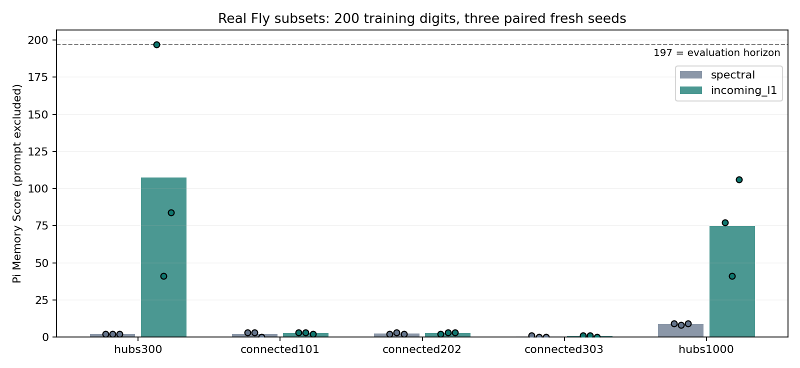
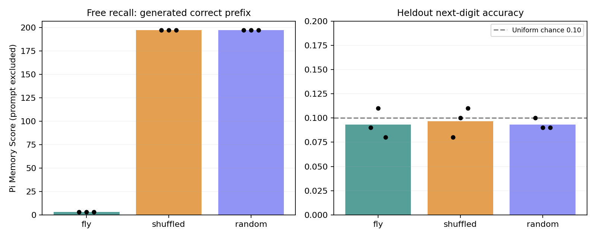
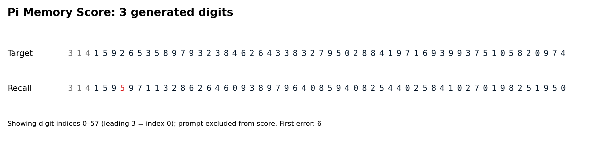
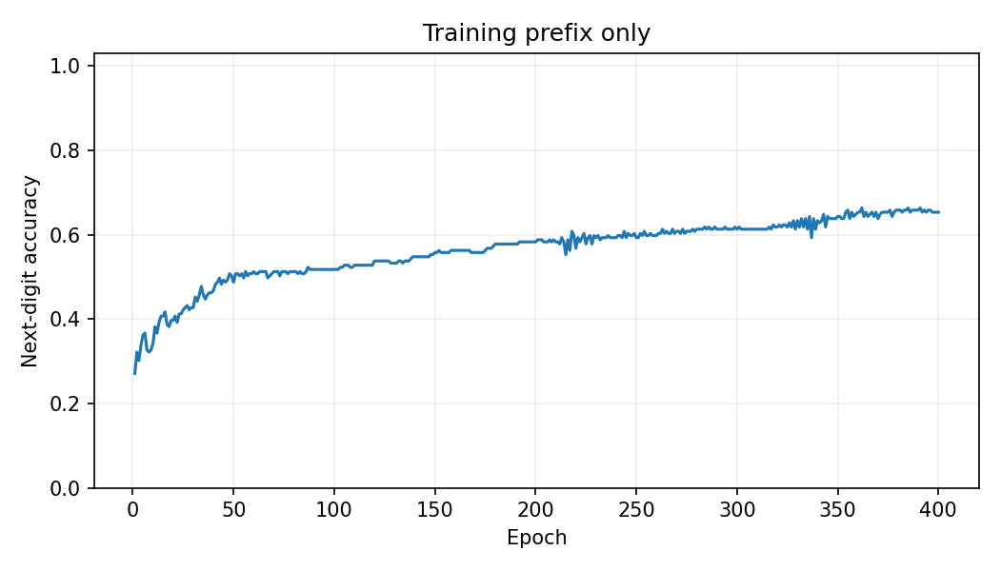
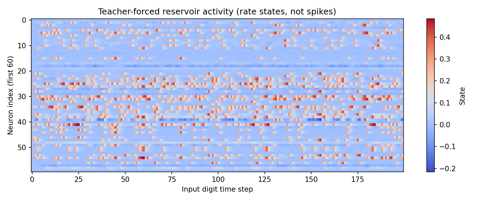

# Flying

## Can a fruit fly brain memorize π?

**Flying — Can a Fly Brain Memorize Pi?**

Flying explores whether a fruit fly connectome can act as a fixed biological-structure-inspired reservoir capable of memorizing the digits of π.

> **실제 FlyWire 연결 데이터로 실행되는 Python MVP입니다.** 현재 결과는 작은 부분망과 단순 dynamics의 계산 실험입니다. 실제 초파리가 원주율을 이해하거나 외웠다는 뜻이 아닙니다.

## Phase 2 update — measured sensitivity study

**450 CPU experiments completed** across five real subsets (300–1000 neurons),
two normalization methods, three prefix lengths, three new model seeds and five
models including recurrence-removal controls. **20 tests passed.**

At 200 training digits, the original 300-neuron real structure scored
`2 / 2 / 2` with global spectral scaling, versus **`≥197 / 41 / 84`** with
per-neuron incoming normalization (paired seeds 142/143/144). This intervention
preserves topology/signs but changes relative incoming strengths. More neurons
and other connected subsets did not consistently improve recall. All real
subsets recalled 47/47 generated digits for 50-digit training; at 400-digit
training, real-subset scores fell to 0–4. Every length uses a separately fitted
readout. These results do not establish biological-wiring superiority or unseen
π prediction.



Read the [complete Phase 2 report](docs/phase2-results.md) and
[all experimental records](results/phase2). The original MVP evidence below is
preserved; Phase 2 uses a separate heldout suffix at indices 1000–1099.

```bash
# Quick comparison: 10 conditions on the bundled 300-neuron subset
python scripts/run_phase2.py --config configs/phase2_quick.json
# Full recorded design: 450 conditions, ~89 seconds on this execution host
python scripts/run_phase2.py --config configs/phase2.json
```

## Project Idea

Keep recurrent connectivity fixed, encode each digit as neural stimulation, and train **only a linear softmax readout** to predict the next digit. The same digit can have different successors; history must enter through the evolving state. There is no time index, positional embedding, digit lookup of π, or teacher target in the autoregressive generator.

## Why Pi?

π provides a reproducible sequence, repeated symbols and a clear exact-prefix recall task. Memorizing a trained finite prefix is different from predicting unseen digits. These experiments do not infer π's formula, prove normality, or measure an animal's intelligence.

## Why a Fruit Fly Brain?

FlyWire offers a real directed connectome with persistent snapshot IDs. This lets us compare a biological wiring pattern to degree-preserving rewiring and random support. The MVP uses **FAFB v783, 300 neurons, 3,303 directed edges**, extracted from the processed connectivity distributed with Shiu et al.'s model. It does not execute a full fly brain or the authors' LIF model.

The subset consists of the 300 neurons with greatest retained incident synapse count, not a mushroom-body circuit. We keep pairs with at least 5 synapses and remove autapses. See [data provenance](data/README.md) and the [Phase 0 investigation](docs/research.md).

## Architecture

`π digit → fixed sparse stimulation → fixed recurrent reservoir → trainable affine softmax → next digit (0–9)`

For input digit `d_t`, with `x_-1 = 0`:

```math
x_t=(1-\alpha)x_{t-1}+\alpha\tanh(Wx_{t-1}+E[d_t])
```

`W[post, pre] = count × upstream sign`, globally rescaled to spectral radius 0.9; leak α = 0.6. Signs are upstream simplified modeling assignments. This is a dimensionless rate-state model, not membrane voltage or spikes. Spectral radius matching does not establish equivalent dynamical regimes or the echo-state property for nonlinear networks.

Readout: `softmax(B · standardized(x_t) + b)`. Standardization uses the training prefix only. Full-batch Adam, 400 epochs, learning rate 0.03, L2 1e-5. No recurrent/encoder parameter is trained. No direct digit skip connection.

### Digit encoding choices

| Choice | Advantages | Limitations |
|---|---|---|
| A: disjoint fixed neuron populations | Easy to interpret; distinct groups | Artificial partition; may stimulate disconnected groups |
| **B: fixed random sparse populations (MVP)** | Seeded; equal stimulation count; overlaps allow distributed states | Not a real sensory pathway; neuron placement matters |
| C: graded population tuning | Smooth graded responses | Imposes similarity between numeric labels that this task does not require |

B activates 10% of neurons at amplitude 0.5 for each digit. The codebook is frozen, and paired model runs use the same seed and codebook.

## Experiment

Default settings are in [configs/mvp.json](configs/mvp.json):

- 200 π digits including the leading `3`; decimal point excluded.
- Training targets: indices 1–199 (199 predictions). At time t, the model has consumed digits 0..t and predicts digit t+1.
- Chronological heldout suffix: next 100 digits, targets 200–299. No gradients or standardization fitting on these states. Teacher forcing carries the true preceding history forward.
- Free recall: reset to zero; provide `314` exactly once; generate 197 digits without target access. This evaluates recall of the trained prefix.
- Extended recall: continue for 297 generated digits, allowing observation of the boundary into the unseen suffix. Logged separately.
- Seeds 42, 43, 44; identical hyperparameters and final-epoch evaluation. No selection by heldout or recall score.

| Model | Controlled properties |
|---|---|
| Real Fly Connectome | Original selected support; source counts and signs |
| Shuffled Fly Connectome | Exact N, E, in-degree and out-degree per neuron; directed double-edge swaps; each source's outgoing weight multiset retained |
| Random Recurrent Network | Exact N and E; uniform directed support without autapses; absolute weight multiset and per-neuron source sign retained |

Each matrix is separately normalized to the same spectral radius. Rewiring does **not** retain incoming weighted strengths or guarantee uniform sampling of all graphs. Swap counts and overlap are logged. Random support need not retain each neuron's degree or the overall inhibitory-edge fraction. A memoryless empirical current-digit→next-digit baseline is also logged.

## Pi Memory Score

**Number of newly generated consecutive correct digits before the first error, excluding the supplied prompt.**

Example: prompt `314`, target continuation `159265…`, generated `159565…` gives score **3**. Total correct digits including the prompt = 6. Zero means the first generated digit was wrong. A score equal to the horizon is flagged `censored=true`: the test hit its limit, not a discovered maximum capacity.

Integer 3 is digit index 0. `first_error_digit_index` uses this indexing and excludes the decimal point. Free-recall reset and seed input exactly match the training-prefix start. We do not report training teacher-forced accuracy as free-recall accuracy.

## Installation

Python 3.10+; Python 3.12 was used for recorded results. CPU only.

```bash
git clone https://github.com/CauchyRiemannEquations/Flying.git
cd Flying
python -m venv .venv
# Windows PowerShell:
.venv\Scripts\Activate.ps1
# macOS/Linux instead: source .venv/bin/activate
python -m pip install -e ".[test]"
```

The repository was created private; cloning requires your GitHub authentication.
For the exact versions used in the logged experiment:
`python -m pip install -r requirements-lock.txt` then `python -m pip install -e .`.
The lock records direct scientific/test dependencies, not a universal cross-platform transitive lock.

## Quick Start

The verified subset is bundled: no live FlyWire account or full data download required.

```bash
python -m pytest -q
python scripts/run_mvp.py
# Explicit reproducible output directory (must not already exist):
python scripts/run_experiment.py --config configs/mvp.json --output outputs/my_run
python scripts/replay_recall.py outputs/my_run/fly_seed42
```

To re-download and regenerate the actual subset:

```bash
python -m pip install -e ".[data]"
python scripts/download_connectome.py --neurons 300
```

The downloader is pinned to a verified upstream commit and rejects a mismatched SHA-256. Do not rename random data as FlyWire. No silent synthetic fallback exists.

Outputs include the resolved configuration, source provenance, package versions, code hashes, per-epoch accuracy/loss, teacher states, recurrent matrices, encoder/readout checkpoints, per-seed JSON/CSV results, aggregate statistics, training plots, activity heatmaps, and target/prediction error plots. New output folders avoid clobbering earlier runs. A CPU cap automatically induces a smaller graph if supplied data exceeds `max_neurons`, recording exactly which neuron IDs remain. The adapter streams raw parquet batches; the default run only reads the small bundled CSV.

## Results

**Measured initial run, 3 seeds, 200 training digits + 100 heldout digits:**

| Model | Train next-digit accuracy, mean | Heldout next-digit accuracy, mean | Pi Memory Score by seed 42 / 43 / 44 |
|---|---:|---:|---:|
| Real Fly subset | 65.66% | 9.33% | 3 / 3 / 3 |
| Degree-preserving shuffled | 100% | 9.67% | ≥197 / ≥197 / ≥197 |
| Random recurrent | 100% | 9.33% | ≥197 / ≥197 / ≥197 |

`≥197` means all 197 requested generated digits were correct within the training prefix. Extended runs made their first error on the first unseen digit (index 200), for all six control runs. The real subset's seed-42 continuation begins `159` correctly and then fails. These are actual measured outputs, not illustrative targets.

**This configuration does not show an advantage for biological connectivity.** The shuffled/random controls memorize the training prefix, while the real subset performs worse. All heldout accuracies are around the uniform-guess reference of 10%. The subset selection, global normalization, input placement and rate dynamics are substantial limitations; this is not evidence that real flies lack sequence memory. Three seeds do not establish population-level or statistically significant claims. A prefix can be fit by a flexible readout using history-sensitive features without generalizable knowledge of π.






**Verification:** 13 tests passed. A second complete run reproduced all nine metric rows exactly (excluding runtime), and all nine saved checkpoints replayed the full logged digit sequences identically. Altering the heldout suffix leaves fitted parameters and training-prefix recall unchanged.

Full tabular evidence and manifests: [results/mvp](results/mvp). Model checkpoints and all per-model figures are produced in `outputs/` on execution, not committed as large binary archives. Reported runtime is machine-specific; metric rows time computation before rendering figures. `runtime.json` times the complete run.

## Roadmap

- [x] Phase 0: primary-source review, verified download/schema and provenance.
- [x] Phase 1: real-subset fixed reservoir, linear readout, teacher forcing, free recall, 3 models × 3 seeds, plots and tests.
- [x] Phase 2 first study: five 300–1000-neuron subsets, normalization/length curves, fresh seeds and leaky/memoryless controls (450 runs).
- [ ] Phase 2 follow-up: perturbation robustness, delayed memory tasks and an independent confirmation protocol.
- [ ] Phase 3: anatomically selected mushroom-body / Kenyon-cell circuits, preserving MBON/DAN feedback; KC-only wiring need not supply useful recurrence.
- [ ] Stage B/C: Brian2 LIF dynamics and better-supported neuron/synapse parameters after rate-model diagnostics.
- [ ] Phase 4: KC→MBON or other explicitly defined plasticity; keep the fixed-reservoir experiment as a baseline.
- [ ] Phase 5: reward/dopamine signals with a separate learning protocol.
- [ ] Phase 6: whole-brain scale simulation after sparse performance and biological assumptions are justified.
- [ ] Later: live web brain visualization and digit-by-digit recall UI. Not part of this MVP.

## GitHub structure

```text
Flying/
  README.md, pyproject.toml, requirements*.txt
  configs/           # mvp.json, phase2.json, phase2_quick.json
  docs/              # source investigation and Phase 2 measured report
  src/flying/
    data/           # pinned connectome adapter; π generation
    encoding/       # seeded fixed digit populations
    brain/          # fixed reservoir; real/shuffled/random graphs
    models/         # only the softmax readout is trained
    training/       # paired-seed experiment runner and logging
    evaluation/     # teacher-forced accuracy; autonomous recall; score
    visualization/  # training, activity, error and comparison plots
  scripts/          # download_connectome, run_mvp, run_experiment
  notebooks/        # 3 runnable exploration/experiment notebooks
  data/             # small real subset, provenance, upstream notice
  results/          # preserved mvp/ and full phase2/ experimental evidence
  outputs/          # new experiments (ignored by Git)
  tests/            # causality, scoring, controls, direction, frozen weights
```

## References

- [FlyWire official site](https://flywire.ai/) and [Codex FAQ](https://codex.flywire.ai/faq).
- [FlyWire Consortium: Whole-brain connectivity, release 783](https://doi.org/10.5281/zenodo.10676866).
- [Dorkenwald et al., Neuronal wiring diagram of an adult brain, Nature (2024)](https://www.nature.com/articles/s41586-024-07558-y).
- [Shiu et al., A Drosophila computational brain model reveals sensorimotor processing, Nature (2024)](https://www.nature.com/articles/s41586-024-07763-9); [author code and v783 data](https://github.com/philshiu/Drosophila_brain_model).
- [fafbseg](https://fafbseg-py.readthedocs.io/en/latest/), [navis](https://navis-org.github.io/navis/stable/), [Brian2](https://brian2.readthedocs.io/en/stable/).
- [Eon public fly-brain code](https://github.com/eonsystemspbc/fly-brain), inspected as follow-up engineering context, not executed here.

Research claims should say “a computational model based on FlyWire connectivity recalled a trained sequence,” never “an actual fly understood or memorized π.”
