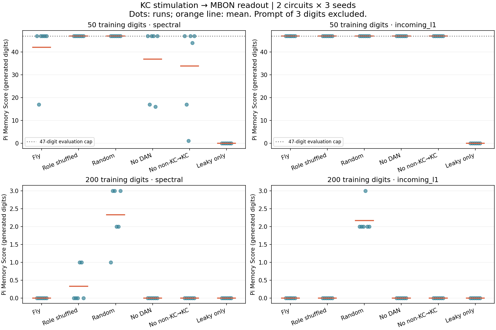

# Flying

**Current priority: finish the remaining original research stages before game
screen work.** Small-circuit Stage B/C and scoped gamma1/pedc Phase 5B experiments
are complete; Phase 5B's neural-response criterion failed. Phase 6 whole-brain
work remains unfinished, and broader biological validation is not established.
[Phase-by-phase audit](docs/phase-status.md).

## Can a fruit fly brain memorize π?

**Latest research: compartment-local Phase 5B dopamine rule implemented.**
Twelve controlled conditioning cases pass the local causal-rule checks: only
paired KC/PPL101 activity changes the selected connections (28.12% depression of
active edges). However, both isolated probe baselines are silent, so the neural
response criterion fails. Mean pi transfer recall falls **3 -> 2 digits**, with
no improvement after refitting the readout. Next: Phase 6 input-coverage and
sparse-scaling prerequisites. [Results and limits](docs/phase5b-results.md) ·
[Locked protocol](docs/phase5b-protocol.md).

**Previous research: sourced small-circuit Stage B/C LIF validation completed.**
Independent spike/state references and three timestep grids pass all locked
checks. Eight matched-budget readouts give real-circuit mean recall **3.0 digits
for LIF versus 33.5 for the rate baseline**. This one-seed feasibility comparison
does not establish a better opponent or cell-specific physiological validity.
[Results and scope](docs/stage-bc-results.md) · [Locked protocol](docs/stage-bc-protocol.md).

**Previous research: scoped Phase 2 robustness completed; acceptance criteria failed.**
72 frozen heads from two independently seeded model cohorts, 16,128 exact recall
replays and 148 passing tests. Confirmation real-graph mean recall fell from
**36.83 clean digits** to **1.59** with one state perturbation (SD .001), **0.48**
with ongoing noise, and **1.51** with 1% edge removal. These are computational
stress levels, not biological noise measurements.
[Results and scale limits](docs/phase2-robustness-results.md).

**Previous research: anchored-weighting confirmation failed its prespecified
criteria.** 324 fresh fits across offsets 0/1000/2000, 972 exact stage-head replays,
27 independent refits and 132 passing tests. All three offsets failed early
retention/completion; at offset 0, mean recall fell from fixed **36.83** to anchored
**34.72**. Keep fixed-32 and proceed to Phase 2 robustness work.
[Results](docs/phase5-retention-confirmation-results.md) · [Unfinished phases](docs/phase-status.md).

**Playable console prototype:** a ten-minute study phase, 18 verified pretrained
opponents and identical first-error scoring. All 18 reproduce their recorded
197-digit rollouts; 125 tests pass. Fresh local training took 2.62 seconds including
preparation for one 6,000-update fit. Graphical screens and live-training mode are
deferred while research takes priority. [Play and read the timing evidence](docs/game-prototype.md).

```bash
python -m flying.game --record outputs/my_first_match.json
```

**Flying — Can a Fly Brain Memorize Pi?**

Flying explores whether a fruit fly connectome can act as a fixed biological-structure-inspired reservoir capable of memorizing the digits of π.

**Product goal: a pi memorization game where a human competes against a trained fly-connectome-based model.** Research establishes reproducible opponents, fair scoring and measured difficulty. The existing validated fixed-32 baseline can support the first playable game while learning research continues. [Game direction and working agreement](docs/game-direction.md).

> **실제 FlyWire 연결 데이터로 실행되는 Python MVP입니다.** 현재 결과는 작은 부분망과 단순 dynamics의 계산 실험입니다. 실제 초파리가 원주율을 이해하거나 외웠다는 뜻이 아닙니다.

**Previous: first-prefix retention discovery completed — 108 fits, 324 exact stage-head replays, 9 independent refits, 96 tests passed.** Preserving first-32 loss share increased real-circuit recall from **31.67 to 38.89 digits** on fresh seeds at the game opening (offset 0), with no loss among 15 initially complete prefixes. Recall/retention criteria passed; later accuracy fell from **81.58% to 80.00%**, so the stronger joint criterion failed. This is a candidate pending separate confirmation. [Results](docs/phase5-retention-results.md) · [Game direction](docs/game-direction.md) · [Next work](docs/next-work.md).

**Previous: matched-budget prefix curriculum completed — 324 fits, 972 exact saved-head replays, 27 independent refits, 84 tests passed.** Expanding the weighted window 32→64→128 did not beat fixed 32-target weighting: real-circuit mean recall was **27.19 versus 33.87 digits**, and all three segment success criteria failed. Of 48 real models that initially completed 32 digits, 19 lost that completion by the final stage. Windows checkout/checkpoint replay failures are also fixed. [Results](docs/phase5-curriculum-results.md) · [Windows reproduction and numerical limits](docs/phase5-windows-reproduction.md) · [Prioritized next work](docs/next-work.md).

**Previous: cross-segment confirmation completed — 216 fits, 216 exact replays, 18 independent refits, 71 tests passed.** With the 32-target/4× rule unchanged, real-circuit recall increased from **6.28 to 34.50 digits** at π offset 1000 and **6.11 to 33.94** at offset 2000. Both prespecified replication criteria passed; later-position accuracy still declined. Each segment was trained separately, so this is not unseen-π prediction. Atomic condition checkpoints and strict resume are now available. [Results](docs/phase5-prefix-confirmation-results.md) · [Latest Codex handoff](docs/codex-handoff-2026-09-27.md).

**Previous: early-prefix weighting completed — 120 fits, 120 exact saved-head replays, 6 independent refits, 65 tests passed.** On real connections, mean error-free recall improved from **9.93 to 32.43 digits**, while later-position accuracy fell from **86.69% to 78.77%**. This is a measured tradeoff in decoder training priorities, not increased total memory or biological-wiring superiority. [Results](docs/phase5-prefix-results.md) · [Protocol](docs/phase5-prefix-protocol.md) · [Codex handoff / Work limitations](docs/codex-handoff-2026-09-25.md).

**Previous: matched-parameter readout experiment completed — 384 evaluations, all saved heads replayed.** [Read the result](docs/phase5-readout-results.md): on real connections, training accuracy rose from 47.80% to 83.70%, but mean error-free recall fell from 6.92 to 5.75 digits. 27 targeted checks passed; the full pytest suite was not run.

**Previous: timing diagnosis completed — 72 π runs and 432 iid-memory measurements independently rebuilt.** [Read the result](docs/phase5-timing-results.md): current-digit decoding rose from about 10% to 100%, but error-free π recall worsened. 23 targeted checks passed; the full pytest suite was unavailable in this runtime.

**Previous: constrained BPTT positive control completed — 192 evaluations, all checkpoints replayed, 45 tests passed.** [Read the result](docs/phase5-bptt-results.md): exact recurrent gradients improved training cross entropy in all 24 graph settings, but did not establish a reliable π recall gain.

**Previous: Phase 5 follow-up completed — 4,384 evaluations, 5 fresh confirmation seeds, 41 tests passed.** [Read the diagnosis](docs/phase5-diagnostic-results.md): three small-update improvement candidates failed to confirm; statistics-only recalibration did not rescue the fixed-readout collapse. Whole-brain scaling remains deferred.

**Phase 5 baseline: 288 reward-learning network conditions, 576 evaluations, full repeat verification, 35 tests passed.** [Read the result](docs/phase5-results.md): this first reward/eligibility rule did not improve recall. Phases 1–3b remain fixed-reservoir baselines; Phases 4–5 separately adapt only existing KC→MBON weights and freeze them before evaluation.

## Phase 2 update — measured sensitivity study

**450 CPU experiments completed** across five real subsets (300–1000 neurons),
two normalization methods, three prefix lengths, three new model seeds and five
models including recurrence-removal controls. **20 tests passed.**

At 200 training digits, the original 300-neuron real structure scored
`2 / 2 / 2` with global spectral scaling, versus **`≥197 / 41 / 84`** with
per-neuron incoming normalization (paired seeds 142/143/144). This intervention
preserves topology/signs but changes relative incoming strengths. More neurons
and other connected subsets did not consistently improve recall. All real
subsets recalled 47/47 generated digits for 50-digit training; at 400-digit
training, real-subset scores fell to 0–4. Every length uses a separately fitted
readout. These results do not establish biological-wiring superiority or unseen
π prediction.


Read the [complete Phase 2 report](docs/phase2-results.md) and
[all experimental records](results/phase2). The original MVP evidence below is
preserved; Phase 2 uses a separate heldout suffix at indices 1000–1099.

```bash
# Quick comparison: 10 conditions on the bundled 300-neuron subset
python scripts/run_phase2.py --config configs/phase2_quick.json
# Full recorded design: 450 conditions, ~89 seconds on this execution host
python scripts/run_phase2.py --config configs/phase2.json
```

## Project Idea

The original baseline keeps recurrent connectivity fixed, encodes each digit as neural stimulation, and trains **only a linear softmax readout** to predict the next digit. Later diagnostic experiments separately test constrained synaptic updates and a small nonlinear readout; each report states what is trained. The same digit can have different successors; history must enter through the evolving state. There is no time index, positional embedding, digit lookup of π, or teacher target in the autoregressive generator.

## Why Pi?

π provides a reproducible sequence, repeated symbols and a clear exact-prefix recall task. Memorizing a trained finite prefix is different from predicting unseen digits. These experiments do not infer π's formula, prove normality, or measure an animal's intelligence.

## Why a Fruit Fly Brain?

FlyWire offers a real directed connectome with persistent snapshot IDs. This lets us compare a biological wiring pattern to degree-preserving rewiring and random support. The MVP uses **FAFB v783, 300 neurons, 3,303 directed edges**, extracted from the processed connectivity distributed with Shiu et al.'s model. It does not execute a full fly brain or the authors' LIF model.

The subset consists of the 300 neurons with greatest retained incident synapse count, not a mushroom-body circuit. We keep pairs with at least 5 synapses and remove autapses. See [data provenance](data/README.md) and the [Phase 0 investigation](docs/research.md).

## Architecture

`π digit → fixed sparse stimulation → fixed recurrent reservoir → trainable affine softmax → next digit (0–9)`

For input digit `d_t`, with `x_-1 = 0`:

```math
x_t=(1-\alpha)x_{t-1}+\alpha\tanh(Wx_{t-1}+E[d_t])
```

`W[post, pre] = count × upstream sign`, globally rescaled to spectral radius 0.9; leak α = 0.6. Signs are upstream simplified modeling assignments. This is a dimensionless rate-state model, not membrane voltage or spikes. Spectral radius matching does not establish equivalent dynamical regimes or the echo-state property for nonlinear networks.

Readout: `softmax(B · standardized(x_t) + b)`. Standardization uses the training prefix only. Full-batch Adam, 400 epochs, learning rate 0.03, L2 1e-5. No recurrent/encoder parameter is trained. No direct digit skip connection.

### Digit encoding choices

| Choice | Advantages | Limitations |
|---|---|---|
| A: disjoint fixed neuron populations | Easy to interpret; distinct groups | Artificial partition; may stimulate disconnected groups |
| **B: fixed random sparse populations (MVP)** | Seeded; equal stimulation count; overlaps allow distributed states | Not a real sensory pathway; neuron placement matters |
| C: graded population tuning | Smooth graded responses | Imposes similarity between numeric labels that this task does not require |

B activates 10% of neurons at amplitude 0.5 for each digit. The codebook is frozen, and paired model runs use the same seed and codebook.

## Experiment

Default settings are in [configs/mvp.json](configs/mvp.json):

- 200 π digits including the leading `3`; decimal point excluded.
- Training targets: indices 1–199 (199 predictions). At time t, the model has consumed digits 0..t and predicts digit t+1.
- Chronological heldout suffix: next 100 digits, targets 200–299. No gradients or standardization fitting on these states. Teacher forcing carries the true preceding history forward.
- Free recall: reset to zero; provide `314` exactly once; generate 197 digits without target access. This evaluates recall of the trained prefix.
- Extended recall: continue for 297 generated digits, allowing observation of the boundary into the unseen suffix. Logged separately.
- Seeds 42, 43, 44; identical hyperparameters and final-epoch evaluation. No selection by heldout or recall score.

| Model | Controlled properties |
|---|---|
| Real Fly Connectome | Original selected support; source counts and signs |
| Shuffled Fly Connectome | Exact N, E, in-degree and out-degree per neuron; directed double-edge swaps; each source's outgoing weight multiset retained |
| Random Recurrent Network | Exact N and E; uniform directed support without autapses; absolute weight multiset and per-neuron source sign retained |

Each matrix is separately normalized to the same spectral radius. Rewiring does **not** retain incoming weighted strengths or guarantee uniform sampling of all graphs. Swap counts and overlap are logged. Random support need not retain each neuron's degree or the overall inhibitory-edge fraction. A memoryless empirical current-digit→next-digit baseline is also logged.

## Pi Memory Score

**Number of newly generated consecutive correct digits before the first error, excluding the supplied prompt.**

Example: prompt `314`, target continuation `159265…`, generated `159565…` gives score **3**. Total correct digits including the prompt = 6. Zero means the first generated digit was wrong. A score equal to the horizon is flagged `censored=true`: the test hit its limit, not a discovered maximum capacity.

Integer 3 is digit index 0. `first_error_digit_index` uses this indexing and excludes the decimal point. Free-recall reset and seed input exactly match the training-prefix start. We do not report training teacher-forced accuracy as free-recall accuracy.

## Installation

Python 3.10+; Python 3.12 was used for recorded results. CPU only.

```bash
git clone https://github.com/CauchyRiemannEquations/Flying.git
cd Flying
python -m venv .venv
# Windows PowerShell:
.venv\Scripts\Activate.ps1
# macOS/Linux instead: source .venv/bin/activate
python -m pip install -e ".[test]"
```

The repository was created private; cloning requires your GitHub authentication.
For the exact versions used in the logged experiment:
`python -m pip install -r requirements-lock.txt` then `python -m pip install -e .`.
The lock records direct scientific/test dependencies, not a universal cross-platform transitive lock.

## Quick Start

The verified subset is bundled: no live FlyWire account or full data download required.

```bash
python -m pytest -q
python scripts/run_mvp.py
# Explicit reproducible output directory (must not already exist):
python scripts/run_experiment.py --config configs/mvp.json --output outputs/my_run
python scripts/replay_recall.py outputs/my_run/fly_seed42
```

To re-download and regenerate the actual subset:

```bash
python -m pip install -e ".[data]"
python scripts/download_connectome.py --neurons 300
```

The downloader is pinned to a verified upstream commit and rejects a mismatched SHA-256. Do not rename random data as FlyWire. No silent synthetic fallback exists.

Outputs include the resolved configuration, source provenance, package versions, code hashes, per-epoch accuracy/loss, teacher states, recurrent matrices, encoder/readout checkpoints, per-seed JSON/CSV results, aggregate statistics, training plots, activity heatmaps, and target/prediction error plots. New output folders avoid clobbering earlier runs. A CPU cap automatically induces a smaller graph if supplied data exceeds `max_neurons`, recording exactly which neuron IDs remain. The adapter streams raw parquet batches; the default run only reads the small bundled CSV.

## Results

**Measured initial run, 3 seeds, 200 training digits + 100 heldout digits:**

| Model | Train next-digit accuracy, mean | Heldout next-digit accuracy, mean | Pi Memory Score by seed 42 / 43 / 44 |
|---|---:|---:|---:|
| Real Fly subset | 65.66% | 9.33% | 3 / 3 / 3 |
| Degree-preserving shuffled | 100% | 9.67% | ≥197 / ≥197 / ≥197 |
| Random recurrent | 100% | 9.33% | ≥197 / ≥197 / ≥197 |

`≥197` means all 197 requested generated digits were correct within the training prefix. Extended runs made their first error on the first unseen digit (index 200), for all six control runs. The real subset's seed-42 continuation begins `159` correctly and then fails. These are actual measured outputs, not illustrative targets.

**This configuration does not show an advantage for biological connectivity.** The shuffled/random controls memorize the training prefix, while the real subset performs worse. All heldout accuracies are around the uniform-guess reference of 10%. The subset selection, global normalization, input placement and rate dynamics are substantial limitations; this is not evidence that real flies lack sequence memory. Three seeds do not establish population-level or statistically significant claims. A prefix can be fit by a flexible readout using history-sensitive features without generalizable knowledge of π.


**Verification:** 13 tests passed. A second complete run reproduced all nine metric rows exactly (excluding runtime), and all nine saved checkpoints replayed the full logged digit sequences identically. Altering the heldout suffix leaves fitted parameters and training-prefix recall unchanged.

Full tabular evidence and manifests: [results/mvp](results/mvp). Model checkpoints and all per-model figures are produced in `outputs/` on execution, not committed as large binary archives. Reported runtime is machine-specific; metric rows time computation before rendering figures. `runtime.json` times the complete run.


### Phase 3: anatomical mushroom-body experiment

Two pinned, annotated FlyWire subsets now contain 686 neurons each (512 KC, 48 MBON, 125 DAN, 1 APL). Digits stimulate KC only; the primary readout observes MBON only. Six graph conditions, two normalization methods, two training lengths and three seeds yield **288 actual CPU runs**.

With 50 training digits and incoming-L1 normalization, real, role-shuffled and random networks all recalled the full 47-digit evaluation horizon after the supplied `314`. With 200 training digits, the real MBON readout scored **0 generated digits in all twelve runs**. This does not establish a benefit of the real fly wiring. DAN are modeled as ordinary signed nodes; dopamine/reward learning is not implemented.



[Full protocol, results, limitations and reproduction commands](docs/phase3-results.md).

```bash
python scripts/run_phase3.py --output outputs/phase3
python scripts/summarize_phase3.py --output outputs/phase3
```

The code is MIT-licensed; FlyWire-derived data retain the upstream **CC BY-NC 4.0** terms. See [data provenance and attribution](data/README.md).

### Phase 3b: temporal-memory diagnosis

The update-count sweep and independent random-input probe are now implemented: **768 π runs and 4,224 delayed-input measurements**, with matched 48-neuron observation budgets and two affine readout methods. At MBON, three-digit-old random inputs are decoded at 71–75% accuracy with one update per digit, compared with 13–16% with four. Real-circuit 200-digit training-prefix recall reaches 5–9 digits (spectral, one update), but shuffled controls perform similarly. This supports sensitivity to model timing, not an advantage of real anatomy.

[Protocol, measured results and limitations](docs/phase3b-results.md).

```bash
python scripts/run_phase3b.py --output outputs/phase3b
python scripts/summarize_phase3b.py --output outputs/phase3b
```

### Phase 4: constrained KC→MBON plasticity

The first supervised local teaching rule is implemented on existing KC→MBON edges only, with sign and incoming plastic-strength conservation. **432 runs** compare frozen weights, correct teaching and shuffled teaching across real, degree-shuffled and role-block-random graphs. Networks are frozen before final readout fitting and evaluation.

This rule did **not** consistently improve recall: among 24 paired real-circuit comparisons at 200 training digits, 5 improved, 3 tied and 16 worsened. At 50 digits, all real conditions reached the 47-digit cap. This is a result about one computational rule, not fly learning or dopamine biology.

[Full learning rule, controls, results and reproducibility report](docs/phase4-results.md).

```bash
python scripts/run_phase4.py --output outputs/phase4
python scripts/summarize_phase4.py --output outputs/phase4
```

### Phase 5: reward and eligibility traces

A supervised-warm-started classifier is frozen while KC→MBON synapses receive scalar correct/incorrect reward. Immediate versus 3-step-delayed reward, trace versus no trace, and unrelated yoked reward are compared on the same topology controls: **288 network conditions and 576 evaluations**. This is an artificial computational reward signal, not modeled dopamine biology.

The primary fixed-policy real-network score declined in all 24 paired comparisons after trace learning. A separate supervised readout refit recovered much of the performance, suggesting a changed-state/readout mismatch, but did not establish improvement over frozen connectivity. [Full protocol and negative result](docs/phase5-results.md).

```bash
python scripts/run_phase5.py --output outputs/phase5
python scripts/summarize_phase5.py --output outputs/phase5
```

### Phase 5 follow-up: weight interpolation × readout decomposition

The same trace/yoked endpoint changes were interpolated at six magnitudes and read with four isolated interventions: fixed policy, statistics-only recalibration, coefficients-only refit and full refit. **2,304 discovery + 2,080 confirmation evaluations** used real and role-degree-shuffled circuits. Selected real-network gains of +0.50 to +0.83 digits became **−0.90 to −0.60 digits** versus frozen connectivity on five fresh seeds. Relearning classifier coefficients recovered much of the endpoint loss; updating feature statistics alone did not. This diagnoses a readout mismatch without establishing a reward-learning gain.

[Full measured result, limitations and reproduction](docs/phase5-diagnostic-results.md) · [Locked protocol](docs/phase5-diagnostic-protocol.md)

### Constrained BPTT positive control

Full temporal gradients now optimize supervised next-digit cross entropy on the same existing KC→MBON edges, with the initial classifier frozen. Correct-label BPTT, last-step gradients, permuted-label BPTT and frozen weights are compared across real/role-shuffled circuits. The **192-evaluation study** reduced training loss but did not consistently extend free recall; extra readout refitting did not beat the permuted-label control. The local-gradient control selected epoch zero in all 24 settings. [Protocol and measured interpretation](docs/phase5-bptt-results.md).

### Input/output timing diagnosis

Three schedules keep the same connectome weights and 48-MBON readout budget. Updating MBON after current KC activity makes the current digit fully decodable, but real-network recall falls from 6.33 to 5.00 digits (spectral) and from 6.00 to 3.67 (incoming-L1). All 72 runs also verify that first-error free recall equals the teacher-forced initial correct segment under the same deterministic reset and prompt. The current bottleneck therefore exists before the first incorrect feedback input. [Results and limitations](docs/phase5-timing-results.md).

## Roadmap

- [x] Phase 0: primary-source review, verified download/schema and provenance.
- [x] Phase 1: real-subset fixed reservoir, linear readout, teacher forcing, free recall, 3 models × 3 seeds, plots and tests.
- [x] Phase 2 first study: five 300–1000-neuron subsets, normalization/length curves, fresh seeds and leaky/memoryless controls (450 runs).
- [x] Phase 2 delayed-memory follow-up: independent random-input tasks implemented and measured in Phase 3b.
- [x] Phase 2 robustness follow-up on the current MB baseline: two model/noise-seed cohorts and full replay; primary robustness criteria failed. [Scope and results](docs/phase2-robustness-results.md).
- [x] Phase 3: annotated KC/MBON/DAN/APL subsets, KC-only input, MBON-only readout, role-preserving shuffle and structural ablations; 288 measured runs.
- [x] Stage B/C, small-circuit scope: sourced Brian2 LIF dynamics, numerical and timestep checks, paired rate comparison. Weak recall; uniform source defaults are not cell-specific calibration. [Results](docs/stage-bc-results.md).
- [x] Phase 3b: update-count sweep, independent delayed-input decoding and equal-size readout diagnostics.
- [x] Phase 4: supervised KC→MBON plasticity with fixed-connectivity and permuted-teacher controls; 432 reproducible runs.
- [x] Phase 5A: artificial scalar reward and eligibility-trace protocol, with delayed and yoked controls.
- [x] Phase 5B, gamma1/pedc model scope: source-supported type mapping and actual DAN-spike-gated local depression; targeted controls pass, neural-response criterion fails. Not an all-compartment physiological model. [Results](docs/phase5b-results.md).
- [ ] Phase 6: whole-brain scale simulation after sparse performance and biological assumptions are justified.
- [x] Game core: verified pretrained opponents, shared first-error scoring and a timed console interface.
- [ ] Game screens: deferred by user request until research work is advanced. [Phase audit](docs/phase-status.md) · [Product direction](docs/game-direction.md).

## GitHub structure

```text
Flying/
  README.md, pyproject.toml, requirements*.txt
  configs/           # mvp.json, phase2.json, phase3.json
  docs/              # source investigation and Phase 2 measured report
  src/flying/
    data/           # pinned connectome adapter; π generation
    encoding/       # seeded fixed digit populations
    brain/          # fixed reservoir; real/shuffled/random graphs
    models/         # only the softmax readout is trained
    training/       # paired-seed experiment runner and logging
    evaluation/     # teacher-forced accuracy; autonomous recall; score
    visualization/  # training, activity, error and comparison plots
  scripts/          # download_connectome, run_mvp, run_experiment
  notebooks/        # 3 runnable exploration/experiment notebooks
  data/             # small real subset, provenance, upstream notice
  results/          # preserved mvp/, phase2/ and phase3/ experimental evidence
  outputs/          # new experiments (ignored by Git)
  tests/            # causality, scoring, controls, direction, frozen weights
```

## References

- [FlyWire official site](https://flywire.ai/) and [Codex FAQ](https://codex.flywire.ai/faq).
- [FlyWire Consortium: Whole-brain connectivity, release 783](https://doi.org/10.5281/zenodo.10676866).
- [Dorkenwald et al., Neuronal wiring diagram of an adult brain, Nature (2024)](https://www.nature.com/articles/s41586-024-07558-y).
- [Shiu et al., A Drosophila computational brain model reveals sensorimotor processing, Nature (2024)](https://www.nature.com/articles/s41586-024-07763-9); [author code and v783 data](https://github.com/philshiu/Drosophila_brain_model).
- [fafbseg](https://fafbseg-py.readthedocs.io/en/latest/), [navis](https://navis-org.github.io/navis/stable/), [Brian2](https://brian2.readthedocs.io/en/stable/).
- [Eon public fly-brain code](https://github.com/eonsystemspbc/fly-brain), inspected as follow-up engineering context, not executed here.

Research claims should say “a computational model based on FlyWire connectivity recalled a trained sequence,” never “an actual fly understood or memorized π.”
