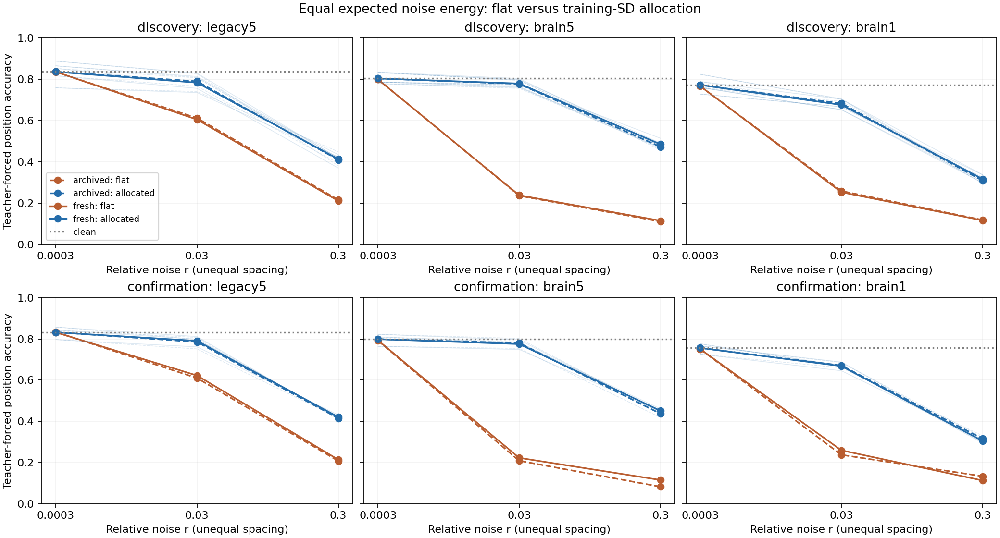

# ACT V 최종 종료 보고 — 고정 연결망·출력층의 강건성과 해독 민감도

**사전 지정한 현재 rate 모델의 ACT V 연구 단락을 완료했다.** 다섯 교란 곡선과
그 실패를 해석하는 세 후속 진단, 독립 검증, 생물학적 가정 감사를 마쳤다.
이는 생리학적 강건성이 입증됐다는 뜻이 아니다. 새 배분 대조의 확인 그래프는
`['legacy5', 'brain5', 'brain1']`이며, 기존 자율 회상 강건성 실패를 대체하지 않는다.
[결과 전 종료 계획](act5-completion-plan.md), [종합 감사](../results/act5_final_closeout/audit.json).

## 1. Repository audit

원래 저장소 전체 감사 이후의 ACT V 코드·config·tests·manifest·checkpoint와
현재 문서를 다시 대조했다. 현재 상태보다 오래된 제안이 남아 있던 README와
로드맵을 갱신하고, 과거 보고서·프로토콜의 바이트는 보존했다.
기존 RSS 측정 문제와 CSV 파서 실패는 기록과 수정 검증을 유지한다.
이번에는 오류 허용 범위 변경, 좋은 seed 선택, hyperparameter 탐색이 없었다.

## 2. Reproduced baseline

ACT I clean 평균 PMS는 legacy5=35.0,brain5=31.8,brain1=34.1이다.
최초 ACT V는 기존30개 head와 새18개(371142–371144)를 사용했다. 상대 잡음 연구는
기존30개와 다른 새18개(381142–381144)를 사용했다. 그 뒤 두 관측 진단은 후자의
48개 모델을 재사용했다. 전체 기간의 모델을 단순 합산해 독립 표본을 늘리지 않는다.
새 배분 연구는 clean48개 및 기존 관측 flat144개를 재현했다.

## 3. New implementation

최종 [배분 실행기](../scripts/allocation_noise.py), [독립 검증기](../scripts/verify_allocation_noise.py),
[종합 감사](../scripts/audit_act5_final.py)를 추가했다. 상대 잡음·관측 진단 실행기는
이전 커밋에 있고, 기본 dynamics와 학습 코드는 변경하지 않았다.
모든 head·전처리·내부 연결은 교란 뒤 고정했다.

## 4. Experiments executed

공통 조건은π offset0/length200/prompt314,관측48 MBON,482개 head 파라미터다.
정답 입력 정확도와 자기 출력을 되먹임하는 자율 회상은 분리한다.

| 연구 | 실제 실행 | 검증 범위 | 결론의 범위 |
| --- | --- | --- | --- |
| 다섯 교란 본 연구 | 48모델,1056 신경 평가 궤적 | 440 독립 궤적,6 exact refit,전체 지표/hash | 새 모델 seed 확인을 포함한 자율 회상 |
| 상대 잡음 | 48모델,384 신경 평가 궤적 | 160 독립 궤적,6 exact refit,전체 지표/hash | 다른 새 모델 seed 확인을 포함한 자율 회상 |
| 현재 관측/누적 상태 대조 | 144 신규 관측 평가 | 144 모두 독립 재계산 | 기존 모델 재사용,정답 입력 해독 |
| 뉴런별 잡음 배분 | 1152 신규 관측 평가,96영점 검사 | 1152 모두 독립 재계산 | 기존 모델 재사용,새 잡음3개,정답 입력 해독 |

영점 alias,smoke,반복 확인은 독립 실험으로 합산하지 않는다. 원래 pulse는
clean prompt 뒤 첫 예측 직전 교란이다. 입력 전 초기 상태 잡음을 별도로 실행했다고
표현하지 않는다. 모든 neuron-dropout에는 입력·관측 뉴런도 포함된다.

## 5. Results

| 질문 | 판정과 수치 | 근거 |
| --- | --- | --- |
| 처음 회상 상태를 흔들어도 견디는가? | 최대 pulse 강도 절대 강건성 기준 실패 | [본 결과](act5-robustness-results.md) |
| 지속 잡음에서 전체망이 유리한가? | 우위 실패;brain1−부분망 유지율−22.10/−20.96%p | [본 결과](act5-robustness-results.md) |
| 연결 제거에 견디는가? | 최대1% 제거 강건성 및 비교 확인 실패 | [본 결과](act5-robustness-results.md) |
| 뉴런 제거에 견디는가? | 최대1% 제거 강건성 및 비교 확인 실패 | [본 결과](act5-robustness-results.md) |
| 가중치 교란에 견디는가? | 최대sigma.05 강건성 실패;discovery secondary도 새 seed에서 확인 실패 | [본 결과](act5-robustness-results.md) |
| 관측 신호 변동 대비 크기를 맞추면? | 우위 실패;유지율 차이−2.07/−5.71%p | [상대 잡음](relative-noise-results.md) |
| 관측만 오염해도 해독이 나빠지는가? | 큰 저하;brain1 누적 잡음 추가 비용0.54/0.76%p | [관측 진단](observation-noise-results.md) |
| 기대 총 제곱 잡음을 고정하고 좌표 배분을 바꾸면? | 확인 그래프`['legacy5', 'brain5', 'brain1']`;아래 seed 표 | [배분 진단](allocation-noise-results.md) |

최종 brain1 배분−flat 정확도 차이(%p),세 강도와 두 circuit 평균:

| cohort | seed | archived noise | fresh3 noise mean |
| --- | --- | --- | --- |
| discovery | 7142 | +19.628 | +21.348 |
| discovery | 7143 | +20.389 | +20.135 |
| discovery | 7144 | +22.420 | +23.548 |
| discovery | 7145 | +22.166 | +20.784 |
| discovery | 7146 | +18.951 | +19.205 |
| confirmation | 381142 | +21.320 | +20.135 |
| confirmation | 381143 | +21.066 | +20.276 |
| confirmation | 381144 | +19.712 | +20.164 |

최종 paired 통계(평균·중앙값·구간은%p,분산은 비율 제곱):

| cohort | noise | mean | median | variance | bootstrap95 | dz | gate |
| --- | --- | --- | --- | --- | --- | --- | --- |
| discovery | archived | 20.711 | 20.389 | 0.000235269 | 19.509 / 21.912 | 13.502 | True |
| discovery | fresh | 21.004 | 20.784 | 0.00026572 | 19.820 / 22.312 | 12.885 | True |
| confirmation | archived | 20.699 | 21.066 | 7.46772e-05 | 19.712 / 21.320 | 23.953 | True |
| confirmation | fresh | 20.192 | 20.164 | 5.56699e-07 | 20.135 / 20.276 | 270.623 | True |

세 그래프·모든 dose/stream/seed의 원자료와 전체 통계는
[최종 세부 보고서](allocation-noise-results.md)에 있다. 작은 n5/n3의 기술 통계이며
같은 connectome의 모델 seed를 생물학적 반복 개체로 해석하지 않는다.



## 6. Interpretation

ACT V는 실패 위치를 구분했다. 단발 상태 교란에서는 정답 입력 정확도가 상당히
남아도 자기 출력 피드백의 자율 회상이 무너질 수 있다. 지속 잡음은 정답 입력
해독도 크게 낮췄지만, 신호 대비 잡음 크기를 보정하면 전체망/부분망 격차가 달라졌다.
깨끗한 상태의 현재 관측값만 오염해도 큰 해독 저하가 나타났고, 최종 대조는
관측 좌표 사이의 잡음 배분을 같은 기대 에너지 아래 분리했다.

이 증거는 representation·decoding·learning 중 주로 해독과 동역학의 민감도에
관한 것이다. 고정 출력층의 실패를 내부 정보의 완전한 소실로 단정할 수 없고,
정답 입력 해독의 개선을 자율 기억의 회복으로 단정할 수도 없다.

## 7. Negative findings

원래 다섯 종류의 최대 교란에서 절대 강건성이 확인된 그래프/종류는 없었다.
두 집단을 함께 요구한15개 전체망/threshold 비교도 모두 실패했다. 상대 잡음
보정도 전체망 자율 회상 우위를 확인하지 못했다. 관측 진단의 작은 양의 history
비용은0이 아니며,부분망은 별도의 근접 기준도 통과하지 못했다.
최종 배분 대조의 성공 여부가 이 결과를 지우지는 않는다.

## 8. What we can claim

실제 초파리 connectome 구조를 사용한 계산 모델에서 입력·관측·head 예산을
고정하고 다섯 교란 곡선,사전 확인,실패 진단을 실행했다. 명시된 현재 rate 모델의
ACT V 계산 실험·검증·보고가 끝났으며,모든 사전 판정과 원자료를 보존했다.

## 9. What we cannot claim

[생물학적 가정 감사](act5-model-assumptions.md)는 완료했지만 생리학적 검증은
완료하지 않았다. Tanh/leak/계산 시간/정규화/직접 KC 입력/외부 출력층/독립 Gaussian은
실제 개체의 세포별 동역학과 잡음에 맞춰 보정되지 않았다. 다른 개체,상관 잡음,
경험 후 적응,다른 수열·동역학으로 일반화할 수 없다.
약한 연결의 순수 인과 효과,실제 초파리의 기억 능력,내부 학습 성공도 미확인이다.
이 확장들은 현재 단락의 미실행 필수 항목으로 소급 추가하지 않는다.

## 10. Reproducibility

[종료 계획](act5-completion-plan.md), [종합 manifest](../results/act5_final_closeout/manifest.json),
[종합 감사](../results/act5_final_closeout/audit.json), [최종 protocol](allocation-noise-protocol.md),
[config](../configs/allocation_noise.json), [독립 검증](../results/allocation_noise_validation/checks.json).
최종 계산 source commit`f3b45be629354d78fc25cb1767a0e2d8f38e4d0b`. 22개 관련 테스트와72개 smoke를
통과했다. 본1152개 평가의 독립 수치 최대 차이는4.77396e-14이며
예측 기호는 모두 일치했다. 기존 두 동역학 연구는 전체망의 지정 subset만 독립
replay했으므로 모든 전체 궤적을 독립 재실행했다고 주장하지 않는다.
환경·checkpoint parent·graph identity·모든 배열과 hash는 연구별 manifest에 있다.

```powershell
$env:PYTHONPATH='src'
../venv-act1/Scripts/python.exe scripts/allocation_noise.py run --out outputs/allocation_new
../venv-act1/Scripts/python.exe scripts/verify_allocation_noise.py outputs/allocation_new --out outputs/allocation_check_new
../venv-act1/Scripts/python.exe scripts/audit_act5_final.py --out outputs/act5_final_audit_new
```

과거 결과는 해당 source revision에서 재현한다. 기존 파일은 덮어쓰지 않고 새
output 폴더를 사용한다. 원래 protocol·보고서·실패 manifest도 보존했다.

## 11. Next highest-information experiment

향후 별도 확장으로 **같은 두 관측 잡음 배분을 자율 회상의 자기 출력 피드백에
적용하는 대조 하나**를 선택한다. 현재 정답 입력 해독의 변화가 연속 정확 회상으로
이어지는지를 검사한다. 아직 사전등록하거나 실행하지 않았으며 현재 ACT V의
종료 조건은 아니다. 새 실험을 계속 붙이지 않고 사전 종료 계획에 따라 여기서 닫는다.
