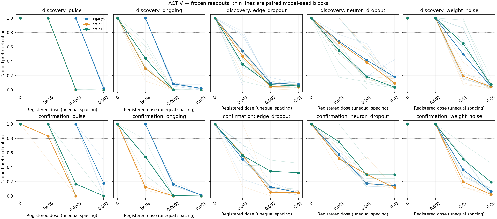
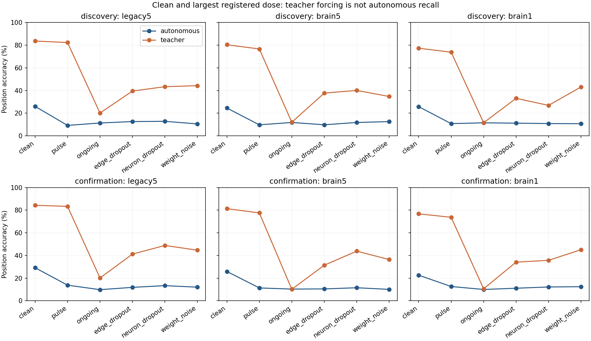

# ACT V — 고정 출력층의 교란 강건성 결과

**주된 전체망 우위 기준을 통과하지 못했다.** 이 판정은 지속 잡음에서 brain1과 legacy5를 비교한 사전 기준이다.
현재 rate 모델의 다섯 교란 곡선, 새 seed 확인, 지정 수치 검증을 완료했다.
실험 종료와 강건성 또는 생물학적 타당성의 입증은 구분한다.

지속 잡음에서 brain1−부분망의 곡선 평균 회상 차이는 기존 seed 집단에서
-7.77자리, 새 seed 집단에서
-11.61자리였다. 평균 유지율 차이는 각각
-22.10%p와 -20.96%p다.
두 집단의 모든 seed에서 차이가 음수였다. 다만 동일한 절대 잡음이 관측 상태의
변동에 비해 얼마나 큰지는 그래프마다 달랐다. 이 진폭 차이를 구조 효과와 구분해야 한다.

## 1. Repository audit

ACT I의 원주율 기준 모델과 ACT IV 종료 문서, 기존 Phase2 강건성 자료,
실행 코드·config·checkpoint·tests·manifest를 대조했다. 기존 Phase2는 부분망의
상태 단발/지속 잡음과 연결 제거 세 종류를 다뤘다. 전체망 비교와 뉴런 제거,
가중치 교란은 이번 패널의 추가 범위다. ACT IV의 국소 학습 모델을 섞지 않았다.
과거 Phase2는6,000회,이번 ACT I 기반 head는2,000회 학습했으므로 두 연구의
수치를 같은 예산의 직접 비교처럼 합산하지 않는다.

발견한 실제 불일치: 첫 smoke supervisor가 Windows venv 실행기 RSS만 측정했다.
원래 약4MiB라는 세 기록은 실제 worker 메모리로 사용할 수 없다. 수치는 보존하고,
본 실험 전에 프로세스 트리 전체 합산으로 수정했다. [공학 감사](act5-engineering-audit.md).
수치 계산은 바뀌지 않았고 threshold1 재시험의207개 배열은 원본과 정확히 같았다.
본 실험의 메모리 기록은 수정된 측정이다. 과거 연구의 부정 결과도 보존한다.

## 2. Reproduced baseline

기존 ACT I legacy5/brain5/brain1의 **30개 모델을 전부** 재사용했다. 깨끗한 자율
출력·확률·MBON 상태 및 teacher 입력 상태를 checkpoint와 정확히 대조했다.
기존 평균 Pi Memory Score는35.0/31.8/34.1이다. 새 확인 모델은3seed×2부분망/입력 매핑 조건×3망,
총18개를 같은 절차로 학습했다. 첫 새 seed의6개 head는 정확한 refit도 확인했다.
기존 Python3.12 격리 환경을 재사용했으며 새 clean-environment 설치로 표현하지 않는다.

| cohort | graph | clean mean PMS | clean teacher accuracy % |
| --- | --- | --- | --- |
| discovery | legacy5 | 35.000 | 83.65 |
| discovery | brain5 | 31.800 | 80.41 |
| discovery | brain1 | 34.100 | 77.31 |
| confirmation | legacy5 | 39.167 | 84.26 |
| confirmation | brain5 | 34.333 | 81.30 |
| confirmation | brain1 | 25.000 | 76.73 |

## 3. New implementation

[실행기](../scripts/act5_robustness.py), [독립 검증기](../scripts/verify_act5_robustness.py),
[그림 도구](../scripts/plot_act5_robustness.py), [테스트](../tests/test_act5_robustness.py).
Canonical neuron/edge ID에 맞춰 같은 구조에는 같은 교란 draw를 적용했다.
뉴런 제거는 KC 중간 갱신과 MBON 최종 갱신에서 모두 고정0을 강제한다.
출력층과 전처리, 살아남은 연결의 정규화는 교란 후 변경하지 않았다.

## 4. Experiments executed

설계 commit `7cdba73`; 메모리 측정 수정 및 main code commit `e4683d7d0caf4b3f24b48f0b4fe17212cab06f6e`.
[Protocol](act5-robustness-protocol.md), [config](../configs/act5_robustness.json),
[seed audit](act5-seed-audit.json). Discovery7142–7146, confirmation371142–371144;
부분망/입력 매핑 조건701/702, legacy5/brain5/brain1. 각 seed에서 두 조건을 먼저 평균해 n=5와 n=3을
별도로 분석했다. 같은 connectome이며 생물학적 표본8개가 아니다.

π offset0,길이200,prompt314,자율 생성197. 동일48 MBON,482개 head 파라미터,
gain.9/leak.6,mbon_after_kc,Adam2000/LR.03,first32 target4×. 새 fit은 clean에서만
시행했다. 부분망686뉴런/3,309·3,241연결; 전체망138,639뉴런,threshold5는
2,700,513연결,threshold1은15,091,983연결이다.

| Family | 세 비영 강도 | 적용 |
| --- | --- | --- |
| pulse | 1e-6,1e-4,1e-3 | 깨끗한 prompt 뒤 첫 예측 직전에 한 번 state Gaussian |
| ongoing | 1e-6,1e-4,1e-3 | 매 예측 직전 state Gaussian |
| edge_dropout | .001,.005,.01 | prompt 이전부터 Bernoulli 연결 제거 |
| neuron_dropout | .001,.005,.01 | 모든 역할이 대상; 입력/관측도 포함한 지속0 clamp |
| weight_noise | .001,.01,.05 | lognormal 배수의 sigma; 연결 부호/지원집합 보존 |

각 모델에 교란 realization은 한 개다. 강도 간 같은 draw와 중첩 mask를 사용한다.
주입되는 뉴런당/연결당 강도는 같지만 전체 에너지는 그래프 크기에 따라 다르다.
State는[-1,1]로 clip하며 개수를 기록한다. Bernoulli 제거는 정확한 개수가 아니므로
실제 제거 수·root IDs를 보존했다. 교란을 서로 결합하지 않았다.

**48개 모델, 실제 평가 궤적1,056개.** 각 모델에서 clean 두 모드,
자율15비영,teacher 최대 강도5개를 실행했다. 영점240행은 clean 출력의 명시적
alias이며 추가 독립 평가로 세지 않는다. 별도 smoke의81궤적과 공학 재시험은 제외했다.

## 5. Results

Confirmed primary = `False`.
확인된 모든 사전 비교 = `[]`.
최대 강도에서 확인된 절대 강건성 = `[]`.
이는 등록한 상대/절대 기준의 결과이며 두 기준은 다른 질문이다.

아래는 **seed별 지속 잡음 곡선**이다. 각 칸은 세 비영 강도의 평균 PMS / 평균 capped
retention이다. Retention=min(PMS/clean PMS,1). 두 부분망/입력 매핑 조건을 먼저 평균했다.

| cohort | seed | legacy5 | brain5 | brain1 |
| --- | --- | --- | --- | --- |
| discovery | 7142 | 13.167 / 0.361 | 3.500 / 0.103 | 7.833 / 0.227 |
| discovery | 7143 | 12.500 / 0.373 | 1.500 / 0.042 | 3.333 / 0.104 |
| discovery | 7144 | 13.167 / 0.351 | 2.500 / 0.071 | 3.833 / 0.110 |
| discovery | 7145 | 13.333 / 0.376 | 2.167 / 0.102 | 3.333 / 0.098 |
| discovery | 7146 | 12.333 / 0.385 | 6.000 / 0.179 | 7.333 / 0.203 |
| confirmation | 371142 | 14.333 / 0.383 | 2.000 / 0.056 | 8.333 / 0.260 |
| confirmation | 371143 | 16.833 / 0.406 | 1.333 / 0.039 | 2.000 / 0.190 |
| confirmation | 371144 | 14.833 / 0.386 | 0.833 / 0.026 | 0.833 / 0.096 |

지속 잡음의 paired 차이와 기술 통계:

| cohort | contrast | metric | mean | median | variance | bootstrap95 | paired dz | gate |
| --- | --- | --- | --- | --- | --- | --- | --- | --- |
| discovery | brain1-legacy5 | pi_memory_score | -7.767 | -9.167 | 5.744 | -9.567 / -5.933 | -3.240 | False |
| discovery | brain1-legacy5 | retention | -0.221 | -0.242 | 0.004 | -0.267 / -0.171 | -3.614 | False |
| discovery | brain5-legacy5 | pi_memory_score | -9.767 | -10.667 | 4.022 | -11.000 / -7.967 | -4.870 | False |
| discovery | brain5-legacy5 | retention | -0.270 | -0.273 | 0.002 | -0.306 / -0.233 | -6.017 | False |
| discovery | brain1-brain5 | pi_memory_score | 2.000 | 1.333 | 1.764 | 1.267 / 3.200 | 1.506 | False |
| discovery | brain1-brain5 | retention | 0.049 | 0.038 | 0.002 | 0.014 / 0.089 | 1.005 | False |
| confirmation | brain1-legacy5 | pi_memory_score | -11.611 | -14.000 | 23.787 | -14.833 / -6.000 | -2.381 | False |
| confirmation | brain1-legacy5 | retention | -0.210 | -0.216 | 0.007 | -0.289 / -0.123 | -2.515 | False |
| confirmation | brain5-legacy5 | pi_memory_score | -13.944 | -14.000 | 2.509 | -15.500 / -12.333 | -8.803 | False |
| confirmation | brain5-legacy5 | retention | -0.351 | -0.359 | 0.000 | -0.367 / -0.327 | -16.645 | False |
| confirmation | brain1-brain5 | pi_memory_score | 2.333 | 0.667 | 12.111 | -0.000 / 6.333 | 0.670 | False |
| confirmation | brain1-brain5 | retention | 0.142 | 0.151 | 0.005 | 0.070 / 0.204 | 2.097 | False |

각 종류의 사전 지정 **최대 강도**에서 평균 PMS / capped retention:

| cohort | family | dose | legacy5 | brain5 | brain1 |
| --- | --- | --- | --- | --- | --- |
| discovery | pulse | 0.001 | 0.700 / 0.021 | 0.000 / 0.000 | 0.000 / 0.000 |
| discovery | ongoing | 0.001 | 0.800 / 0.024 | 0.000 / 0.000 | 0.000 / 0.000 |
| discovery | edge_dropout | 0.01 | 2.700 / 0.080 | 1.200 / 0.041 | 1.900 / 0.056 |
| discovery | neuron_dropout | 0.01 | 6.100 / 0.182 | 3.100 / 0.094 | 1.300 / 0.038 |
| discovery | weight_noise | 0.05 | 1.700 / 0.047 | 1.300 / 0.043 | 2.600 / 0.076 |
| confirmation | pulse | 0.001 | 7.333 / 0.179 | 0.000 / 0.000 | 0.000 / 0.000 |
| confirmation | ongoing | 0.001 | 0.500 / 0.012 | 0.000 / 0.000 | 0.000 / 0.000 |
| confirmation | edge_dropout | 0.01 | 1.833 / 0.046 | 1.500 / 0.046 | 3.333 / 0.321 |
| confirmation | neuron_dropout | 0.01 | 5.333 / 0.144 | 4.000 / 0.115 | 3.000 / 0.293 |
| confirmation | weight_noise | 0.05 | 2.500 / 0.064 | 0.667 / 0.019 | 2.667 / 0.193 |

[모든 원자료](../results/act5_main/raw-metrics.csv),
[모든 dose/seed](../results/act5_main/dose-seed-table.csv),
[paired differences](../results/act5_main/paired-differences.csv),
[전체 통계와 판정](../results/act5_main/summary.json).
다른 교란의 모든 평균·중앙값·분산·bootstrap·효과 크기도 summary에 있다.
작은 n의 구간은 기술 통계이며 생물학적 모집단의 정밀한 신뢰구간이 아니다.



## 6. Interpretation

판정은 사전 고정한 곡선 지수(세 비영 점의 동일 가중 평균)와 실제 회상 길이를
함께 사용한다. 연속 dose 축의 면적이나 formal memory capacity가 아니다.
두 cohort 모두 retention 이득>=.10,평균 회상 이득>=2자리 및 지정 seed 일관성을
만족해야 비교를 확인한다. 약한 강도만 선택하거나 secondary 결과로 primary를
교체하지 않았다. 원래 clean PMS가0이면 관련 비율 판정은 판별 불가다.

같은 절대 잡음도 clean MBON 변동에 대한 상대 크기는 다르다. 아래는σ=.001을
각 head의48개 학습 MBON 표준편차 중앙값으로 나눈 비율이다. 전체 뉴런의 동일
상대 잡음이라는 뜻이 아니며,구조와 feature amplitude 효과를 완전히 분리하지 않는다.

| cohort | graph | mean relative dose | range across heads |
| --- | --- | --- | --- |
| confirmation | brain1 | 1.310 | 1.220 / 1.409 |
| confirmation | brain5 | 2.209 | 1.951 / 2.693 |
| confirmation | legacy5 | 0.272 | 0.262 / 0.281 |
| discovery | brain1 | 1.266 | 1.136 / 1.456 |
| discovery | brain5 | 2.264 | 1.723 / 3.062 |
| discovery | legacy5 | 0.276 | 0.237 / 0.345 |

최대 강도에서 정답 입력과 자기 출력 피드백을 구분한 진단:

| cohort | family | graph | autonomous % | teacher % | teacher rank | standardized clean MSE |
| --- | --- | --- | --- | --- | --- | --- |
| discovery | pulse | legacy5 | 9.19 | 82.34 | 15.31 | 0.003 |
| discovery | pulse | brain5 | 9.70 | 76.65 | 10.95 | 5.009 |
| discovery | pulse | brain1 | 10.76 | 73.81 | 11.46 | 1.358 |
| discovery | ongoing | legacy5 | 11.32 | 20.10 | 26.26 | 0.812 |
| discovery | ongoing | brain5 | 11.78 | 11.98 | 42.32 | 1072.010 |
| discovery | ongoing | brain1 | 11.47 | 11.52 | 42.89 | 282.493 |
| discovery | edge_dropout | legacy5 | 12.59 | 39.49 | 15.17 | 0.211 |
| discovery | edge_dropout | brain5 | 9.75 | 37.72 | 10.55 | 0.061 |
| discovery | edge_dropout | brain1 | 11.17 | 33.10 | 11.26 | 0.120 |
| discovery | neuron_dropout | legacy5 | 12.79 | 43.35 | 15.11 | 0.413 |
| discovery | neuron_dropout | brain5 | 11.78 | 40.05 | 10.44 | 0.554 |
| discovery | neuron_dropout | brain1 | 10.81 | 26.85 | 11.17 | 0.734 |
| discovery | weight_noise | legacy5 | 10.51 | 44.26 | 15.29 | 0.031 |
| discovery | weight_noise | brain5 | 12.54 | 34.72 | 10.52 | 0.076 |
| discovery | weight_noise | brain1 | 10.71 | 43.10 | 11.28 | 0.010 |
| confirmation | pulse | legacy5 | 13.79 | 83.33 | 15.51 | 0.003 |
| confirmation | pulse | brain5 | 11.34 | 77.58 | 11.29 | 5.589 |
| confirmation | pulse | brain1 | 12.61 | 73.69 | 11.44 | 1.480 |
| confirmation | ongoing | legacy5 | 9.81 | 20.14 | 26.50 | 0.666 |
| confirmation | ongoing | brain5 | 10.32 | 10.15 | 42.83 | 1099.159 |
| confirmation | ongoing | brain1 | 9.98 | 10.58 | 42.91 | 271.532 |
| confirmation | edge_dropout | legacy5 | 11.84 | 41.20 | 15.42 | 0.066 |
| confirmation | edge_dropout | brain5 | 10.49 | 31.39 | 10.81 | 0.244 |
| confirmation | edge_dropout | brain1 | 11.08 | 34.09 | 11.23 | 0.037 |
| confirmation | neuron_dropout | legacy5 | 13.37 | 48.82 | 15.47 | 0.057 |
| confirmation | neuron_dropout | brain5 | 11.51 | 43.82 | 10.93 | 0.067 |
| confirmation | neuron_dropout | brain1 | 12.18 | 35.70 | 11.22 | 0.064 |
| confirmation | weight_noise | legacy5 | 12.01 | 44.67 | 15.47 | 0.032 |
| confirmation | weight_noise | brain5 | 10.07 | 36.38 | 10.85 | 0.048 |
| confirmation | weight_noise | brain1 | 12.44 | 45.09 | 11.23 | 0.009 |

두 모드는 첫 오류까지 입력과 잡음이 같으므로 그때까지의 prefix score는 같다.
이 진단은 오류 뒤에도 맞는 이전 기호를 계속 공급하는 효과를 위치 정확도로 본다.
단발 상태 잡음의 최대 강도에서는 자율 회상이 크게 떨어져도 teacher 정확도가
상당 부분 유지됐다. 지속 잡음에서는 teacher 정확도도 크게 떨어졌다. 따라서
단발 교란 뒤 자기 출력의 오류가 다음 입력으로 이어지는 효과와, 매 단계 새로
들어오는 교란의 효과를 구분해 볼 필요가 있다.
Teacher 결과는 맞는 이전 기호를 계속 공급했을 때의 위치 정확도다. 자율 기억
성공으로 부를 수 없다. Frozen head의 오류는 내부 정보 소실,상태 분포 이동,
출력층 경계 민감도와 피드백 누적을 구별하지 못한다. Rank가 커져도 잡음이
방향을 늘린 것일 수 있으며 더 많은 유용한 정보가 있다는 증거가 아니다.
Neuron dropout은 입력과 MBON 관측도 제거하므로 순수 저장 장소 ablation이 아니다.



## 7. Negative findings

최대 강도의30개 cohort/graph/family 조합은 모두 절대 강건성 기준을 통과하지 못했다.
두 cohort에서 함께 확인하도록 정한 15개 사전 비교 중 통과한 것은 없었다.
유일한 discovery 비교 통과는 weight_noise의 brain1−brain5였다. 곡선 평균 PMS
차이는6.667자리,retention 차이는16.07%p였지만,
confirmation에서는 PMS 차이-2.000자리였다. 상대 retention은
16.39%p 높았어도,등록된 절대 회상 길이 조건을 만족하지 못했다.
따라서 양성처럼 보이는 상대 곡선만 골라 weak-edge 이득으로 확정하지 않는다.

실패/판별 불가인 각 graph/family 및 비교를 summary의 `passed` 필드에 그대로
보존했다. 원래 Phase2의 두 집단 모두 대표 상태 잡음과1%연결 제거 강건성 기준에
실패한 사실은 변경하지 않는다. 새로운 양성 secondary가 있더라도 과거 실패나
ACT I의 clean 전체망 우위 실패를 지우지 않는다. Parameter search는 실행하지 않았다.

## 8. What we can claim

**실제 초파리 connectome 구조를 사용한 계산 모델**에서 동일 입력·관측·출력층
조건의 다섯 교란 곡선을 실행하고 새 seed에서 같은 기준을 확인했다.
현재 rate-model ACT V의 등록된 실험과 검증은 완료했다. 어떤 조건이 기준을
통과했는지는 위 판정을 따른다. Representation,decoding,internal learning은
별개이며 이번에는 recurrent learning을 수행하지 않았다.

## 9. What we cannot claim

실제 초파리의 기억,생리학적 강건성,미학습 π 예측,Shannon/formal memory capacity,
혹은 모든 내부 정보의 소실을 주장하지 않는다. 이는 rate 모델이며 LIF나 실제
신경 조직 자체가 아니다. Uniform leak,계산적 update 순서와 incoming normalization,
차원 없는 독립 잡음은 실제 뇌의 시간·세포별 잡음·상관구조에 맞춰 검증되지 않았다.
Whole threshold 비교는 배선·normalization·총 교란량이 함께 달라 순수한 weak-edge
인과 효과가 아니다. 새로운 random topology 비교나 perturbation-trained head는 없다.
[모델 가정 감사](act5-model-assumptions.md)에 코드와 생물학적 해석의 차이를 항목별로
기록했다. 생물학적 타당성에 관한 이번 작업은 가정 감사에 한정되며, 생리학적 검증 완료가 아니다.

## 10. Reproducibility

[종료 감사](../results/act5_closeout/audit.json),
[Main manifest](../results/act5_main/manifest.json), [독립 검증](../results/act5_validation/checks.json),
[smoke 검증](../results/act5_smoke_validation/checks.json), [메모리 수정 검증](../results/act5_resource_probe/checks.json),
[테스트 증거](../results/act5_tests/manifest.json).
Config SHA256 `d435e454ee2eaa5a5d359ae1614f1519bc304935152b373703f6c9ed837382c5`.
Main manifest SHA256 `31bf94bd27006a4efe99cbbe202204dfb5d762184d3b2e8229e95db0dad1878d`.

독립 scalar 궤적 440개,exact fresh refits 6개,
원자료 metric 행 1,296개와 집계·판정을 검증했다. 모든 부분망과 지정된
전체망 사례를 replay했으며 **전체망의 모든 궤적을 독립 replay했다고 주장하지 않는다**.
나머지도 파일 checksum과 모든 저장 metric을 검사했다. 최대 수치 차이 0.
이전 파일 21,474개가 그대로다. 전체 회귀 검사에서 252개 테스트가 통과했고 8개는 skip됐다.
Supervisor만 수정한 뒤 신규 12개 테스트도 다시 통과했다.

Main wall 2963.88s; worker-tree peak 최대 1.120GiB
(.2s sampling). 검증 wall 656.06s,peak 1.117GiB
(.05s sampling). 환경/BLAS/package versions는 각 case.json에 있다. 학습 checkpoint,
197기호 출력·확률·관측 상태·mask·개별 metric을 모두 보존했다.
Windows 11, Python 3.12.10, NumPy 2.3.5, SciPy 1.17.0, pandas 2.2.3,
OpenBLAS 0.3.30을 사용했다. CPU worker는 최대 둘, worker별 수치 연산 thread는 하나다.

```powershell
$env:PYTHONPATH='src'
# Graph cache가 없는 checkout에서만 먼저 실행:
# ../venv-act1/Scripts/python.exe -m flying.training.phase6 prepare --cache outputs/act1-graphs
../venv-act1/Scripts/python.exe -m pytest -q
../venv-act1/Scripts/python.exe scripts/act5_robustness.py run --smoke --out outputs/act5_smoke_new
../venv-act1/Scripts/python.exe scripts/act5_robustness.py run --out outputs/act5_new
../venv-act1/Scripts/python.exe scripts/verify_act5_robustness.py outputs/act5_new --out outputs/act5_check_new
../venv-act1/Scripts/python.exe scripts/plot_act5_robustness.py outputs/act5_new --out outputs/act5_plots_new
```

기록된 source revision과 pinned graph cache/ACT I source artifacts가 필요하다.
독립 검증은 코드 hash를 확인한다. 항상 새 output 폴더를 사용한다.

## 11. Next highest-information experiment

**고정 출력층에서 관측 신호 대비 상대 잡음 크기를 맞춘 지속 잡음 대조 하나**를 제안한다.
이번σ=.001은 부분망의 학습 MBON 표준편차 중앙값 대비약.27배지만,whole graph에서는
약1.3–2.3배였다. 다음에는 각 모델의 clean48-MBON 표준편차 중앙값을 기준으로
같은 relative-dose grid를 먼저 고정하고,같은 전체 뉴런 잡음·입력·관측·head를
유지한다. 하나의 모델별 scalar로 크기만 맞추며 모든 뉴런의 개별 상대 잡음까지
동일해지는 것은 아니다. 상태 진폭 차이를 통제해도 whole/partial 차이가 남는지
묻는 별도 실험이다. 이번에는 실행하지 않았다. 기존 절대 잡음 결과를 더 약한
잡음의 성공으로 교체하지 않으며,새 판정·seed·예산은 다음 결과 전에 고정한다.
