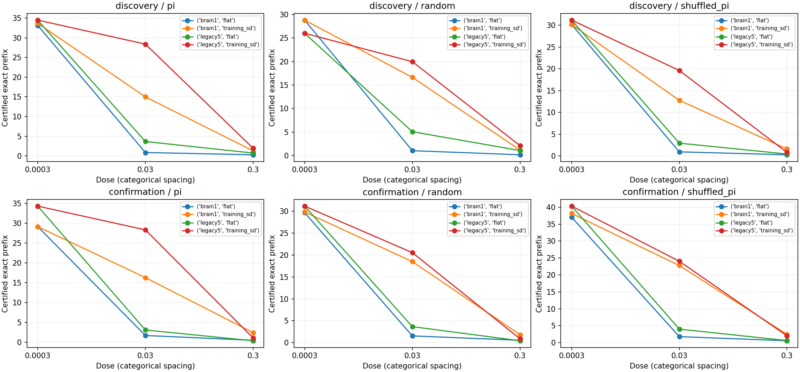
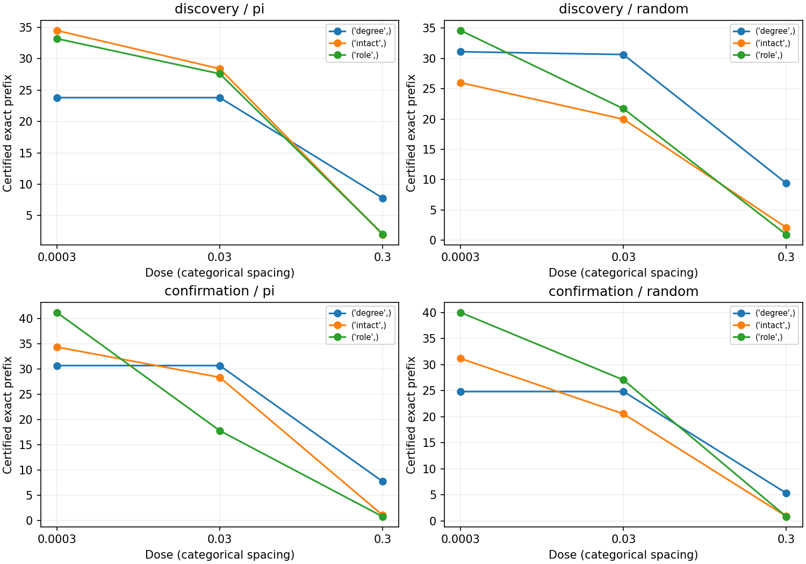
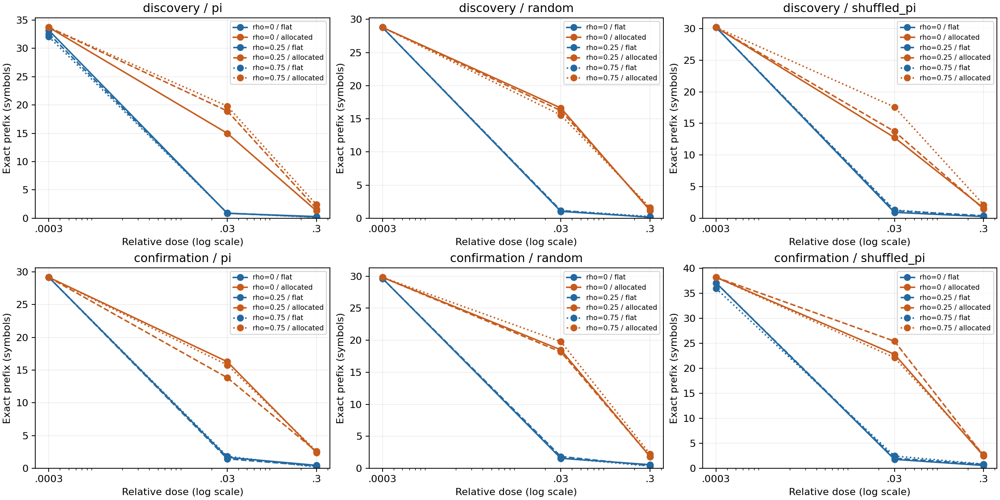

# DrosoMem 추가 연구 완료 보고 — 수열·구조 대조·상관 잡음

사용자가 지정한 **세 축의 제한된 계산 실험과 독립 검증을 순서대로 모두 완료했다.**
완료는 모든 가설의 성공이나 생리학적 검증을 의미하지 않는다.
[사전 완료 계획](additional-research-completion-plan.md)을 결과 전 commit `f1c667c`에서 고정했다.

## 1. Repository audit

ACT I–V의 기존 연구는 각 보고서에 명시된 계산 모델 범위에서 닫혀 있었다.
이전 [추가 연구 브리핑](additional-research-brief.md)은 첫 피드백 연구를 마친 시점의 기록이다.
그 문서의 나머지 후보가 미실행이라는 표시는 당시 상태이며, 현재 상태는 이 보고서와
[연구 현황](research-status.md)을 따른다. 과거 봉인 문서·결과·manifest를 수정하지 않았다.
README, docs, config, runner, src, tests, checkpoint와 검증 chain을 확인하고,
기존 ACT II 60개 head와 검증된 graph cache를 재사용했다. 모든 과거 실험을 재실행한 것은 아니다.

집계상 주의점도 기록한다. 원자료의 `reused_exposure`는 상관 연구의 rho0만 표시한다.
구조 연구 intact 576개 노출 역시 수열 연구와 동일하며, 별도 종료 감사에서 모든 저장 배열의
정확한 일치를 확인했다. 따라서 총 8,640개 certificate 평가는 **6,336개 서로 다른 노출 설정과
2,304개 부모 조건 반복**이다. 1,728개는 rho0, 576개는 구조 intact 반복이다.
이 수를 독립 표본 수로 사용하지 않는다. 통계 단위는 발견 5개/확인 3개 seed-block이다.

## 2. Reproduced baseline

기존 ACT II의 60개 clean 출력·확률·관측값을 정확히 재현했다. 이전 평균과 실제 평균은 같다.
Partial/whole clean prefix는 π 34.5/33.7, random 26.0/28.8, shuffled π 31.2/30.2였다.
36개 새 head는 새 모델 seed로 학습했고, random/shuffled는 새 수열 seed도 사용했다.
π는 같은 구간이므로 새로운 π 구간 확인은 아니다. 새 head 전체와 기존 random head 두 개를
독립 재학습했다. 환경은 기존 Python 격리 환경을 재사용했으며 새 설치라고 주장하지 않는다.

## 3. New implementation

[실행기](../scripts/research_suite.py), [독립 검증기](../scripts/verify_research_suite.py),
[종료 감사](../scripts/audit_research_suite.py), [고정 config](../configs/research_suite.json)를 추가했다.
기존 SequenceDataset·graph builder·학습기·검증된 구조 sampler를 활용했다.
Target-free 자율 실행, 일반 기호 prefix, 수열별 checkpoint, graph별 refit,
공통 성분 관측 잡음, clean=0 유지율의 정의 불가 전파를 지원한다. 관련 테스트 **28개 통과**.
고정 내부 연결에서 외부 readout만 학습한다.

## 4. Experiments executed

| 연구 | 주 판정 | 조건 수 | 새 fit | certificate 평가 | 실제 평가 경로 | 독립 전체 replay | 독립 refit |
| --- | --- | --- | --- | --- | --- | --- | --- |
| sequence | 통과 | 96 | 36 | 1728 | 420 | 350 | 38 |
| structure | 실패 | 96 | 64 | 1728 | 672 | 672 | 64 |
| correlation | 통과 | 96 | 0 | 5184 | 52 | 52 | 0 |

합계: 새 head fit **100개**, 독립 head refit **102개**, 실제 평가 경로 **1,144개**,
독립 전체 자율 replay **1,074개**. 별도로 새 teacher training 궤적 100개를 저장했다.
부모 조건의 재실행을 포함한 횟수이며 독립 모델·동물 반복 수가 아니다.
Smoke 3단계의 9조건·75경로는 본 통계에서 제외했다.

Prefix는 prompt 다음부터 처음 틀리기 전까지 연속으로 맞힌 기호 수다. 유지율은
`min(prefix / clean_prefix, 1)`이며 clean이 0이면 정의 불가다. 배분 이득의 사전 기준은
평균 prefix 차이 ≥2기호와 유지율 차이 ≥10%p, 각 지표가 발견 4/5 이상·확인 3/3
seed-block에서 양수인 것이다. 구조 비교는 같은 기준을 intact−role에 적용했다.

관측 잡음은 출력층이 뉴런 상태를 읽을 때 더하는 교란이다. Flat은 좌표마다 같은 크기,
training-SD 배분은 학습 상태의 좌표별 변동 크기에 비례해 나눈다. 기준 q는 관측 좌표들의
학습 표준편차 중앙값이다. 학습 때 정답 입력을 사용하고 자율 평가에서는 생성한 기호를
다음 입력으로 사용한다. 내부 연결을 바꾸는 학습은 하지 않았다.

공통 조건은 K10, 길이 200, prompt314, 평가 197기호, 관측 MBON48개,
48→8 tanh→10 readout 482파라미터다. Adam 2,000회, LR .03, L2 1e-5,
fixed32 ×4, incoming-L1 gain .9, leak .6, mbon_after_kc를 고정했다.
부분망 legacy5는 686뉴런·3,309/3,241연결, 전체망 brain1은 threshold1,
138,639뉴런·15,091,983연결이다. 관측 뉴런 수를 늘리지 않았다.

발견 model/data seed 9142–9146/9242–9246, 새 확인 440142–440144/440242–440244,
circuits701/702, 독립 잡음448001–448003, 공통 잡음478001–478003이다.
강도 .0003/.03/.3, 상관 rho0/.25/.75를 결과 전에 고정했다.
Flat과 training-SD 배분은 기대 preclip 에너지만 같으며 realized/postclip 에너지는 다를 수 있다.
구조 대조에서는 paired intact의 q를 공통으로 쓰고, graph별 readout을 refit한 뒤 고정 평가했다.
Degree는 signed in/out degree와 각 뉴런의 incoming weight multiset을 보존하며,
role은 역할별 signed in/out counts도 보존한다. 구체적인 연결 상대·motif·outgoing strength는
보존하지 않는다. 역할 annotation을 생리학적 module로 해석하지 않는다.

## 5. Results

모든 값은 사전 지정 회상 prefix의 paired 차이다. 아래 seed별 표에서 구조 열만
intact−role이고 나머지는 allocated−flat이다. 강도·circuit·잡음 반복을 먼저 평균했다.

| cohort | seed | 수열 random/whole | 구조 π | 구조 random | 상관 .25 random/whole | 상관 .75 random/whole |
| --- | --- | --- | --- | --- | --- | --- |
| discovery | 9142 | 7.611 | 4.444 | 6.333 | 5.889 | 5.667 |
| discovery | 9143 | 6.833 | -1.056 | -10.722 | 7.278 | 6.611 |
| discovery | 9144 | 2.833 | -2.333 | -4.056 | 4.278 | 4.500 |
| discovery | 9145 | 6.167 | -0.833 | -4.111 | 5.889 | 5.556 |
| discovery | 9146 | 4.222 | 3.111 | -2.722 | 3.778 | 3.889 |
| confirmation | 440142 | 5.056 | 9.944 | 1.444 | 5.278 | 5.889 |
| confirmation | 440143 | 4.000 | 0.444 | -11.167 | 3.389 | 3.500 |
| confirmation | 440144 | 9.333 | -6.389 | -5.556 | 9.278 | 10.833 |

| 연구 | 조건 | 평균 prefix 차이 | bootstrap95 | 평균 유지율 차이 %p | prefix 양수 block |
| --- | --- | --- | --- | --- | --- |
| sequence | discovery/random/brain1/intact/0.0 | 5.533 | 3.911 / 7.011 | 20.226 | 5/5 |
| sequence | confirmation/random/brain1/intact/0.0 | 6.130 | 4.000 / 9.333 | 21.241 | 3/3 |
| structure | discovery/pi/role | 0.667 | -1.522 / 3.078 | -1.414 | 2/5 |
| structure | discovery/random/role | -3.056 | -7.789 / 2.178 | 8.968 | 1/5 |
| structure | confirmation/pi/role | 1.333 | -6.389 / 9.944 | 12.526 | 2/3 |
| structure | confirmation/random/role | -5.093 | -11.167 / 1.444 | 1.464 | 1/3 |
| correlation | discovery/random/brain1/intact/0.25 | 5.422 | 4.300 / 6.444 | 20.426 | 5/5 |
| correlation | discovery/random/brain1/intact/0.75 | 5.244 | 4.367 / 6.022 | 20.776 | 5/5 |
| correlation | confirmation/random/brain1/intact/0.25 | 5.981 | 3.389 / 9.278 | 22.671 | 3/3 |
| correlation | confirmation/random/brain1/intact/0.75 | 6.741 | 3.500 / 10.833 | 25.070 | 3/3 |

Median, sample variance, paired dz, 유지율의 seed별 값·구간 및 모든 보조 조건은
[수열 결과](sequence-noise-results.md), [구조 결과](structure-noise-results.md),
[상관 결과](correlated-noise-results.md)의 원자료·통계 표에 모두 있다.
작은 n5/n3 bootstrap이며 p-value로 판정하지 않았다.

수열·구조 그림의 강도는 범주 간격이고 상관 그림은 로그 축이다. 평균 그림이 seed별 분산을 대체하지 않는다.

## 6. Interpretation

수열 일반화와 합성 공간 상관에서의 배분 이득은 사전 기준을 통과했다. 무작위 수열의
전체망 배분 이득은 무상관에서 +5.533/+6.130기호, rho.25에서 +5.422/+5.981,
rho.75에서 +5.244/+6.741이었다(발견/확인 집단). 같은 효과가 π에만 한정되지는 않았다.
상관 자체의 효과는 배분 이득과 구분한 [별도 paired 분석](../results/research_suite_correlation_rho_analysis/statistics.json)에 있다.

그러나 원래 배선의 역할 보존 대조 대비 우위는 π와 random의 두 집단 모두 실패했다.
Random의 원래 망−role 차이는 −3.056/−5.093기호였다. 따라서 이번 배분 효과를
실제 연결 상대만이 제공하는 고유한 기억 특성으로 해석할 근거는 없다. 대조가 보존한
degree·역할·가중치 분포의 기여가 사라졌다는 뜻도 아니다.

저장 상태의 사후 진단에서 degree 대조의 관측 SD 기준은 원래 망 대비 중앙값2.596배였다.
같은 절대 잡음에도 신호에 대한 상대 교란 크기가 달라질 수 있다. 이는 신호 규모가 설명
후보임을 보여 줄 뿐, 이번 음성 결과를 성공으로 바꾸거나 topology의 인과 기여를 분리한 결과는 아니다.

관측 좌표별 변동 규모와 readout의 해독 민감도가 중요한 설명 후보다. 이 실험은 잡음을
관측 직전에 더하며 내부 신경 상태를 직접 바꾸지 않는다. 첫 오류 이전까지는 정답 입력
상태와 자율 상태가 같지만, 이후 출력은 실제 자율 궤적에서만 평가했다. 저장된 certificate를
전체 생성 수열로 취급하지 않았다. Representation, decoding, internal learning을 구분한다.

## 7. Negative findings

구조 우위의 주 가설은 실패했다. Degree/π의 발견 모델9143/c702는 clean prefix0이어서
해당 유지율 분석을 판별 불가로 보존했다. Role/π 확인 집단에서는 배분 개선 기준도 실패했다.
상관 연구가 통과하더라도 가장 강한 잡음의 rho.75 random/brain1은 평균1.600/2.222기호였으며,
전체 강도 평균 유지율은58.717/65.488%였다. 완전하고 안정적인 회상을 달성하지 못했다.

수열 연구의 random/brain1 allocated 강도 .3 회상은 1.167/1.833기호였고,
전체 강도 평균 clean 대비 유지율은 58.021/63.618%였다. 모델440142/c701/random/brain1은
clean에서도 prefix1이었다. 이 실패 모델과 오류 뒤의 낮은 정확도를 보존했다.
새 hyperparameter 탐색, seed 교체, checkpoint 선택, 사후 success 기준 변경은 하지 않았다.

## 8. What we can claim

이 고정 rate-model·K10·200기호 과제에서 학습 관측 신호의 SD에 비례한 잡음 배분은
동일 기대 raw 에너지의 균일 배분보다 정확한 자율 prefix를 개선했다. 이 이득은 새 모델·수열
seed의 random/shuffled π와 지정 공간 상관에서도 관찰됐다. 모든 기호·확률·지표와
등록한 독립 재실행/재학습 범위를 확인했다. 내부 연결이 학습한 결과라는 주장은 하지 않는다.

모든 주장은 **실제 초파리 connectome 구조를 사용한 계산 모델**의 지정 조건에 한정된다.

## 9. What we cannot claim

전체망의 일반적 우위, 실제 동물의 수열 기억, 생리학적 타당성, 내부 연결의 경험 기반 기억
학습, unseen prediction, formal/Shannon memory capacity를 주장할 수 없다.
구조 대조는 부분망 두 개와 finite 10E swap sampler이며 균일한 graph ensemble 표본이 아니다.
상관 잡음은 관측 48좌표의 합성 공통 성분이고 시간적으로 white다. 실측 상관, 다른 neuron
dynamics, 전체망 재배선은 실행하지 않았다. 모델·수열·graph seed 요인의 분산도 분리하지 못한다.
Threshold5 전체망을 이번 확장에서 다시 비교하지 않았으며 기존 ACT I 결론을 바꾸지 않는다.

## 10. Reproducibility

사전 source commit `f1c667cea5370dba501da2e35b8f3d42f5278466`.
각 stage의 config·manifest·환경·checkpoint·행렬·원자료는
[sequence](../results/research_suite_sequence/manifest.json),
[structure](../results/research_suite_structure/manifest.json),
[correlation](../results/research_suite_correlation/manifest.json)에 기록했다.
상관 연구는 부모 checkpoint를 참조하며 새 checkpoint 학습을 주장하지 않는다.
[종료 감사](../results/research_suite_closeout/audit.json)는 세 연구와 과거 봉인 문서의 보존을 확인한다.

| 연구 | 실행 초 | 검증 초 | worker 최대 sampled RSS MiB | 최대 수치 오차 |
| --- | --- | --- | --- | --- |
| sequence | 829.656 | 268.506 | 1012.262 | 3.55e-14 |
| structure | 347.516 | 327.491 | 157.816 | 4.2e-14 |
| correlation | 292.156 | 220.199 | 984.441 | 4.69e-14 |

Sampled RSS는 순간 절대 peak나 두 worker 합산 peak가 아니다. Windows11, Python3.12.10,
NumPy2.3.5, SciPy1.17.0, pandas2.2.3, OpenBLAS0.3.30, 2workers×1thread였다.
예측 기호는 정확히 일치했고, 연속값 검증은 atol1e-12/rtol1e-10, metric reductions는 atol1e-11이다.
의존성 설치와 새 출력 경로 실행은 [README](../README.md), 각 단계의 정확한 명령은 개별 보고서를 따른다.
기존 결과 디렉터리는 덮어쓰지 않는다. 새 부모로 연결할 때 --parent와 --structural-validation을 지정한다.

## 11. Next highest-information experiment

**구조 대조의 graph별 상대 잡음 보정 비교 한 가지**를 제안한다. 기존 intact/degree/role
head와 수열을 고정하고 새 잡음에서, 현재의 공통 q와 각 graph의 학습 관측 SD 중앙값 q를
사용한 조건을 짝지어 비교한다. 핵심 질문은 “재배선 대조의 강건성 차이가 신호 규모를 맞추면
얼마나 달라지는가?”다. 원래 망의 승리를 목표로 삼지 않는다.

공통 q는 raw 에너지, graph별 q는 신호 대비 강도를 맞추므로 서로 다른 통제다. 두 해석을
섞지 않고 차이의 변화량을 사전에 정의해야 한다. 추가 hyperparameter 탐색이나 새 head 학습은
필요하지 않다. **제안만 했으며 새 protocol 등록·실행은 하지 않았다.** 사용자가 이번에 지정한
세 축에는 남은 실행·검증 작업이 없다. 실측 생리학·다른 동역학·전체망 재배선은 별도 미래 범위다.
