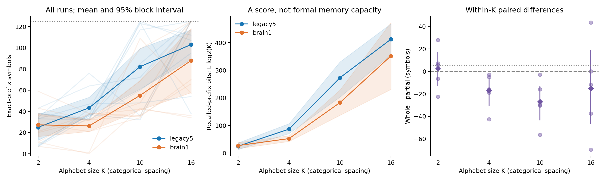

# ACT II-A — random-sequence alphabet scaling at fixed N128

**Both graphs meet the scoped trained-prefix criterion at every K, but no K
meets whole-brain superiority.** Partial/whole mean prefixes are25.0/27.3 atK2,
43.4/26.3 atK4,82.2/55.1 atK10 and103.1/88.0 atK16. Larger K does not produce
the registered endpoint recall decrease. These are trained instances, not unseen
prediction, formal memory capacity or internal synaptic learning.

Protocol91c3032 preceded outcomes. Implementation e84f330.
[Protocol](alphabet-memory-protocol.md) · [Config](../configs/alphabet_memory.json).

## 1. Repository audit

The dataset generator already accepted integer alphabets, but DigitEncoder,
KCEncoder and the nonlinear head fixed their dimensions at10. New adapters
reuse the old numerical implementation without changing historical source
modules. The previous delayed-input study measured past-symbol decoding, not
this autonomous recall task. Old results and negative findings are retained.

## 2. Reproduced baseline

Replayed/refitted the existing N128 block11142/data11242/stratum701 in both
graphs: expected/actual legacy5=34 and brain1=38. The K10 adapter separately
matched input patterns, normalized graph, features, head parameters, losses,
teacher probabilities and autonomous rollout exactly on those old314-prompt
data. These compatibility checks are excluded from new scientific estimates.
[Baseline verification](../results/alphabet_validation/baseline.json).

## 3. New implementation

SymbolEncoder accepts integer symbols0 through K−1; SymbolReadout parameterizes
the output dimension and inherits the existing objective/Adam implementation.
AlphabetExperimentConfig validates the fixed study; existing SequenceDataset,
NetworkCondition and graph/dynamics code are reused. Each manifest includes
the new adapter hashes as well as historical source/config/dataset/graph hashes.
The grouped runner loads one graph for four fresh fits, resetting states and
heads at every K. The verifier rebuilds each graph and every state trajectory.

## 4. Experiments executed

Main:5 paired model/data blocks21142/22142–21146/22146, two input strata701/702,
two graphs and four K =80 fits. Smoke8 fits (21139/22139,stratum701,20 updates)
are excluded. Legacy5 has686 neurons and3,309/3,241 edges at threshold5;
brain1 has138,639 neurons and15,091,983 edges at threshold1.

Common prompt[0,1,0],127 training transitions,125 autonomous outputs. Same48
MBONs, eligible512 KCs,51 stimulated KCs per symbol, amplitude.5, incoming-L1
gain.9, leak.6, mbon_after_kc. The16-pattern bank is nested across K, preserving
shared symbol patterns. Actual stimulated-neuron union can grow with K.

Head48→8 tanh→K:410/428/482/536 parameters. Same counts within each graph pair,
different output counts across K. Train-only scaling floor1e-5, Adam2000,
LR.03,L2=1e-5, first32 targets weight4, early loss mass128/223 at every K.
No hyperparameter search. Weighted majority and Markov1 controls use the same
training data. Generated symbols10–15 remain integers, not ambiguous strings.
K10 with010 prompt is a new anchor; it is not pooled with the old314 baseline.

No K triggered whole-brain superiority confirmation. No extra seeds or tuning were added.

## 5. Results

Prefix excludes the three supplied symbols. Bits=L log2(K) is an exact-prefix score, not measured Shannon information storage.

| Cohort | K | Graph | Mean prefix | Mean prefix bits | Teacher accuracy | Completion | H1 trained-prefix gate |
|---|---:|---|---:|---:|---:|---:|---|
| Main | 2 | legacy5 | 25.000 | 25.000 | 88.80% | 0.0% | True |
| Main | 2 | brain1 | 27.300 | 27.300 | 86.08% | 0.0% | True |
| Main | 4 | legacy5 | 43.400 | 86.800 | 90.16% | 0.0% | True |
| Main | 4 | brain1 | 26.300 | 52.600 | 86.80% | 0.0% | True |
| Main | 10 | legacy5 | 82.200 | 273.062 | 98.64% | 10.0% | True |
| Main | 10 | brain1 | 55.100 | 183.038 | 96.00% | 0.0% | True |
| Main | 16 | legacy5 | 103.100 | 412.400 | 99.28% | 50.0% | True |
| Main | 16 | brain1 | 88.000 | 352.000 | 99.28% | 40.0% | True |

### Paired whole-minus-partial effects

| Cohort | K | Mean symbols | Median | Variance | 95% block interval | d_z | W/T/L | H2 gate |
|---|---:|---:|---:|---:|---|---:|---|---|
| Main | 2 | +2.300 | +5.500 | 346.325 | [-12.400, +16.900] | 0.12359073487371645 | 3/0/2 | False |
| Main | 4 | -17.100 | -16.000 | 248.800 | [-30.300, -6.400] | -1.0841039389663314 | 0/0/5 | False |
| Main | 10 | -27.100 | -29.500 | 396.425 | [-43.200, -13.500] | -1.3610960494020248 | 0/0/5 | False |
| Main | 16 | -15.100 | -12.000 | 1783.175 | [-46.500, +18.600] | -0.35758555267499165 | 1/1/3 | False |

### Main: every seed, K and input stratum

Each cell lists stratum701 /702.

| Model / data seed | K | Partial prefix | Whole prefix |
|---|---:|---:|---:|
| 21142 / 22142 | 2 | 8 / 9 | 36 / 37 |
| 21142 / 22142 | 4 | 37 / 37 | 32 / 32 |
| 21142 / 22142 | 10 | 32 / 117 | 69 / 48 |
| 21142 / 22142 | 16 | 125 / 125 | 125 / 125 |
| 21143 / 22143 | 2 | 33 / 43 | 20 / 43 |
| 21143 / 22143 | 4 | 32 / 64 | 32 / 32 |
| 21143 / 22143 | 10 | 124 / 72 | 36 / 99 |
| 21143 / 22143 | 16 | 38 / 125 | 125 / 125 |
| 21144 / 22144 | 2 | 34 / 33 | 11 / 11 |
| 21144 / 22144 | 4 | 76 / 47 | 38 / 0 |
| 21144 / 22144 | 10 | 36 / 48 | 35 / 43 |
| 21144 / 22144 | 16 | 125 / 54 | 70 / 34 |
| 21145 / 22145 | 2 | 7 / 7 | 21 / 7 |
| 21145 / 22145 | 4 | 42 / 34 | 37 / 1 |
| 21145 / 22145 | 10 | 125 / 85 | 42 / 109 |
| 21145 / 22145 | 16 | 107 / 125 | 36 / 57 |
| 21146 / 22146 | 2 | 38 / 38 | 28 / 59 |
| 21146 / 22146 | 4 | 32 / 33 | 21 / 38 |
| 21146 / 22146 | 10 | 60 / 123 | 34 / 36 |
| 21146 / 22146 | 16 | 95 / 112 | 117 / 66 |



### Representation and input diagnostics (main means)

| K | Graph | Effective rank | Mean MBON absolute state | Mean adjacent cosine | Mean stimulated-neuron union |
|---|---|---:|---:|---:|---:|
| 2 | brain1 | 2.843 | 0.005489 | 0.998103 | 95.8 |
| 2 | legacy5 | 4.184 | 0.012784 | 0.982610 | 95.8 |
| 4 | brain1 | 5.343 | 0.005450 | 0.997237 | 176.2 |
| 4 | legacy5 | 7.786 | 0.012775 | 0.971814 | 176.2 |
| 10 | brain1 | 10.582 | 0.005643 | 0.996760 | 333.0 |
| 10 | legacy5 | 15.645 | 0.012926 | 0.969662 | 333.0 |
| 16 | brain1 | 14.071 | 0.005626 | 0.996575 | 417.8 |
| 16 | legacy5 | 20.056 | 0.012983 | 0.966719 | 417.8 |

## 6. Interpretation

Average two strata within each model/data seed before paired inference. Main
has5 blocks; confirmation, if triggered, has3. Bootstrap10,000 blocks with
seed25399. Conditions across K share RNG seeds/pattern banks and are not
independent datasets. These are computational repeats from one source brain.

H1 requires mean prefix>=8, mean excess over the stronger simple control>=5,
and positive control excess in>=4/5 blocks. H2 requires mean whole-minus-partial
prefix>=5 and>=4/5 positive blocks; fresh confirmation requires mean>=5 and
all3 positive. All per-K comparisons are exploratory; no p-value gate.

Main-qualified K: **[]**. Confirmed K: **[]**.

Descriptive K16-minus-K2 prefix-fraction endpoint:

| Graph | Mean change | 95% interval | Registered load-drop gate |
|---|---:|---|---|
| legacy5 | +0.6248 | [0.4232, 0.8263999999999999] | False |
| brain1 | +0.4856 | [0.31200000000000006, 0.6592] | False |

Changing K changes task information load, input-pattern union, symbol frequencies
and output dimension. Fixed symbol length does not hold these constant. Report
symbols, bits and completion together; perfect125 is horizon-censored. Activity
rank and decay are descriptive diagnostics, not a causal mechanism claim.

All eight graph/K cells pass H1. K2's whole-brain mean advantage is only2.3
symbols, with3/5 positive blocks and interval[-12.4,16.9], so H2 fails. AtK4
andK10 all five block differences are negative. AtK16 the interval spans zero
[-46.5,18.6]; do not claim that whole-brain is uniformly worse in every regime.

The endpoint actually increases in all five blocks for both graphs. Larger
alphabets may make short training contexts more distinctive, while input union
and output dimension also grow. This is a hypothesis for the next diagnostic,
not an explanation established here. Mean stimulated-neuron union rises95.8→417.8;
effective rank rises4.18→20.06 in legacy5 and2.84→14.07 in brain1. None of these
associations isolates a causal contribution or measures intrinsic capacity.

## 7. Negative findings

All low scores, negative paired differences and failed criteria remain in the
raw table. No architecture, prefix weight, training updates or seed replacement
was selected after outcomes. Historical whole-brain, plasticity and robustness
negative findings remain unchanged. This study does not separate scale from
weak-edge restoration or establish robustness of tiny floating-point traces.

Whole-brain K4 seed21144/data22144/stratum702 recalls0 symbols; seed21145/
data22145/stratum702 recalls1. K2 also has three7-symbol runs. These remain in
the raw table. AtK16, legacy5 completes5/10 and brain1 completes4/10; K10 has
one legacy5 completion. No K2/K4 run completes125. The prior default is not
promoted or tuned based on favorable individual runs.

## 8. What we can claim

The data quantify trained-instance autonomous recall under explicit integer
alphabets in computational models using actual Drosophila connectome structure.
Matched graph claims are limited to each K's registered interface and budgets.
Interpret H1/H2 using the observed gates, not the best seed or largest bit score.

## 9. What we cannot claim

No living-fly memory, unseen random-symbol prediction, learned recurrent
connectivity, Shannon/formal memory capacity, universal sequence generalization
or intrinsic superiority of a whole connectome is established. Higher bit score
alone is not evidence of more independent information stored. Across K this is
not a constant-parameter-count comparison; within K it is matched exactly.

## 10. Reproducibility

- Main: 80 exact trajectory/rollout replays; 8 independent exact refits. Sum group wall time620.89s, max sampled group RSS978.4MiB.

Smoke8 exact replays/refits are excluded. Old baseline and K10 compatibility
checks are additional validation. Tests154 passed /8 optional-dependency skips.
All3,792 prior result files, existing numerical source modules and locked
protocols are unchanged. Python3.12.10 and requirements-act1-lock.txt; one
numerical thread. Shared group runtime/RSS covers all four K, and is not counted
four times. Verification overlaps fits, so timings are not isolated benchmarks.

[Main manifest](../results/alphabet_main/manifest.json) ·
[Verification](../results/alphabet_verification/manifest.json) ·
[Decision](../results/alphabet_decision/decision.json) ·
[Environment](../results/alphabet_validation/environment.json).

```powershell
$env:PYTHONPATH = 'src'
python -m pip install -r requirements-act1-lock.txt
python -m flying.training.phase6 prepare --cache outputs/act1-graphs
python scripts/run_alphabet_memory.py run --config configs/alphabet_memory.json --out outputs/alphabet_new
python scripts/run_alphabet_memory.py verify --source outputs/alphabet_new --out outputs/alphabet_verify_new
python scripts/summarize_alphabet_memory.py --source outputs/alphabet_new --out outputs/alphabet_analysis_new
```

If confirmation is triggered, use configs/alphabet_memory_confirmation.json
and fresh output paths with the same commands. Graph caches are excluded from
Git/ZIP and regenerated against recorded source hashes. Checkpoints, generated
integer symbols, probabilities, per-position scores and training histories are
archived. Original source/protocol bytes are required for strict old replay.

## 11. Next highest-information experiment

**One fixed-context ambiguity and n-gram control study on the saved80 tasks.**
Before computing it, preregister context orders1,2,3,4,5,8, reset/start handling,
tie-breaking and unseen-context fallback. Measure how often identical training
contexts have conflicting next symbols; fit each declared finite-context
predictor and perform target-free rollout from the same010 prompt. Report every
order, model-table size and per-seed score, with no best-order selection from
test scores. Use the saved neural results, not additional neural training.

다음 실험 하나는 **기존80개 과제의 짧은 문맥 중복 분석과 고정 차수 n-gram 대조**다.
같은 앞 기호 조합 뒤에 서로 다른 정답이 나타나는 빈도와, 그 조합을 저장한 단순
예측기의 자율 회상을 비교한다. K가 커질수록 이런 문맥 충돌이 줄어드는지가
현재 점수 상승의 한 설명인지 확인한다. 아직 실행하지 않았다.

This remains an ACT II task/decoding diagnostic before structural attribution.
An n-gram table is not a matched-parameter neural control or a random-connectome
control; explicitly report that limitation. Passing such a control does not
demonstrate unique biological wiring, and failing it does not erase the measured
trained-prefix phenomenon. ACT III structural controls remain a distinct next axis.
