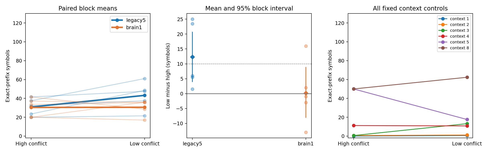
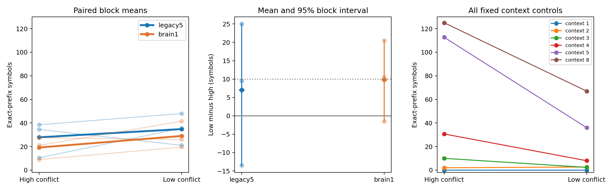

# Fixed-K context-conflict intervention — ACT II results

Discovery-qualified graphs: ['legacy5']; fresh confirmation executed: True; confirmed graphs: [].

The partial model's discovery gain (+12.3 symbols; 5/5 positive blocks) did not
confirm: fresh gain +7.0, interval[-13.5,25.0], with only2/3 positive blocks.
This fails the registered minimum10-symbol and all-three-positive criteria.
It is not proof of zero effect. The whole graph fails discovery (+0.2);
its fresh +9.83 is descriptive and cannot rescue a failed discovery gate.

Protocol `3b9e0f1` preceded sequence construction and neural outcomes; implementation
`212e6b9` ran all cohorts. [Protocol](context-intervention-protocol.md).
This is a task-ordering intervention in computational models using actual
Drosophila connectome structure. Connectivity is fixed; only external heads learn.

## 1. Repository audit

The prior alphabet study confounded K with stimulated input union and output
size. The latest context diagnostic suggested a task-level explanation, without
neural causality. This study holds K4, N128, prompt, symbol multiset, input map,
observed MBONs and readout capacity fixed within paired blocks. All
4,706 archived result files, prior protocols and src/ numerical modules
remain unchanged. Historical negative findings are retained.

## 2. Reproduced baseline

Archived K4 legacy5, model21142/data22142, stratum701: expected37 and actual37
prefix symbols. All21 checkpoint arrays, training history, probabilities and
control scores match an independent refit and replay through the new evaluation
path. This is compatibility validation, excluded from the study estimates.
[Baseline](../results/intervention_validation/baseline.json).

## 3. New implementation

`context_intervention.py` makes bounded low/high pairs and records every proposal,
acceptance and objective. An independent dictionary implementation verifies the
optimized conflict counter and every construction step. All fixed-order controls
are checked by the earlier independent scan oracle. `run_context_intervention.py`
reuses the historical numerical path and isolates each arm's state and head;
`summarize_context_intervention.py` uses registered paired block comparisons.

## 4. Experiments executed

Main: model27142–27146/data28142–28146, both strata701/702, legacy5/brain1,
low/high (40 fits). Smoke:27139/28139, stratum701,20 updates (4 fits, excluded).
Conditional fresh cohort:29142–29144/30142–30144, same two strata/graphs/arms,
24 fits only if main qualifies. Actual cohort counts: `{'smoke': {'fits': 4, 'exact_replays': 4, 'exact_refits': 4, 'sequence_pairs': 1}, 'main': {'fits': 40, 'exact_replays': 40, 'exact_refits': 4, 'sequence_pairs': 5}, 'confirmation': {'fits': 24, 'exact_replays': 24, 'exact_refits': 4, 'sequence_pairs': 3}}`.

Each symbol occurs32 times; prompt010 is fixed. A seeded tail permutation and
2000 shared swap proposals define both arms. Accept only strict decrease/increase
in three-context integer classification errors. No neural score enters generation.
All required gaps≥0.10 must pass before a cohort can train; no failed-pair replacement.
Each accepted/rejected proposal and regional frequency/transition diagnostic is saved.

Neural budget:512 eligible KCs,51 stimulated per symbol, amplitude0.5,48 observed
MBONs,428-parameter48→8→4 tanh head; Adam2000,lr0.03,L2=1e-5; first32 generated
targets weight4. Incoming-L1 gain0.9,leak0.6,mbon_after_kc. Matched initialization
and maps; independent resets/refits per arm.127 teacher transitions,125 autonomous
symbols after prompt. Graph cache and exact neuron IDs are recorded in manifests.
Runtime/RSS is grouped across both arms, not double-counted.

## 5. Results

Discovery-qualified graphs: ['legacy5']; fresh confirmation executed: True; confirmed graphs: [].

Discovery criterion: mean low−high prefix≥10 and≥4/5 positive blocks per graph.
Confirmation: only discovery-qualified graphs are eligible; mean≥10 and3/3
positive fresh blocks. No pooling to pass. Five/three blocks make bootstrap
intervals descriptive. All mean/median/variance/effect sizes use10,000 paired
draws,RNG31399; graph differences and interactions are descriptive only.

### Main cohort

| Graph | Low prefix | High prefix | Mean difference | Median | Variance | 95% block interval | paired dz | Positive/zero/negative | Gate |
| --- | --- | --- | --- | --- | --- | --- | --- | --- | --- |
| legacy5 | 43.2 | 30.9 | 12.3 | 6.0 | 122.325 | [4.0, 20.605] | 1.112 | 5/0/0 | True |
| brain1 | 30.6 | 30.4 | 0.2 | -1.0 | 109.7 | [-8.0, 8.8] | 0.019 | 2/0/3 | False |


Raw neural rows (each numeric cell is one fit; both input strata retained):

| Model seed | Data seed | Input stratum | Partial low | Partial high | Whole low | Whole high |
| --- | --- | --- | --- | --- | --- | --- |
| 27142 | 28142 | 701 | 73 | 32 | 34 | 29 |
| 27142 | 28142 | 702 | 49 | 43 | 37 | 38 |
| 27143 | 28143 | 701 | 35 | 9 | 37 | 42 |
| 27143 | 28143 | 702 | 8 | 31 | 35 | 32 |
| 27144 | 28144 | 701 | 32 | 33 | 35 | 7 |
| 27144 | 28144 | 702 | 65 | 14 | 37 | 33 |
| 27145 | 28145 | 701 | 34 | 23 | 34 | 7 |
| 27145 | 28145 | 702 | 41 | 41 | 0 | 33 |
| 27146 | 28146 | 701 | 43 | 41 | 24 | 51 |
| 27146 | 28146 | 702 | 52 | 42 | 33 | 32 |


Paired seed-block differences after averaging the two input strata:

| Graph | Model seed | Low−high prefix | Low−high teacher accuracy |
| --- | --- | --- | --- |
| legacy5 | 27142 | 23.5 | 0.056 |
| legacy5 | 27143 | 1.5 | 0.02 |
| legacy5 | 27144 | 25.0 | 0.068 |
| legacy5 | 27145 | 5.5 | 0.036 |
| legacy5 | 27146 | 6.0 | 0.028 |
| brain1 | 27142 | 2.0 | 0.044 |
| brain1 | 27143 | -1.0 | 0.012 |
| brain1 | 27144 | 16.0 | 0.04 |
| brain1 | 27145 | -3.0 | 0.076 |
| brain1 | 27146 | -13.0 | -0.024 |


Teacher-forced and autonomous accuracy remain distinct:

| Graph | Arm | Teacher accuracy | Autonomous accuracy | Effective rank | Mean |MBON| | Decay ratio at32 |
| --- | --- | --- | --- | --- | --- | --- |
| legacy5 | low | 0.9184 | 0.5368 | 7.704132 | 0.013152 | 1e-06 |
| legacy5 | high | 0.8768 | 0.436 | 7.631478 | 0.013143 | 1e-06 |
| brain1 | low | 0.8768 | 0.4376 | 5.23943 | 0.005642 | 2e-06 |
| brain1 | high | 0.8472 | 0.4352 | 5.240136 | 0.005638 | 3e-06 |


Manipulation checks: unweighted three-context error floors, full125/early32/late93:

| Data seed | Low floor | High floor | Gap | Early low | Early high | Late low | Late high |
| --- | --- | --- | --- | --- | --- | --- | --- |
| 28142 | 0.192 | 0.552 | 0.36 | 0.0625 | 0.1875 | 0.1828 | 0.4516 |
| 28143 | 0.184 | 0.552 | 0.368 | 0.0625 | 0.125 | 0.1935 | 0.4409 |
| 28144 | 0.16 | 0.536 | 0.376 | 0.125 | 0.2188 | 0.1398 | 0.4624 |
| 28145 | 0.192 | 0.552 | 0.36 | 0.0625 | 0.2188 | 0.2043 | 0.4516 |
| 28146 | 0.176 | 0.552 | 0.376 | 0.0625 | 0.1875 | 0.172 | 0.4624 |


All fixed context controls, including failed orders and seeds:

| Data seed | Arm | m1 | m2 | m3 | m4 | m5 | m8 |
| --- | --- | --- | --- | --- | --- | --- | --- |
| 28142 | low | 0 | 3 | 21 | 9 | 9 | 98 |
| 28142 | high | 0 | 0 | 2 | 47 | 125 | 125 |
| 28143 | low | 2 | 1 | 8 | 8 | 25 | 35 |
| 28143 | high | 0 | 0 | 0 | 0 | 0 | 0 |
| 28144 | low | 1 | 0 | 4 | 4 | 4 | 32 |
| 28144 | high | 0 | 3 | 1 | 9 | 125 | 125 |
| 28145 | low | 0 | 0 | 16 | 16 | 33 | 59 |
| 28145 | high | 0 | 0 | 0 | 0 | 0 | 0 |
| 28146 | low | 0 | 2 | 17 | 17 | 17 | 88 |
| 28146 | high | 0 | 0 | 0 | 0 | 0 | 0 |




[Raw metrics](../results/intervention_main_analysis/raw-seed-table.csv) ·
[All statistics and graph contrasts](../results/intervention_main_analysis/summary.json) ·
[Main manifest](../results/intervention_main/manifest.json) ·
[Exact verification](../results/intervention_main_verification/manifest.json).
### Confirmation cohort

| Graph | Low prefix | High prefix | Mean difference | Median | Variance | 95% block interval | paired dz | Positive/zero/negative | Gate |
| --- | --- | --- | --- | --- | --- | --- | --- | --- | --- |
| legacy5 | 34.833333333333336 | 27.833333333333332 | 7.0 | 9.5 | 375.25 | [-13.5, 25.0] | 0.361 | 2/0/1 | False |
| brain1 | 29.0 | 19.166666666666668 | 9.833333333333334 | 10.5 | 121.3333 | [-1.5, 20.5] | 0.893 | 2/0/1 | False |


Raw neural rows (each numeric cell is one fit; both input strata retained):

| Model seed | Data seed | Input stratum | Partial low | Partial high | Whole low | Whole high |
| --- | --- | --- | --- | --- | --- | --- |
| 29142 | 30142 | 701 | 64 | 40 | 38 | 9 |
| 29142 | 30142 | 702 | 32 | 37 | 1 | 9 |
| 29143 | 30143 | 701 | 36 | 10 | 37 | 33 |
| 29143 | 30143 | 702 | 35 | 11 | 15 | 22 |
| 29144 | 30144 | 701 | 37 | 59 | 42 | 28 |
| 29144 | 30144 | 702 | 5 | 10 | 41 | 14 |


Paired seed-block differences after averaging the two input strata:

| Graph | Model seed | Low−high prefix | Low−high teacher accuracy |
| --- | --- | --- | --- |
| legacy5 | 29142 | 9.5 | 0.06 |
| legacy5 | 29143 | 25.0 | 0.004 |
| legacy5 | 29144 | -13.5 | -0.048 |
| brain1 | 29142 | 10.5 | 0.064 |
| brain1 | 29143 | -1.5 | -0.024 |
| brain1 | 29144 | 20.5 | 0.12 |


Teacher-forced and autonomous accuracy remain distinct:

| Graph | Arm | Teacher accuracy | Autonomous accuracy | Effective rank | Mean |MBON| | Decay ratio at32 |
| --- | --- | --- | --- | --- | --- | --- |
| legacy5 | low | 0.884 | 0.454667 | 7.879518 | 0.012992 | 1e-06 |
| legacy5 | high | 0.878667 | 0.378667 | 7.935566 | 0.012961 | 1e-06 |
| brain1 | low | 0.897333 | 0.421333 | 5.378114 | 0.005596 | 3e-06 |
| brain1 | high | 0.844 | 0.358667 | 5.379306 | 0.005591 | 3e-06 |


Manipulation checks: unweighted three-context error floors, full125/early32/late93:

| Data seed | Low floor | High floor | Gap | Early low | Early high | Late low | Late high |
| --- | --- | --- | --- | --- | --- | --- | --- |
| 30142 | 0.136 | 0.568 | 0.432 | 0.0312 | 0.1562 | 0.129 | 0.4516 |
| 30143 | 0.176 | 0.504 | 0.328 | 0.125 | 0.2188 | 0.1505 | 0.4194 |
| 30144 | 0.176 | 0.52 | 0.344 | 0.0938 | 0.1875 | 0.1613 | 0.4086 |


All fixed context controls, including failed orders and seeds:

| Data seed | Arm | m1 | m2 | m3 | m4 | m5 | m8 |
| --- | --- | --- | --- | --- | --- | --- | --- |
| 30142 | low | 0 | 1 | 4 | 6 | 43 | 64 |
| 30142 | high | 0 | 1 | 3 | 32 | 125 | 125 |
| 30143 | low | 0 | 0 | 2 | 11 | 51 | 51 |
| 30143 | high | 0 | 5 | 18 | 18 | 88 | 125 |
| 30144 | low | 0 | 7 | 1 | 7 | 14 | 86 |
| 30144 | high | 0 | 0 | 9 | 42 | 125 | 125 |




[Raw metrics](../results/intervention_confirmation_analysis/raw-seed-table.csv) ·
[All statistics and graph contrasts](../results/intervention_confirmation_analysis/summary.json) ·
[Main manifest](../results/intervention_confirmation/manifest.json) ·
[Exact verification](../results/intervention_confirmation_verification/manifest.json).


## 6. Interpretation

The study does not establish the registered confirmed recall benefit from reducing global three-context conflict. Preserve both arms and inspect representation/decoding rather than retune the generator or readout.

Unigram frequency and capacity are matched, but swapping changes transition
statistics, predictability and conflict location as well as the intended global
metric. The outcome cannot attribute all differences to one scalar ambiguity
score. Exact-prefix depends especially on early errors; teacher-forced accuracy
and autonomous rollout are separate. Context tables have a different storage
budget and are not neural parameter controls. Plot limits at125 reflect censoring.

## 7. Negative findings

Fresh partial block differences are +9.5,+25.0,−13.5. The context3 control also
reverses: low2.33 versus high10.0 in confirmation, despite every construction
pair passing the global conflict-gap check. The original global ambiguity
metric is therefore insufficient to guarantee autonomous prefix improvement,
even for a predictor using the same nominal context length.

Every negative paired difference, failed gate and short recall is in the raw
tables. A large global conflict gap does not guarantee a long correct prefix;
the short prompt, weighting and learned decision boundaries can still fail.
In discovery, whole-brain seed27145/stratum702 falls from33(high) to0(low);
partial seed27143/stratum702 falls from31 to8. Averaging input strata must not
hide these adverse runs. The context5 control also falls from50.0(high) to17.6(low)
on average, despite the targeted context3 floor decreasing. Different context
orders do not represent interchangeable notions of sequence difficulty.
There was no adjustment of construction budget, seeds, readout updates or
success criteria after outcomes. The earlier whole-brain advantage failures
and robustness/plasticity negatives remain valid within their original scopes.

## 8. What we can claim

We measured autonomous recall under this precise fixed-K ordering manipulation,
with matched neural interfaces/capacity and complete paired reporting. Claims
of benefit are restricted to registered discovery/confirmation gates above.
These are trained-instance results from computational models using actual
Drosophila connectome structure, with external readout learning.

## 9. What we cannot claim

No living-fly recall, isolated biological memory mechanism, useful internal
plasticity, formal/Shannon capacity or unseen sequence prediction. No unique
topology effect or general whole-brain superiority is registered. Reordering
is not a pure intervention on ambiguity alone. A negative decoder result also
does not prove absence of all information in reservoir states.

## 10. Reproducibility

Smoke4 replay/refits; all main/conditional confirmation heads replay exactly,
with the registered four independent refits per scientific cohort. All sequence
proposals were independently reconstructed and all six fixed-order controls
verified. Tests167 passed,8 optional-dependency skips. Old result files preserved;
protocol/source hashes and paired bootstrap/gates independently checked.
[Integrity and test record](../results/intervention_validation/final-checks.json) ·
[Decision](../results/intervention_validation/decision.json).

Scientific grouped resource usage (seconds/bytes; fit and replay overlap, so not
an isolated hardware benchmark):

- main: {'group_wall_seconds_sum': 345.9360000000015, 'peak_group_rss_bytes': 997326848}
- confirmation: {'group_wall_seconds_sum': 186.9250000000029, 'peak_group_rss_bytes': 1035763712}

```powershell
$env:PYTHONPATH = 'src'
python -m pip install -r requirements-act1-lock.txt
python -m flying.training.phase6 prepare --cache outputs/act1-graphs
python scripts/run_context_intervention.py run --config configs/context_intervention_main.json --out outputs/intervention_new
python scripts/run_context_intervention.py verify --source outputs/intervention_new --out outputs/intervention_verify_new
python scripts/summarize_context_intervention.py --source outputs/intervention_new --out outputs/intervention_analysis_new
```

The committed config points to the immutable constructed sequence artifacts.
To reconstruct generation separately, copy the config and change only its
`sequences` destination to a new directory, then run
`python scripts/context_intervention.py --config PATH_TO_COPY` before neural fits.
The independent construction verifier also runs in the recorded final checks.
Use the confirmation config only under the registered trigger; do not rerun to
select a favorable outcome. Checkpoints include states, generated integers and
probabilities; raw graphs are regenerated against recorded source hashes.

## 11. Next highest-information experiment

**One frozen-state representation/decoding diagnostic on these saved pairs: compare past-symbol accessibility and next-symbol separability across low/high arms, using prespecified readout complexity and blocked validation. Reuse saved trajectories; keep training-instance decoding distinct from general memory capacity. Preregister the exact probes before their outcomes.**

Proposed, not preregistered or executed here. Current roadmap remains ACT II:
fixed-K ordering intervention completed within scope. ACT III structural
attribution and ACT IV useful internal learning remain separate.
