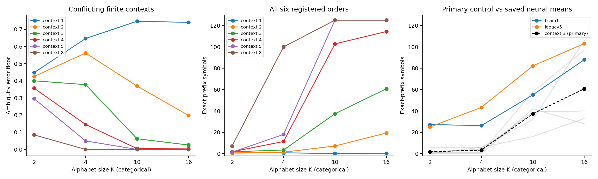

# Fixed-context ambiguity and autonomous recall — ACT II diagnostic

Both preregistered diagnostic endpoints pass on the saved20 unique sequences.
Order2 ambiguity falls by0.2272 from K2 toK16, while order3 mean exact prefix
increases1.8→60.8 symbols. These results are consistent with finite-context
distinctiveness contributing to the known K curve. They do not identify a causal
mechanism in the neural reservoir or establish connectome-specific memory.

Protocol commit `382501b`; implementation/run commit `bffc0cc`.
[Protocol](context-memory-protocol.md) · [Config](../configs/context_memory.json).
Neural results were already known at preregistration; the new diagnostic outcomes
were not computed before its protocol commit. No new neural fits.

## 1. Repository audit

The80 saved neural runs contain20 unique datasets, repeated across two graphs
and two input strata. Treating them as80 independent context datasets would
inflate replication. Source manifests, every checkpoint's symbol array and
saved prefix were verified; all 4,574 prior result files remain byte-identical.
Existing src/ numerical modules and old protocols are unchanged.

## 2. Reproduced baseline

Order1 exactly reproduces archived weighted Markov predictions, teacher accuracy
and prefix for all20 unique tasks. Their mean prefixes at K2/4/10/16 are
0.6/0.8/0.2/0.4. All80 saved neural prefix scores were independently rescored
from their generated arrays. Neural dynamics/readouts were not newly refit here;
the previous alphabet study's80 exact replays and8 independent refits remain
the evidence for their trajectory reproducibility.

## 3. New implementation

`scripts/context_memory.py` fits suffix-count tables and separates target-free
rollout from teacher evaluation. `scripts/context_reference.py` independently
scans matching training positions, including recounting every table cell.
Tests cover weighted ties, backoff, start handling, autonomous feedback,
known ambiguity and reference agreement. Historical neural source is untouched.

## 4. Experiments executed

Exactly20 datasets x six context lengths(1,2,3,4,5,8) =120 count-table fits,
with120 independent reference checks;480 comparisons to the80 existing neural
runs. K2/4/10/16; data22142–22146 paired with model21142–21146;
N128, prompt010,125 generated symbols, training targets1..127. Positions3..34
receive weight4, all others1. No smoothing; ties choose the lowest integer.
Backoff tries shorter observed suffixes, then global weighted frequencies.
No start token, padding, cyclic wrap or absolute-position lookup.

For inference, average neural strata701/702 within each seed; five seed blocks.
Bootstrap10,000 paired blocks with RNG26399; no p-value or best-order selection.
Primary ambiguity uses order2, primary recall uses order3. All orders are below.

## 5. Results

Mean exact-prefix symbols (evaluation ceiling125):

| K | m1 | m2 | m3 (primary) | m4 | m5 | m8 |
| --- | --- | --- | --- | --- | --- | --- |
| 2 | 0.6 | 0.8 | 1.8 | 1.8 | 1.4 | 7.2 |
| 4 | 0.8 | 1.4 | 3.4 | 11.4 | 18.0 | 100.0 |
| 10 | 0.2 | 7.2 | 37.4 | 102.8 | 125.0 | 125.0 |
| 16 | 0.4 | 19.4 | 60.8 | 114.4 | 125.0 | 125.0 |




Registered endpoints (K16−K2):

| Endpoint | Mean | Median | Variance | 95% bootstrap | paired dz | Pass |
| --- | --- | --- | --- | --- | --- | --- |
| H1 | -0.2272 | -0.232 | 0.000371 | [-0.2416, -0.2112] | -11.792 | True |
| H2 | 59.0 | 38.0 | 1501.0 | [29.6, 88.4] | 1.523 | True |


H1 required mean ambiguity change≤−0.10 and4/5 negative blocks; all5 are negative.
H2 required mean order3 prefix change≥25 and4/5 positive blocks; all5 are positive.
The joint criterion passes. These endpoints test a proposed explanation, not
whole-brain superiority. Large standardized effects from five seeds do not
provide population-level biological inference.

| Data seed | Order2 ambiguity K16−K2 | Order3 prefix K16−K2 |
| --- | --- | --- |
| 22142 | -0.24 | 106.0 |
| 22143 | -0.2 | 28.0 |
| 22144 | -0.248 | 27.0 |
| 22145 | -0.216 | 38.0 |
| 22146 | -0.232 | 96.0 |


All120 per-fit prefixes, including zeros (no graph duplicates):

| Data seed | K | m1 | m2 | m3 | m4 | m5 | m8 |
| --- | --- | --- | --- | --- | --- | --- | --- |
| 22142 | 2 | 1 | 0 | 0 | 0 | 0 | 0 |
| 22142 | 4 | 1 | 2 | 6 | 6 | 6 | 125 |
| 22142 | 10 | 0 | 2 | 32 | 81 | 125 | 125 |
| 22142 | 16 | 0 | 10 | 106 | 106 | 125 | 125 |
| 22143 | 2 | 1 | 0 | 0 | 0 | 0 | 0 |
| 22143 | 4 | 0 | 2 | 0 | 0 | 0 | 0 |
| 22143 | 10 | 0 | 1 | 42 | 125 | 125 | 125 |
| 22143 | 16 | 0 | 1 | 28 | 91 | 125 | 125 |
| 22144 | 2 | 0 | 0 | 6 | 6 | 4 | 33 |
| 22144 | 4 | 2 | 0 | 6 | 6 | 6 | 125 |
| 22144 | 10 | 0 | 4 | 16 | 125 | 125 | 125 |
| 22144 | 16 | 1 | 33 | 33 | 125 | 125 | 125 |
| 22145 | 2 | 1 | 2 | 2 | 2 | 2 | 2 |
| 22145 | 4 | 0 | 2 | 4 | 15 | 15 | 125 |
| 22145 | 10 | 1 | 22 | 39 | 125 | 125 | 125 |
| 22145 | 16 | 1 | 23 | 40 | 125 | 125 | 125 |
| 22146 | 2 | 0 | 2 | 1 | 1 | 1 | 1 |
| 22146 | 4 | 1 | 1 | 1 | 30 | 63 | 125 |
| 22146 | 10 | 0 | 7 | 58 | 58 | 125 | 125 |
| 22146 | 16 | 0 | 30 | 97 | 125 | 125 | 125 |


Primary-order neural comparisons: strata averaged within seed before intervals.
Positive differences favor neural recall. These are descriptive, not prespecified
neural-superiority tests and not matched-parameter comparisons.

| K | Graph | Neural − context3 | 95% block interval | W/T/L |
| --- | --- | --- | --- | --- |
| 2 | legacy5 | 23.2 | [10.9, 35.5] | 5/0/0 |
| 2 | brain1 | 25.5 | [12.7, 37.9] | 5/0/0 |
| 4 | legacy5 | 40.0 | [31.8, 49.2] | 5/0/0 |
| 4 | brain1 | 22.9 | [16.4, 29.4] | 5/0/0 |
| 10 | legacy5 | 44.8 | [32.3, 57.5] | 5/0/0 |
| 10 | brain1 | 17.7 | [-3.6, 31.6] | 4/0/1 |
| 16 | legacy5 | 42.3 | [19.0, 63.7] | 5/0/0 |
| 16 | brain1 | 27.2 | [1.8, 63.3] | 4/0/1 |


All orders' paired means, medians, variances, intervals and standardized effects
are in [summary.json](../results/context_main/summary.json).
[Raw120 rows](../results/context_main/raw-context-table.csv) ·
[All480 neural differences](../results/context_main/neural-comparisons.csv) ·
[Seed blocks](../results/context_main/paired-blocks.csv).

Storage costs include all suffix tables0..m. Nonzero cells count context-symbol
associations; dense scalars count all K slots, including zeros. JSON bytes use
the recorded compact table serialization, not interpreter heap memory.
None is equivalent to a neural trainable parameter count.

| K | Order | Mean table contexts | Mean nonzero cells | Mean dense count scalars | Mean serialized bytes |
| --- | --- | --- | --- | --- | --- |
| 2 | 1 | 3.0 | 6.0 | 6.0 | 113.0 |
| 2 | 2 | 7.0 | 14.0 | 14.0 | 269.0 |
| 2 | 3 | 15.0 | 30.0 | 30.0 | 593.6 |
| 2 | 4 | 31.0 | 62.0 | 62.0 | 1257.6 |
| 2 | 5 | 62.8 | 117.4 | 125.6 | 2627.8 |
| 2 | 8 | 290.8 | 397.2 | 581.6 | 13425.2 |
| 4 | 1 | 5.0 | 20.0 | 20.0 | 230.6 |
| 4 | 2 | 21.0 | 73.8 | 84.0 | 954.2 |
| 4 | 3 | 74.6 | 171.6 | 298.4 | 3473.6 |
| 4 | 4 | 171.8 | 287.0 | 687.2 | 8236.4 |
| 4 | 5 | 286.2 | 407.6 | 1144.8 | 14070.8 |
| 4 | 8 | 646.2 | 770.0 | 2584.8 | 33871.6 |
| 10 | 1 | 11.0 | 81.2 | 110.0 | 748.2 |
| 10 | 2 | 82.2 | 198.6 | 822.0 | 5661.0 |
| 10 | 3 | 198.8 | 323.0 | 1988.0 | 13939.6 |
| 10 | 4 | 322.2 | 447.0 | 3222.0 | 22947.8 |
| 10 | 5 | 445.2 | 570.0 | 4452.0 | 32172.8 |
| 10 | 8 | 808.2 | 933.0 | 8082.0 | 60845.8 |
| 16 | 1 | 17.0 | 113.6 | 272.0 | 1564.8 |
| 16 | 2 | 114.2 | 235.8 | 1827.2 | 10671.6 |
| 16 | 3 | 235.6 | 360.4 | 3769.6 | 22328.4 |
| 16 | 4 | 359.2 | 484.4 | 5747.2 | 34485.2 |
| 16 | 5 | 482.2 | 607.4 | 7715.2 | 46870.8 |
| 16 | 8 | 845.2 | 970.4 | 13523.2 | 85117.0 |


## 6. Interpretation

A finite-context predictor stores which symbol followed a short combination.
With many symbols, longer combinations often uniquely locate training positions,
so a small context window can reproduce much of the trained sequence without
a connectome. At K10 andK16, context5 and context8 complete all five sequences.
This is a strong task-level caveat to interpreting the old K curve as capacity.
The primary context3 control still has lower mean recall than both neural models
at every K; long-context completion does not erase that measured distinction.

The ambiguity error floor is an unweighted, exact-context classification
diagnostic over125 evaluation positions. The actual predictors fit127 weighted
targets and store *all* suffixes for backoff. Thus it is not their teacher-error
bound or a promise of autonomous completion. In particular, short prompt contexts
can pool suffixes from later training positions even when long contexts are unique.

## 7. Negative findings

- The endpoint improvement is not universal monotonicity: order2 ambiguity rises
  from0.4256 atK2 to0.5616 atK4 before falling to0.3696 and0.1984.
  Order1 ambiguity rises0.4480→0.7408 fromK2 toK16, and its recall stays weak.
- K2 context8 recalls only7.2 symbols on average. Increasing order4→5 even lowers
  its mean1.8→1.4. All orders and low seeds are retained.
- K4/data22143/context8 has zero exact long-context ambiguity but recalls0
  symbols. At prompt010 only three symbols are available. The fitted suffix010
  counts are `[0,0,4,4]`; the tie selects2, while the first target is3.
  The exact-context diagnostic has only the initial010→3 occurrence because
  later positions use longer keys. This explains the discrepancy without tuning.
- Whole-brain minus context3 atK10 has an interval crossing zero, and its K16
  comparison loses one seed block. No universal neural superiority claim.
- Five selected computational data seeds and known earlier outcomes limit
  generalization. No fresh-seed confirmation was specified or performed.

## 8. What we can claim

On these trained random-symbol instances, context ambiguity and finite-context
recall vary strongly with K under fixed N. Both registered diagnostic endpoints
pass. A connectome-free table can fully recall these K10/K16 instances using
five preceding symbols and its recorded count storage. The neural evidence
continues to concern computational models using actual Drosophila connectome
structure; external readout training remains distinct from internal learning.

## 9. What we cannot claim

No causal explanation of neural K effects, biological memory circuit, living-fly
recall, formal/Shannon capacity, unseen random-sequence prediction, or learned
internal connectivity. Across K, neural input union and output size still change.
Context tables are not matched neural parameter budgets or random graph controls.
This does not separate graph scale from weak-edge restoration. Reaching125 is
censoring at the evaluation horizon, not proof of longer recall.

## 10. Reproducibility

All120 stored fits match independent recounts for tables, autonomous predictions,
probabilities, teacher predictions/probabilities and ambiguity counts.
20 old order1 controls match;80 saved neural scores and20 regenerated datasets
match. Tests:165 passed,8 optional-dependency skips; new targeted tests11 passed.
Python and full dependency versions are stored in the manifest (Python3.12.10).
Runtime8.43s; sampled peak process RSS
152.3MiB, sampling every0.05s. This includes
analysis and independent reference, not neural training. Budget900s/1GiB passed.

[Manifest](../results/context_main/manifest.json) ·
[Verification](../results/context_main/verification.json) ·
[Resource measurements](../results/context_main/resources.json).
All120 persisted tables were subsequently reloaded and replayed exactly;
[final integrity checks](../results/context_validation/checks.json) also verify
the unchanged protocols and independently reconstruct both endpoint statistics.
Each `k*_d*_m*.json` saves the full count-table checkpoint, generated integer
symbols, probabilities, teacher outputs, region accuracy and context counts.
Use the recorded implementation revision for strict byte-hash reproduction.

```powershell
$env:PYTHONPATH = 'src'
python -m pip install -r requirements-act1-lock.txt
python scripts/context_memory.py --config configs/context_memory.json --out outputs/context_new
python -m pytest -q
```

No graph cache or downloads are needed for this saved-task diagnostic. Use a new
output directory; original results cannot be overwritten by the runner.

## 11. Next highest-information experiment

**One fixed-K, fixed-N context-conflict intervention.** Preregister paired low/high
short-context-conflict sequences with the same K, length, prompt and symbol
multiset, before any neural outcomes. Freeze the generator and construction
budget; report every construction failure. Use shared neural input mapping,
observation IDs and head budgets, plus the same fixed context controls. This
changes sequence ordering while removing the across-K alphabet/input/output
size changes. It tests sensitivity to the task's context structure, not a unique
biological circuit. It is proposed, not registered or executed in this study.

Current roadmap: ACT II-A plus its finite-context diagnostic completed within
scope; ACT III structural attribution and ACT IV internal learning remain open.
