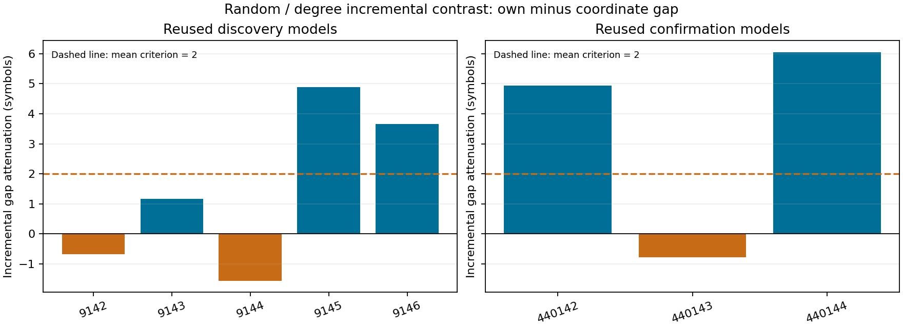
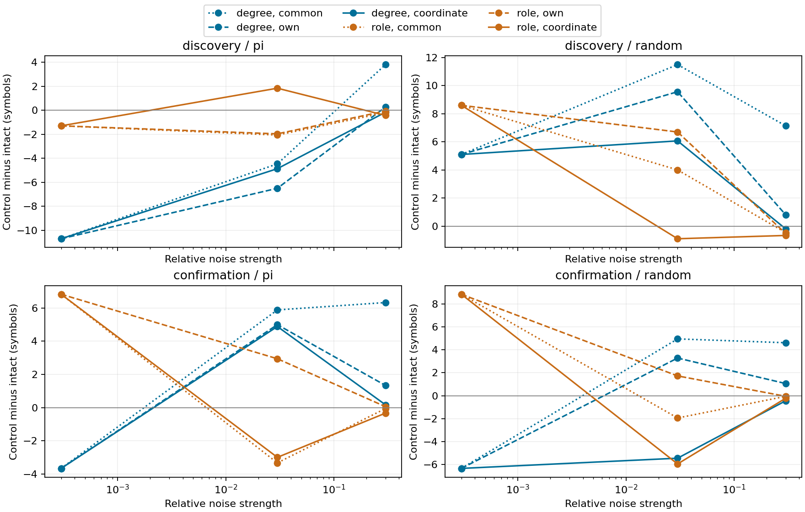

# 뉴런별 SD 직접 보정 — 관측 잡음 추가 연구의 마지막 실험

**사전 random/degree 추가 격차 감소 기준: 실패.** 실험 완료와 가설 성공을 구분한다.
이 실험·독립 검증·[종합 종료 보고서](additional-research-closeout.md)로 지정한 관측 잡음 추가 연구를 닫는다.

## 1. Repository audit

[앞선 망별 중앙값 보정](graph-relative-noise-results.md)은 작은 방향성 효과를 보였지만 joint 기준에 실패했다.
관측 SD 중앙값/RMS 비율이 남아 있었으므로 [별도 protocol](coordinate-sd-noise-protocol.md)을 결과 전에 등록했다.
이전 gate·원자료·봉인 문서를 수정하지 않았다. 같은 모델을 재사용하며 원래 망의 승리를 목표로 삼지 않는다.
현재 종료는 지정 계산 연구의 종료다. 생리 자료 검증·다른 동역학·전체망 재배선은 미실행이다.

## 2. Reproduced baseline

96개 부모 모델의 clean 출력·확률·관측값·활성 수·state norm을 정확히 재현했다.
96개 teacher 경로도 독립 계산했다. 아래 부모 기대값과 실제값은 동일하다.
기존 격리 Python 환경을 재사용했으며 새 환경 설치나 새 head 학습을 주장하지 않는다.

| 집단 | 수열 | graph | clean prefix |
| --- | --- | --- | --- |
| confirmation | pi | degree | 30.667 |
| confirmation | pi | intact | 34.333 |
| confirmation | pi | role | 41.167 |
| confirmation | random | degree | 24.833 |
| confirmation | random | intact | 31.167 |
| confirmation | random | role | 40.000 |
| discovery | pi | degree | 23.800 |
| discovery | pi | intact | 34.500 |
| discovery | pi | role | 33.200 |
| discovery | random | degree | 31.100 |
| discovery | random | intact | 26.000 |
| discovery | random | role | 34.600 |

## 3. New implementation

[실행기](../scripts/coordinate_sd_noise.py), [검증기](../scripts/verify_coordinate_sd_noise.py),
[분석기](../scripts/analyze_coordinate_sd_noise.py), [종료 감사](../scripts/audit_coordinate_sd_noise.py)를 추가했다.
뉴런별 SD 대비 진폭 일치, zero-SD 좌표 처리, intact 변화 차감, NaN 전파를 포함한 관련32개 테스트 통과.
이전 numerical source는 변경하지 않았다. 자율 함수에는 정답을 전달하지 않는다.

## 4. Experiments executed

Pi/random × intact/degree/role × circuits701/702 × 기존8개 model/data block=96모델.
발견9142–9146/data9242–9246(n5), 기존 확인440142–440144/data440242–440244(n3)을 따로 분석했다.
이번에는 두 집단 모두 기존 모델이다. 새 잡음498001–498003과 강도.0003/.03/.3을 사용했다.
686뉴런,threshold5,3309/3241연결, 같은 입력·48MBON·482개 head 파라미터.
K10/길이200/prompt314/평가197. 부모 학습은2000Adam/LR.03/L2=1e-5/fixed32×4;
gain.9/leak.6/mbon_after_kc. 이번 graph/head 학습·새 fit·update는 모두0이다.

SD(표준편차)는 각 뉴런의 관측값이 평소 얼마나 흔들리는지를 나타낸다. 직접 SD 보정은
그 평소 변동에 비례해 잡음을 넣는 방식이다. 학습199시점에서 좌표 SD s, 중앙값 q,
RMS u를 구한다. 잡음 진폭은 다음과 같다.

| 조건 | 뉴런 i의 잡음 진폭 | 통제 |
| --- | --- | --- |
| common | r·q_intact·s_i/u | graph 간 기대 raw 에너지 |
| own | r·q_graph·s_i/u | graph별 중앙값 기준 |
| coordinate | r·s_i | 각 좌표의 학습 SD 대비 진폭 |

세 조건의 표준정규 draw를 짝지었고 관측값을[-1,1]로 잘랐다. Coordinate는 clipping 이전 비율만 맞춘다.
원래 망도 own→coordinate에서 바뀌므로, 대조의 변화만을 효과로 기록하지 않는다.
전체2592개 noisy 평가 중288개 intact-own은 common과 정확히 같다. 서로 다른 새 noisy 설정은2304개다.
여기에96개 clean 반복을 더한 **2688개 실제 자율 경로를 모두 독립 재실행**했다.
2592개 teacher first-error certificate는 별도 저장했다. Smoke3모델/84경로는 다른 잡음498901–498903,
horizon8이며 본 통계에서 제외했다. 32개 고유 control graph를 두 수열에서 재사용했다.

## 5. Results

Gap=control−intact. **주 지표는 own gap−coordinate gap**이다. 양수는 추가 보정 후 gap이 낮아짐을 뜻한다.
각 seed 안에서2circuit×3noise×3강도=18관측을 먼저 평균했다. Retention=min(prefix/자기 clean prefix,1),
clean0이면 정의 불가다. Prefix는 prompt 이후197기호 중 첫 오류 전 길이이며 π에서만 PMS라고 부른다.

| 기존 집단 | seed | own gap | coordinate gap | 추가 prefix 감소 | 추가 유지율 감소 %p |
| --- | --- | --- | --- | --- | --- |
| confirmation | 440142 | 1.556 | -3.389 | 4.944 | 15.238 |
| confirmation | 440143 | -10.889 | -10.111 | -0.778 | 7.339 |
| confirmation | 440144 | 7.333 | 1.278 | 6.056 | 18.826 |
| discovery | 9142 | 0.278 | 0.944 | -0.667 | 0.325 |
| discovery | 9143 | 12.278 | 11.111 | 1.167 | 3.109 |
| discovery | 9144 | 5.000 | 6.556 | -1.556 | -8.151 |
| discovery | 9145 | 1.833 | -3.056 | 4.889 | 14.191 |
| discovery | 9146 | 6.389 | 2.722 | 3.667 | 12.035 |

| 집단 | 추가 감소 지표 | mean | median | variance | bootstrap95 | dz | +/0/− | joint gate |
| --- | --- | --- | --- | --- | --- | --- | --- | --- |
| confirmation | prefix 기호 | 3.407 | 4.944 | 13.4455 | -0.778 / 6.056 | 0.929 | 2/0/1 | False |
| confirmation | 유지율 %p | 13.801 | 15.238 | 0.00345371 | 7.339 / 18.826 | 2.348 | 3/0/0 | False |
| discovery | prefix 기호 | 1.500 | 1.167 | 7.58025 | -0.656 / 3.656 | 0.545 | 3/0/2 | False |
| discovery | 유지율 %p | 4.302 | 3.109 | 0.00824799 | -2.509 / 11.112 | 0.474 | 4/0/1 | False |

유지율 분산은 비율 제곱 단위다. 10000회 seed-block bootstrap, n5/n3 별도이며 작은 표본의 기술 통계다.
큰 dz나 양의 구간을 일반 생물학적 효과 또는 사후 성공 기준으로 해석하지 않는다.

| 보조 조건 | 추가 prefix 감소 | 추가 유지율 감소 %p | 기술적 gate |
| --- | --- | --- | --- |
| confirmation/pi/degree | 0.426 | 1.190 | False |
| confirmation/pi/role | 2.111 | 2.564 | False |
| confirmation/random/role | 2.611 | 8.417 | False |
| discovery/pi/degree | -0.400 | 정의 불가 | None |
| discovery/pi/role | -1.144 | -2.879 | False |
| discovery/random/role | 2.578 | 5.702 | False |

[전체 seed 차이](../results/coordinate_sd_noise/paired-differences.csv),
[모든 자율 실행 행](../results/coordinate_sd_noise/raw-rollouts.csv),
[강도별 seed 표](../results/coordinate_sd_noise/dose-seed-table.csv),
[전체 통계](../results/coordinate_sd_noise/summary.json),
[조건별 절대 평균](../results/coordinate_sd_noise_analysis/condition-means.csv).
Common−coordinate 총 변화와 common−own 재검사는 같은 raw 표/통계에 있으며 primary를 대체하지 않는다.





## 6. Interpretation

Random/degree의 추가 gap 감소는 발견 집단1.500기호/4.302%p,
기존 확인 집단3.407기호/13.801%p였다. 발견 집단은 두 평균 크기 기준(2기호/10%p)에 부족했고,
prefix 감소 방향도3/5로 필요한4/5에 미달했다. 기존 확인 집단은 두 평균 크기는 넘었으나
prefix 감소가2/3으로 필요한3/3에 미달했다. 따라서 두 집단 모두 joint 기준 실패다.
추가 prefix 효과의 bootstrap 구간도 각각[−.656,3.656], [−.778,6.056]로0을 포함했다.

Coordinate 조건의 degree−intact 절대 prefix gap은 발견+3.656기호(대조가 높은 seed4/5),
기존 확인−4.074기호(대조가 높은 seed1/3)였다. 집단과 seed에 따라 방향이 달라
원래 연결망의 일관된 우위를 확인하지 못했다. 유지율은 모델별 자기 clean 분모로 정규화한 뒤
평균하므로, 절대 prefix 차이와 유지율 차이의 집계 방향이 같을 필요도 없다.

등록된 **보조 total contrast**인 common→coordinate에서는 평균 gap이
4.256/5.148기호,13.419/21.570%p 감소했다. 이 더 큰 수치를 주 가설의 성공으로 바꾸지 않는다.
이는 중앙값 보정까지 포함한 누적 변화이며, 주 질문은 own 이후의 추가 변화였다.
같은 새 잡음에서 common→own 재검사는2.756/1.741기호,9.118/7.769%p 감소했다.
따라서 잡음 보정은 비교값을 바꾸지만 마지막 보정의 효과가 모든 seed에서 일관되지는 않았다.

## 7. Negative findings

추가 보정의 joint 기준은 두 집단 모두 실패했다. 발견 seed9142와9144,
기존 확인 seed440143에서는 오히려 degree−intact prefix gap이 증가했다.
원래 망을 승자로 만들거나 실패를 성공으로 바꾸는 후속 보정·seed 탐색은 하지 않았다.
보조 total contrast의 더 큰 평균을 근거로 endpoint를 교체하지 않았다.

Pi/degree seed9143/circuit702의 clean0을 유지했다. 해당 발견 집단의 retention/joint 판정은 정의 불가다.
성능이 좋아지는 seed·강도·head를 찾는 추가 탐색은 하지 않았다.

## 8. What we can claim

등록한 표본에서 뉴런별 training SD 대비 preclip 잡음 진폭을 실제로 맞추었고,
그 조건의 자율 회상과 구조 차이를 재현했다. 공통 raw 크기와 직접 SD 보정의 총 차이는
관찰되지만, 중앙값 보정 이후의 추가 차이는 seed별로 섞였고 사전 joint 기준에 미달했다.
이는 신호 크기 통제가 구조 비교의 해석에 중요하다는 제한된 계산 결과다.
내부 연결은 학습하지 않았으며 연구의 범위는 표현과 외부 readout 해독이다.

주장은 **실제 초파리 connectome 구조를 사용한 계산 모델**의 지정 관측 잡음·readout 조건에 한정한다.

## 9. What we cannot claim

실제 동물의 기억, 전체망 우위, 생리학적 타당성, 내부 연결의 경험 기반 학습을 입증하지 않는다.
Teacher-forced 해독과 자율 회상은 구분한다. 학습한 수열의 재생이며 unseen prediction이 아니다.
Prefix bits는 Llog2(10)이지 Shannon/formal memory capacity가 아니다.
Coordinate 보정도 covariance·head 경계·clipping·실현된 에너지를 같게 하지 않는다.
Graph별로 학습한 head의 차이가 포함된다. 기존8개 model/data block은 새 모델 일반화 검증이 아니다.
두 circuit은 같은 connectome에서 만들어졌고32개 재배선은 균일 graph 모집단 표본이 아니다.

## 10. Reproducibility

사전 commit `621afe6d26ec88247edd9c583513b057a705476d`.
Main manifest SHA256 `4f19a45c15f881bc086761c5b49e056eda504eb6ef7424a66f74d3a4fda70ef9`.
[Config](../configs/coordinate_sd_noise.json), [manifest](../results/coordinate_sd_noise/manifest.json),
[독립 검증](../results/coordinate_sd_noise_validation/checks.json), [종료 감사](../results/coordinate_sd_noise_closeout/audit.json).
각 case.json의 checkpoint_path/SHA256은 부모96개 checkpoint를 가리킨다. Head/graph는 frozen 검사를 통과했다.
64개 control graph/task의 보존량·정규화도 독립 감사했다(고유 graph32개).

| 작업 | 초 | 최대 sampled RSS MiB |
| --- | --- | --- |
| 실행 | 271.550 | 167.715 |
| 독립 검증 | 226.596 | 201.504 |

시간에는 과거 artifact 전체 해시 검사도 포함된다. 단일 process RSS를50ms 간격으로 샘플링했으며
순간 절대 peak는 아니다. 기존 파일31695개 보존; 최대 연속값 오차3.25e-14,
기호와 clean 부모 재현은 정확히 일치했다. Windows11/Python3.12.10/NumPy2.3.5/SciPy1.17.0/
pandas2.2.3/OpenBLAS0.3.30,1process×1수치thread. 환경 전체는 verification.json에 있다.

기존 부모 artifact와 pinned cache를 준비하고 저장소 root에서 **새 출력 경로**로 실행한다.

```powershell
$env:PYTHONPATH = 'src'
.\.venv\Scripts\python.exe scripts/coordinate_sd_noise.py --out outputs/sd_smoke_new --smoke
.\.venv\Scripts\python.exe scripts/verify_coordinate_sd_noise.py outputs/sd_smoke_new --out outputs/sd_smoke_new_validation
.\.venv\Scripts\python.exe scripts/coordinate_sd_noise.py --out outputs/sd_main_new
.\.venv\Scripts\python.exe scripts/verify_coordinate_sd_noise.py outputs/sd_main_new --out outputs/sd_main_new_validation
.\.venv\Scripts\python.exe scripts/analyze_coordinate_sd_noise.py outputs/sd_main_new --validation outputs/sd_main_new_validation --out outputs/sd_analysis_new
```

[잠긴 의존성](../requirements-act1-lock.txt). 실제 실행은 `../venv-act1/Scripts/python.exe`와
`results/coordinate_sd_noise_smoke`, `results/coordinate_sd_noise`, 각각의 `_validation`을 사용했다.
기존 출력 경로를 덮어쓰지 않는다. 원자료·통계·그림·테스트·종료 문서는 manifest로 봉인했다.

## 11. Next highest-information experiment

**새 model/data/graph seed에서 coordinate-SD 조건의 intact 대조를 확인하는 한 가지 실험**을
미래 제안으로 남긴다. 이미 본8개 모델에서 잡음 강도나 보정을 다시 고르는 대신 일반화 여부를 묻는다.
별도 사전 등록과 예산이 필요하며 이번에는 실행하지 않았다. 현재 지정한 관측 잡음 추가 연구는
결과의 방향과 무관하게 종료한다. 생리학·다른 동역학·전체망 재배선은 별도의 미해결 축이다.
