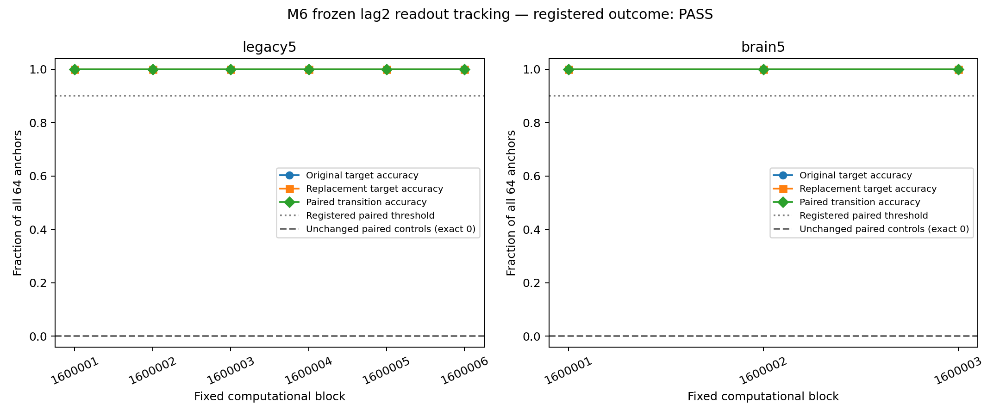

# M6: counterfactual past-symbol tracking by frozen readouts — results

Date: 2026-10-08. **Registered primary PASS**, independently verified.
All9 fixed cases and validation are complete. No new readout training,
rescaling, seed/lag/threshold selection or graph search was performed.
[Protocol](counterfactual-tracking-protocol.md),
[config](../configs/counterfactual_tracking.json).

## 1. What was asked?

When one actual past symbol changes but the full prefix and future inputs stay
identical, does the already-trained lag2 readout follow that replacement on
fresh held-out input?

M5 tested response attenuation and state differences, not this registered
counterfactual decoding question. M6 freezes its original graph, input mapping,
decoder/scaler and training-derived baselines. Baseline main
`43d6b068af853dd317241fc611f0df78b7110fca`; new namespace
`results/counterfactual_tracking_v1/`. Protocol/config committed before outcomes
as `c2263270503c1d106dce7069a496c30c924e04f6`. Main and independent verification
source `341aefa6353a81484001b86b72141d48ccfbf348`.

Use source-derived circuit701 legacy5 primary and brain5 secondary, original
signed incoming-L1 gain0.9 weights, zero direct carry, drive0.6, mbon_after_kc.
These are M5/M3 intact_synaptic conditions, not carry-on v1/full dynamics.
Same512 KC input pool,51 selected KC per symbol at amplitude0.5, same48
observed MBON IDs. All parent patterns, graph weights and coordinate order
authenticate exactly. The lag2 head is M5 columns20:30, intercept20:30;
original mean/scale remain unchanged. Its490 affine parameters were trained
on4000 old iid samples at alpha1. **New learned parameters:0.**

Six new blocks1600001–1600006 retain M5 mappings1510001–1510006/parent heads
1500001–1500006. Independent new iid K10 streams1610001–1610006, reset to zero,
warmup200,2000 scored rows; whole firstthree are paired counterparts, not
additional independent input replicates. Each case has64 fixed unconditioned
anchors. Directly change symbol s to r=(s+1)%10 at anchor a only, then replay
a,a+1,a+2 from the same full pre-state. Read state at a+2; both future symbols
and current symbol at evaluation remain identical.

Primary paired-transition accuracy is
`count(pred_original==s AND pred_replacement==r)/64`.
Require exact `10*joint_correct>=9*64` in every six primary blocks (minimum58/64).
All anchors count, including wrong original predictions. No baseline-performance
eligibility gate converts poor frozen-head transfer into invalidity or filters
the denominator. Scores use only state plus frozen parameters, never targets.

## 2. What was confirmed?

Every registered cell has64/64 original predictions correct AND64/64 valid
replacement predictions correct at the same anchors. Every predicted label
changes from the old value to the new value. Primary384/384 paired transitions
and secondary192/192 pass the predeclared criterion.

| Primary block | Original correct | Replacement correct | Unconditioned joint correct | Registered cell |
| --- | ---: | ---: | ---: | --- |
| 1600001 | 64/64 | 64/64 | 64/64 | PASS |
| 1600002 | 64/64 | 64/64 | 64/64 | PASS |
| 1600003 | 64/64 | 64/64 | 64/64 | PASS |
| 1600004 | 64/64 | 64/64 | 64/64 | PASS |
| 1600005 | 64/64 | 64/64 | 64/64 | PASS |
| 1600006 | 64/64 | 64/64 | 64/64 | PASS |

All three whole counterparts also have64/64 joint correct. Per-level mean and
median are1, sample SD0, descriptive block bootstrap[1,1] because all fixed
block values coincide. This is not biological certainty, an animal population
confidence interval or nine independent input-stream replicates. The576
case/probe pairs include the192 secondary counterparts of three primary
streams. [Exact cells](../results/counterfactual_tracking_v1/main/primary-cells.json),
[block scores](../results/counterfactual_tracking_v1/main/block-scores.csv),
[all trials](../results/counterfactual_tracking_v1/main/raw-trials.csv).

### Unchanged predictors cannot follow the replaced historical value

| Fixed paired predictor | Partial joint count | Whole secondary joint count |
| --- | ---: | ---: |
| Frozen history-bearing reservoir + lag2 readout | 384/384 | 192/192 |
| Old training-derived class-frequency prediction | 0/384 | 0/192 |
| Old training-derived current-symbol-only lookup | 0/384 | 0/192 |
| Instantaneous reference + SAME frozen lag2 head | 0/384 | 0/192 |

The current input is unchanged at a+2, so frequency/current-only predictions
are exactly equal across the two worlds. Since s!=r, any unchanged prediction
cannot be correct for both targets. Their joint0 is a mathematical property,
not a10% joint-chance claim; single-arm uniform chance remains10% separately.

Instantaneous prior-drive-off reference retains current KC→MBON access, direct
carry0 and the same head/scaler. Every final full state, score and prediction
pair is exactly equal; joint0 follows. That head is off its training distribution
in this reference, so marginal accuracy is not interpreted as a matched
physiological performance control.

On the entire unperturbed new stream, frozen lag0 and lag2 heads both score
12000/12000 partial and6000/6000 secondary. These are descriptive sanity/transfer
outcomes, not added gates. Old frequency/current-only lag2 accuracies are
10.2667%/9.9583% primary and10.1667%/10.1500% secondary.
[Stream metrics](../results/counterfactual_tracking_v1/main/stream-metrics.csv).

Original, replacement and joint curves coincide at100%; their denominators
are the same64 anchors. The dotted90% line is the registered joint criterion;
the zero line is the unchanged paired controls. This is a single fixed lag,
not a temporal-memory/capacity curve or a whole-brain advantage test.

### Frozen readout geometry follows a finite state change

Mean original alternative-minus-original score margin is−.923088 partial /
−.909114 whole; after replacement it becomes+.928221 /+.901608. Mean margin
changes are1.851308 /1.810722 score units. The same changes independently equal
the frozen linear head's projection of observed-state difference after applying
the OLD scale. They are descriptive affine score margins, not calibrated
probabilities, a new success gate or a unique inhibitory/cycle mechanism.

No synthetic interpolation/gradient is used to generate this intervention.
Direct actual symbol substitution matters: each full prefix is identical,
only the first of three window symbols differs, both future symbols and
evaluation time are identical, and original windows match the uninterrupted
baseline state trace exactly. The fixed output therefore follows the changed
historical value under this controlled computational intervention.

## 3. What failed or remains unanswered?

The scientific tracking criterion passes; no held-out smoke/main execution or
independent decoding validation failed. One pre-experiment source-capture
attempt was rejected before any safeguard test/new source-graph outcome:
the auditor's CRLF working bytes differed from its committed LF Git blob.
The first `guard_tests` directory, failure, resources and incomplete manifest
remain archived. Working bytes were normalized to the exact already-recorded
Git blob, with no code/threshold/head/data change. The same tests reran in
`guard_tests_retry1` and all29 passed with authenticated source bytes.
[Failure](../results/counterfactual_tracking_v1/guard_tests/failure.json),
[registry](../results/counterfactual_tracking_v1/known-incomplete-attempts.json),
[valid retry](../results/counterfactual_tracking_v1/guard_tests_retry1/checks.json).

This result does not establish biological memory/learning, storage location,
cycle necessity, real-wiring or whole-brain superiority, noise robustness or
formal Shannon/reservoir capacity. The model is deterministic and observation
is ideal. Only lag2 and the specified cyclic alternative are registered, not
all lags/all90 ordered symbol contrasts. Anchors share each stream/head and
are not independent model/animal replicates. The preserved M1 invalid assay,
P2 material failures, M4 strict-control INFEASIBLE and earlier biological/local
learning negatives are not relabeled by this result.

## Independent verification and reproducibility

[Independent main checks](../results/counterfactual_tracking_v1/main_validation/checks.json)
rebuild raw source graphs, normalization, mapping and all9 fresh full-state
baseline hashes. Each of576 full pre-state digests,2304 recorded four-world
window digest entries and2304 final-state entries is independently replayed.
There are576 exact instantaneous final-state pairs. Counts are replay entries;
equal reference endpoints and overlapping baseline windows are not distinct
models or unique biological events.

The verifier reconstructs old M5 lag2 training via SVD in9 authentication
checks, then evaluates exact archived head/scaler bytes on new states. These
are OLD-head reconstructions, not new learned parameters or a counterfactual
refit. Fixed scores/predictions, targets, controls, margins, integer primary
and bootstrap summaries agree; no scientific tolerance enlarges the threshold.
It imports no main reservoir/scorer/endpoint helpers. Smoke has2 cases and128
probe pairs with scientific endpoints null (stage label `smoke`).

| Stage | Attempt wall seconds | Sampled aggregate tree RSS bytes |
| --- | ---: | ---: |
| Baseline seal | 23.307 | Single-process OS peak68,648,960 |
| First guard, source-validation failure retained | 1.921 | Single-process OS peak64,954,368 |
| Same safeguards, valid29-test retry | 36.179 | Single-process OS peak123,912,192 |
| Smoke | 53.616 | 478,175,232 |
| Independent smoke | 64.773 | 620,793,856 |
| Main | 97.671 | 884,895,744 |
| Independent main | 110.719 | 1,000,554,496 |

Four workers/one numeric thread each; unchanged7200s/4GiB stage budget.50ms
sum of process RSS may count shared pages and metadata subprocesses repeatedly,
not an exact system peak. Input streams, parent/head/scaler/model/data/graph
hashes, code/config/protocol/seed/environment, raw trials, summaries, resource
records and manifests are archived. Compact observed windows/full-state hashes
avoid duplicating M5's large full-vector finite-difference archives.

Parent M5 main manifest SHA256:
`98eb3b4c3c49934365caa30608fd50b677dd883b7e3ed722271db4aceeaf73af`.
New M6 main manifest SHA256:
`d7aa7b1ce4f951d0bfdeabe0eddad39fd71554d9c7d47049181410a989850b39`.
[Manifest](../results/counterfactual_tracking_v1/main/manifest.json),
[source/parent-bank lineage](../results/counterfactual_tracking_v1/main/source.json),
[runner](../scripts/counterfactual_tracking.py),
[verifier](../scripts/verify_counterfactual_tracking.py),
[final artifact audit](../results/counterfactual_tracking_v1/final_audit/audit.json).

The baseline seal preserves44,571 prior result Git identities and45,219 old
paths excluding four authorized overview documents. Fresh byte checks cover
4,963 materialized prior results;39,608 sparse-excluded identities are protected
without claiming replay. M5's29 manifests/725 checksum entries and frozen
parent bank authenticate. M4's preserved source-validation failure snapshot
and all old scientific source/data/config/protocol/tests remain unchanged.
[Baseline audit](../results/counterfactual_tracking_v1/baseline_audit/audit.json).

## 4. What can now be said about DrosoMem?

In the stipulated fixed connectome-derived zero-carry computational reservoir,
the old lag2 readout follows actual changes to historical symbol value under
the same future inputs. The new input-to-state-to-frozen-readout causal response
is consistent with the existing decodable past-input claim. It adds no new
internal learning, biological storage or structural-superiority claim, and
does not convert M5's norm attenuation into an information-loss percentage.

One next candidate is **frozen-readout counterfactual tracking under artificial
observation noise**. First audit earlier closed ACT V/noise scopes to avoid
duplication or rescuing old failures; then, if pursued, register one fixed
nonzero noise dose, paired noise/control rules, fresh streams, frozen budgets
and a finite primary criterion before outcomes. This is an unregistered,
unexecuted proposal, not a noise sweep or physiology calibration. M6's clean
result stays sealed; P3 physiology/spiking/plasticity remains outside this work.

## 비전공자를 위한 한국어 요약

모델이 받은 과거 숫자 하나만 바꾸고, 그 뒤에 들어오는 숫자들은 똑같이
유지했습니다. 추가 학습 없이 기존 출력층이 두 단계 전 숫자를 읽는 답도
바뀐 숫자를 따라갔습니다. 부분망384쌍과 전뇌 보조192쌍 모두에서, 바꾸기
전과 바꾼 뒤의 답을 동시에 맞혔습니다.

이는 이 계산 모델이 실제 과거 입력의 값을 읽어낼 수 있다는 확인입니다.
살아 있는 초파리의 기억이나 학습을 입증한 것은 아닙니다. 기존 실패 결과와
이번 소스 봉인 검사의 중단 기록도 보존했습니다. 다음 후보는 관측값에
사전에 정한 작은 인공 잡음을 넣어도 이 추적이 유지되는지 확인하는 연구입니다.
