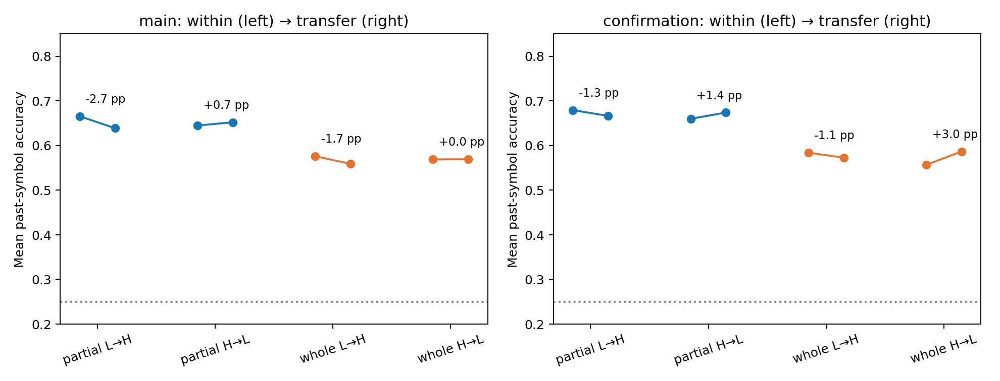

# Frozen cross-arm transfer — ACT II results

Past-symbol transfer passes the registered above-control rule in all four
graph/direction conditions across both archived seed cohorts. Both graphs pass
the descriptive5-percentage-point retention tolerance. This is portable linear
access across these paired orderings, not proven capacity or biological learning.

Protocol5080e94 preceded transfer outcomes; implementation4cfb3bc.
[Protocol](cross-arm-probe-protocol.md) · [Config](../configs/cross_arm_probe.json).
The preceding [blocked-state study](frozen-state-probe-results.md) was completed
and committed as056df14 before this authorized second study began.

## 1. Repository audit

The64 source trajectories have common input/observation interfaces within each
graph/seed/stratum. All archived source hashes match. The opposite ordering is
not an independent random sample: the pair shares a multiset and initial ancestor.
Approximately59–60% of current symbols match at the same evaluated positions.
We therefore save changed-target and same-target diagnostics separately.

## 2. Reproduced baseline

Every source fold is the exact fitted checkpoint from the first diagnostic;
within-source baseline accuracy and training budget are unchanged. The first
study also reproduced the older independent-stream delayed-symbol ridge baseline.
Transfer verification refits only SOURCE rows and gives identical coefficients;
target features/labels never enter fitting or standardization.

## 3. New implementation

`scripts/cross_arm_probe.py` applies frozen real and shifted heads to the opposite
sequence's same test indices. Tests verify target-label isolation, unchanged
coefficients/scaling and identity transfer. Independent augmented least squares
checks all transferred scores to1e-9 and requires identical predicted classes.
No historical numerical module or first-study implementation was modified.

## 4. Experiments executed

Both low→high and high→low, legacy5/brain1, strata701/702, all five main blocks
and three confirmation blocks:64 directions,192 frozen folds,512 per-task rows.
Current, past1/2/3/4/5/8 and next targets share119 held-out positions. Training
sizes70/61/71 and196 coefficients per task match the corresponding source fold.
There are ZERO target-arm fits, no new neural trajectories and no autonomous
recall experiment. Refits are source-only numerical verification.

## 5. Results

Accuracy proportions; past aggregate excludes current and next:

| Cohort | Graph | Direction | Within past | Transfer past | Current | Next | Past majority excess | Past null excess | Past R2 |
| --- | --- | --- | --- | --- | --- | --- | --- | --- | --- |
| main | legacy5 | low→high | 0.6655 | 0.6389 | 1.0 | 0.2227 | 0.4059 | 0.3959 | 0.3518 |
| main | legacy5 | high→low | 0.6448 | 0.6521 | 1.0 | 0.2185 | 0.4277 | 0.4363 | 0.371 |
| main | brain1 | low→high | 0.5762 | 0.5591 | 0.9916 | 0.237 | 0.3261 | 0.3144 | 0.173 |
| main | brain1 | high→low | 0.5689 | 0.5693 | 0.9916 | 0.2445 | 0.345 | 0.3609 | 0.1828 |
| confirmation | legacy5 | low→high | 0.6793 | 0.6664 | 1.0 | 0.2241 | 0.4657 | 0.4393 | 0.3836 |
| confirmation | legacy5 | high→low | 0.6599 | 0.6739 | 1.0 | 0.2227 | 0.4587 | 0.465 | 0.4113 |
| confirmation | brain1 | low→high | 0.584 | 0.5728 | 0.9944 | 0.2423 | 0.3721 | 0.3574 | 0.1888 |
| confirmation | brain1 | high→low | 0.5567 | 0.5866 | 0.9944 | 0.2171 | 0.3714 | 0.3742 | 0.2181 |




H1 requires transferred past excess>=0.05 over both source-frequency and shifted
controls in mean and>=4/5 main blocks, then all3 confirmation blocks, with positive
mean R2. All four graph/direction conditions pass in both cohorts.

H2 averages directions and input strata within seed. It requires transferred
minus within-source past accuracy>=−0.05 in mean and>=4/5 main blocks, then all3
confirmation blocks. Both graphs pass. This engineering tolerance is NOT a formal
equivalence/noninferiority test. Negative changes are retained:

| Cohort | Graph | Mean delta | Median | Variance | 95% block interval | paired dz | W/T/L | Within tolerance | Pass |
| --- | --- | --- | --- | --- | --- | --- | --- | --- | --- |
| main | legacy5 | -0.009664 | -0.015406 | 0.00023916 | [-0.020448, 0.002521] | -0.625 | 1/0/4 | 5 | True |
| main | brain1 | -0.008333 | -0.009804 | 0.00019054 | [-0.018768, 0.002521] | -0.604 | 1/0/4 | 5 | True |
| confirmation | legacy5 | 0.000584 | 0.002451 | 3.4e-05 | [-0.005952, 0.005252] | 0.1 | 2/0/1 | 3 | True |
| confirmation | brain1 | 0.009337 | 0.004202 | 9.64e-05 | [0.003151, 0.020658] | 0.951 | 3/0/0 | 3 | True |


Seed-block results, with input strata averaged:

| Cohort | Graph | Source arm | Seed | Past within | Past transfer | Next transfer |
| --- | --- | --- | --- | --- | --- | --- |
| confirmation | brain1 | high | 29142 | 0.598 | 0.6275 | 0.2353 |
| confirmation | brain1 | high | 29143 | 0.5098 | 0.5217 | 0.1639 |
| confirmation | brain1 | high | 29144 | 0.5623 | 0.6106 | 0.2521 |
| confirmation | brain1 | low | 29142 | 0.6317 | 0.6085 | 0.2941 |
| confirmation | brain1 | low | 29143 | 0.5294 | 0.5259 | 0.1639 |
| confirmation | brain1 | low | 29144 | 0.591 | 0.584 | 0.2689 |
| confirmation | legacy5 | high | 29142 | 0.6709 | 0.6947 | 0.2647 |
| confirmation | legacy5 | high | 29143 | 0.6303 | 0.6478 | 0.1849 |
| confirmation | legacy5 | high | 29144 | 0.6786 | 0.6793 | 0.2185 |
| confirmation | legacy5 | low | 29142 | 0.7122 | 0.6765 | 0.2899 |
| confirmation | legacy5 | low | 29143 | 0.6569 | 0.6499 | 0.1387 |
| confirmation | legacy5 | low | 29144 | 0.6688 | 0.673 | 0.2437 |
| main | brain1 | high | 27142 | 0.577 | 0.5735 | 0.2521 |
| main | brain1 | high | 27143 | 0.556 | 0.5364 | 0.2437 |
| main | brain1 | high | 27144 | 0.5805 | 0.5889 | 0.2395 |
| main | brain1 | high | 27145 | 0.5847 | 0.5819 | 0.2101 |
| main | brain1 | high | 27146 | 0.5462 | 0.5658 | 0.2773 |
| main | brain1 | low | 27142 | 0.6134 | 0.5651 | 0.2563 |
| main | brain1 | low | 27143 | 0.5273 | 0.5399 | 0.1975 |
| main | brain1 | low | 27144 | 0.5959 | 0.5595 | 0.2479 |
| main | brain1 | low | 27145 | 0.5938 | 0.577 | 0.2227 |
| main | brain1 | low | 27146 | 0.5504 | 0.5539 | 0.2605 |
| main | legacy5 | high | 27142 | 0.6548 | 0.6618 | 0.2605 |
| main | legacy5 | high | 27143 | 0.6275 | 0.6218 | 0.1933 |
| main | legacy5 | high | 27144 | 0.6674 | 0.6583 | 0.2059 |
| main | legacy5 | high | 27145 | 0.6541 | 0.6723 | 0.2101 |
| main | legacy5 | high | 27146 | 0.6204 | 0.6464 | 0.2227 |
| main | legacy5 | low | 27142 | 0.6849 | 0.6261 | 0.2605 |
| main | legacy5 | low | 27143 | 0.6492 | 0.6197 | 0.1555 |
| main | legacy5 | low | 27144 | 0.6884 | 0.6667 | 0.2479 |
| main | legacy5 | low | 27145 | 0.6758 | 0.6506 | 0.2143 |
| main | legacy5 | low | 27146 | 0.6296 | 0.6317 | 0.2353 |


Changed vs unchanged target positions (descriptive mean of per-run/per-lag rates,
not a new endpoint or pooled independent sample; counts vary by sequence/lag):

| Cohort | Graph | Mean changed-target accuracy | Mean same-target accuracy | Mean changed rows per119 | Current-symbol same-position fraction |
| --- | --- | --- | --- | --- | --- |
| confirmation | brain1 | 0.5632 | 0.5902 | 46.8333 | 0.6022 |
| confirmation | legacy5 | 0.6625 | 0.6743 | 46.8333 | 0.6022 |
| main | brain1 | 0.5673 | 0.5618 | 48.3 | 0.5899 |
| main | legacy5 | 0.6509 | 0.6421 | 48.3 | 0.5899 |


[All512 task rows](../results/cross_arm_probe/raw-task-table.csv) ·
[All64 directional aggregates per task](../results/cross_arm_probe/raw-aggregate-table.csv) ·
[Paired retention](../results/cross_arm_probe/paired-retention.csv) ·
[All statistics](../results/cross_arm_probe/summary.json).
Intervals use10,000 seed-block resamples,RNG33399, separately for5/3 blocks.

## 6. Interpretation

Past-symbol decoding is not confined to the exact ordering used to fit a source
head. Performance also remains substantial where the decoded symbol changes
between the two paired sequences. However these are related orderings, and
changed-position selection is descriptive. The result supports a reusable
decoded signal in this model/interface, not arbitrary-sequence generalization.

Next-symbol transfer remains weak (roughly22–24% mean). Reading the past and
predicting the next arbitrary symbol are different problems. Neither diagnostic
replaces the old autonomous-recall result or changes its failed confirmation.

## 7. Negative findings

Main transferred past accuracy decreases in4/5 seed blocks in BOTH graphs,
although the declines stay within the registered tolerance: mean−0.97pp partial
and−0.83pp whole. Do not call this zero cost or exact invariance. Transfer can
improve on a different target ordering without adding information to the source
state or learning new connections. There is no new established next-symbol
prediction benefit, biological memory mechanism or whole-brain superiority.

## 8. What we can claim

Within these fixed-K paired tasks, frozen affine heads retain above-control
access to past symbols on the opposite ordering in computational models using
actual Drosophila connectome structure. The registered mean/block retention
tolerance passes in both archived cohorts. The underlying graph remains fixed.

## 9. What we cannot claim

No independent random-sequence generalization, formal memory capacity, unique
connectome advantage, autonomous sequence completion, internal learning or
living-fly cognition. Shared pair ancestry and ~60% same-position symbols limit
transfer interpretation. Neither shuffled-label nor frequency controls are
matched random network controls. Older Phase3/3b structural negatives remain.

## 10. Reproducibility

All192 frozen folds pass exact replay, source-only deterministic refit and
independent least-squares checks. Zero target-arm fits. Full suite172 passed,
8 optional-dependency skips. 6,012 prior files, including first-study results,
are byte-identical. Runtime21.51s, sampled peak RSS
144.9MiB. Full source/input hashes, environment, code revisions
and all scores/labels/coefficients are in the
[manifest](../results/cross_arm_probe/manifest.json) and
[verification](../results/cross_arm_probe/verification.json).
The [final two-study integrity audit](../results/probe_studies_validation/checks.json)
also reconstructs all384 fold alignments and metrics from saved files, verifies
unchanged source heads, and independently recalculates gates and bootstrap intervals.

```powershell
$env:PYTHONPATH = 'src'
python -m pip install -r requirements-act1-lock.txt
python scripts/cross_arm_probe.py --out outputs/cross_arm_new
```

The config uses the immutable first-study checkpoints. To rebuild both stages
independently, first run the blocked runner to a fresh directory, copy the cross-arm
config and change only `source_probes` to that directory. Do not overwrite old outputs.

## 11. Next highest-information experiment

**One current-protocol structural control: real versus role-/degree-preserving
rewired partial graphs on independent K4 input streams.** Keep the current
input/48-MBON interface and delayed-symbol probe budget matched; fit each graph's
head separately and report all rewiring seeds and preserved/destroyed properties.
Reuse the existing audited role-block double-edge-swap mechanism where applicable,
checking its mixing/overlap limitations. This is a scoped ACT III structural
question under current dynamics, not a claim that older Phase3/3b controls were
absent. Those earlier controls did not establish real-wiring superiority.

It would test whether the reusable past-symbol signal needs this particular
wiring and remove the present pair-ancestry overlap. Preregister streams, rewiring,
normalization, budgets and gates before outcomes. Proposed, not yet registered
or executed. The two user-authorized studies are complete; current executed
roadmap remains ACT II, with the next scoped structural comparison in ACT III.
