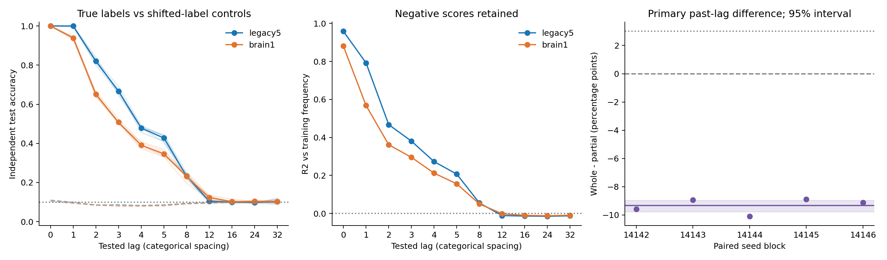

# ACT II diagnostic — independent-stream delayed-symbol decoding

**Whole-brain superiority fails the preregistered main criterion.** Mean
paired whole-minus-partial delayed accuracy is -9.320 percentage
points (95% block bootstrap [-9.760, -8.945]).
This measures linear access to past inputs under the current48-MBON interface,
not autonomous recall or formal memory capacity.

Protocol28a407c preceded outcomes; numerical runner332e340; analyzer's
single-thread correction30ecb6b preceded the scientific cohort.
[Protocol](delayed-symbol-protocol.md) · [Config](../configs/delayed_symbol.json).

## 1. Repository audit

Continued from878e5dd. Revisited the earlier Phase3b delay probes, existing ridge
decoder, timing semantics, model builder, data/cache provenance and the N512
decoder tradeoff. Phase3b used different partial-network timing conditions; its
results do not substitute for this matched whole-brain comparison. All3,565
prior result files remain unchanged, as do existing numerical source modules.

Roadmap: ACT I matched graph comparison is completed without established
whole-brain superiority. ACT II four-family pilot, N32–512 scaling and prefix
loss-mass study are complete in their scoped designs. This is an ACT II
representation/decoding diagnostic. Network alphabet experiments K2/4/16 remain
open; comprehensive ACT III ablations and ACT IV internal learning are not done.
ACT V robustness is separate, with prior negative findings preserved.

## 2. Reproduced baseline

Rebuilt the historical N512 first-block11142/data11242/stratum701 baseline in
both graphs. Features, output parameters, predictions and probabilities match
exactly; expected/actual prefix scores legacy5=12, brain1=33.
[Validation](../results/delay_validation/baseline.json).
Existing shift-register and memoryless delay-alignment tests were reused.

## 3. New implementation

Added run_delayed_symbol.py and summarize_delayed_symbol.py. Existing graph,
dynamics and RidgeDecoder are reused. Saved predictions are cross-checked
against decode_delays and scores reconstructed from saved coefficients.
verify_delayed_symbol_stream.py consumes finalized per-run manifests while the
cohort continues; it regenerates every trajectory and refits every real/null
head. Its own source hash is recorded even though it was added after execution
commit30ecb6b. Repeats are validation, not independent scientific samples.

## 4. Experiments executed

Five paired blocks: input14142–14146, train15142–15146, test16142–16146;
strata701/702; legacy5/brain1 =20 scientific state conditions. Each has11 real
and11 shifted-label lag probes. All streams are independently generated iid
decimal symbols, with100 warmup +2,000 training /1,000 test samples. Both
streams reset the reservoir separately; there is no prompt or pi input.

Identical48 MBON observations and source-root input patterns within each graph
pair; incoming-L1 gain.9, leak.6, mbon_after_kc, inputfraction.1, amplitude.5.
Linear ridge has490 coefficients per lag (48x10 weights +10 intercepts),
alpha1, train-only scaling floor1e-5. No nonlinear-head comparison is implied.
There is no autonomous rollout, prefix weighting, tuning or recurrent learning.

Legacy5 has686 neurons and3,309/3,241 edges in strata701/702, threshold5.
Brain1 has138,639 neurons and15,091,983 edges, threshold1. This two-condition
diagnostic does not separately isolate graph expansion from weak-edge restoration.

Lags0,1,2,3,4,5,8,12,16,24,32. Primary aggregate averages lags1,2,3,4,5,8;
lag0 measures current-input access. A circular shift of1,000 training target
rows supplies the misaligned-head control; evaluate against original test labels.
Ridge scores are not calibrated probabilities. Two smoke runs use200/100
samples and shift100, and are excluded from estimates.

## 5. Results

All percentages below concern independent test streams, not trained-sequence
autonomous recall. Raw conditions retain both input strata.

| Graph | Past-lag accuracy | Frequency baseline | Shifted-label head | R2 vs train frequency | H1 gate |
|---|---:|---:|---:|---:|---|
| legacy5 | 60.420% | 9.563% | 8.842% | 0.36240 | True |
| brain1 | 51.100% | 9.563% | 8.508% | 0.27374 | True |

### Every seed and input stratum

| Input / train / test seed | Stratum | Partial accuracy | Whole accuracy | Whole - partial (pp) |
|---|---:|---:|---:|---:|
| 14142 / 15142 / 16142 | 701 | 59.600% | 50.483% | -9.117 |
| 14142 / 15142 / 16142 | 702 | 59.283% | 49.217% | -10.067 |
| 14143 / 15143 / 16143 | 701 | 60.783% | 51.050% | -9.733 |
| 14143 / 15143 / 16143 | 702 | 60.333% | 52.200% | -8.133 |
| 14144 / 15144 / 16144 | 701 | 60.233% | 50.250% | -9.983 |
| 14144 / 15144 / 16144 | 702 | 60.950% | 50.750% | -10.200 |
| 14145 / 15145 / 16145 | 701 | 61.150% | 50.550% | -10.600 |
| 14145 / 15145 / 16145 | 702 | 59.233% | 52.083% | -7.150 |
| 14146 / 15146 / 16146 | 701 | 60.450% | 51.767% | -8.683 |
| 14146 / 15146 / 16146 | 702 | 62.183% | 52.650% | -9.533 |

### Predeclared lag curve (all runs)

| Lag | Partial accuracy | Whole accuracy | Partial R2 | Whole R2 |
|---|---:|---:|---:|---:|
| 0 | 100.00% | 100.00% | 0.9583 | 0.8804 |
| 1 | 99.95% | 93.89% | 0.7920 | 0.5679 |
| 2 | 82.03% | 65.05% | 0.4673 | 0.3615 |
| 3 | 66.69% | 50.79% | 0.3805 | 0.2953 |
| 4 | 47.81% | 39.10% | 0.2728 | 0.2122 |
| 5 | 42.74% | 34.66% | 0.2069 | 0.1557 |
| 8 | 23.30% | 23.11% | 0.0549 | 0.0499 |
| 12 | 10.37% | 12.32% | -0.0113 | -0.0016 |
| 16 | 9.99% | 10.20% | -0.0137 | -0.0100 |
| 24 | 9.82% | 10.35% | -0.0152 | -0.0122 |
| 32 | 10.32% | 10.34% | -0.0124 | -0.0095 |

### Observed representation diagnostics

| Graph | Effective rank | Mean absolute MBON state | Mean active neurons | Consecutive MBON cosine | Observed decay ratio32 |
|---|---:|---:|---:|---:|---:|
| brain1 | 10.624 | 0.005822 | 114031.6 | 0.996804 | 2.96e-06 |
| legacy5 | 14.974 | 0.013574 | 646.5 | 0.969241 | 6.61e-07 |

These diagnostics describe activity under the registered streams. More active
neurons need not mean more diverse features at the fixed observed interface.
Rank/cosine associations alone do not establish a causal explanation.



The lag panels show evenly spaced tested categories, not a linear time axis.
The original analysis figure is retained; this separate rendering only fixes
overlapping seed tick labels and makes categorical spacing explicit.

Primary paired block difference: mean-9.320pp,
median-9.108pp, variance0.26540pp²,
d_z=-18.091025273810175; positive/tied/negative blocks
0/0/5.
Average two strata per block before10,000 bootstrap resamples, seed21399.
Five blocks are small computational samples of one source connectome, not five
animals. All raw lag scores, train accuracy, frequency/null scores, per-lag
intervals and neural diagnostics are in the saved CSV/NPZ files.

## 6. Interpretation

H1 requires mean and>=4/5 block primary excesses over both frequency and shifted
controls >=5pp, plus mean R2>0. H2 requires whole-minus-partial mean>=3pp and
>=4/5 positive blocks. Main H2: **False**.
Fresh confirmation triggered: **False**.
Per-lag effects cannot replace that aggregate after outcomes.

Both graphs pass H1. All ten individual input-stratum contrasts and all five
paired block contrasts favor legacy5 on the primary aggregate. Both graphs
decode the current symbol at100%, so the past-lag difference is not failure
to inject or read the current input. Whole-brain has lower observed effective
rank (10.624 vs14.974), smaller mean absolute MBON activity and higher adjacent
state cosine similarity despite many more active neurons. These are descriptive
representation diagnostics, not causal identification of scale or weak edges.

This task separates linear accessibility of past input from priority fitting
of a single sequence. Even strong short-lag decoding does not establish long
autonomous sequence recall. Inability of this linear head to decode does not
prove absence of all past information from the observed or unobserved network.

## 7. Negative findings and execution deviations

The first smoke analysis lacked a single-thread limit and failed exact saved
score reconstruction at maximum difference4.996e-16. Smoke full repeats had
already matched. The analyzer was corrected to the registered single-thread
setting; no tolerance was relaxed. The subsequent exact analysis passed.

A chained orchestration call prematurely launched results/delay_main before
that analysis failure was inspected. It was stopped; its partial artifacts are
preserved and excluded. The complete scientific cohort restarted with unchanged
config at results/delay_main_v2 after smoke passed. No partial scores were used
to modify hypotheses or parameters. [Deviation record](../results/delay_validation/execution-deviation.json).
Historical anchored-window, robustness and plasticity negatives remain intact.

At lag12, whole-brain accuracy is descriptively higher (12.32% vs10.37%), but
both mean R2 values are negative. This isolated lag does not rescue the primary
criterion. At lags16–32, both accuracies are around10%; do not claim that all
past information is absent based on this finite linear probe. Small paired
variance makes d_z large in magnitude; it is not a biological effect-size estimate.

## 8. What we can claim

The saved tests quantify linear recovery of past iid symbols under this fixed
computational model and48-MBON interface. The paired design isolates the graph
condition while preserving input IDs, observed IDs, streams and decoder budget.
Use the actual H1/H2 decisions above; graph size alone is not a success claim.

## 9. What we cannot claim

No living-fly memorization, biological circuit localization, internal synaptic
learning, increased Shannon capacity, formal reservoir memory capacity or
general alphabet/sequence performance is established. This is not an ACT III
topology-control experiment. The simple leaky dynamics and temporal input
propagation may support short lags; only matched structural controls can test
whether specific wiring is necessary. No physiological timescale is implied.

## 10. Reproducibility

All20 scientific state conditions are independently regenerated and both heads
refitted exactly; all numerical checkpoint arrays agree. Two smoke conditions
and the two selected historical baselines are additional validation. Test suite:
148 passed,8 optional-dependency skips. Python3.12.10, requirements-act1-lock.txt,
one numerical thread; per worker1,800s/3GiB limits with0.2s process-tree sampling.
Execution and verification overlap; runtime is not an isolated speed benchmark.
Scientific worker wall-time sum: 1685.42s; maximum sampled process-tree
RSS: 948.1MiB. Numerical array storage and all per-run resources are retained.

[Main manifest](../results/delay_main_v2/manifest.json) ·
[Verification](../results/delay_verification/manifest.json) ·
[Analysis](../results/delay_analysis/summary.json) ·
[Environment](../results/delay_validation/environment.json).

From repository root, always use fresh output directories:

```powershell
$env:PYTHONPATH = 'src'
python -m pip install -r requirements-act1-lock.txt
python -m flying.training.phase6 prepare --cache outputs/act1-graphs
python scripts/run_delayed_symbol.py run --config configs/delayed_symbol.json --out outputs/delay_new
python scripts/run_delayed_symbol.py verify --source outputs/delay_new --out outputs/delay_verify_new
python scripts/summarize_delayed_symbol.py --source outputs/delay_new --out outputs/delay_analysis_new
python scripts/plot_delayed_symbol.py --source outputs/delay_analysis_new --out outputs/delay_figures_new
```

The streaming verifier is an equivalent scheduling option. Raw graph caches
are excluded from Git and regenerated against stored source hashes. Exact old
replays require recorded source/protocol bytes; never rewrite historical hashes.

## 11. Next highest-information experiment

**One ACT II-A alphabet-size experiment:** compare K=2,4,10,16 on seeded
random sequences at fixed N128 in legacy5 and brain1. Match input/observation
IDs, stimulation budget, dynamics, optimizer and head architecture within each
K; explicitly report the output-dimension-dependent parameter count across K.
Use a common valid prompt and preregister seeds and criteria before outcomes.
Report exact-prefix symbols and L log2(K) recalled-prefix bits alongside
teacher-forced accuracy, without calling either formal memory capacity.

다음 실험 하나는 **길이128을 고정하고 기호 종류 수K=2·4·10·16을 비교하는
ACT II-A 실험**이다. 부분망과 전체망을 각K 안에서 같은 조건으로 비교한다.
현재까지 네트워크 연구가K=10에 한정되어 있어, 숫자 열 종류를 넓힌 결과가
기호 체계 변화에도 유지되는지 직접 확인한다. 아직 실행하지 않았다.
