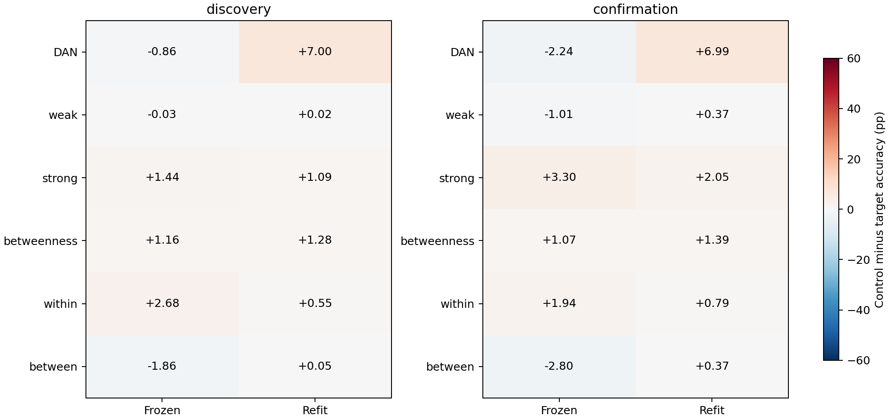
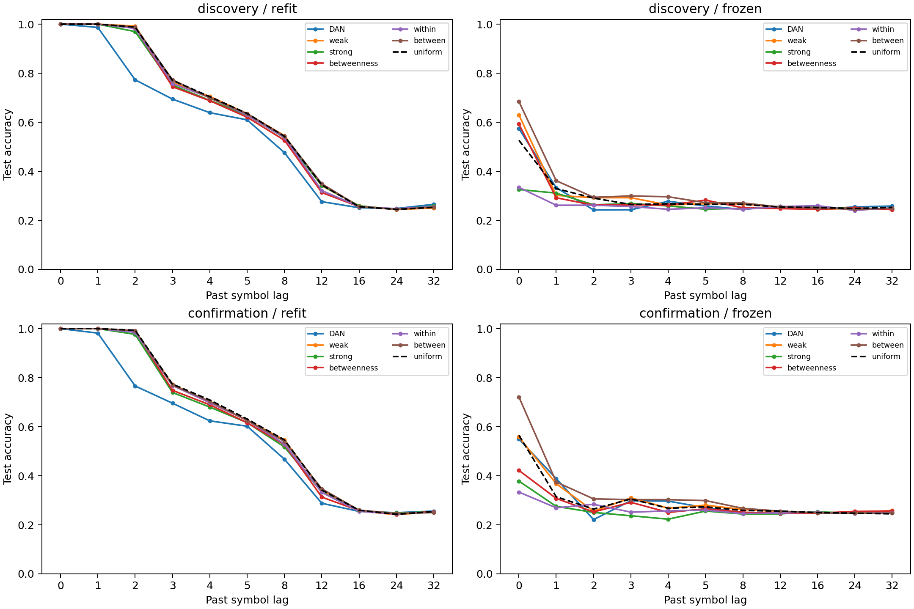
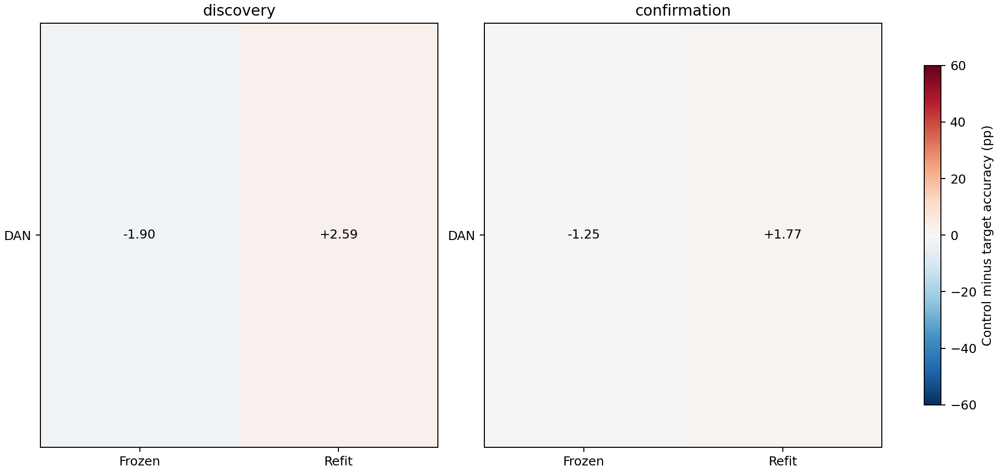

# ACT III-B: 같은 수의 연결 제거가 같은 기억 손상을 만드는가?

**현재 두 부분 회로의 ACT III-B 연결 제거 패널을 끝까지 실행·검증했다.**
원래 raw-weight-bin 패널의 DAN-refit 확인: **True**.
정규화 가중치 후속 대조의 DAN-refit 확인: **False**.
원래 패널의 사전 고정한 동일-mode·양 cohort 기준 통과 목록: **refit/DAN**.
이후 정규화 가중치까지 맞춘 마지막 대조의 판단은 아래 별도로 보고한다.
III-C/D/IV와 whole-brain 연결 위치 규명까지 완료했다는 의미는 아니다.

**엄격한 정규화 가중치 대조에서는 DAN의5%p 추가 손상을 확인하지 못했다.**
원래 제거 수·부호·raw weight-bin 대조에서는 재학습 후 추가 손상이 본 실험6.997%p,
확인6.994%p로 재현됐다. 하지만 이 비교는 정규화 후 제거 가중치량88.023 대58.774라는
차이를 남겼다. 따라서 긍정 결과만으로 DAN topology의 특별한 효과를 주장하지 않았다.

정규화 가중치도 맞춘 별도 사전등록·새 cohort에서 추가 손상은2.585%p/1.773%p였다.
모든 seed에서 양수지만5%p gate는 두 cohort 모두 실패했다. 실제 제거량 오차는
최대0.0167%였다. 이는 무효과나 동일성의 증명이 아니며,선택한 비교에서5%p의
추가 손상이 성립하지 않았다는 결과다. DAN 제거 자체는 intact보다 해독 성능을
낮추며,비슷한 유효 가중치량을 제거한 대조의 정확도도 intact보다 낮았다.

대조와 DAN target의 겹침은 원래21.95–27.72%에서 엄격 대조63.41–70.42%로 커졌다.
사용한 computational cohorts도 다르다. 따라서 효과 감소의 전부가 정규화 제거량
때문이라고 단정하거나 normalized strength의 단독 매개 효과를 입증했다고 해석하지
않는다. 더 엄격한 대조의 구조적 차이가 작아졌다는 한계도 함께 남긴다.

Weak/strong/betweenness/within-role/between-role의 동일5% edge 패널에서는
5%p 추가 손상의 독립 확인을 얻지 못했다. Frozen 해독은 여러 edge 제거에 크게
흔들렸지만 refit 후 손상과 구분된다. 현재 결과는 외부 해독기의 민감성과
connectome state에서 읽을 수 있는 과거 정보의 양을 분리하는 모델 내 증거다.


## 1. Repository audit

기준 `fc20e23`에서 III-A 결과,현황/방향/roadmap,AGENTS,코드·config·checkpoint와
다음 과제를 확인했다. 앞 연구는 DAN 뉴런 제거 후 재학습 손상을 확인했으나
matched neuron control이 같은 edge 수/strength를 제거하지 않았다.
이번에는 뉴런 수와 직접 입력을 유지한 채 연결만 제거한다.
[Graph-only audit](edge-panel-graph-audit.json)에서 c701/c702의 DAN incident
edges552/524,within-role217/220을 확인했다. DAN을 전혀 포함하지 않는 대조로는
일부 sign/weight 구간 수를 맞출 수 없어 전체 edge pool을 사용하기로 사전 결정했다.
대조와 target의 overlap을 숨기지 않는다. 같은 수 비교는 whole graph의5%인165/162
edges로 고정했다. Within pool의 약3/4를 제거하는 조건임도 해석에 포함한다.

Protocol commit `8043dfe`, 구현·중심성 수치 tie 규칙 commit `971ce53`, 모두 새
outcome 전에 완료. [Seed audit](edge-panel-seed-audit.json)에서105개 새 실험 seed
충돌0. 기존 11,435개 결과 파일 해시를 유지했다.

독립 검증에서 `between` prefix가 `betweenness`까지 포함하는 집계 오류를 발견했다.
원본221조건의 상태/metric에는 문제가 없었으며,정확한 arm membership으로
수정해 [analysis_v2](../results/edge_ablation_analysis_v2/manifest.json)에 재집계했다.
[실패 기록](../results/edge_ablation_validation/failure.json)과 원래 집계는 보존하고
수정된 모든 통계·상태·metric을 다시 독립 검증했다. DAN 판단은 바뀌지 않았다.
원래 `results/edge_ablation/summary.json`와 그림의 between 집계는 superseded다.
재집계 수정 commit `a40d4ea`,독립 검증은 validation_v2에 기록했다.

## 2. Reproduced baseline

과거 structural K4 intact의 모든 배열·metric을 정확히 재현했다(primary75.483%).
기존 III-A `DAN_c701_s91142`의 full-neuron lesion과 이번 incident-edge lesion도
공통 상태·decoder 배열 32개,모든 metric,가중치가
정확히 일치했다. DAN에 직접 입력을 넣지 않고0 상태에서 시작하므로 예상되는
동등성이다. 새로운 독립 표본으로 세지 않았다. [Baseline evidence](../results/edge_ablation/baseline.json).

## 3. New implementation

[Edge masks](../scripts/edge_masks.py),[runner](../scripts/edge_panel.py),
[independent verifier](../scripts/verify_edge_panel.py)를 추가했다.
집계된 directed neuron-pair entry 하나가 edge 하나다. 모든686 뉴런·입력 매핑·48
MBON 관측은 유지한다. Intact incoming-L1 정규화 후 entries만0으로 만들며 생존
가중치를 재정규화하지 않는다. Frozen source moments/계수와 target refit을 분리한다.
중심성은 부호·가중치를 거리로 사용하지 않는 directed unweighted shortest paths다.
많은 최단경로에 걸쳐 있는 연결일수록 이 중심성이 높다.
Brandes 계산과 별도의 최단경로 개수 공식이 전체 edge에서 일치했고,반올림6자리
순위도 같았다. 동점은 숫자 root ID(pre,post) 순서로 고정한다.
이번에 사용하는 소스 바이트는 실행 전에 Git commit과 모두 일치함을 검사했다.
과거 줄바꿈/source snapshot과 기존 numerical engine은 수정하지 않았다.

## 4. Experiments executed

- **17조건 ×13 circuit/block combinations =221조건**: smoke17,discovery102,
  confirmation102. 양 cohort의 모든 조건을 결과에 관계없이 실행했다.
- Intact,DAN,부호·raw weight-bin 수 matched 대조3개,weak,strong,betweenness,
  uniform random3개,within-role3개,between-role3개.
- DAN은552/524개,나머지 ablation은165/162개. DAN 대조는 sign과
  [5,10),[10,20),[20,50),[50,100),[100,∞)별 수를 정확히 맞췄다.
  Exact raw strength나 normalized-weight matching은 아니다. 기타 대조는 count-only다.
- Discovery mapping121142–121144/train122142–122144/test123142–123144;
  confirmation131142–131144/132142–132144/133142–133144. 모든 mask seed는 config에 있다.
- K4 의사난수 독립 train/test,100 warmup+2000/1000 symbols,11lags,
  primary1/2/3/4/5/8. gain0.9,leak0.6,mbon_after_kc,input0.1/0.5,ridge alpha1,
  lag별196 coefficients. Source-frequency와 half-train cyclic-null 대조 포함.
- 두 biological source circuits는 동일하고 computational seeds가 새롭다.
  Seed 내 mask·lag·회로를 평균한다. Cohort당 독립 분석 단위는3개다.

221 full replays/refits,208 frozen evaluations,442 independent train/test trajectories,
4,719 lag-metric rows 검증. Runtime 204.36s,50ms sampled peak
202.20MiB. 별도 검증은
120.49s. Smoke 결과를 main 통계에 넣지 않았다.

## 5. Results

Primary past-lag 정확도(%). F=frozen,R=refit. DAN control은 signed-bin matched,
다른 family control은 uniform3개 평균이다. Within/between도 각3 masks 평균.
Gate는 intact 대비 손상과 control 대비 추가 손상이 모두 평균5%p 이상,
각각세 seed 모두양수,정상 intact 접근성이라는 고정 기준이다.

| Cohort | Family | Target F | Control F | Target R | Control R | F gate | R gate |
| --- | --- | --- | --- | --- | --- | --- | --- |
| discovery | DAN | 26.661 | 25.805 | 69.644 | 76.642 | False | True |
| discovery | weak | 28.072 | 28.045 | 77.339 | 77.357 | False | False |
| discovery | strong | 26.608 | 28.045 | 76.264 | 77.357 | False | False |
| discovery | betweenness | 26.889 | 28.045 | 76.078 | 77.357 | False | False |
| discovery | within | 25.362 | 28.045 | 76.806 | 77.357 | False | False |
| discovery | between | 29.904 | 28.045 | 77.304 | 77.357 | False | False |
| confirmation | DAN | 28.733 | 26.492 | 68.964 | 75.957 | False | True |
| confirmation | weak | 29.081 | 28.071 | 77.194 | 77.569 | False | False |
| confirmation | strong | 24.775 | 28.071 | 75.519 | 77.569 | False | False |
| confirmation | betweenness | 27.000 | 28.071 | 76.175 | 77.569 | False | False |
| confirmation | within | 26.129 | 28.071 | 76.778 | 77.569 | False | False |
| confirmation | between | 30.874 | 28.071 | 77.200 | 77.569 | False | False |




전체 paired seed 결과(% 및%p):

| Cohort | Seed | Family | Mode | Intact | Target | Control | Intact−target | Control−target |
| --- | --- | --- | --- | --- | --- | --- | --- | --- |
| discovery | 121142 | DAN | refit | 77.883 | 69.292 | 76.578 | 8.592 | 7.286 |
| discovery | 121143 | DAN | refit | 77.667 | 69.558 | 76.083 | 8.108 | 6.525 |
| discovery | 121144 | DAN | refit | 78.108 | 70.083 | 77.264 | 8.025 | 7.181 |
| discovery | 121142 | weak | refit | 77.883 | 77.425 | 77.408 | 0.458 | -0.017 |
| discovery | 121143 | weak | refit | 77.667 | 76.858 | 77.397 | 0.808 | 0.539 |
| discovery | 121144 | weak | refit | 78.108 | 77.733 | 77.267 | 0.375 | -0.467 |
| discovery | 121142 | strong | refit | 77.883 | 75.283 | 77.408 | 2.600 | 2.125 |
| discovery | 121143 | strong | refit | 77.667 | 76.417 | 77.397 | 1.250 | 0.981 |
| discovery | 121144 | strong | refit | 78.108 | 77.092 | 77.267 | 1.017 | 0.175 |
| discovery | 121142 | betweenness | refit | 77.883 | 75.708 | 77.408 | 2.175 | 1.700 |
| discovery | 121143 | betweenness | refit | 77.667 | 75.783 | 77.397 | 1.883 | 1.614 |
| discovery | 121144 | betweenness | refit | 78.108 | 76.742 | 77.267 | 1.367 | 0.525 |
| discovery | 121142 | within | refit | 77.883 | 76.475 | 77.408 | 1.408 | 0.933 |
| discovery | 121143 | within | refit | 77.667 | 76.444 | 77.397 | 1.222 | 0.953 |
| discovery | 121144 | within | refit | 78.108 | 77.497 | 77.267 | 0.611 | -0.231 |
| discovery | 121142 | between | refit | 77.883 | 76.967 | 77.408 | 0.917 | 0.442 |
| discovery | 121143 | between | refit | 77.667 | 77.081 | 77.397 | 0.586 | 0.317 |
| discovery | 121144 | between | refit | 78.108 | 77.864 | 77.267 | 0.244 | -0.597 |
| discovery | 121142 | DAN | frozen | 77.883 | 27.617 | 25.853 | 50.267 | -1.764 |
| discovery | 121143 | DAN | frozen | 77.667 | 27.133 | 25.431 | 50.533 | -1.703 |
| discovery | 121144 | DAN | frozen | 78.108 | 25.233 | 26.131 | 52.875 | 0.897 |
| discovery | 121142 | weak | frozen | 77.883 | 30.008 | 27.886 | 47.875 | -2.122 |
| discovery | 121143 | weak | frozen | 77.667 | 25.183 | 27.636 | 52.483 | 2.453 |
| discovery | 121144 | weak | frozen | 78.108 | 29.025 | 28.614 | 49.083 | -0.411 |
| discovery | 121142 | strong | frozen | 77.883 | 26.508 | 27.886 | 51.375 | 1.378 |
| discovery | 121143 | strong | frozen | 77.667 | 26.383 | 27.636 | 51.283 | 1.253 |
| discovery | 121144 | strong | frozen | 78.108 | 26.933 | 28.614 | 51.175 | 1.681 |
| discovery | 121142 | betweenness | frozen | 77.883 | 27.483 | 27.886 | 50.400 | 0.403 |
| discovery | 121143 | betweenness | frozen | 77.667 | 24.725 | 27.636 | 52.942 | 2.911 |
| discovery | 121144 | betweenness | frozen | 78.108 | 28.458 | 28.614 | 49.650 | 0.156 |
| discovery | 121142 | within | frozen | 77.883 | 24.825 | 27.886 | 53.058 | 3.061 |
| discovery | 121143 | within | frozen | 77.667 | 25.889 | 27.636 | 51.778 | 1.747 |
| discovery | 121144 | within | frozen | 78.108 | 25.372 | 28.614 | 52.736 | 3.242 |
| discovery | 121142 | between | frozen | 77.883 | 27.525 | 27.886 | 50.358 | 0.361 |
| discovery | 121143 | between | frozen | 77.667 | 30.003 | 27.636 | 47.664 | -2.367 |
| discovery | 121144 | between | frozen | 78.108 | 32.183 | 28.614 | 45.925 | -3.569 |
| confirmation | 131142 | DAN | refit | 76.458 | 67.917 | 74.503 | 8.542 | 6.586 |
| confirmation | 131143 | DAN | refit | 78.158 | 69.600 | 76.358 | 8.558 | 6.758 |
| confirmation | 131144 | DAN | refit | 77.942 | 69.375 | 77.011 | 8.567 | 7.636 |
| confirmation | 131142 | weak | refit | 76.458 | 76.550 | 76.450 | -0.092 | -0.100 |
| confirmation | 131143 | weak | refit | 78.158 | 77.908 | 77.553 | 0.250 | -0.356 |
| confirmation | 131144 | weak | refit | 77.942 | 77.125 | 78.703 | 0.817 | 1.578 |
| confirmation | 131142 | strong | refit | 76.458 | 74.683 | 76.450 | 1.775 | 1.767 |
| confirmation | 131143 | strong | refit | 78.158 | 76.283 | 77.553 | 1.875 | 1.269 |
| confirmation | 131144 | strong | refit | 77.942 | 75.592 | 78.703 | 2.350 | 3.111 |
| confirmation | 131142 | betweenness | refit | 76.458 | 75.083 | 76.450 | 1.375 | 1.367 |
| confirmation | 131143 | betweenness | refit | 78.158 | 76.767 | 77.553 | 1.392 | 0.786 |
| confirmation | 131144 | betweenness | refit | 77.942 | 76.675 | 78.703 | 1.267 | 2.028 |
| confirmation | 131142 | within | refit | 76.458 | 75.764 | 76.450 | 0.694 | 0.686 |
| confirmation | 131143 | within | refit | 78.158 | 76.939 | 77.553 | 1.219 | 0.614 |
| confirmation | 131144 | within | refit | 77.942 | 77.631 | 78.703 | 0.311 | 1.072 |
| confirmation | 131142 | between | refit | 76.458 | 76.019 | 76.450 | 0.439 | 0.431 |
| confirmation | 131143 | between | refit | 78.158 | 77.731 | 77.553 | 0.428 | -0.178 |
| confirmation | 131144 | between | refit | 77.942 | 77.850 | 78.703 | 0.092 | 0.853 |
| confirmation | 131142 | DAN | frozen | 76.458 | 26.517 | 26.506 | 49.942 | -0.011 |
| confirmation | 131143 | DAN | frozen | 78.158 | 27.958 | 27.386 | 50.200 | -0.572 |
| confirmation | 131144 | DAN | frozen | 77.942 | 31.725 | 25.583 | 46.217 | -6.142 |
| confirmation | 131142 | weak | frozen | 76.458 | 28.542 | 26.853 | 47.917 | -1.689 |
| confirmation | 131143 | weak | frozen | 78.158 | 28.550 | 28.942 | 49.608 | 0.392 |
| confirmation | 131144 | weak | frozen | 77.942 | 30.150 | 28.419 | 47.792 | -1.731 |
| confirmation | 131142 | strong | frozen | 76.458 | 23.717 | 26.853 | 52.742 | 3.136 |
| confirmation | 131143 | strong | frozen | 78.158 | 26.083 | 28.942 | 52.075 | 2.858 |
| confirmation | 131144 | strong | frozen | 77.942 | 24.525 | 28.419 | 53.417 | 3.894 |
| confirmation | 131142 | betweenness | frozen | 76.458 | 26.492 | 26.853 | 49.967 | 0.361 |
| confirmation | 131143 | betweenness | frozen | 78.158 | 26.975 | 28.942 | 51.183 | 1.967 |
| confirmation | 131144 | betweenness | frozen | 77.942 | 27.533 | 28.419 | 50.408 | 0.886 |
| confirmation | 131142 | within | frozen | 76.458 | 25.386 | 26.853 | 51.072 | 1.467 |
| confirmation | 131143 | within | frozen | 78.158 | 26.439 | 28.942 | 51.719 | 2.503 |
| confirmation | 131144 | within | frozen | 77.942 | 26.561 | 28.419 | 51.381 | 1.858 |
| confirmation | 131142 | between | frozen | 76.458 | 29.564 | 26.853 | 46.894 | -2.711 |
| confirmation | 131143 | between | frozen | 78.158 | 32.389 | 28.942 | 45.769 | -3.447 |
| confirmation | 131144 | between | frozen | 77.942 | 30.669 | 28.419 | 47.272 | -2.250 |


Control−target 통계:variance는%p²,bootstrap95는 seed block3개를10,000회 재표집.
작은 표본의 탐색적 구간이다. Paired dz가 크더라도 독립 biological n이 늘지는
않으며 multiple-comparison significance나 p-value 성공 주장을 하지 않는다.

| Cohort | Family | Mode | Mean | Median | Variance | CI | Paired dz | +/0/− |
| --- | --- | --- | --- | --- | --- | --- | --- | --- |
| discovery | DAN | refit | 6.997 | 7.181 | 0.17003 | [6.525, 7.286] | 16.969 | 3/0/0 |
| discovery | DAN | frozen | -0.856 | -1.703 | 2.30754 | [-1.764, 0.897] | -0.564 | 1/0/2 |
| discovery | weak | refit | 0.019 | -0.017 | 0.25371 | [-0.467, 0.539] | 0.037 | 1/0/2 |
| discovery | weak | frozen | -0.027 | -0.411 | 5.34340 | [-2.122, 2.453] | -0.012 | 1/0/2 |
| discovery | strong | refit | 1.094 | 0.981 | 0.96020 | [0.175, 2.125] | 1.116 | 3/0/0 |
| discovery | strong | frozen | 1.437 | 1.378 | 0.04838 | [1.253, 1.681] | 6.533 | 3/0/0 |
| discovery | betweenness | refit | 1.280 | 1.614 | 0.42895 | [0.525, 1.700] | 1.954 | 3/0/0 |
| discovery | betweenness | frozen | 1.156 | 0.403 | 2.32432 | [0.156, 2.911] | 0.759 | 3/0/0 |
| discovery | within | refit | 0.552 | 0.933 | 0.45922 | [-0.231, 0.953] | 0.814 | 2/0/1 |
| discovery | within | frozen | 2.683 | 3.061 | 0.66538 | [1.747, 3.242] | 3.290 | 3/0/0 |
| discovery | between | refit | 0.054 | 0.317 | 0.32168 | [-0.597, 0.442] | 0.095 | 2/0/1 |
| discovery | between | frozen | -1.858 | -2.367 | 4.05612 | [-3.569, 0.361] | -0.923 | 1/0/2 |
| confirmation | DAN | refit | 6.994 | 6.758 | 0.31711 | [6.586, 7.636] | 12.419 | 3/0/0 |
| confirmation | DAN | frozen | -2.242 | -0.572 | 11.48621 | [-6.142, -0.011] | -0.661 | 0/0/3 |
| confirmation | weak | refit | 0.374 | -0.100 | 1.10300 | [-0.356, 1.578] | 0.356 | 1/0/2 |
| confirmation | weak | frozen | -1.009 | -1.689 | 1.47238 | [-1.731, 0.392] | -0.832 | 1/0/2 |
| confirmation | strong | refit | 2.049 | 1.767 | 0.90775 | [1.269, 3.111] | 2.151 | 3/0/0 |
| confirmation | strong | frozen | 3.296 | 3.136 | 0.28763 | [2.858, 3.894] | 6.146 | 3/0/0 |
| confirmation | betweenness | refit | 1.394 | 1.367 | 0.38597 | [0.786, 2.028] | 2.243 | 3/0/0 |
| confirmation | betweenness | frozen | 1.071 | 0.886 | 0.67017 | [0.361, 1.967] | 1.309 | 3/0/0 |
| confirmation | within | refit | 0.791 | 0.686 | 0.06073 | [0.614, 1.072] | 3.209 | 3/0/0 |
| confirmation | within | frozen | 1.943 | 1.858 | 0.27371 | [1.467, 2.503] | 3.713 | 3/0/0 |
| confirmation | between | refit | 0.369 | 0.431 | 0.26840 | [-0.178, 0.853] | 0.711 | 2/0/1 |
| confirmation | between | frozen | -2.803 | -2.711 | 0.36464 | [-3.447, -2.250] | -4.641 | 0/0/3 |




Graph audit: 제거수는c701/c702;strength/role counts는 두 cohort 전체 평균.
DAN overlap은 원래 DAN target edges 중 해당 mask가 제거한 비율이다.

| Family | Removed edges | Raw L1 | Normalized L1 | DAN overlap | Within-role | Between-role |
| --- | --- | --- | --- | --- | --- | --- |
| DAN | 552 / 524 | 6651.50 | 88.0230 | 100.0–100.0% | 8.00 | 530.00 |
| between | 165 / 162 | 2261.36 | 29.8615 | 4.0–7.4% | 0.00 | 163.50 |
| betweenness | 165 / 162 | 3949.00 | 71.8734 | 7.6–8.3% | 21.00 | 142.50 |
| dan_control | 552 / 524 | 6689.94 | 58.7739 | 21.9–27.7% | 44.92 | 493.08 |
| strong | 165 / 162 | 9593.00 | 33.9572 | 5.3–6.3% | 42.00 | 121.50 |
| uniform | 165 / 162 | 2313.75 | 28.2991 | 4.0–6.9% | 11.72 | 151.78 |
| weak | 165 / 162 | 817.50 | 6.7738 | 6.5–6.5% | 16.50 | 147.00 |
| within | 165 / 162 | 3740.39 | 22.5547 | 0.6–1.5% | 163.50 | 0.00 |


확인 cohort 상태 진단 평균:

| Family | Effective rank | Active neurons | MBON norm | Sparsity | Decay32 |
| --- | --- | --- | --- | --- | --- |
| DAN | 5.175 | 561.00 | 0.10997 | 0.000 | 5.85e-07 |
| between | 6.359 | 627.69 | 0.11604 | 0.000 | 2.54e-07 |
| betweenness | 6.267 | 584.58 | 0.12949 | 0.094 | 1.69e-07 |
| dan_control | 6.024 | 610.64 | 0.09694 | 0.016 | 1.25e-07 |
| intact | 6.451 | 647.00 | 0.11770 | 0.000 | 7.17e-07 |
| strong | 6.039 | 631.64 | 0.13066 | 0.000 | 8.47e-08 |
| uniform | 6.361 | 629.52 | 0.11480 | 0.001 | 2.7e-07 |
| weak | 6.371 | 645.00 | 0.10884 | 0.000 | 7.01e-07 |
| within | 5.749 | 641.11 | 0.09738 | 0.108 | 7.52e-07 |


개별 조건/lag 원본과 모든 통계는 [raw table](../results/edge_ablation/raw-lag-table.csv),
[seed blocks](../results/edge_ablation_analysis_v2/seed-blocks.csv),[paired differences](../results/edge_ablation_analysis_v2/paired-differences.csv),
[summary](../results/edge_ablation_analysis_v2/summary.json),[edge audit](../results/edge_ablation/edge-audit.csv),
[neural diagnostics](../results/edge_ablation/neural-diagnostics.csv),
[within-minus-between](../results/edge_ablation_analysis_v2/within-between.csv)에 보존했다.
Within-minus-between은 사전 지정한 기술적 contrast이며 관찰 후 방향을 골라
성공 기준을 새로 만들지 않았다.

### 최종 대조: 실제 정규화 가중치도 맞추면?

첫 패널에서 DAN/대조의 normalized removed L1은88.023/58.774로 달랐다.
이 관찰을 근거로 별도 [사전 protocol](edge-strength-protocol.md) `1e6a4c4`와
[config](../configs/edge_strength.json)를 고정한 뒤,새 cohort에서65조건을 실행했다.
원래 패널의5%p 기준/seed/결과는 바꾸지 않았다. 구현 commit `8357de8`.
Exact edge count,sign,raw weight-bin과 normalized magnitude 폭0.001의 joint-bin
counts를 맞췄다. Rejection sampling이나 좋은 대조를 고르는 탐색은 없었다.

실제 대조의 정규화 제거량 오차는 최대 **0.01666%**,
DAN target 연결과 겹침은 **63.41–70.42%**였다.
Matching이 강화되면서 비교 집단의 겹침도 커졌다. Exact strength나 endpoint별
strength matching은 아니며,완전히 다른 edge set을 비교했다고 표현하지 않는다.

Smoke5,discovery30,confirmation30; discovery mapping141142–141144,
train142142–142144/test143142–143144; confirmation151142–151144,
152142–152144/153142–153144. 기존 두 biological graphs,K4와 모든 dynamics/readout
설정은 동일하다. 새로운 computational seeds이며 원래 패널과 pooled하지 않았다.

**정규화 가중치 대조의 주 가설 확인: False;
양 cohort에서 같은 mode로 확인된 목록: 없음.**

| Cohort | Seed | Mode | Intact | DAN | Matched control | Control−DAN (%p) |
| --- | --- | --- | --- | --- | --- | --- |
| discovery | 141142 | refit | 77.333 | 69.608 | 72.547 | 2.939 |
| discovery | 141143 | refit | 76.825 | 70.175 | 71.872 | 1.697 |
| discovery | 141144 | refit | 78.142 | 69.208 | 72.328 | 3.119 |
| discovery | 141142 | frozen | 77.333 | 26.592 | 25.606 | -0.986 |
| discovery | 141143 | frozen | 76.825 | 27.617 | 24.317 | -3.300 |
| discovery | 141144 | frozen | 78.142 | 27.692 | 26.281 | -1.411 |
| confirmation | 151142 | refit | 74.858 | 68.075 | 69.994 | 1.919 |
| confirmation | 151143 | refit | 77.475 | 69.283 | 71.386 | 2.103 |
| confirmation | 151144 | refit | 76.825 | 69.033 | 70.331 | 1.297 |
| confirmation | 151142 | frozen | 74.858 | 25.492 | 25.192 | -0.300 |
| confirmation | 151143 | frozen | 77.475 | 26.967 | 25.858 | -1.108 |
| confirmation | 151144 | frozen | 76.825 | 27.342 | 25.008 | -2.333 |


| Cohort/mode | Mean (%p) | Median | Variance (%p²) | Bootstrap95 | Paired dz | Gate |
| --- | --- | --- | --- | --- | --- | --- |
| discovery/refit/DAN | 2.585 | 2.939 | 0.59951 | [1.6972, 3.1194] | 3.339 | False |
| discovery/frozen/DAN | -1.899 | -1.411 | 1.51710 | [-3.3, -0.9861] | -1.542 | False |
| confirmation/refit/DAN | 1.773 | 1.919 | 0.17828 | [1.2972, 2.1028] | 4.199 | False |
| confirmation/frozen/DAN | -1.247 | -1.108 | 1.04808 | [-2.3333, -0.3] | -1.218 | False |




65 full replays/independent refits,52 frozen evaluations,130 independent train/test
trajectories,1,287 metric rows를 검증했다. Runtime 143.72s,
50ms sampled peak 189.12MiB.
기존 13,211개 결과 파일의 해시는 변하지 않았다.
이번 B단계 전체는 **286조건,260 frozen evaluations,572 독립 trajectories,
6,006 lag-metric rows**다. 오류 수정은 원래 case를 새 표본으로 세지 않는다.

[Raw seed table](../results/edge_strength/seed-blocks.csv),
[paired differences](../results/edge_strength/paired-differences.csv),
[summary](../results/edge_strength/summary.json),[edge matching audit](../results/edge_strength/edge-audit.csv),
[manifest](../results/edge_strength/manifest.json),[independent checks](../results/edge_strength_validation/checks.json).
Execution `8357de84d2f954a9a396afa986bb28a4b8ae7882`,config hash `36021e3662bfdb1ebe604dfcdbf73588ed4241886857bba135a1096f90d1e75b`.
각 case에 refit/state/mask checkpoint와 frozen checkpoint,제거 후weights를 보존했다.

## 6. Interpretation

**엄격한 정규화 가중치 대조에서는 DAN의5%p 추가 손상을 확인하지 못했다.**
원래 제거 수·부호·raw weight-bin 대조에서는 재학습 후 추가 손상이 본 실험6.997%p,
확인6.994%p로 재현됐다. 하지만 이 비교는 정규화 후 제거 가중치량88.023 대58.774라는
차이를 남겼다. 따라서 긍정 결과만으로 DAN topology의 특별한 효과를 주장하지 않았다.

정규화 가중치도 맞춘 별도 사전등록·새 cohort에서 추가 손상은2.585%p/1.773%p였다.
모든 seed에서 양수지만5%p gate는 두 cohort 모두 실패했다. 실제 제거량 오차는
최대0.0167%였다. 이는 무효과나 동일성의 증명이 아니며,선택한 비교에서5%p의
추가 손상이 성립하지 않았다는 결과다. DAN 제거 자체는 intact보다 해독 성능을
낮추며,비슷한 유효 가중치량을 제거한 대조의 정확도도 intact보다 낮았다.

대조와 DAN target의 겹침은 원래21.95–27.72%에서 엄격 대조63.41–70.42%로 커졌다.
사용한 computational cohorts도 다르다. 따라서 효과 감소의 전부가 정규화 제거량
때문이라고 단정하거나 normalized strength의 단독 매개 효과를 입증했다고 해석하지
않는다. 더 엄격한 대조의 구조적 차이가 작아졌다는 한계도 함께 남긴다.

Weak/strong/betweenness/within-role/between-role의 동일5% edge 패널에서는
5%p 추가 손상의 독립 확인을 얻지 못했다. Frozen 해독은 여러 edge 제거에 크게
흔들렸지만 refit 후 손상과 구분된다. 현재 결과는 외부 해독기의 민감성과
connectome state에서 읽을 수 있는 과거 정보의 양을 분리하는 모델 내 증거다.


모든 결과는 실제 초파리 connectome 구조를 사용한 계산 모델의 **과거 기호 해독**이다.
이번에 입력·관측·뉴런 수를 고정했으므로 직접적인 입출력 삭제는 비교 요인이
아니다. 다만 연결 수 matching만으로 부호/strength/endpoint composition이
통제되지는 않는다. Within/between은 역할 주석 분할이며 생물학적 module이 아니다.
Frozen 손상만으로 정보 소실을 말할 수 없고 refit 성능도 선택한 해독기에 의존한다.

## 7. Negative findings

확인 목록에 없는 family/mode는 사전 양-cohort 기준을 충족하지 못했다.
하나의 seed 또는 cohort만 통과한 결과도 원본에 모두 남겼다.
Gate 실패는 동일성/무효과의 증명이 아니다. 이번 패널은 자율 회상 개선,
whole-brain 우위 또는 dopamine-dependent learning을 검증하지 않았다.

## 8. What we can claim

현행 두 부분 회로에서 같은 제거 수와 고정 입출력 아래 edge set별 영향,
DAN incident edges의 sign/weight-bin matched 대조 결과를 재현 가능하게 측정했다.
Raw-bin 패널의 확인 목록은 `refit/DAN`,정규화 후속 대조의 확인 목록은 `없음`이다. Representation/decoding에 관한
모델 내 관찰이며 내부 연결을 학습한 결과가 아니다. 이 범위의 ACT III-B를 종료한다.

## 9. What we cannot claim

실제 초파리의 기억/지능,생물학적 memory pathway,Shannon/formal memory capacity,
학습된 내부 plasticity,whole-brain/localization,자율 수열 회상에서 동일 효과를
주장할 수 없다. DAN controls는 target edges와 겹치며 정확 strength matching은
아니다. Count-only families는 strength와 역할 구성이 다르다.5%라는 한 제거량의
결과를 전체 dose curve로 일반화하지 않는다. III-C/D/IV/V 전체 완료도 아니다.

## 10. Reproducibility

[Protocol](edge-panel-protocol.md),[config](../configs/edge_panel.json),
[manifest](../results/edge_ablation/manifest.json),[independent checks](../results/edge_ablation_validation_v2/checks.json),
[test suite](../results/edge_strength_validation/test-suite.json).
Execution commit `971ce53362288738ce0da5387fbcc5e46ad50607`, config hash `940c158d9ff0d46d35b3b8996ba06d45798347740550cd6a5f66d6ae96a46b0e`.
환경 Python3.12.10,NumPy2.3.5,SciPy1.17.0,
BLAS1 thread; `requirements-act1-lock.txt`의 기존 환경 사용. 이번에 새 환경을
설치한 것은 아니다. Manifest에 OS/CPU/BLAS·실제 버전을 저장했다.
모든 사용 source와 Git 바이트 일치,모든 이전 result hash 불변을 확인했다.
테스트 **212 passed,8 optional skipped**.

각 조건 `checkpoint.npz`에 refit/state/mask,`frozen.npz`에 source 고정 평가,
`weights.npz`에 제거 후 연결을 저장했다. `graphs/701,702`에는 원본 그래프와
전체 betweenness를 저장했다. Result manifest가 경로·해시·seed·환경을 연결한다.

```powershell
$env:PYTHONPATH='src'
python scripts/edge_panel.py --out outputs/edge_panel_new
python scripts/verify_edge_panel.py outputs/edge_panel_new --out outputs/edge_panel_check_new
python scripts/edge_strength.py --out outputs/edge_strength_new
python scripts/verify_edge_strength.py outputs/edge_strength_new --out outputs/edge_strength_check_new
python -m pytest -q
```

항상 새 경로 사용. Runner는 clean committed checkout과 exact source bytes를
요구한다. 과거 결과를 현재 파일로 덮어쓰거나 기존 manifest hash를 고치지 않는다.
기존 raw panel을 검증할 때는 수정된 분석을 지정한다:

```powershell
python scripts/verify_edge_panel.py results/edge_ablation --analysis results/edge_ablation_analysis_v2 --out outputs/edge_archived_check_new
```

## 11. Next highest-information experiment

**ACT III-C: 역할·뉴런별 in/out degree·postsynaptic incoming weight multiset을
보존한 재배선 대조 하나.** 원래 배선과 이 대조를 같은 입력/48 MBON/readout
조건에서 비교한다. 뉴런별 유입 가중치 분포와 incoming-L1 정규화 계수를 유지한
상태에서 구체적인 연결 상대를 바꾸는 것이 핵심이다. 어느 property를 보존하고
어느 property(예: outgoing strength)를 바꾸는지는 새 protocol에서 검증한다.
이는 제안이며 이번 B단계에서 실행하지 않았다. III-D나 내부 plasticity로 건너뛰지 않는다.


## Completion scope ledger

| III-B 항목 | 상태 |
|---|---|
| DAN incident edges + sign/raw-weight-bin count controls | 본/확인 완료,겹침·strength 차이 공개 |
| Weakest/strongest/uniform random | 같은165/162 edge 수로 완료 |
| High-betweenness | 독립 최단경로 계산·동점 규칙 검증,실험 완료 |
| Within/between partitions | KC/MBON/DAN/APL 역할 분할 범위에서 완료 |
| Effective normalized-strength matching | 새65조건·새 cohort·독립 검증 완료 |
| Frozen/refit·fresh seeds·all raw results·sensitivity plots | 완료 |
| Detected biological modules/whole-brain/full dose curves/autonomous recall | 미검증 확장으로 유지 |
| III-C structural controls / III-D critical subnetwork / IV learning | 별도 후속 단계 |
