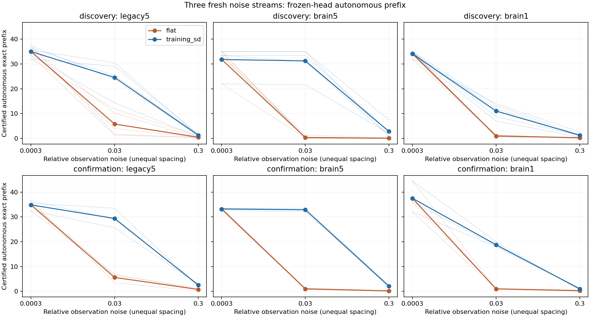
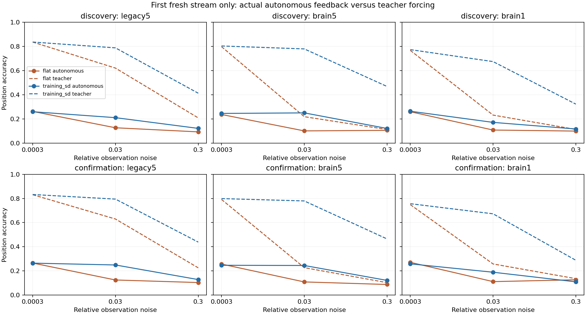

# 추가 연구1 — 관측 잡음 배분과 자율 회상

**Brain1의 사전 지정 자율 prefix 개선 기준을 통과했다.** 같은 그래프 안에서 이 기준을 통과한 조건은
`['legacy5', 'brain5', 'brain1']`다. 완료된 ACT V와 별도로 실행한 확장 연구이며, 과거 실패를 변경하지 않는다.

이번 질문은 관측값을 읽는 과정의 잡음을 뉴런마다 똑같이 주는 대신,
각 뉴런의 평소 변화 크기에 비례해 나누면 자율 회상이 나아지는가이다.
총 기대 잡음 에너지는 같은 모델 안에서 맞췄다. 연결망의 상태를 직접 고치거나
다시 학습하지 않았으며, 오염된 관측을 읽고 낸 숫자가 다음 입력으로 들어간다.

## 1. Repository audit

[추가 연구 브리핑](additional-research-brief.md)에서 자율 전이, 수열 일반화, 구조 대조,
더 현실적인 교란을 순서대로 정리하고 첫 질문만 선택했다. 부모 모델·head·기존
배분 대조·manifest·코드를 확인했다. 기존 ACT I에도 clean first-error 일치 검사가
있었다. 이 성질을 관측 잡음으로 확장해 불필요한 전체망 재계산을 줄였다.
기존 ACT V 보고서와 실패 기록은 그대로 보존했다.

## 2. Reproduced baseline

기존 48개 모델을 재사용하고 모두 실제 clean 자율 rollout으로 재현했다.
Clean 출력·확률·관측 상태·활성 뉴런 수·norm을 부모 결과와 정확히 대조했다.
원래 n5와 부모 확인 n3은 이번에도 같은 모델이다. 새로운 모델 학습이나 독립
모델 holdout 확인이 아니다. 기존 Python 3.12 격리 환경을 재사용했다. 새 clean environment를 만들거나
readout을 다시 학습한 실험은 아니다.

| cohort | graph | 모델 수 | 부모 expected PMS 평균 | actual PMS 평균 | 대조 |
| --- | --- | --- | --- | --- | --- |
| discovery | legacy5 | 10 | 35.000 | 35.000 | all arrays exact |
| discovery | brain5 | 10 | 31.800 | 31.800 | all arrays exact |
| discovery | brain1 | 10 | 34.100 | 34.100 | all arrays exact |
| confirmation | legacy5 | 6 | 34.833 | 34.833 | all arrays exact |
| confirmation | brain5 | 6 | 33.167 | 33.167 | all arrays exact |
| confirmation | brain1 | 6 | 37.500 | 37.500 | all arrays exact |

## 3. New implementation

[실행기](../scripts/feedback_noise.py), [독립 검증기](../scripts/verify_feedback_noise.py),
[테스트](../tests/test_feedback_noise.py). 자율 함수는 prompt와 잡음을 받지만 정답
수열을 인자로 받지 않는다. 출력한 기호만 다음 입력으로 넣는다. 잡음은 관측값에만
더하고 내부 상태에 직접 쓰지 않는다. Raw reservoir 관측과 noisy head 입력도
별도로 저장한다. 내부 연결·head·전처리는 고정했다.

## 4. Experiments executed

[Protocol](feedback-noise-protocol.md), [config](../configs/feedback_noise.json).
설계/source commit `007f3fb5ea29660550185718b5c989ba37db0071`. 모델 seed 7142–7146와 381142–381144,
circuits 701/702, legacy5/brain5/brain1. 같은 48개 MBON·482개 head 파라미터,
π offset 0 / length 200 / prompt 314, 평가 197위치. 원래 gain .9 / leak .6 / mbon_after_kc를 유지했다.
Readout은 48→8(tanh)→10이며, 부모 학습은 Adam 2000 updates, LR .03,
L2 1e-5, 첫 32위치 가중치 4배다. 이번에는 그 checkpoint를 그대로 읽었다.

| graph | neurons | edges | threshold | observed MBONs | head parameters |
| --- | --- | --- | --- | --- | --- |
| legacy5 | 686 | 3309 | 5 | 48 | 482 |
| brain5 | 138639 | 2700513 | 5 | 48 | 482 |
| brain1 | 138639 | 15091983 | 1 | 48 | 482 |

학습 199행의 SD 중앙값 q와 뉴런별 배분 a_j=SD_j/RMS(SD)를 고정하고,
flat sigma=rq와 allocated sigma_j=rq a_j를 비교했다. r=[.0003,.03,.3].
잡음을 더한 관측값은 [-1,1] 범위로 잘라 head에 전달한다.
같은 모델 안의 기대 clip 전 제곱 잡음 에너지가 같으며, 실현 에너지나 그래프 간
총 에너지가 같다는 뜻은 아니다. 잡음은 예측 시점마다 같은 48좌표에서 대응한다.

| 구분 | 조건 | 수량 | 실제 자율 전체 출력 여부 |
| --- | --- | --- | --- |
| 기존 기록 재분석 | 기존 372001/408001/408002/408003 | 1152 prefix certificate | 아니오; 사후 재분석, 성공 판정 제외 |
| 새 잡음 prefix | 새 418001/418002/418003, 모든 모델·강도·배분 | 864 prefix certificate | 첫 오류까지만 인증 |
| 실제 자율 rollout | 418001, 모든 모델·강도·배분 | 288 | 예, 197자리 전체 저장 |
| Clean/영점 재현 | 모든 모델 | 48 | 예 |

실제 신경 평가 궤적은 **336개**다. 2016개 certificate를 2016개 전체 자율 실행으로
부르지 않는다. Smoke의 126개 certificate·21개 궤적은 본 분석에서 제외했다.

## 5. Results

PMS는 prompt를 제외하고 첫 오류 전까지 연속으로 맞힌 기호 수이며, 최대 197이다.
유지율은 `min(잡음 조건 PMS / clean PMS, 1)`이다. Clean PMS=0이면 정의하지 않는다.
이것은 이번 수열의 정확한 연속 회상 지표이며 formal memory capacity가 아니다.

새 잡음에서 seed별 배분−flat 차이. 각 칸은 `PMS 자리 / capped retention %p`다.
세 강도·두 circuit·새 잡음 3개를 먼저 평균하고, 두 모델 집단을 합치지 않았다.

| cohort | seed | legacy5 | brain5 | brain1 |
| --- | --- | --- | --- | --- |
| discovery | 7142 | +5.500 / +14.850 | +10.667 / +31.892 | +4.556 / +12.790 |
| discovery | 7143 | +4.444 / +13.428 | +11.889 / +33.952 | +5.111 / +15.972 |
| discovery | 7144 | +7.611 / +20.460 | +14.056 / +40.159 | +2.944 / +8.413 |
| discovery | 7145 | +9.167 / +26.371 | +7.833 / +35.764 | +2.167 / +6.402 |
| discovery | 7146 | +5.944 / +18.576 | +11.500 / +34.315 | +3.722 / +11.350 |
| confirmation | 381142 | +6.944 / +21.254 | +11.444 / +34.157 | +6.111 / +19.097 |
| confirmation | 381143 | +9.222 / +24.822 | +11.111 / +34.191 | +6.389 / +13.347 |
| confirmation | 381144 | +9.389 / +25.973 | +11.222 / +33.462 | +6.000 / +16.405 |

주요 조건 brain1의 seed별 절대값. 각 칸은 `평균 PMS / 평균 retention %`다.
반복을 평균한 seed block이며 개별 시행 원자료는 아래 CSV에 모두 보존했다.

| cohort | seed | flat | allocated |
| --- | --- | --- | --- |
| discovery | 7142 | 12.000 / 34.296 | 16.556 / 47.086 |
| discovery | 7143 | 11.111 / 34.722 | 16.222 / 50.694 |
| discovery | 7144 | 12.056 / 34.444 | 15.000 / 42.857 |
| discovery | 7145 | 11.667 / 34.315 | 13.833 / 40.717 |
| discovery | 7146 | 12.056 / 35.023 | 15.778 / 46.373 |
| confirmation | 381142 | 10.944 / 34.201 | 17.056 / 53.299 |
| confirmation | 381143 | 15.278 / 34.354 | 21.667 / 47.701 |
| confirmation | 381144 | 12.556 / 34.886 | 18.556 / 51.291 |

조건별 평균 `PMS / retention %`:

| cohort | graph | flat | allocated | joint gate |
| --- | --- | --- | --- | --- |
| discovery | legacy5 | 13.756 / 39.432 | 20.289 / 58.169 | True |
| discovery | brain5 | 10.756 / 33.849 | 21.944 / 69.065 | True |
| discovery | brain1 | 11.778 / 34.560 | 15.478 / 45.545 | True |
| confirmation | legacy5 | 13.741 / 39.461 | 22.259 / 63.477 | True |
| confirmation | brain5 | 11.444 / 34.527 | 22.704 / 68.463 | True |
| confirmation | brain1 | 12.926 / 34.481 | 19.093 / 50.764 | True |

새 잡음의 paired 기술 통계. Retention의 평균·중앙값·구간은 %p,
분산은 원래 비율의 제곱이며 PMS는 자리 단위다.

| cohort | graph | metric | mean | median | variance | bootstrap95 | dz | wins/ties/losses |
| --- | --- | --- | --- | --- | --- | --- | --- | --- |
| discovery | legacy5 | pi_memory_score | 6.533 | 5.944 | 3.46852 | 5.167 / 8.122 | 3.508 | 5/0/0 |
| discovery | legacy5 | retention | 18.737 | 18.576 | 0.00261438 | 15.026 / 22.885 | 3.664 | 5/0/0 |
| discovery | brain5 | pi_memory_score | 11.189 | 11.500 | 5.08426 | 9.300 / 12.944 | 4.962 | 5/0/0 |
| discovery | brain5 | retention | 35.217 | 34.315 | 0.000954626 | 33.128 / 37.749 | 11.398 | 5/0/0 |
| discovery | brain1 | pi_memory_score | 3.700 | 3.722 | 1.41142 | 2.789 / 4.611 | 3.114 | 5/0/0 |
| discovery | brain1 | retention | 10.986 | 11.350 | 0.00139713 | 8.082 / 13.824 | 2.939 | 5/0/0 |
| confirmation | legacy5 | pi_memory_score | 8.519 | 9.222 | 1.86523 | 6.944 / 9.389 | 6.237 | 3/0/0 |
| confirmation | legacy5 | retention | 24.016 | 24.822 | 0.000605396 | 21.254 / 25.973 | 9.761 | 3/0/0 |
| confirmation | brain5 | pi_memory_score | 11.259 | 11.222 | 0.0288066 | 11.111 / 11.444 | 66.338 | 3/0/0 |
| confirmation | brain5 | retention | 33.937 | 34.157 | 1.69037e-05 | 33.462 / 34.191 | 82.542 | 3/0/0 |
| confirmation | brain1 | pi_memory_score | 6.167 | 6.111 | 0.0401235 | 6.000 / 6.389 | 30.786 | 3/0/0 |
| confirmation | brain1 | retention | 16.283 | 16.405 | 0.000827714 | 13.347 / 19.097 | 5.660 | 3/0/0 |

[개별 certificate 원자료](../results/feedback_noise_main/raw-certificates.csv),
[개별 실제 rollout 원자료](../results/feedback_noise_main/raw-rollouts.csv),
[paired differences](../results/feedback_noise_main/paired-differences.csv),
[전체 통계·판정](../results/feedback_noise_main/summary.json).
작은 n5/n3 모델 표본의 기술 통계이며, 새 잡음 반복을 독립 모델로 세지 않는다.
Brain1 발견 집단의 유지율 이득 95% bootstrap 구간은 8.08–13.82%p로,
사전 최소 평균 이득 10%p보다 낮은 값도 포함한다. 등록 기준은 평균과 seed별 방향에
적용했으며 구간 하한을 사용하도록 바꾸지 않았다. 일부 n3의 큰 dz는 반복을 평균한
seed 차이의 분산이 매우 작은 데서 나온다. 이를 일반화의 확실성으로 해석하지 않는다.



가로축은 세 사전 지정 강도를 나열한 범주 축이며, 선형 간격이 아니다. 옅은 선은 seed별 평균, 굵은 선은 집단 평균이다.

## 6. Interpretation

Brain1의 새 잡음 곡선 평균 PMS 이득은
3.700/6.167자리,
유지율 이득은 10.986/16.283%p다.
성공에는 두 집단 모두 PMS 평균 ≥2자리와 유지율 ≥10%p, 각 지표에서 각각 4/5 이상·3/3 seed의
양의 차이가 필요하다. 이 joint criterion을 사후 변경하지 않았다.
이는 같은 그래프의 두 잡음 배분 비교이며 전체망이 부분망보다 우수하다는 판정이 아니다.

첫 오류 전에는 자율 출력이 정답이므로 다음 입력도 정답 입력과 같다. 같은
prompt·noise·결정론적 update라면 상태와 예측도 첫 오류를 포함해 일치한다.
이 관계를 실제 336개 궤적에서 확인했다. 첫 오류 이후 정답 입력의 전체 정확도는
자율 회상 정확도가 아니므로, 아래는 실제 실행한 첫 새 잡음 418001만 별도로 본다.

| cohort | graph | arm | PMS | autonomous % | teacher % | after-first-error % |
| --- | --- | --- | --- | --- | --- | --- |
| confirmation | brain1 | flat | 12.722 | 16.920 | 38.043 | 11.185 |
| confirmation | brain1 | training_sd | 19.889 | 18.528 | 57.219 | 9.387 |
| confirmation | brain5 | flat | 11.444 | 15.059 | 37.366 | 9.924 |
| confirmation | brain5 | training_sd | 22.667 | 20.389 | 68.077 | 10.035 |
| confirmation | legacy5 | flat | 14.444 | 16.413 | 56.176 | 9.889 |
| confirmation | legacy5 | training_sd | 22.667 | 21.348 | 68.838 | 11.142 |
| discovery | brain1 | flat | 11.667 | 15.533 | 37.056 | 10.285 |
| discovery | brain1 | training_sd | 17.000 | 18.359 | 59.019 | 10.689 |
| discovery | brain5 | flat | 10.733 | 14.738 | 37.631 | 9.833 |
| discovery | brain5 | training_sd | 22.367 | 20.525 | 68.409 | 10.399 |
| discovery | legacy5 | flat | 13.867 | 16.024 | 55.516 | 9.752 |
| discovery | legacy5 | training_sd | 20.200 | 19.695 | 67.919 | 10.512 |

오류 뒤 정확도는 첫 틀린 위치 다음부터 남은 위치의 정확도다. 완주하거나 마지막
위치에서 처음 틀린 경우 정의되지 않으며, 그런 경우는 원자료의 null로 보존한다.
다른 두 새 잡음에는 오류 이후 자율 출력을 생성하지 않았으므로 이 표로 확대하지 않는다.



가로축은 같은 세 강도의 범주 축이다. 실선은 실제 자율 출력, 점선은 정답 입력 해독 정확도다.

## 7. Negative findings

등록한 개선 기준을 실패한 그래프는 없지만, 이는 잡음 없는 성능의 회복이 아니다.
Brain1의 새 잡음 곡선 평균 유지율은 배분 변경 뒤에도 45.55% / 50.76%에 그쳤다.
강도 .0003에서는 두 배분 모두 clean prefix와 같았고, .03에서는 allocated가
11.03 / 18.78자리를 보존했다. .3에서는 allocated도 1.30 / 1.00자리로 무너졌다.

실제 자율 경로를 실행한 첫 잡음에서 brain1 allocated의 전체 정확도는
18.36% / 18.53%였고, 같은 잡음의 정답 입력 정확도는 59.02% / 57.22%였다.
첫 오류 다음부터의 정확도는 10.69% / 9.39%였다. 따라서 개선된 첫 오류 점수를
안정적인 긴 순서 회상이나 오류 뒤 복구로 표현하지 않는다.
모든 seed·강도·0 또는 음의 차이를 보존했고, 실패한 조건을 더 약한 잡음이나
다른 metric으로 바꾸지 않았다. 기존 ACT V의 전체망 우위·절대 강건성 실패도 유지한다.

## 8. What we can claim

실제 초파리 connectome 구조를 사용한 계산 모델에서 frozen head의 관측 잡음
배분 변경이 flat 배분보다 정확 자율 prefix를 개선했다. 주 조건 brain1과 두 보조
그래프 모두 미리 정한 개선 기준을 통과했다. 이 효과가 실제 connectome에 특유한지,
feature scale과 head의 일반적인 성질인지 이번 대조만으로는 분리할 수 없다.
첫 오류 인증과 실제 오류 이후 feedback을 구분해 보고했다. 모델 내부 학습은 수행하지 않았다.

## 9. What we cannot claim

실제 동물의 기억, 생리학적 강건성, 내부 연결 학습, formal/Shannon capacity,
unseen π 예측을 주장할 수 없다. 이미 학습한 π와 이미 분석했던 모델 두 집단을
재사용했다. 새 잡음은 새 모델 holdout이 아니다. 관측 잡음 대조를 전체 신경 상태
잡음의 회복책으로 일반화할 수 없고, certificate로 오류 이후 출력을 대신할 수 없다.

## 10. Reproducibility

[Main manifest](../results/feedback_noise_main/manifest.json),
[독립 검증](../results/feedback_noise_validation/checks.json),
[smoke 검증](../results/feedback_noise_smoke_validation/checks.json),
[테스트](../results/feedback_noise_tests/manifest.json),
[완료 감사](../results/feedback_noise_closeout/audit.json).
Main manifest SHA256 `54898d1627de353ee5ed0f32069e9fbb030a6e1043c2b95136d6297f89945823`.
2016개 certificate의 첫 오류 지표와 실제 336개 궤적의 저장 지표·첫 오류 일치를
확인했다. 그중 **140개 전체 궤적**은 별도 신경 update 구현으로 재실행했다.
모든 부분망 궤적과 사전 지정한 전체망 일부가 대상이며, 모든 전체망 궤적을
독립 재실행했다는 뜻은 아니다. 예측 기호는 정확히 일치했고,
최대 수치 차이는 3.0087e-14였다. 관련 테스트 16개가 통과했다.
기존 파일 25,091개는 변경되지 않았다.

본 실험은 1083.17초, 최대 worker process-tree sampled RSS는
0.996 GiB였다.
독립 검증은 268.44초,
최대 sampled RSS는 0.883 GiB였다.
메모리는 주기적으로 측정한 최댓값이므로, 측정 간격 사이의 순간 peak를 보장하지 않는다.
환경은 각 case.json에 기록했고, head/checkpoint·graph는 부모 manifest로 고정했다.
Python 3.12.10, Windows-11-10.0.26200-SP0,
NumPy 2.3.5, SciPy 1.17.0,
pandas 2.2.3, psutil 7.2.2.
[Dependency lock](../requirements-act1-lock.txt)을 사용했고, CPU worker 2개에
각각 수치 thread 1개를 제한했다. 원본 graph cache가 없다면 아래 prepare를 먼저 실행한다.

실제로 실행한 본 실험 명령은
`../venv-act1/Scripts/python.exe scripts/feedback_noise.py run --out results/feedback_noise_main`이며,
검증 명령은 `../venv-act1/Scripts/python.exe scripts/verify_feedback_noise.py results/feedback_noise_main --out results/feedback_noise_validation`이다.
아래 명령은 같은 조건을 새 output 폴더에서 재실행한다. 새 clone의 환경 설치는
[README](../README.md)의 명령을 따른다. 로컬 환경 경로를 사용하지 않는 경우
`../venv-act1/Scripts/python.exe`를 그 환경의 Python 경로로 대체한다.

```powershell
$env:PYTHONPATH='src'
# Cache가 없을 때만 준비:
../venv-act1/Scripts/python.exe -m flying.training.phase6 prepare --cache outputs/act1-graphs
../venv-act1/Scripts/python.exe scripts/feedback_noise.py run --smoke --out outputs/feedback_smoke_new
../venv-act1/Scripts/python.exe scripts/verify_feedback_noise.py outputs/feedback_smoke_new --out outputs/feedback_smoke_check_new
../venv-act1/Scripts/python.exe scripts/feedback_noise.py run --out outputs/feedback_new
../venv-act1/Scripts/python.exe scripts/verify_feedback_noise.py outputs/feedback_new --out outputs/feedback_check_new
../venv-act1/Scripts/python.exe scripts/feedback_noise.py plot --source outputs/feedback_new --out outputs/feedback_plot_new
```

항상 새 output 폴더를 사용한다. Pinned graph cache와 기존 부모 결과가 필요하다.
기존 수치 코드·프로토콜·결과는 해당 source revision에서 재현한다.

## 11. Next highest-information experiment

다음 하나는 **고정 seed 무작위 숫자 수열에서 같은 관측 잡음 배분의 자율 prefix 대조**다.
π에서 본 현상이 임의 수열로 이어지는지 검사한다. 수열·모델 seed·학습 예산·판정을
먼저 고정하고, 이번 결과가 좋은 seed만 선택하지 않는다. 현재는 제안이며 아직
등록하거나 실행하지 않았다. 이번 작업은 브리핑의 첫 연구와 검증·문서화까지 완료했다.
