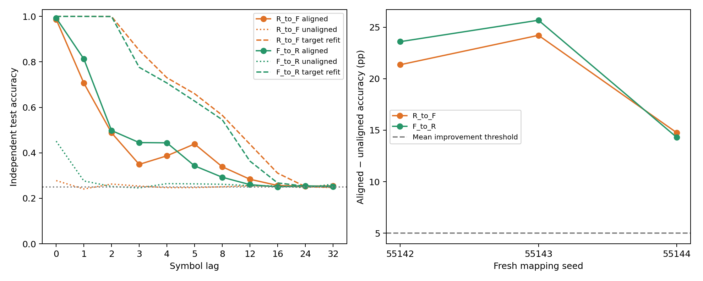

# ACT III: 새로운 paired seeds에서 정렬 효과 확인

**정렬의 이득은 새 seed에서도 재현됐지만 완전한 전이는 실패했다.**
R→F는25.033→45.142%(+20.108%p), F→R는26.061→47.256%(+21.194%p)였다.
새3개 block 모두 개선해 사전 H1을 통과했다. 그러나 조건별 refit80.108%/77.606%
와의 차이가 크고 R²가 음수여서 H2 접근성과 H3 유지 기준은 실패했다.
기존49–53%라는 절대 정확도가 그대로 재현됐다고 표현하지 않는다.

Protocol `2ff9e52`, implementation `312d1b5`.
[Protocol](fresh-alignment-protocol.md) · [seed 사전 audit](fresh-alignment-seed-audit.json).

## 1. Repository audit

기준 `770a2d0`의 AGENTS·연구 방향·handoff·최신 residual diagnostics,
normalization/transfer 코드·config·checkpoint·manifest·최근 commits를 확인했다.
초기 전체 audit는 [연구 상태](research-status.md)에 유지했다.
이전 config/result JSON5333개,291개의 서로 다른 seed 값과 새 후보를 비교해
seed 필드 충돌이0임을 확인한 뒤 등록했다. Audit 범위와 기준 commit도 저장했다.
이번 실행 전부터 존재하던 결과 7,511개 파일 해시가 그대로다.

기존 확인 집단은 이미 관찰된 데이터였다는 한계를 새 pseudorandom cohort로
보완했다. 그래도 biological circuit701/702는 같으므로 새로운 생물 개체나
독립 connectome 표본을 얻은 것은 아니다. 과거 두 residual 가설을 다시 검사하지 않았다.

## 2. Reproduced baseline

새 seed를 생성하기 전에 기존 c701/s34142 R/F의 full train2000/test1000 run을
재실행하여 모든 checkpoint 배열, metric과 neural diagnostics를 정확 재현했다.
기존 smoke c701/s34001 R/F(train200/test100)와 양방향 정렬 전이도 모든 배열이
정확히 일치했다. Source-only refit 검증을 통과한 뒤 새 cohort를 실행했다.
[baseline/smoke 기록](../results/fresh_alignment/baseline-smoke.json).

이전 dependency-lock Windows venv를 재사용했다. 이번에 환경을 새로 만든 것은
아니며, 실제 package/hardware/BLAS 정보는 새 manifest에 기록했다.

## 3. New implementation

`scripts/fresh_alignment.py`는 보존된 `normalization_control.execute`와
`moment_alignment`를 조합하며, 원래 수치 구현을 바꾸지 않는다. 새 graph/state/head
생성, full replay, 양방향 전이, raw 통계·plot·manifest를 담당한다.
`scripts/verify_fresh_alignment.py`는 저장 graph의 정규화 계수, 새 symbol stream·
지연 정답, source-only augmented solver, 전이·null·unaligned 점수, paired 통계와
판정을 별도로 검사한다. 기존 예산/동역학 변경 거부와3block 판정 분리 tests를 추가했다.

각 조건의 source head를 새 데이터로 학습한 뒤 전이 동안 고정한다.
**전체 연구에 새 head 학습은 있지만, 전이 과정의 추가 target-supervised fit은0**이다.
각 조건에서 학습한 동일 head를 반대 방향의 target-refit comparator로 사용했다.
Target 학습 feature의 평균48개·표준편차48개만 adapter에 쓰며, target 정답이나
평가 구간 통계는 adapter에 들어가지 않는다.

## 4. Experiments executed

| mapping seed | train seed | test seed | rewire seed | perturb seed |
| --- | --- | --- | --- | --- |
| 55142 | 56142 | 57142 | 58142 | 59142 |
| 55143 | 56143 | 57143 | 58143 | 59143 |
| 55144 | 56144 | 57144 | 58144 | 59144 |


Circuit701/702, 각각686뉴런·3309/3241edges,threshold5. K4 iid stream,
warmup100 뒤 train2000/test1000,동일48MBON·입력/관측 IDs·입력 패턴.
R=`renormalized` D(B)B, F=`fixed_original` D(A)B, 같은 raw rewired B를 사용한다.
실제 topology 대 random topology의 비교가 아니다.
5swaps/edge,gain.9,leak.6,input_fraction.1,input_amplitude.5,
schedule `mbon_after_kc`,ridge alpha1,ddof0,표준편차 floor1e−5를 유지했다.

3seeds×2circuits×2conditions=12개 새 조건. 각 조건 real11+shifted-null11 heads,
task당48×4+4=196 supervised 계수. 총132real+132null task heads이며 검증 refit은
추가 분석 조건이 아니다. 양방향12개 전이를 비교했다.
Lags0,1,2,3,4,5,8,12,16,24,32. Primary1,2,3,4,5,8을 평균하고 circuit 두 개를
평균해 n3 mapping blocks로 집계했다. 이전5+3개 block과 합쳐 표본을 늘리지 않았다.

학습과 평가 stream은 독립이다. 실제 입력을 계속 공급하며 과거 기호를 읽는
진단이므로 autonomous rollout, Pi Memory Score 또는 unseen π prediction이 아니다.

## 5. Results

### 모든 새 seed block

단위: 정확도%,차이%p. 각 행은2circuits×6primary lags 평균이다.

| 방향 | seed | 무보정 % | 정렬 % | target refit % | 개선 pp | refit 대비 pp | R² |
| --- | --- | --- | --- | --- | --- | --- | --- |
| R→F | 55142 | 25.058 | 46.417 | 78.717 | 21.358 | -32.300 | -2.490 |
| R→F | 55143 | 24.800 | 49.017 | 79.900 | 24.217 | -30.883 | -1.550 |
| R→F | 55144 | 25.242 | 39.992 | 81.708 | 14.750 | -41.717 | -5.703 |
| F→R | 55142 | 25.900 | 49.500 | 76.300 | 23.600 | -26.800 | -1.370 |
| F→R | 55143 | 27.308 | 52.992 | 77.817 | 25.683 | -24.825 | -0.648 |
| F→R | 55144 | 24.975 | 39.275 | 78.700 | 14.300 | -39.425 | -6.068 |


### 요약과 paired 차이

| 방향 | 무보정 평균 % | 정렬 평균 % | refit 평균 % | 정렬 중앙값 % | 정렬 분산 pp² | 정렬 bootstrap95 % |
| --- | --- | --- | --- | --- | --- | --- |
| R→F | 25.033 | 45.142 | 80.108 | 46.417 | 21.5819 | [39.992, 49.017] |
| F→R | 26.061 | 47.256 | 77.606 | 49.500 | 50.8149 | [39.275, 52.992] |


| 방향 | paired 차이 | 평균 pp | 중앙값 pp | 분산 pp² | bootstrap95 pp | paired dz | +/0/− |
| --- | --- | --- | --- | --- | --- | --- | --- |
| R→F | 정렬−무보정 | 20.108 | 21.358 | 23.5763 | [14.750, 24.217] | 4.141 | 3/0/0 |
| R→F | 정렬−target refit | -34.967 | -32.300 | 34.6736 | [-41.717, -30.883] | -5.938 | 0/0/3 |
| F→R | 정렬−무보정 | 21.194 | 23.600 | 36.7351 | [14.300, 25.683] | 3.497 | 3/0/0 |
| F→R | 정렬−target refit | -30.350 | -26.800 | 62.7419 | [-39.425, -24.825] | -3.832 | 0/0/3 |


Bootstrap10000,seed55399. n3의 작은 표본이므로 구간과 dz는 기술통계다.
사전 gate를 p-value로 바꾸지 않았다. 모든 보조 지표의 mean/median/variance/구간도
[summary](../results/fresh_alignment/summary.json)에 보존했다.

### 대조군과 사전 판정

| 방향 | majority % | aligned null % | R² | MSE | H1 개선 | H2 접근 | H3 유지 |
| --- | --- | --- | --- | --- | --- | --- | --- |
| R→F | 24.694 | 22.228 | -3.2476 | 0.7969 | True | False | False |
| F→R | 24.694 | 22.769 | -2.6951 | 0.6933 | True | False | False |


H1은 평균 개선≥5%p 및3/3positive. H2는 두 accuracy control 대비≥5%p를 평균과
모든 block에서 만족하고 평균 R²>0. H3는 refit 대비−5%p 이내를 평균과 모든
block에서 만족하는 기준이다. 정확도 margin은 통과했지만 평균 R² 조건은 실패했다.
회귀 score는 확률이나 confidence가 아니다. 음수 R²와 낮은 seed55144를 보존했다.

### 이전 집단과 분리한 비교

| 집단 | 방향 | n blocks | 정렬 평균 % | 무보정 대비 개선 pp |
| --- | --- | --- | --- | --- |
| main | R→F | 5 | 51.007 | 25.278 |
| main | F→R | 5 | 51.607 | 26.138 |
| confirmation | R→F | 3 | 49.447 | 24.489 |
| confirmation | F→R | 3 | 52.886 | 25.714 |
| fresh_confirmation | R→F | 3 | 45.142 | 20.108 |
| fresh_confirmation | F→R | 3 | 47.256 | 21.194 |


새 정확도는 이전보다 낮다. 반복된 것은 개선의 방향과 등록된 최소효과이며,
절대 정확도 동일성이나 집단 간 통계적 동등성을 확인한 결과가 아니다.



[모든132 transfer-lag raw](../results/fresh_alignment/raw-lag-table.csv) ·
[circuit별 primary raw](../results/fresh_alignment/raw-past-table.csv) ·
[seed blocks](../results/fresh_alignment/seed-blocks.csv) ·
[condition training/test metrics](../results/fresh_alignment/condition-lag-table.csv) ·
[neural/engineering 진단](../results/fresh_alignment/neural-diagnostics.csv).

## 6. Interpretation

단순 평균·크기 보정의 부분적인 이득은 이미 본 seed에만 국한되지 않았다.
하지만 그것만으로 다른 정규화 조건의 head를 성공적으로 이식할 수는 없었다.
같은 목표 상태에 맞춰 학습한 head는 약78–80%를 유지하므로 전이 실패를
목표 state의 과거 정보 소실과 동일시할 수 없다.

정규화 개입은 상태 좌표와 decoder 의존성을 함께 바꾼다. 향후 neuron ablation도
고정 head 실패를 곧바로 표현 소실로 해석하지 않도록 frozen/refit 질문을 분리해야 한다.
이 연구가 normalization의 모든 실패 메커니즘을 밝혔다는 뜻은 아니다.

## 7. Negative findings

R→F target refit 대비−34.967%p, F→R−30.350%p이며5%p 유지 기준에 실패했다.
양방향 평균 R²도 음수다. Seed55144는 정렬 후에도 약39–40%로 상대적으로 낮았다.
Gain,cutoff,head architecture를 바꾸거나 좋은 seed만 골라 보고하지 않았다.
과거 실제 배선/전체망 우위 부정 결과와 두 residual 진단의 부정 결과도 그대로다.

## 8. What we can claim

실제 초파리 connectome 구조를 사용하는 계산 모델에서 파생된 이 재배선 대조의
R/F 조건 사이에서는, train-only label-free 평균·표준편차 정렬이 무보정 고정 head
전이보다 정확도를 높이는 효과가 사전 등록된 새로운3개 paired seed에서도 재현됐다.
이 주장은 두 고정 biological graph strata와 이번 학습·평가 조건에 한정한다.

## 9. What we cannot claim

완전 전이,자율 회상 향상,formal memory capacity,actual topology/whole-brain 우위,
내부 연결 학습 또는 살아 있는 초파리의 기억을 입증하지 않았다. n3로 광범위한
일반화나 안정성을 보증하지 않는다. 새 seed를 새 생물 개체로 취급하지 않는다.
정렬 결과를 정답을 전혀 사용하지 않은 전체 학습이라고 부를 수 없다. Source head는
정답으로 학습했고, label-free인 부분은 target moment adapter다.

## 10. Reproducibility

12개 조건 full replay·독립 refit,12개 전이 exact replay·독립 source solver를
통과했다. 별도 verifier가12graphs/132 transfer-lag 행과 새 stream·labels·
정규화·통계·gate를 확인했다. 전체 테스트194 passed,8 optional dependency skips.
실행 32.65초,50ms sampled peak RSS
166.32MiB; 실제 peak 상한은 아니다.
Python3.12.10,NumPy2.3.5,SciPy1.17.0,pandas2.2.3,threadpoolctl3.6.0,
numerical BLAS1thread. 별도 verifier 함수 밖의 snapshot에는 기본12thread가 보일 수 있다.

[Config](../configs/fresh_alignment.json) · [Manifest](../results/fresh_alignment/manifest.json) ·
[검증](../results/fresh_alignment_validation/checks.json) · [의존성 lock](../requirements-act1-lock.txt).
조건별 checkpoint에는 raw graph/normalized weights,전체 train/test features·symbols,
real/null heads와 neural diagnostics를 보존했다. 전이 checkpoint에는 고정 source
계수,target train moments,unaligned/aligned/null/refit scores·predictions·labels를 보존했다.

저장소 루트의 locked venv에서 새 경로로 실행한다:

```powershell
$env:PYTHONPATH='src'
.venv/Scripts/python.exe scripts/fresh_alignment.py --out outputs/fresh_alignment_new
.venv/Scripts/python.exe scripts/verify_fresh_alignment.py outputs/fresh_alignment_new --out outputs/fresh_alignment_check_new
```

## 11. Next highest-information experiment

**KCγ 집단 제거를 같은 수·차수·입력 노출의 무작위 KC 제거와 비교하는 refit-only
실험** 하나를 선택한다. 관측 MBON48개와 readout 크기는 유지하고, 연결 제거 후
정규화 계수는 고정해 재정규화 효과를 섞지 않는다. 각 조건의 학습 상태로 readout을
다시 학습한 뒤 독립 평가 stream에서 남은 과거 정보의 해독을 비교한다.
이는 고정 decoder의 좌표 변화 취약성이 아니라 제거 후 다시 해독할 수 있는
정보에 대한 질문이다. Frozen-head ablation과 섞지 않는다. Exact annotation
선택·matching·seed·판정은 별도 protocol에서 먼저 고정한다. 아직 실행하지 않았다.
