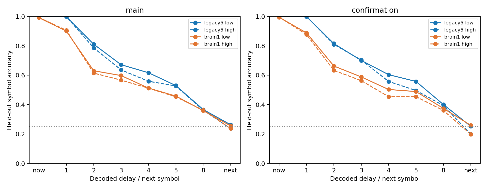

# Frozen-state blocked decoding — ACT II results

All four graph/arm conditions pass the past-access criteria in both archived
seed cohorts. Neither graph establishes the registered low-minus-high next-symbol
advantage. This separates past-symbol accessibility from decoding continuation;
it is not autonomous recall or formal memory capacity.

Protocol0b86a86 preceded new probe outcomes; implementation c01bc24.
[Protocol](frozen-state-probe-protocol.md) · [Config](../configs/frozen_state_probe.json).

## 1. Repository audit

Reuse64 immutable48-MBON teacher-forced trajectories from the fixed-K study,
40 main and24 confirmation; exclude smoke. All5,553 earlier result files
are unchanged. Feature row t follows input s[t]; target s[t+1] is a separate
next-symbol task. Source manifest and checkpoint hashes are recorded.

## 2. Reproduced baseline

Existing independent-stream delayed-symbol ridge baseline legacy5/c701/s14142
exactly refits coefficients, scaling, intercepts and test scores.
[Record](../results/frozen_state_probe/baseline.json). This is compatibility
validation, not a new baseline cohort or a repeat of neural dynamics.

## 3. New implementation

`scripts/frozen_state_probe.py` aligns current/past/next targets, uses purged
blocked folds and fits the unchanged RidgeDecoder(alpha1). Every real and shifted
head is refit and replayed exactly; an independent augmented least-squares solver
agrees to1e-9 and gives identical class predictions. Tests cover alignment,
nonoverlapping raw-symbol windows, train-only statistics, known delayed input
and correct aggregation of unequal test folds.

## 4. Experiments executed

K4, states at t8..126,119 positions, lags0/1/2/3/4/5/8 and next(t+1).
Three contiguous held-out blocks of40/40/39 positions with purge9; training sizes
70/61/71. Affine196-coefficient head per task, alpha1,uniform training weights,
train-only scaling floor1e-5.192 folds:1536 real and1536 circular-shift task heads,
implemented as384 multi-output solves. Training-frequency and shifted controls
are independently evaluated. No graph simulation or recall-head refit.

## 5. Results

Accuracy proportions; past is the mean of lags1/2/3/4/5/8:

| Cohort | Graph | Arm | Past accuracy | Current accuracy | Next accuracy | Past frequency excess | Past null excess | Past R2 |
| --- | --- | --- | --- | --- | --- | --- | --- | --- |
| main | legacy5 | low | 0.6655 | 1.0 | 0.263 | 0.4543 | 0.4489 | 0.375 |
| main | legacy5 | high | 0.6448 | 1.0 | 0.237 | 0.4445 | 0.4354 | 0.3663 |
| main | brain1 | low | 0.5762 | 0.9916 | 0.2555 | 0.365 | 0.3602 | 0.1878 |
| main | brain1 | high | 0.5689 | 0.9924 | 0.237 | 0.3686 | 0.3602 | 0.1791 |
| confirmation | legacy5 | low | 0.6793 | 1.0 | 0.2521 | 0.5014 | 0.4617 | 0.4085 |
| confirmation | legacy5 | high | 0.6599 | 1.0 | 0.1989 | 0.4657 | 0.444 | 0.3811 |
| confirmation | brain1 | low | 0.584 | 0.9944 | 0.2591 | 0.4062 | 0.3658 | 0.2082 |
| confirmation | brain1 | high | 0.5567 | 0.9958 | 0.1975 | 0.3625 | 0.3301 | 0.1752 |




The past-access rule requires >=0.05 excess over both controls in cohort mean
and at least4/5 main blocks or all3 confirmation blocks, plus positive mean R2.
All four conditions pass. Next low-minus-high requires mean>=0.05 and4/5 positive
main blocks, then mean>=0.05 and all3 positive confirmation blocks. Neither
graph passes across cohorts. No post-outcome changes to lags/splits/regularization.

| Cohort | Graph | Next low−high | Median | Variance | 95% interval | paired dz | W/T/L |
| --- | --- | --- | --- | --- | --- | --- | --- |
| main | legacy5 | 0.02605 | 0.05462 | 0.002166 | [-0.01513, 0.05798] | 0.56 | 4/0/1 |
| main | brain1 | 0.01849 | 0.01681 | 0.001259 | [-0.01092, 0.04454] | 0.521 | 4/0/1 |
| confirmation | legacy5 | 0.05322 | 0.05462 | 0.005408 | [-0.02101, 0.12605] | 0.724 | 2/0/1 |
| confirmation | brain1 | 0.06162 | 0.07983 | 0.006962 | [-0.02941, 0.13445] | 0.739 | 2/0/1 |


Per-seed block results (input strata701/702 averaged; all raw64 trajectory
aggregates and512 task rows remain in linked CSVs):

| Cohort | Graph | Arm | Seed | Past | Current | Next |
| --- | --- | --- | --- | --- | --- | --- |
| confirmation | brain1 | high | 29142 | 0.598 | 0.9958 | 0.1933 |
| confirmation | brain1 | high | 29143 | 0.5098 | 0.9958 | 0.2101 |
| confirmation | brain1 | high | 29144 | 0.5623 | 0.9958 | 0.1891 |
| confirmation | brain1 | low | 29142 | 0.6317 | 1.0 | 0.2731 |
| confirmation | brain1 | low | 29143 | 0.5294 | 0.9916 | 0.1807 |
| confirmation | brain1 | low | 29144 | 0.591 | 0.9916 | 0.3235 |
| confirmation | legacy5 | high | 29142 | 0.6709 | 1.0 | 0.2185 |
| confirmation | legacy5 | high | 29143 | 0.6303 | 1.0 | 0.1891 |
| confirmation | legacy5 | high | 29144 | 0.6786 | 1.0 | 0.1891 |
| confirmation | legacy5 | low | 29142 | 0.7122 | 1.0 | 0.2731 |
| confirmation | legacy5 | low | 29143 | 0.6569 | 1.0 | 0.1681 |
| confirmation | legacy5 | low | 29144 | 0.6688 | 1.0 | 0.3151 |
| main | brain1 | high | 27142 | 0.577 | 0.9958 | 0.2269 |
| main | brain1 | high | 27143 | 0.556 | 0.9916 | 0.2269 |
| main | brain1 | high | 27144 | 0.5805 | 1.0 | 0.2437 |
| main | brain1 | high | 27145 | 0.5847 | 0.9874 | 0.2143 |
| main | brain1 | high | 27146 | 0.5462 | 0.9874 | 0.2731 |
| main | brain1 | low | 27142 | 0.6134 | 1.0 | 0.2437 |
| main | brain1 | low | 27143 | 0.5273 | 0.9874 | 0.2689 |
| main | brain1 | low | 27144 | 0.5959 | 0.9874 | 0.2983 |
| main | brain1 | low | 27145 | 0.5938 | 0.9874 | 0.2311 |
| main | brain1 | low | 27146 | 0.5504 | 0.9958 | 0.2353 |
| main | legacy5 | high | 27142 | 0.6548 | 1.0 | 0.2563 |
| main | legacy5 | high | 27143 | 0.6275 | 1.0 | 0.2185 |
| main | legacy5 | high | 27144 | 0.6674 | 1.0 | 0.2647 |
| main | legacy5 | high | 27145 | 0.6541 | 1.0 | 0.1933 |
| main | legacy5 | high | 27146 | 0.6204 | 1.0 | 0.2521 |
| main | legacy5 | low | 27142 | 0.6849 | 1.0 | 0.2605 |
| main | legacy5 | low | 27143 | 0.6492 | 1.0 | 0.2773 |
| main | legacy5 | low | 27144 | 0.6884 | 1.0 | 0.3193 |
| main | legacy5 | low | 27145 | 0.6758 | 1.0 | 0.2521 |
| main | legacy5 | low | 27146 | 0.6296 | 1.0 | 0.2059 |


[Raw task table](../results/frozen_state_probe/raw-task-table.csv) ·
[Raw trajectory aggregates](../results/frozen_state_probe/raw-aggregate-table.csv) ·
[All statistics](../results/frozen_state_probe/summary.json).
Intervals:10,000 seed-block bootstraps,RNG32399; only5/3 blocks, no p-value claims.

## 6. Interpretation

Past symbols remain accessible to this linear decoder even where autonomous
recall is fragile. Next-symbol decoding is a different target and remains near
the nominal25% reference on average; chance is not the sole statistical control.
These results do not diagnose why the old nonlinear recall head fails or prove
all information is linearly represented. Head capacity, target and training
procedure differ from that head. Graph differences here are descriptive.

## 7. Negative findings

Next-symbol advantage fails the joint rule in both graphs. Confirmation next
differences are positive in only2/3 blocks each. Mean next accuracy can be below
25% (e.g. high condition), and all negative R2 values remain saved. A finite
circular-shift control is not guaranteed to be at chance; compare measured controls.

## 8. What we can claim

In these computational models using actual Drosophila connectome structure,
an affine decoder reads past symbols above registered controls across blocked
positions in all four graph/arm conditions. Only external probes are fitted.

## 9. What we cannot claim

No independent-stream generalization is tested here. Test and training blocks
share one recurrent trajectory; purge9 removes overlapping explicit symbol
windows, not all possible long-lived state dependence. Later training positions
are allowed, so this is not forward forecasting. No formal memory capacity,
unique biological mechanism, living-fly learning or learned recurrent connections.

## 10. Reproducibility

All192 folds pass exact saved-coefficient replay/refit and independent solver
checks. Targeted tests3 passed. Runtime12.93s, sampled peak
RSS144.8MiB. Full environment, source/protocol/config/input
hashes, split indices, scores, labels and checkpoints are in the
[manifest](../results/frozen_state_probe/manifest.json) and
[verification](../results/frozen_state_probe/verification.json).

```powershell
$env:PYTHONPATH = 'src'
python -m pip install -r requirements-act1-lock.txt
python scripts/frozen_state_probe.py --out outputs/frozen_probe_new
```

Use a fresh directory. Reuse the pinned source checkpoints; no graph cache is needed.

## 11. Next highest-information experiment

**Frozen cross-arm probe transfer with the same fold training budget.** Reuse
each fitted source-arm head unchanged and evaluate the opposite saved sequence
at the same held-out indices. Compare transferred scores to the same head's
within-source scores and null controls. Lock a separate protocol before results.
This tests portability of the decoded representation across these paired
orderings; it does not test arbitrary independent sequences. It has not run at
the time this report is committed. Engineering verification passed, so the
user-authorized second study can proceed. Current position remains ACT II.
