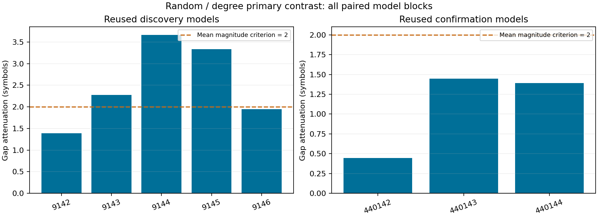
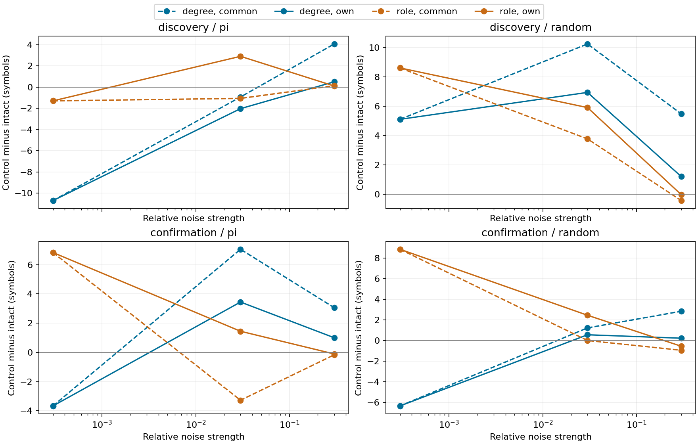

# Graph별 신호 규모에 맞춘 관측 잡음 비교

**사전 random/degree joint 기준: 실패.** 이전 모델을 재사용한 새 잡음 비교이며,
새 모델 집단을 생성하거나 원래 연결망 우위를 목표로 한 연구가 아니다.

## 1. Repository audit

[이전 구조 결과](structure-noise-results.md)는 intact가 role 대조보다 우수하다는 기준에 실패했다.
당시 degree의 own/common 신호 규모 비율 중앙값2.596은 사후 진단이었다.
이번에는 그 진단에서 출발한 [새 protocol](graph-relative-noise-protocol.md)을 결과 전에 등록했다.
원래 연구의 gate·결과·문서·checkpoint는 수정하지 않았다. 기존 문서의 ‘미실행’ 표시는
봉인 당시 상태이며, 현재 상태 문서에서 이번 완료로 연결한다.

## 2. Reproduced baseline

96개 부모 모델의 clean 자율 출력·확률·MBON 관측값·활성 수·상태 norm을 정확히 재현했다.
96개 teacher 경로도 독립 수식으로 다시 계산했다. 아래 기대값(부모)과 실제값이 동일하다.
기존 Python 격리 환경을 재사용했고 새 환경 설치나 새 readout fit을 주장하지 않는다.

| 집단 | 수열 | graph | clean prefix |
| --- | --- | --- | --- |
| confirmation | pi | degree | 30.667 |
| confirmation | pi | intact | 34.333 |
| confirmation | pi | role | 41.167 |
| confirmation | random | degree | 24.833 |
| confirmation | random | intact | 31.167 |
| confirmation | random | role | 40.000 |
| discovery | pi | degree | 23.800 |
| discovery | pi | intact | 34.500 |
| discovery | pi | role | 33.200 |
| discovery | random | degree | 31.100 |
| discovery | random | intact | 26.000 |
| discovery | random | role | 34.600 |

## 3. New implementation

[실행기](../scripts/graph_relative_noise.py), [독립 검증기](../scripts/verify_graph_relative_noise.py),
[분석기](../scripts/analyze_graph_relative_noise.py), [종료 감사](../scripts/audit_graph_relative_noise.py)를 추가했다.
기존 numerical source를 변경하지 않고 checkpoint와 저장 graph를 참조한다.
실제 자율 함수에는 정답 target을 전달하지 않는다. 관련 26개 테스트가 통과했다.
설정은 [config](../configs/graph_relative_noise.json)에 고정했다.

## 4. Experiments executed

Pi/random × intact/degree/role × circuits701/702 × 기존8개 모델/수열 block =96모델.
발견 집단9142–9146/data9242–9246(n5), 기존 확인 집단440142–440144/data440242–440244(n3)을 따로 분석했다.
두 집단 모두 이번에는 재사용 모델이며 새로운 독립 모델 확인이 아니다.
686뉴런, 연결3309/3241, threshold5; 같은 입력과48 MBON,482개 readout 파라미터.
길이200/prompt314/평가197/K10. 부모 학습은2000 Adam updates, LR.03, L2=1e-5,
fixed32×4; gain.9/leak.6/mbon_after_kc. 이번 업데이트 수0, 새 fit0.

학습 관측 SD를 s, 중앙값을 q, 배분 벡터를 s/RMS(s)로 둔다.
common은 paired intact의 q, own은 각 graph의 q를 쓴다. SD 배분은 양쪽에서 동일하다.
새 잡음488001–488003, 강도.0003/.03/.3. PCG64의 canonical root-ID 잡음을 모든 조건에서 짝지었다.
기대 raw 에너지는48(rq)²이며 own은 graph마다 에너지가 달라진다.
관측값에만 더한 후[-1,1]로 자르고, 생성 기호를 다음 입력으로 사용한다.
원래 신경 상태에 잡음 값을 직접 덮어쓰지 않는다.

본 실험1824개 실제 경로와1824개 독립 전체 재실행,1728개 teacher first-error certificate를 저장했다.
1728개 중288개 intact-own은 common과 정확히 같은 노출이다. 서로 다른 새 잡음 조건은1440개,
clean 부모 반복은96개다. 독립 graph 표본이나 모델 수로 늘려 세지 않는다.
Smoke는 별도 잡음488901–488903, horizon8,3모델/57경로이며 본 통계에서 제외했다.

## 5. Results

Gap=대조−intact, 감소량=common gap−own gap. 양수는 보정 후 대조의 상대 점수가 낮아졌다는 뜻이다.
먼저 각 모델 seed 안에서2circuit×3noise×3강도=18개 관측을 평균했다.
유지율은 min(prefix/자기 graph의 clean prefix,1)이다. clean0은 정의 불가로 전파한다.

| 기존 모델 집단 | seed | common gap | own gap | prefix 감소량 | 유지율 감소량 %p |
| --- | --- | --- | --- | --- | --- |
| confirmation | 440142 | 0.944 | 0.500 | 0.444 | 1.357 |
| confirmation | 440143 | -10.944 | -12.389 | 1.444 | 11.547 |
| confirmation | 440144 | 7.722 | 6.333 | 1.389 | 4.340 |
| discovery | 9142 | 3.222 | 1.833 | 1.389 | 4.013 |
| discovery | 9143 | 10.333 | 8.056 | 2.278 | 5.917 |
| discovery | 9144 | 10.667 | 7.000 | 3.667 | 12.459 |
| discovery | 9145 | 3.889 | 0.556 | 3.333 | 11.594 |
| discovery | 9146 | 6.556 | 4.611 | 1.944 | 5.128 |

| 집단 | gap 감소 지표 | mean | median | variance | bootstrap95 | dz | +/0/− | joint gate |
| --- | --- | --- | --- | --- | --- | --- | --- | --- |
| discovery | prefix 기호 | 2.522 | 2.278 | 0.91142 | 1.789/3.256 | 2.642 | 5/0/0 | False |
| discovery | 유지율 %p | 7.822 | 5.917 | 0.00152811 | 4.840/10.820 | 2.001 | 5/0/0 | False |
| confirmation | prefix 기호 | 1.093 | 1.389 | 0.315844 | 0.444/1.444 | 1.944 | 3/0/0 | False |
| confirmation | 유지율 %p | 5.748 | 4.340 | 0.00274431 | 1.357/11.547 | 1.097 | 3/0/0 | False |

유지율 분산은 비율 제곱 단위다. Bootstrap은 모델 block10000회이며 n5/n3를 합치지 않았다.
CI·dz는 이 작은 재사용 모델 패널의 기술 통계이며 모집단 일반성이나 p-value 성공 판정이 아니다.
다음은 보조 조건이다. 이 gate들은 primary를 대체하지 않으며 여러 조건에서 성공을 고르는 데 쓰지 않았다.

| 보조 조건 | prefix 감소량 | 유지율 감소량 %p | 기술적 gate |
| --- | --- | --- | --- |
| confirmation/pi/degree | 1.889 | 5.199 | False |
| confirmation/pi/role | -1.593 | -3.362 | False |
| confirmation/random/role | -0.944 | -2.139 | False |
| discovery/pi/degree | 1.556 | 정의 불가 | None |
| discovery/pi/role | -1.311 | -3.318 | False |
| discovery/random/role | -0.844 | -2.337 | False |

[전체 seed 차이](../results/graph_relative_noise/paired-differences.csv),
[모든 실제 실행 행](../results/graph_relative_noise/raw-rollouts.csv),
[강도별 seed 표](../results/graph_relative_noise/dose-seed-table.csv),
[통계 JSON](../results/graph_relative_noise/summary.json)을 함께 보존했다.





## 6. Interpretation

Random/degree의 gap 감소 방향은 두 집단의 모든 seed(5/5,3/3)에서 같았다.
그러나 크기는 발견 집단 prefix2.522기호/유지율7.822%p, 기존 확인 집단1.093기호/5.748%p였다.
사전 기준은 각각 평균2기호와10%p를 **모두** 요구했다. 발견 집단은 유지율 기준을,
기존 확인 집단은 두 크기 기준을 모두 충족하지 못했으므로 primary는 실패다.
방향이 일관된 작은 효과와 사전 joint 가설의 실패를 함께 보고한다.

발견 집단의 degree−intact prefix gap은6.933→4.411기호로 줄었지만 모든 seed에서
degree가 여전히 높았다. 기존 확인 집단의 평균 gap은−.759→−1.852기호였다.
이 집단은 **새 잡음에서 보정 전부터 degree의 평균 절대 prefix 우위가 없었으므로**,
보정이 그 우위를 제거했다고 설명할 수 없다. 개별 seed의 큰 편차도 원자료에 남겼다.
자기 clean을 분모로 둔 유지율에서는 degree−intact가 두 집단 모두 양수 평균으로 남았다.
절대 회상 길이와 자기 clean 대비 비율은 서로 다른 질문이다.

Common은 기대 raw 에너지를 맞춘 대조이고 own은 각 망의 SD 중앙값에 비례한 대조다.
두 조건은 서로 다른 잡음 개입이다. 관측 신호의 모든 통계나 readout의 경계까지 같게 만든 것은 아니다.
특히 own에서도 좌표 SD 대비 진폭은 r·median(s)/RMS(s)로 graph마다 달라질 수 있다.
따라서 특정 q 보정의 효과를 ‘순수 배선 효과를 완전히 분리했다’고 해석하지 않는다.

## 7. Negative findings

등록한 primary joint 기준은 두 기존 모델 집단 모두 실패했다. 신호 규모 보정으로
원래 망의 일관된 우위가 나타나지 않았고, 발견 집단의 degree 우위도 사라지지 않았다.
Role 대조는 own q가 대체로 더 작아져 평균 prefix gap이 반대로 커졌다.
따라서 하나의 신호 크기 보정만으로 모든 재배선 결과를 설명하거나 원래 배선 우위를
복원할 수 없었다. Pi/degree 발견 집단은 아래 clean0 때문에 joint 판정 불가다.

기존 pi/degree seed9143/circuit702의 clean prefix0을 유지했다. 해당 발견집단 유지율은
정의 불가이며 seed를 버리거나 작은 분모로 바꾸지 않았다. 전체망 우위와 내부 학습에 관한
이전 실패를 이번 결과로 뒤집지 않았다. 보정·seed·head 선택을 추가 탐색하지 않았다.

## 8. What we can claim

동일한 기존 모델·head·잡음 draw에서 q만 바꾸면 자율 prefix 차이가 변했다.
Random/degree에서는 모든 기존 model block에서 양의 gap 감소를 관찰했지만,
평균 효과는 사전 joint 기준에 부족했다. 따라서 관측 잡음의 스케일 선택이 구조 비교의
수치에 영향을 준다는 제한된 결과를 지지한다. 이 결과는 원래 배선의 우월성을 지지하지 않는다.

모든 주장은 **실제 초파리 connectome 구조를 사용한 계산 모델**의 부분망 rate dynamics와
지정 readout·수열·합성 관측 잡음 조건에 한정한다. 표현과 해독의 연구이며 내부 학습의 결과가 아니다.

## 9. What we cannot claim

실제 동물의 기억, 전체망의 우위, 생리학적 잡음 강건성, 내부 연결의 경험 기반 학습,
unseen prediction, Shannon/formal memory capacity를 주장할 수 없다.
Graph별로 학습된 head와 SD 분포가 함께 달라지므로 topology만의 원인을 식별하지 못한다.
재배선 graph는32개 draw를 두 수열에 재사용했고 signed degree/incoming weight 등 많은 특성을 보존했다.
같은 connectome에서 나온 두 circuit이며 균일 random graph 모집단도 아니다.

## 10. Reproducibility

사전 commit `a26ad9e810821b330410fc58c16d71dd34f9bb0b`. Main manifest SHA256 `f73ed240c0625740e8d87b51e14b6471ea056aa7486653019f31bbd34e768f3a`.
[Manifest](../results/graph_relative_noise/manifest.json), [독립 검증](../results/graph_relative_noise_validation/checks.json),
[종료 감사](../results/graph_relative_noise_closeout/audit.json).
Checkpoint는 각 case.json의 checkpoint_path/SHA256으로 부모96개 파일을 참조한다.
새 checkpoint를 학습하지 않았고 기존 graph·head는 frozen hash 검사를 통과했다.
64개 control graph/task의 보존량·정규화를 독립 감사했다(32개 고유 graph draw).

| 작업 | 초 | 최대 sampled RSS MiB |
| --- | --- | --- |
| 실행 | 275.784 | 165.602 |
| 독립 검증 | 178.750 | 195.152 |

위 시간에는 과거 결과 전체 해시 검사도 포함된다. 최대 sampled RSS는50ms 간격의 해당
단일 process 측정값으로 순간 절대 peak를 보장하지 않는다. 기존 파일29256개가 동일했다.
독립 비교 최대 연속값 오차4.87e-14; 생성 기호와 clean 부모 재현은 정확히 같았다.
Windows11/Python3.12.10/NumPy2.3.5/SciPy1.17.0/pandas2.2.3/OpenBLAS0.3.30,
단일 process·단일 수치 thread. 전체 환경은 verification.json에 저장했다.

저장소 root에서 잠긴 의존성과 기존 부모 artifacts/cache를 준비하고 새로운 경로로 실행한다.

```powershell
$env:PYTHONPATH = 'src'
.\.venv\Scripts\python.exe scripts/graph_relative_noise.py --out outputs/calibration_smoke_new --smoke
.\.venv\Scripts\python.exe scripts/verify_graph_relative_noise.py outputs/calibration_smoke_new --out outputs/calibration_smoke_new_validation
.\.venv\Scripts\python.exe scripts/graph_relative_noise.py --out outputs/calibration_main_new
.\.venv\Scripts\python.exe scripts/verify_graph_relative_noise.py outputs/calibration_main_new --out outputs/calibration_main_new_validation
.\.venv\Scripts\python.exe scripts/analyze_graph_relative_noise.py outputs/calibration_main_new --validation outputs/calibration_main_new_validation --out outputs/calibration_analysis_new
```

의존성 파일은 [requirements-act1-lock.txt](../requirements-act1-lock.txt).
실제 실행은 같은 환경의 `../venv-act1/Scripts/python.exe`와
`results/graph_relative_noise_smoke`, `results/graph_relative_noise`, 각각의 `_validation` 경로를 썼다.
이미 존재하는 출력 경로는 실행기가 거부한다. 종료 감사/통계/PNG도 별도 manifest로 봉인했다.

## 11. Next highest-information experiment

**각 관측 좌표의 SD에 직접 비례한 잡음 대조 한 가지**를 제안한다.
기존 모델을 고정하고 delta_i=r·s_i·z_i로 두면, 현재 own 조건에 남은
median(s)/RMS(s) 계수를 제거해 좌표별 학습 SD 대비 잡음 진폭을 맞출 수 있다.
이는 더 좋은 회상을 찾는 강도 조절이 아니라 잡음 단위를 명시적으로 맞추는 통제다.
같은 등록 강도·paired model 설계와 새 잡음을 다음 protocol에서 고정하고, 원래 망이 이기는지와
무관하게 공통 raw 에너지/중앙값 보정/좌표 SD 보정의 차이를 보고하는 것이 다음 정보가치가 높다.
단, readout 경계·상관 구조까지 같아지는 것은 아니다. **제안만 했으며 등록·실행하지 않았다.**
