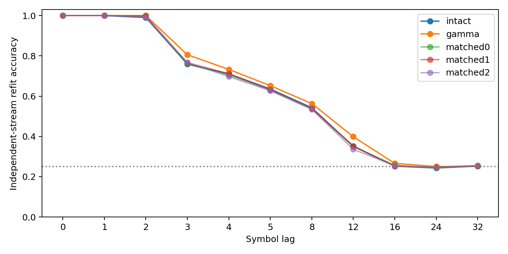
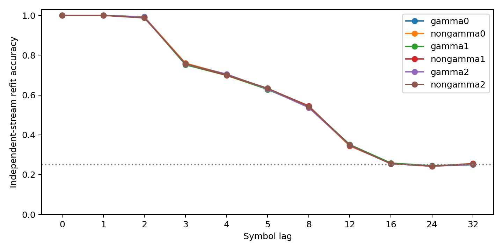

# ACT III-A: KCγ 집단 제거와 비중복 대조

**두 사전등록 비교 모두 KCγ 특이적 성능 저하를 지지하지 않았다.**
전체 집단 제거 후 정확도는 무제거77.303%, KCγ79.219%, matched77.156%였다.
비중복 부분집합 비교는 KCγ76.957%, 비KCγ77.072%로 차이가 작고 방향도
seed마다 달랐다. 실제 초파리 connectome 구조를 사용한 계산 모델의
독립 입력 stream 과거 기호 해독 결과다. π 자율 회상 실험이 아니다.

현재 위치: **ACT III-A 첫 집단 제거 및 후속 대조 완료**. ACT III 전체나
memory-critical subnetwork 식별이 끝난 것은 아니며 ACT IV의 새로운 내부 학습 확장은 시작하지 않았다.
첫 protocol `d21c35c`, 구현 `307bc11`, 검증기 수정 `4e83886`;
후속 protocol/첫 결과 보존 `ecf9525`, 후속 구현 `886cfd3`.

## 1. Repository audit

기준 `e68fa4a`에서 AGENTS, README, 연구 방향·현황·로드맵·handoff,
최신 정렬 결과, configs, 실험 scripts, src의 역학·readout, tests,
results의 manifests/checkpoints 및 최근 commits를 확인했다.
초기 전체 inventory와 실패·superseded 연구는 [연구 현황](research-status.md)에 유지한다.
당시 다음 작업이던 KCγ 제거가 아직 실행되지 않았음을 artifact로 확인했다.

annotation의 `role=KC`이고 `cell_type`이 `KCg`로 시작하는 항목을 KCγ로
정의했다. c701은254개(m225,d27,s2/s3각1), c702는226개(m193,d33).
각 회로는686뉴런·512KC·48MBON, threshold5, edges3309/3241이다.
모든 입력 기호별 노출 bitmask와 원래 in/out degree를 정확히 맞출 수 있었지만
전체 KC 집단에서 뽑는 대조의 실제 KCγ 중복률은61.9–72.0%(평균65.7%)였다.
대조가 비KCγ로만 이루어졌다는 잘못된 해석을 막기 위해 이를 별도 보고했다.
연결 강도와 실제 제거된 edge 수는 맞추지 않았으며 raw audit에 보존했다.

첫 검증기의 read-only input bank 수정 오류는 `.copy()`로 고쳤다.
실험 수치·seed·기준·checkpoint는 변경하거나 재선택하지 않았다.
실행 manifest는 당시 구현 hash를, 검증 결과는 수정 검증기 hash를 보존한다.
후속까지 기존 결과 7,908개 파일이 변경되지 않았다.

## 2. Reproduced baseline

`results/structural_k4_main/real_c701_s34142` 전체 checkpoint 배열과 모든
기록 지표를 정확히 재현했다. Primary lag 평균 정확도는 expected=actual
**75.4833%**였다. seed34142,circuit701,K4,train2000/test1000의 기존 real graph다.
두 새 runner 모두 baseline을 먼저 확인했다. [expected/actual 기록](../results/kc_ablation/baseline.json).
기존 의존성 고정 환경을 재사용했다. 이번 turn에 새 clean environment를
설치한 재현이라고 주장하지 않는다.

## 3. New implementation

`kc_ablation.py`: annotation 선택, exact joint matching, 제거 행·열·입력0,
남은 가중치 유지, 매 step 제거 상태0 확인, 조건별 refit/전체 replay.
`kc_exclusive.py`: 저장된 G/M에서 G\M과 M\G를 구성하며 공통 부분은 양쪽 모두
활성으로 유지한다. 차수·입력 histogram 동일, 집합 중복0, annotation 분리 확인.
`verify_kc_ablation.py`, `verify_kc_exclusive.py`: 원시 데이터에서 mask 재구성,
dense 계산으로 정규화·제거 확인, independent augmented least-squares,
stream/labels/집계/판정 검증. `audit_kc_metrics.py`는 별도 수식으로 모든 지표와
CSV·cell 통계를 다시 계산한다. 기존 수치 엔진과 과거 결과는 보존했다.

## 4. Experiments executed

| 조건 | 전체 집단 | 비중복 부분집합 |
|---|---|---|
| Main | 3paired seeds×2circuits×5조건=30 | 3seeds×2circuits×3pairs×2조건=36 |
| Smoke | 별도1seed,5조건 | 별도1seed,6조건 |
| 제거 | 전체 KCγ254/226 또는 같은 수 matched KC | 기존 G\M vs M\G,쌍별71–93뉴런 |
| 대조 겹침 | 61.9–72.0% | 0% |
| 독립 확인 | 사전등록 main | 같은 seed의 탐색적 후속,독립 확인 아님 |

mapping61142–61144,train62142–62144,test63142–63144; matched draws64142–64150.
Smoke mapping61001,train62001,test63001,draws64001–64003.
K4 uniform pseudo-random streams,train2000/test1000,warmup100; smoke200/100.
input fraction.1,amplitude.5,gain.9,leak.6,mbon_after_kc.
제거 전에 incoming-L1 정규화하고 이후 재정규화하지 않았다. 48MBON 관측 고정.
각 조건의 train만 사용한 표준화(std floor1e−5) 및 alpha1 ridge refit,
lag당196계수. 실제 label과 half-train cyclic shifted null을 별도 학습했다.
전체 lags0,1,2,3,4,5,8,12,16,24,32; primary1,2,3,4,5,8.
사전 판정은 대조−KCγ>=5%p 평균,3block 모두 양수,무제거 접근성 통과다.
Smoke를 main이나 표본 수에 합치지 않았다.

## 5. Results

아래는 primary lags와 두 circuit을 평균한 각 paired mapping block이다.
matched는 지정한3개 mask 평균이며 원래 값은 아래 개별표/CSV에 모두 보존했다.
정확도는 %, Δ는 대조−KCγ %p다.

| seed | 무제거 | 전체 KCγ | 전체 matched | 전체 Δ | 부분 KCγ | 부분 비KCγ | 부분 Δ |
| --- | --- | --- | --- | --- | --- | --- | --- |
| 61142 | 77.200 | 79.025 | 76.778 | -2.247 | 76.931 | 76.736 | -0.194 |
| 61143 | 76.125 | 78.333 | 75.697 | -2.636 | 76.053 | 76.019 | -0.033 |
| 61144 | 78.583 | 80.300 | 78.992 | -1.308 | 77.889 | 78.461 | 0.572 |


| 연구 | 조건 | n | 평균 % | 중앙값 % | 분산 (%p)² | bootstrap95 % | R² 평균 |
| --- | --- | --- | --- | --- | --- | --- | --- |
| 전체 집단 | gamma | 3 | 79.219 | 79.025 | 0.9953 | [78.333, 80.300] | 0.5790 |
| 전체 집단 | intact | 3 | 77.303 | 77.200 | 1.5188 | [76.125, 78.583] | 0.5439 |
| 전체 집단 | matched_mean | 3 | 77.156 | 76.778 | 2.8204 | [75.697, 78.992] | 0.5486 |
| 비중복 부분집합 | gamma | 3 | 76.957 | 76.931 | 0.8434 | [76.053, 77.889] | 0.5398 |
| 비중복 부분집합 | nongamma | 3 | 77.072 | 76.736 | 1.5752 | [76.019, 78.461] | 0.5404 |


| 연구 | 대응 차이 | 평균 %p | 중앙값 %p | 분산 (%p)² | bootstrap95 %p | paired dz | +/0/− |
| --- | --- | --- | --- | --- | --- | --- | --- |
| 전체 집단 | extra_impairment | -2.064 | -2.247 | 0.4660 | [-2.636, -1.308] | -3.024 | 0/0/3 |
| 전체 집단 | intact_minus_gamma | -1.917 | -1.825 | 0.0667 | [-2.208, -1.717] | -7.419 | 0/0/3 |
| 전체 집단 | intact_minus_matched | 0.147 | 0.422 | 0.2315 | [-0.408, 0.428] | 0.306 | 2/0/1 |
| 비중복 부분집합 | extra_impairment | 0.115 | -0.033 | 0.1634 | [-0.194, 0.572] | 0.284 | 1/0/2 |


n은3개 mapping/stream block이며 circuit·mask·time row를 독립 표본으로 세지 않았다.
Bootstrap10000,seed64399. 작은 n의 interval과 큰 dz는 좁은 표본 내 변동을
반영하며 생물학적 일반화나 높은 확실성을 보장하지 않는다. p-value 판정은 없다.

개별 대조의 seed별 결과(각각 두 circuit 평균):

| 연구 | seed | 조건 | 정확도 % |
| --- | --- | --- | --- |
| 전체 집단 | 61142 | gamma | 79.025 |
| 전체 집단 | 61142 | intact | 77.200 |
| 전체 집단 | 61142 | matched0 | 76.675 |
| 전체 집단 | 61142 | matched1 | 76.733 |
| 전체 집단 | 61142 | matched2 | 76.925 |
| 전체 집단 | 61143 | gamma | 78.333 |
| 전체 집단 | 61143 | intact | 76.125 |
| 전체 집단 | 61143 | matched0 | 75.575 |
| 전체 집단 | 61143 | matched1 | 76.525 |
| 전체 집단 | 61143 | matched2 | 74.992 |
| 전체 집단 | 61144 | gamma | 80.300 |
| 전체 집단 | 61144 | intact | 78.583 |
| 전체 집단 | 61144 | matched0 | 79.067 |
| 전체 집단 | 61144 | matched1 | 78.917 |
| 전체 집단 | 61144 | matched2 | 78.992 |
| 비중복 부분집합 | 61142 | gamma0 | 76.850 |
| 비중복 부분집합 | 61142 | gamma1 | 77.025 |
| 비중복 부분집합 | 61142 | gamma2 | 76.917 |
| 비중복 부분집합 | 61142 | nongamma0 | 76.800 |
| 비중복 부분집합 | 61142 | nongamma1 | 76.758 |
| 비중복 부분집합 | 61142 | nongamma2 | 76.650 |
| 비중복 부분집합 | 61143 | gamma0 | 76.075 |
| 비중복 부분집합 | 61143 | gamma1 | 76.008 |
| 비중복 부분집합 | 61143 | gamma2 | 76.075 |
| 비중복 부분집합 | 61143 | nongamma0 | 76.083 |
| 비중복 부분집합 | 61143 | nongamma1 | 75.917 |
| 비중복 부분집합 | 61143 | nongamma2 | 76.058 |
| 비중복 부분집합 | 61144 | gamma0 | 78.267 |
| 비중복 부분집합 | 61144 | gamma1 | 77.492 |
| 비중복 부분집합 | 61144 | gamma2 | 77.908 |
| 비중복 부분집합 | 61144 | nongamma0 | 78.492 |
| 비중복 부분집합 | 61144 | nongamma1 | 78.517 |
| 비중복 부분집합 | 61144 | nongamma2 | 78.375 |


[전체집단 circuit별 raw](../results/kc_ablation/main/raw-past-table.csv) ·
[전체집단 모든 lag](../results/kc_ablation/main/raw-lag-table.csv) ·
[비중복 circuit/pair raw](../results/kc_exclusive/main/raw-past-table.csv) ·
[비중복 모든 lag](../results/kc_exclusive/main/raw-lag-table.csv).




신경 상태 진단은 기술 통계다. 인과적 설명의 사전 성공 지표로 쓰지 않았다.

| 연구 | 조건 | effective rank | 활성 뉴런 평균 | MBON norm | 32step decay ratio |
| --- | --- | --- | --- | --- | --- |
| 전체 집단 | gamma | 6.5207 | 406.00 | 0.12096 | 1.33e-08 |
| 전체 집단 | intact | 6.4856 | 647.00 | 0.11672 | 6.22e-07 |
| 전체 집단 | matched | 6.4867 | 405.22 | 0.10584 | 1.23e-08 |
| 비중복 부분집합 | gamma | 6.5058 | 564.89 | 0.11667 | 1.49e-07 |
| 비중복 부분집합 | nongamma | 6.4089 | 564.11 | 0.10826 | 1.09e-07 |


Sparsity,연속 상태 cosine,훈련 손실·정확도,real/null scores와 labels,
전체 features·symbols·head 계수도 저장했다. Ridge scores는 확률이 아니다.
이번 과제에는 Pi Memory Score/생성 수열이 적용되지 않아 기록했다고 주장하지 않는다.

## 6. Interpretation

전체 KCγ를 제거하고 출력층을 다시 학습해도 과거 기호 해독은 낮아지지 않았다.
무제거보다1.917%p 높았지만, 반대 방향 이득을 사후 성공 기준으로 삼지 않았다.
이는 고정 ridge·입력·정규화 조건에서의 관찰이며 KCγ가 기억을 방해한다는
일반 주장으로 확대하지 않는다. Effective rank는6.486→6.521로 변화가 작고,
관측 decay는 더 빨라졌다. 이를 기억량 증가의 원인으로 확정할 수 없다.

비중복 후속의 평균 차이는0.115%p이고 seed 방향은1positive/2negative였다.
집합 중복을 없애도5%p KCγ 특이 저하 기준을 통과하지 못했다. 하지만 제거량과
공통 뉴런이 살아 있는 배경도 바뀌므로, 두 실험의 차이를 중복 하나의 효과로
분해할 수 없다. 같은 cohort를 재사용한 후속이며 추가 독립 표본이 아니다.

## 7. Negative findings

전체 집단과 비중복 부분집합 모두 사전 KCγ 특이적 손상 가설은 실패했다.
이 결과만으로 memory-critical subnetwork를 식별하지 못했다.
기존 whole-brain 우위 실패, 정렬의 접근성·유지 실패는 그대로 유지한다.
가중치·seed·ridge·lag를 바꾸어 성공 결과를 찾지 않았다.

## 8. What we can claim

이 부분 connectome rate model의 지정 조건에서는 KCγ 제거 후에도,
readout을 재학습하면 독립 입력 stream의 과거 기호를 해독할 수 있었다.
전체 집단과 비중복 matched 비교 모두 특별한5%p 손상을 지지하지 않았다.
이는 representation과 refit decoding의 관찰이다.

## 9. What we cannot claim

KCγ가 생물학적으로 불필요하거나 기억을 방해한다는 결론, 뉴런 집단의 동등성,
whole-brain 자율 회상 개선, formal memory capacity, 실제 초파리의 학습,
내부 recurrent plasticity 성공은 지지되지 않는다. Source-derived partial graph,
두 회로 표본,3개 mapping/stream blocks,한 dynamics/readout 설정의 한계가 있다.
가중 강도·incident edge 수는 match하지 않았다. Frozen readout 제거는 아직
실행하지 않았다. 반대 방향 개선은 fresh-seed confirmation되지 않았다.

## 10. Reproducibility

전체35+후속42=**77조건 모두 full replay·독립 least-squares 통과**.
Main lag rows330+396=726; smoke포함 직접 수식 audit847rows.
전체 test suite **198passed,8optional skips**.
실행 77.13s / 87.35s,
50ms sampled peak RSS 160.88 /
157.84MiB. Sampled peak는 실제 상한이 아니다.
Python3.12.10,NumPy2.3.5,SciPy1.17.0,pandas2.2.3,threadpoolctl3.6.0,
numerical BLAS1thread. 정확한 OS/CPU/환경은 manifest에 포함했다.

[전체 config](../configs/kc_ablation.json) · [전체 protocol](kc-ablation-protocol.md) ·
[전체 manifest](../results/kc_ablation/manifest.json) · [전체 검증](../results/kc_ablation_validation/checks.json) ·
[후속 config](../configs/kc_exclusive.json) · [후속 protocol](kc-exclusive-protocol.md) ·
[후속 manifest](../results/kc_exclusive/manifest.json) · [후속 검증](../results/kc_exclusive_validation/checks.json) ·
[별도 수식 audit](../results/kc_metric_audit/checks.json) · [dependency lock](../requirements-act1-lock.txt).
조건별 checkpoint.npz,raw-graph.npz,weights.npz,graph/metrics/neural JSON과
manifest를 보존했다. 각 mask 원본 root IDs,annotation hash,source commit,
config hash와 artifact hashes도 기록했다.

저장소 루트의 locked environment에서 새 경로로 실행한다.
후속은 protocol에 고정된 기존 `results/kc_ablation` masks를 읽는다.

```powershell
$env:PYTHONPATH='src'
.venv/Scripts/python.exe scripts/kc_ablation.py --out outputs/kc_ablation_new
.venv/Scripts/python.exe scripts/verify_kc_ablation.py outputs/kc_ablation_new --out outputs/kc_ablation_check_new
.venv/Scripts/python.exe scripts/kc_exclusive.py --out outputs/kc_exclusive_new
.venv/Scripts/python.exe scripts/verify_kc_exclusive.py outputs/kc_exclusive_new --out outputs/kc_exclusive_check_new
.venv/Scripts/python.exe scripts/audit_kc_metrics.py outputs/kc_ablation_new outputs/kc_exclusive_new --out outputs/kc_metric_check_new
```

## 11. Next highest-information experiment

**같은 KCγ 제거 checkpoint에서 무제거 head를 고정 적용하고 이미 얻은 refit과
비교하는 실험** 하나를 선택한다. 기존 head의 mean/scale/계수까지 고정해,
조건별 재학습이 어느 정도 해독을 보완했는지 분리한다. 신규 gain/seed 탐색 없이
기존 paired states로 평가할 수 있다. 별도 protocol·판정 기준을 먼저 등록하고
frozen-head 결과를 이번 refit 결과와 구분한다. 아직 실행하지 않았다.
