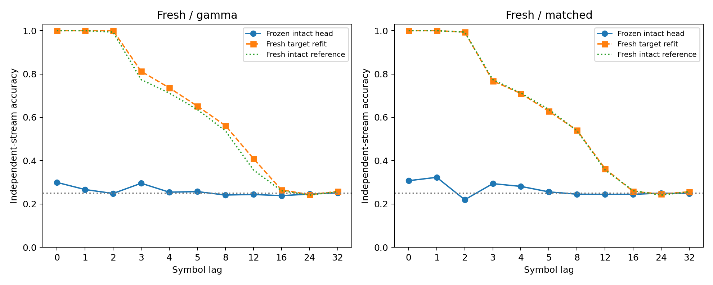

# ACT III-A: 새 seed에서 확인된 고정 readout과 재학습의 차이

**사전등록한 재학습 이득이 새로운3개 paired seed에서도 재현됐다.**
KCγ 제거에서 고정26.047% 대 재학습79.367%,평균 차이53.319%p였다.
세 seed 모두 양수이고 refit 접근성도 통과해5%p 확인 기준을 충족했다.
Matched 제거도26.962% 대77.323%였다. 반면 KCγ에 특이적인5%p 손상 기준은
통과하지 못했다. 두 질문을 분리하며 초파리의 지능을 평가한 것으로 해석하지 않는다.

현재 위치: **ACT III-A KCγ frozen/refit 비교의 새 seed 확인 완료**.
Protocol/seed audit `c49a61e`,implementation `f5d1752`; 모두 결과 전에 commit했다.
실제 초파리 connectome 구조를 사용한 계산 모델의 과거 입력 해독 실험이다.

## 1. Repository audit

기준 `4272cb0`에서 AGENTS,README,연구 현황·방향·handoff·이전 protocol/result,
configs,scripts,src,tests,results manifests/checkpoints,최근 commits를 확인했다.
기존 성공은 이미 관찰한3개 seed의 후속 분석이었다는 한계를 확인하고,새 cohort를
별도로 등록했다. 원래 전체 audit와 실패 이력은 [연구 현황](research-status.md)에 유지한다.

[Seed audit](kc-confirmation-seed-audit.json): 추적 중인 config/result JSON5888개,
기존 seed333값과 신규 실험 seed24개를 비교해 충돌0. 재귀적으로 seed 이름의 필드를
검사했으며 문서나 임의 숫자 전체까지 검사했다는 뜻은 아니다. 기존 biological
circuit701/702는 유지했다. 새 생물 개체 표본이 아니다.
실행 전 결과 8,446개 파일 해시가 그대로다. 기존 수치 엔진도 보존했다.

## 2. Reproduced baseline

`structural_k4_main/real_c701_s34142`의 전체 checkpoint 배열과 모든 metrics를
정확히 재현했다. Primary 정확도 expected=actual **75.4833%**.
[전체 기록](../results/kc_confirmation/baseline.json).
추가로 새 무제거 head7개(본6+smoke1)의 자기 예측·source-only refit과 지표도
일치했다. 새 조건35개는 모두 전체 trajectory 재실행까지 확인했다.
기존 locked environment를 재사용했으며 새 clean environment 설치라고 주장하지 않는다.

## 3. New implementation

`kc_confirmation.py`는 기존 kc_ablation·kc_frozen 수치 함수를 그대로 사용해
새 states/refits와 frozen transfer를 연결한다. 한 공통 runtime/RSS budget으로
smoke 두 단계가 끝난 후 본실험을 실행한다. Target mean/scale/weight를
frozen 예측에 사용하지 않는다. Source mean/scale/real·null weights/bias를 고정한다.

`verify_kc_confirmation.py`는 기존 독립 mask/graph/stream/metric verifier와
별도 source-only least-squares·직접 score/metric/집계/bootstrap/gate 계산을
결합했다. 새 테스트는 seed/설정 변경 거부,기존 성공과 많은 대조군으로 실패한
새 block을 구제할 수 없음을 확인한다. 이전 numerical modules는 변경하지 않았다.

## 4. Experiments executed

| 범위 | 새 회로/조건 refit | Frozen 비교 |
|---|---:|---:|
| Smoke,c701/seed71001 | 5 | 4 |
| Main,3seeds×2circuits | 30 | 24 |
| 합계 | 35 | 28 |

조건: intact,gamma,matched0/1/2. 새 mapping71142–71144,
train72142–72144,test73142–73144,matched RNG74142–74150.
Smoke71001/72001/73001,matched74001–74003. 모든 조건을 선택 없이 실행했다.
각 circuit686뉴런·512KC·48MBON,threshold5,edges3309/3241. KCg 주석254/226개.
Matched는 전체KC에서 뽑으며 raw in/out degree와 기호별 입력 노출 bitmask를
정확히 맞춘다. 이번 실제 KCγ 중복은61.0–71.3%(평균65.8%)다.
연결 강도와 실제 제거 edge 수는 맞추지 않았고 raw audit에 보존했다.

K4 pseudo-random,train2000/test1000,warmup100;smoke200/100.
input fraction.1/amplitude.5,gain.9/leak.6,mbon_after_kc,
제거 전 incoming-L1 정규화 후 생존 가중치 유지. 제거 row/column/input0,
매 step 제거 상태0 확인. 관측48MBON,alpha1,lag당196계수,
train std floor1e−5,half-train shifted-label null.
Lags0,1,2,3,4,5,8,12,16,24,32;primary1,2,3,4,5,8.

H1은 전체KCγ의 평균(refit−frozen)>=5%p,3block 모두>0,
refit의 majority/null margins 각5%p 및 양의 평균R²다.
기존 cohort 성공과 **새 cohort 자체의 성공**이 모두 있어야 confirmation을 인정했다.
Frozen 접근성·5%p 유지·KCγ 특이성은 별도 secondary였다.

## 5. Results

새 seed별 primary lag/circuit 평균이다. Matched는 지정한3draw도 평균했다.
각 draw/circuit/lag 원값은 아래 CSV와 checkpoint에 모두 보존했다.

| 조건 | seed | 무제거 % | 고정 % | 재학습 % | 차이 %p |
| --- | --- | --- | --- | --- | --- |
| gamma | 71142 | 77.967 | 27.675 | 79.558 | 51.883 |
| gamma | 71143 | 77.250 | 25.517 | 78.967 | 53.450 |
| gamma | 71144 | 77.442 | 24.950 | 79.575 | 54.625 |
| matched | 71142 | 77.967 | 28.031 | 77.931 | 49.900 |
| matched | 71143 | 77.250 | 26.106 | 76.403 | 50.297 |
| matched | 71144 | 77.442 | 26.750 | 77.636 | 50.886 |


| 조건 | 고정 평균 % | 중앙값 % | 분산 (%p)² | bootstrap95 % | 재학습 평균 % |
| --- | --- | --- | --- | --- | --- |
| gamma | 26.047 | 25.517 | 2.0675 | [24.950, 27.675] | 79.367 |
| matched | 26.962 | 26.750 | 0.9601 | [26.106, 28.031] | 77.323 |


| 조건 | 이득 평균 %p | 중앙값 %p | 분산 (%p)² | bootstrap95 %p | paired dz | +/0/− |
| --- | --- | --- | --- | --- | --- | --- |
| gamma | 53.319 | 53.450 | 1.8920 | [51.883, 54.625] | 38.764 | 3/0/0 |
| matched | 50.361 | 50.297 | 0.2462 | [49.900, 50.886] | 101.504 | 3/0/0 |


n=3paired mapping/stream blocks. Control masks,circuits,time rows를 독립 표본으로
세지 않았다. Bootstrap10000,seed74399. 작은 n의 bootstrap과 큰 dz를 생물학적
일반화나 높은 확실성으로 과장하지 않는다. p-value 판정은 없다.

이전 cohort와 새 cohort를 합치지 않은 비교:

| cohort | 조건 | n | 고정 % | 재학습 % | 차이 %p |
| --- | --- | --- | --- | --- | --- |
| discovery | gamma | 3 | 26.250 | 79.219 | 52.969 |
| confirmation | gamma | 3 | 26.047 | 79.367 | 53.319 |
| discovery | matched | 3 | 26.377 | 77.156 | 50.779 |
| confirmation | matched | 3 | 26.962 | 77.323 | 50.361 |


| 조건 | 다수 클래스 % | 고정 null % | 고정 R² | refit R² | 재학습 이득 | 고정 접근 | 5%p 유지 |
| --- | --- | --- | --- | --- | --- | --- | --- |
| gamma | 26.106 | 25.006 | -515.038 | 0.580 | True | False | False |
| matched | 26.106 | 24.522 | -382.365 | 0.553 | True | False | False |


대조−KCγ 특이성 차이:

| cohort | decoder | 평균 %p | bootstrap95 %p | +/0/− | 5%p 특이성 |
| --- | --- | --- | --- | --- | --- |
| discovery | frozen | 0.127 | [-0.914, 1.203] | 2/0/1 | False |
| discovery | refit | -2.064 | [-2.636, -1.308] | 0/0/3 | False |
| confirmation | frozen | 0.915 | [0.356, 1.800] | 3/0/0 | False |
| confirmation | refit | -2.044 | [-2.564, -1.628] | 0/0/3 | False |


새 frozen 특이성 차이는 세 seed 모두 양수지만 평균0.915%p로 사전5%p보다 작다.
기준 실패를 차이가 정확히0이거나 두 집단이 동등하다는 결론으로 바꾸지 않는다.
반대로 gamma refit은 intact77.553%보다79.367%로 높았다. 이는 기술 결과이며
반대 방향의 새로운 성공 기준을 만들지 않았다.

[Condition별 모든 lag](../results/kc_confirmation/conditions/main/raw-lag-table.csv) ·
[Condition circuit/draw별](../results/kc_confirmation/conditions/main/raw-past-table.csv) ·
[Frozen 모든 lag](../results/kc_confirmation/frozen/raw-lag-table.csv) ·
[Frozen circuit/draw별](../results/kc_confirmation/frozen/raw-past-table.csv) ·
[Paired blocks](../results/kc_confirmation/frozen/seed-blocks.csv).



새 신경 상태 진단(조건별 기술 평균):

| 조건 | effective rank | 활성 뉴런 | MBON norm | 32step decay ratio |
| --- | --- | --- | --- | --- |
| gamma | 6.4397 | 406.00 | 0.12636 | 1.79e-08 |
| intact | 6.4336 | 647.00 | 0.12039 | 6.17e-07 |
| matched | 6.3845 | 405.44 | 0.11222 | 1.71e-08 |


Sparsity,state cosine,전체 train/test features,symbols,labels,heads,training loss/
accuracy,real/null/frozen/refit scores,graph/mask hashes도 보존했다.
큰 음수R²도 원값 그대로다. Ridge scores는 확률이 아니다.
이 실험의 지표는 독립 stream 과거 기호 해독이며 Pi Memory Score/자율 회상이 아니다.

## 6. Interpretation

재학습된 readout이 제거 후 상태에서 정보를 해독할 수 있다는 관찰과,
제거 전 readout을 고정 적용하면 크게 실패한다는 관찰이 새 입력 배치·수열·
matched mask에서도 함께 재현됐다. 따라서 frozen decoder 실패를 정보 자체의
소실이나 생물학적 기억 회로 증거로 동일시할 수 없다.

Matched 제거에서도 큰 refit 이득이 나타나 KCγ에만 특이적인 현상은 아니다.
이번 neuron lesion은 연결과 직접 주입 입력을 동시에 지웠다. Degree/input count
matching은 대조군 간 노출량을 통제하지만,입력 차단 효과와 recurrent 연결 제거
효과 자체를 분리하지 않는다. 이 점을 다음 기전 질문으로 남긴다.

## 7. Negative findings

확인 cohort의 gamma/matched 모두 frozen 접근성과5%p 유지 기준에 실패했다.
Gamma 특이성은 frozen/refit 모두 사전 기준에 실패했다. Memory-critical
subnetwork를 식별하지 못했다. 이전 whole-brain 우위 실패와 내부 학습의
negative results도 유지한다. Gain/seed/readout 탐색이나 기준 변경은 없었다.

## 8. What we can claim

같은 부분 connectome 계산 모델의 새 pseudorandom 입력·배치·mask cohort에서,
KCγ 제거 후 condition-specific refit의 큰 이득이 사전 기준에 따라 확인됐다.
고정 decoder의 재사용 가능성과 남아 있는 정보의 해독 가능성은 구분해야 한다.
이는 representation/decoding에 대한 결과다.

## 9. What we cannot claim

새 biological samples,whole-brain 일반화,실제 초파리 지능·학습,biological KCγ의
불필요성,내부 plasticity 성공,formal memory capacity,π 자율 회상 개선은
보이지 않았다. 고정 readout 붕괴의 원인을 입력·연결·표준화·계수 중 하나로
확정할 수 없다. Fresh seed 확인은 같은 biological graph/dynamics 설정 안의 확인이다.

## 10. Reproducibility

35조건 full replay/독립 refit,28frozen score replay/독립 source least-squares,
7self-check,condition385+frozen308=693lag rows의 별도 검증을 통과했다.
Main만 세면330+264=594rows. Tests **202passed,8optional skips**.
이전8,446result files unchanged. 전체 실행90.27s,
50ms sampled peak RSS172.78MiB.
Sampled peak는 실제 상한이 아니다. Python3.12.10,NumPy2.3.5,SciPy1.17.0,
pandas2.2.3,threadpoolctl3.6.0,numerical BLAS1thread. 상세 환경은 manifest 참조.

[Config](../configs/kc_confirmation.json) · [Protocol](kc-confirmation-protocol.md) ·
[Seed audit](kc-confirmation-seed-audit.json) · [Manifest](../results/kc_confirmation/manifest.json) ·
[독립 검증](../results/kc_confirmation_validation/checks.json) · [Lock](../requirements-act1-lock.txt).
`conditions`에는 raw graph/normalized weights,masks,전체 features·labels·head;
`frozen`에는 고정 source parameters,해당 target features·labels·scores·refit
비교와 source checkpoint/hash 참조가 있다. Git/config/source/artifact hash 보존.

저장소 루트의 locked environment에서 새 경로로 실행한다:

```powershell
$env:PYTHONPATH='src'
.venv/Scripts/python.exe scripts/kc_confirmation.py --out outputs/kc_confirmation_new
.venv/Scripts/python.exe scripts/verify_kc_confirmation.py outputs/kc_confirmation_new --out outputs/kc_confirmation_check_new
```

## 11. Next highest-information experiment

**같은 KCγ/matched mask의 직접 입력만 차단하고 모든 recurrent 연결은 유지하는
대조 실험** 하나를 선택한다. 기존 full neuron lesion과 비교하면,직접 입력이
차단된 상태에서 recurrent 연결까지 지우는 추가 효과를 확인할 수 있다.
Frozen/refit을 각각 보고하고,단순 입력 손실을 구조적 memory-critical 효과로
오해하지 않도록 한다. 별도 protocol을 먼저 등록하며 아직 실행하지 않았다.
