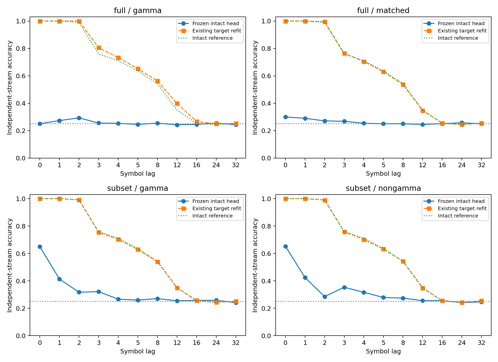

# ACT III-A: KC 제거 상태의 고정 출력층과 재학습 비교

**과거 입력을 해독할 정보는 남아 있었지만, 제거 전 출력층을 그대로 쓰기는 어려웠다.**
전체 KCγ 제거에서 frozen26.250% 대 refit79.219%(+52.969%p)로,
세 seed 모두 사전5%p 재학습 이득 기준을 통과했다. Matched 제거도
26.377% 대77.156%로 비슷했다. KCγ 특이 손상은 지지되지 않았다.
실제 초파리 connectome 구조를 사용한 계산 모델의 결과다.

현재 위치는 **ACT III-A 고정 출력층/재학습 구분 완료**다. 전체 ACT III,
memory-critical subnetwork 식별이나 ACT IV의 새로운 내부 학습 확장은 아직 남았다.
Protocol `88f80d4`, implementation `da01943`; 결과 계산 전에 각각 commit했다.

## 1. Repository audit

기준 `e163648`의 AGENTS,README,docs 연구 방향·handoff·phase-status·최신 결과,
config,scripts,src 수치 엔진,tests,results manifests/checkpoints,최근 commits를
확인했다. 초기 전체 inventory는 [연구 현황](research-status.md)에 유지한다.
기존 KC 제거 결과는 **조건별로 다시 학습한 head**였다는 점을 확인했다.
무제거 head를 제거 상태에 적용한 성능은 기록되지 않아 이번에 처음 계산했다.
그 차이를 문서에 명확히 반영했다. 이전 결과 8,222개 파일의 해시가 그대로다.

전체 제거의 matched control은 KCγ와61.9–72.0% 겹친다. 비중복 후속은
겹침0이지만 제거량이71–93개로 달라지고 공통 뉴런이 활성으로 남는다.
두 설계의 차이를 겹침 하나의 효과로 해석하지 않는다.

## 2. Reproduced baseline

무제거 원본 head7개(본6+smoke1)의 source-only ridge refit,
독립 augmented least-squares 및 원래 상태 자기 예측이 모두 정확히 일치했다.
모든 기존 지표도 expected=actual이었다. Primary lag 평균 정확도(%):

| cohort | seed | circuit | expected | actual | 검증 |
| --- | --- | --- | --- | --- | --- |
| smoke | 61001 | 701 | 70.167 | 70.167 | exact |
| main | 61142 | 701 | 76.983 | 76.983 | exact |
| main | 61142 | 702 | 77.417 | 77.417 | exact |
| main | 61143 | 701 | 75.700 | 75.700 | exact |
| main | 61143 | 702 | 76.550 | 76.550 | exact |
| main | 61144 | 701 | 77.367 | 77.367 | exact |
| main | 61144 | 702 | 79.800 | 79.800 | exact |


기존 의존성 고정 환경을 재사용했다. 새 clean environment 설치나 새 reservoir
trajectory 재현이라고 표현하지 않는다. 원본 상태는 직전 연구에서 full replay했다.
[전체 baseline 기록](../results/kc_frozen/baselines.json).

## 3. New implementation

`kc_frozen.py`가 기존 `normalization_transfer.predict_frozen`을 사용한다.
예측 함수는 source parameters와 target features만 받는다. Source mean,
scale,real/null weights,bias를 고정한다. Target 평균 보정이나 재표준화는 없다.
동일 intended input map,48observed IDs,수열,labels를 확인한다. 제거에 따른
effective input 차이는 유지하고, 생존 가중치가 동일한지 별도 확인했다.

`verify_kc_frozen.py`는 별도 score 수식,source-only least-squares,
metric·CSV·집계·bootstrap·gate 재계산을 수행한다. 모든70개 저장 결과를
정확히 반복 계산했다. 새 테스트는 target head/표준화가 frozen 예측에 영향을
주지 않는지, 큰 refit 이득을 frozen 접근성과 혼동하지 않는지 확인한다.
기존 numerical modules와 이전 결과 파일은 변경하지 않았다.

## 4. Experiments executed

| 비교 | Main | Smoke | Source head |
|---|---:|---:|---|
| 전체 KCγ＋matched0/1/2 | 24 | 4 | 같은 seed/circuit 무제거 |
| 비중복 KCγ/비KCγ 3쌍 | 36 | 6 | 같은 seed/circuit 무제거 |

합계70transfers,그중60main. 새로운 target fit과 reservoir trajectory는0이다.
Refit 비교값은 직전 연구에서 학습·저장한 head로부터 읽었다. Source-only
검증용 재학습은 수행했지만 transfer 모델이나 저장 가중치를 바꾸지 않았다.

Main mapping61142–61144,train62142–62144,test63142–63144,
matching64142–64150,circuits701/702. Smoke61001/62001/63001,c701.
K4 독립 pseudo-random streams,train2000/test1000,warmup100;smoke200/100.
gain.9/leak.6,mbon_after_kc,input fraction.1/amplitude.5,제거 전 incoming-L1 고정.
48MBON,lag당196계수,alpha1; lags0,1,2,3,4,5,8,12,16,24,32;
primary1,2,3,4,5,8. 원본과 동일하게 half-train shifted null head도 고정했다.

H1은 **전체 KCγ만** primary: refit−frozen 평균>=5%p,3block 모두>0,
refit의 majority/null margin 각5%p 및 양의 평균R²를 요구했다.
다른 그룹의 이득·접근성·5%p 유지·집단 특이성은 사전 지정 secondary다.

## 5. Results

각 seed에서 primary lags와 두 circuit,해당하는 경우3control draws를 평균했다.
평균만 보존하지 않았다: [모든 condition/lag](../results/kc_frozen/raw-lag-table.csv),
[모든 circuit/draw](../results/kc_frozen/raw-past-table.csv),
[seed별 원자료](../results/kc_frozen/seed-blocks.csv),
[대응 특이성 차이](../results/kc_frozen/paired-specificity.csv).

| 조건 | seed | 무제거 % | 고정 % | 재학습 % | 재학습−고정 %p |
| --- | --- | --- | --- | --- | --- |
| 전체 KCγ | 61142 | 77.200 | 28.267 | 79.025 | 50.758 |
| 전체 KCγ | 61143 | 76.125 | 24.875 | 78.333 | 53.458 |
| 전체 KCγ | 61144 | 78.583 | 25.608 | 80.300 | 54.692 |
| 전체 matched | 61142 | 77.200 | 27.353 | 76.778 | 49.425 |
| 전체 matched | 61143 | 76.125 | 26.078 | 75.697 | 49.619 |
| 전체 matched | 61144 | 78.583 | 25.700 | 78.992 | 53.292 |
| 부분 KCγ | 61142 | 77.200 | 35.372 | 76.931 | 41.558 |
| 부분 KCγ | 61143 | 76.125 | 26.956 | 76.053 | 49.097 |
| 부분 KCγ | 61144 | 78.583 | 30.036 | 77.889 | 47.853 |
| 부분 비KCγ | 61142 | 77.200 | 31.672 | 76.736 | 45.064 |
| 부분 비KCγ | 61143 | 76.125 | 31.003 | 76.019 | 45.017 |
| 부분 비KCγ | 61144 | 78.583 | 33.869 | 78.461 | 44.592 |


| 조건 | 고정 평균 % | 재학습 평균 % | 이득 %p | 고정 중앙값 % | 분산 (%p)² | 고정 bootstrap95 % |
| --- | --- | --- | --- | --- | --- | --- |
| 전체 KCγ | 26.250 | 79.219 | 52.969 | 25.608 | 3.1847 | [24.875, 28.267] |
| 전체 matched | 26.377 | 77.156 | 50.779 | 26.078 | 0.7500 | [25.700, 27.353] |
| 부분 KCγ | 30.788 | 76.957 | 46.169 | 30.036 | 18.1340 | [26.956, 35.372] |
| 부분 비KCγ | 32.181 | 77.072 | 44.891 | 31.672 | 2.2490 | [31.003, 33.869] |


| 조건 | 이득 평균 %p | 중앙값 %p | 분산 (%p)² | bootstrap95 %p | paired dz | +/0/− |
| --- | --- | --- | --- | --- | --- | --- |
| 전체 KCγ | 52.969 | 53.458 | 4.0470 | [50.758, 54.692] | 26.330 | 3/0/0 |
| 전체 matched | 50.779 | 49.619 | 4.7457 | [49.425, 53.292] | 23.309 | 3/0/0 |
| 부분 KCγ | 46.169 | 47.853 | 16.3339 | [41.558, 49.097] | 11.424 | 3/0/0 |
| 부분 비KCγ | 44.891 | 45.017 | 0.0676 | [44.592, 45.064] | 172.604 | 3/0/0 |


Bootstrap10000,seed65399,n=3mapping/stream blocks. Circuit·mask·lag·time row를
추가 독립 표본으로 세지 않았다. 큰 dz와 좁은 interval은 작은 표본 내부의
변동에 기반하며 일반화를 보장하지 않는다. p-value 성공 판정은 없다.

| 조건 | 다수 클래스 % | 고정 null % | 고정 R² | 고정 test MSE | 고정 접근 | 5%p 유지 | 재학습 이득 |
| --- | --- | --- | --- | --- | --- | --- | --- |
| 전체 KCγ | 24.283 | 24.603 | -1233.161 | 231.685 | False | False | True |
| 전체 matched | 24.283 | 24.834 | -812.459 | 152.710 | False | False | True |
| 부분 KCγ | 24.283 | 23.890 | -42.608 | 8.187 | False | False | True |
| 부분 비KCγ | 24.283 | 23.479 | -44.228 | 8.492 | False | False | True |


Ridge score는 확률이 아니며 범위가 제한되지 않는다. 큰 음수R²와 큰MSE는
유한한 실제 계산값이며 clip하거나 감추지 않았다. 정확도가 일부 chance25%보다
높아도 사전 접근 기준을 충족하는 것과 다르다. Train loss/accuracy도 raw CSV에 있다.

대조−KCγ 차이(양수면 KCγ 제거에서 더 낮음):

| 설계 | decoder | 평균 %p | bootstrap95 %p | +/0/− | 특이성 기준 |
| --- | --- | --- | --- | --- | --- |
| full | frozen | 0.127 | [-0.914, 1.203] | 2/0/1 | False |
| full | refit | -2.064 | [-2.636, -1.308] | 0/0/3 | 이전 기준 실패 |
| subset | frozen | 1.394 | [-3.700, 4.047] | 2/0/1 | False |
| subset | refit | 0.115 | [-0.194, 0.572] | 1/0/2 | 이전 기준 실패 |




학습 상태 변화는 기술 진단이며 어떤 보정에도 사용하지 않았다.

| 조건 | 평균 절대 shift(source SD) | scale ratio 중앙값의 평균 | 뉴런별 시간 상관 평균 | paired cosine 평균 |
| --- | --- | --- | --- | --- |
| 전체 KCγ | 2.149 | 0.946 | 0.723 | 0.895 |
| 전체 matched | 1.682 | 0.812 | 0.713 | 0.912 |
| 부분 KCγ | 0.380 | 0.997 | 0.953 | 0.995 |
| 부분 비KCγ | 0.440 | 0.969 | 0.915 | 0.982 |


## 6. Interpretation

KCγ 전체 제거에서 고정 readout은26.250%지만 같은 상태를 조건에 맞게 읽도록
학습한 head는79.219%였다. 따라서 고정 decoder의 성능 붕괴를 정보 자체의
소실로 동일시할 수 없다. 변한 상태에서 정보가 다시 해독 가능한지는 별도 질문이다.
이는 decoder 재사용의 취약성과 condition-specific decoding의 차이를 보여준다.

이 현상은 matched KC 제거와 양쪽 비중복 부분집합에서도 나타났다.
KCγ에만 특이적인 기억 회로 증거가 아니다. 상태 drift와 큰 affine score 오차는
decoder mismatch와 일관되지만 원인을 평균·scale·방향 중 하나로 분리하지 않았다.
Refit은 표준화와 계수를 함께 바꾸므로 각각의 기여도도 아직 분리할 수 없다.

## 7. Negative findings

네 그룹 모두 frozen 접근성과5%p 유지 기준에 실패했다. 전체/비중복 모두
frozen KCγ 특이성 기준에도 실패했다. 이전 refit 특이성 실패는 그대로 유지한다.
고정 출력층의 큰 손상만으로 memory-critical subnetwork를 식별하지 못했다.
No tuning,mask/seed selection,post-outcome threshold changes.

## 8. What we can claim

지정한 부분 connectome 계산 모델에서 제거 후 head를 조건에 맞게 재학습한
경우가 무제거 head를 고정 적용한 경우보다 과거 입력을 훨씬 잘 해독한다.
Primary H1은3개 block 모두에서 통과했다. 이번 결과는 표현의 해독 방식에
관한 것이며, connectome 내부가 학습했다는 결과가 아니다.

## 9. What we cannot claim

이 분석은 기존3seed의 후속이며 독립 확인이 아니다. 새로운 생물 개체,전체망,
다른 역학·학습 규칙·sequence family로 일반화할 수 없다. 실제 초파리의 기억,
KCγ의 생물학적 필요성,formal memory capacity,π 자율 회상 성공을 보여주지 않는다.
무제거 head는 원래 학습됐던 head다. 이번 transfer에 새 target training이0이라는
사실을 모델 전체가 학습하지 않았다는 뜻으로 표현하지 않는다.

## 10. Reproducibility

70개 score replay,7source baseline,source-only 독립 least-squares,
770lag rows(660main)의 별도 metric/statistic 검증 통과.
전체 tests **200passed,8optional skips**. 이전8,222result files unchanged.
실행 57.64s,50ms sampled peak RSS 171.09MiB.
Sampled peak는 실제 peak 상한이 아니다. Python3.12.10,NumPy2.3.5,SciPy1.17.0,
pandas2.2.3,threadpoolctl3.6.0,numerical BLAS1thread; 자세한 환경은 manifest 참조.

[Config](../configs/kc_frozen.json) · [Protocol](kc-frozen-protocol.md) ·
[Manifest](../results/kc_frozen/manifest.json) · [독립 검증](../results/kc_frozen_validation/checks.json) ·
[Lock](../requirements-act1-lock.txt).
조건별 checkpoint는 고정 source mean/scale/real·null 계수,target features·labels,
frozen/train/refit scores,predictions,drift arrays를 포함한다. Manifest는 원본
checkpoint/graph/neural diagnostics 경로와 hash를 가리킨다. 원래 신경 상태
진단은 재생성하지 않고 명시적으로 참조한다. Git/config/source/artifact hashes 보존.

저장소 루트,locked environment에서 기존 원본 결과를 유지하고 새 경로로 실행한다:

```powershell
$env:PYTHONPATH='src'
.venv/Scripts/python.exe scripts/kc_frozen.py --out outputs/kc_frozen_new
.venv/Scripts/python.exe scripts/verify_kc_frozen.py outputs/kc_frozen_new --out outputs/kc_frozen_check_new
```

## 11. Next highest-information experiment

**새3개 paired mapping/train/test seeds에서 전체 KCγ 및 matched 제거의
frozen/refit 차이를 확인하는 독립 cohort 실험** 하나를 선택한다. 기존 역학·
readout·제거 규칙·5%p 주 기준을 유지하고,무제거/KCγ/3matched 조건을 함께
평가한다. 같은 생물학적 circuit을 쓴다면 새 생물 표본으로 표현하지 않는다.
이번에 본 seed를 재사용하거나 기존 집단과 합쳐 성공 판정하지 않는다.
별도 protocol·seed audit을 먼저 등록할 계획이며 아직 실행하지 않았다.
