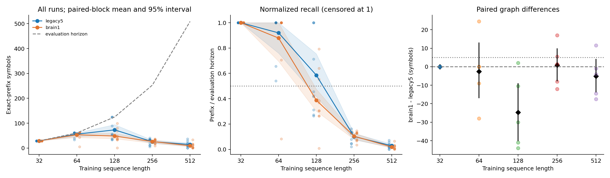
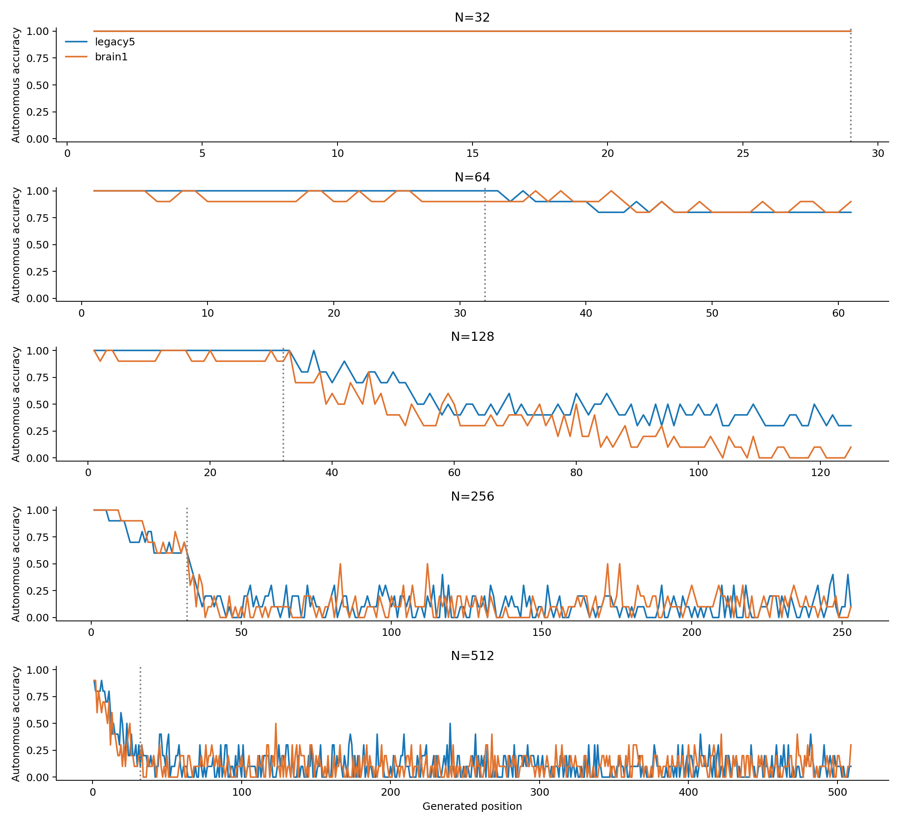

# ACT II — Random-sequence length scaling

**Both models complete the short N32 task but lose most normalized recall at
longer lengths; whole-brain superiority is not established.** At N512, mean
prefixes are14.6 (legacy5) and9.5 (brain1). The registered operational collapse
criterion first holds at N256 and N128 respectively. Aggregate whole-brain
minus partial prefix is−6.3 symbols, paired interval[−13.18,−0.94], for these
five computational blocks; this is not universal whole-brain inferiority.

This study measures the fixed training procedure, not intrinsic reservoir
memory capacity. All source graph connections are frozen; the external
readout is trained separately for each task length.

Protocol **8885aca** preceded outcomes; main execution revision **070b4bf**.
[Protocol](length-scaling-protocol.md) · [Config](../configs/length_scaling.json) ·
[All raw metrics](../results/scaling_analysis/all-metrics.csv).

## 1. Repository audit

Continued from the completed four-family pilot at0df1fc7. Reused the unchanged
ACT I/II numerical backend and data generator. Existing source, checkpoint and
protocol bytes remain unchanged. All1,932 prior result files passed final
SHA-256 integrity verification. New runs and smoke failures use separate directories.
The README, current research status and roadmap distinguish this study from
the preceding200-symbol pilot and old phase handoffs.

## 2. Reproduced baseline

Exactly replayed and independently refitted both pilot random-family heads
for model seed9142 / dataset seed9242 / input stratum701. Expected and actual
prefix scores: legacy5=33, brain1=32. Head parameters, trajectories,
probabilities, controls and losses matched exactly.
[Baseline record](../results/scaling_baseline/report.json).

## 3. New implementation

Added length-grid orchestration and paired-block analysis without changing
the existing model, readout optimizer, generator or historical verifiers.
Each shorter task is an exact prefix of a512-symbol random stream. Length
configs cap the weighted window at the available evaluation horizon. Saved
raw symbols, generated sequences, features, probabilities, loss histories,
checkpoints, resource use and source/config/environment manifests.

## 4. Experiments executed

- N=32/64/128/256/512; decimal K=10; common supplied prompt314; horizon H=N−3.
- Model/dataset blocks11142/11242 through11146/11246; input strata701/702;
  legacy5 and brain1 at each length: **100 separately trained fits** (paired design).
- legacy5:686 nodes; brain1:138,639 nodes /15,091,983 edges. Exact input IDs
  and48 observed MBON IDs/order matched across networks and lengths.
- Frozen incoming-L1 gain.9, leak.6, mbon_after_kc, encoder fraction.1/amplitude.5.
- 48→8 tanh→10 head,482 parameters; fresh initialization at every length;
  train-only normalization/std floor1e-5. Full-batch Adam2000, LR.03, L2=1e-5.
- First min(32,H) generated targets weighted4, all other training targets1.
  There is no warm start, curriculum, hyperparameter sweep or selected checkpoint.
- Four excluded smoke fits: N32/512, block11139/11239, stratum701,20 updates.

| N | Horizon | Weighted window | Total target weight | Weighted prefix mass |
|---|---:|---:|---:|---:|
| 32 | 29 | 29 | 118 | 0.9831 |
| 64 | 61 | 32 | 159 | 0.8050 |
| 128 | 125 | 32 | 223 | 0.5740 |
| 256 | 253 | 32 | 351 | 0.3647 |
| 512 | 509 | 32 | 607 | 0.2109 |

Fixed updates do not mean equal computation or a constant early-target loss
share. The prefix mass falls from98.3% to21.1%. This is an explicit design
property; no outcome-dependent compensation was applied.

## 5. Results

Exact-prefix score excludes prompt. Full completion is right-censored at H;
it cannot show how far that fitted model might recall beyond this horizon.

| N | Network | Mean prefix | Raw median | Raw sample variance | Block 95% interval | Mean L/H | Completed runs |
|---|---|---:|---:|---:|---|---:|---:|
| 32 | legacy5 | 29.00 | 29.00 | 0.00 | [29.000, 29.000] | 1.0000 | 10/10 |
| 32 | brain1 | 29.00 | 29.00 | 0.00 | [29.000, 29.000] | 1.0000 | 10/10 |
| 64 | legacy5 | 56.10 | 61.00 | 109.43 | [46.300, 61.000] | 0.9197 | 8/10 |
| 64 | brain1 | 53.60 | 61.00 | 323.60 | [42.400, 61.000] | 0.8787 | 8/10 |
| 128 | legacy5 | 73.20 | 55.00 | 1526.84 | [52.100, 94.300] | 0.5856 | 3/10 |
| 128 | brain1 | 48.50 | 42.00 | 769.61 | [37.600, 59.400] | 0.3880 | 0/10 |
| 256 | legacy5 | 25.60 | 32.50 | 155.60 | [19.300, 31.900] | 0.1012 | 0/10 |
| 256 | brain1 | 26.40 | 32.00 | 90.04 | [20.100, 32.700] | 0.1043 | 0/10 |
| 512 | legacy5 | 14.60 | 12.00 | 138.04 | [7.900, 21.300] | 0.0287 | 0/10 |
| 512 | brain1 | 9.50 | 7.00 | 103.39 | [4.900, 14.100] | 0.0187 | 0/10 |

Raw medians/variances describe ten fits. Intervals average the two strata
within a block, then resample five paired blocks10,000 times (seed11399).
Dataset and model seeds are paired, not fully crossed. Reused prefixes,
strata and neurons must not be treated as independent replicates.

| N | Mean brain1−legacy5 | Median | Sample variance | Paired95% interval | d_z | W/T/L | Per-length criterion |
|---|---:|---:|---:|---|---:|---|---|
| 32 | +0.00 | 0.00 | 0.00 | [0.000, 0.000] | undefined | 0/5/0 | False |
| 64 | -2.50 | 0.00 | 358.50 | [-16.800, 12.900] | -0.132 | 1/2/2 | False |
| 128 | -24.70 | -30.00 | 395.20 | [-40.000, -9.100] | -1.242 | 1/0/4 | False |
| 256 | +0.80 | 1.50 | 131.57 | [-7.700, 9.700] | 0.070 | 3/0/2 | False |
| 512 | -5.10 | -4.00 | 133.93 | [-13.600, 4.000] | -0.441 | 1/0/4 | False |

Aggregate paired graph gain (equal weight per length): **-6.30 symbols**, interval[-13.180, -0.940], d_z=-0.779, W/T/L=1/0/4. Qualifying adjacent pairs: []. Overall graph criterion: **False**.



### Every seed

Each cell reports input stratum701 /702; these are not independent animals.

**N=32, H=29**

| Model / dataset seed | legacy5 (701/702) | brain1 (701/702) |
|---|---:|---:|
| 11142 / 11242 | 29 / 29 | 29 / 29 |
| 11143 / 11243 | 29 / 29 | 29 / 29 |
| 11144 / 11244 | 29 / 29 | 29 / 29 |
| 11145 / 11245 | 29 / 29 | 29 / 29 |
| 11146 / 11246 | 29 / 29 | 29 / 29 |

**N=64, H=61**

| Model / dataset seed | legacy5 (701/702) | brain1 (701/702) |
|---|---:|---:|
| 11142 / 11242 | 61 / 61 | 61 / 61 |
| 11143 / 11243 | 61 / 61 | 43 / 61 |
| 11144 / 11244 | 61 / 61 | 61 / 61 |
| 11145 / 11245 | 61 / 61 | 61 / 5 |
| 11146 / 11246 | 33 / 40 | 61 / 61 |

**N=128, H=125**

| Model / dataset seed | legacy5 (701/702) | brain1 (701/702) |
|---|---:|---:|
| 11142 / 11242 | 34 / 125 | 38 / 33 |
| 11143 / 11243 | 52 / 39 | 1 / 69 |
| 11144 / 11244 | 33 / 57 | 46 / 48 |
| 11145 / 11245 | 125 / 89 | 33 / 99 |
| 11146 / 11246 | 53 / 125 | 38 / 80 |

**N=256, H=253**

| Model / dataset seed | legacy5 (701/702) | brain1 (701/702) |
|---|---:|---:|
| 11142 / 11242 | 35 / 33 | 34 / 37 |
| 11143 / 11243 | 33 / 32 | 17 / 32 |
| 11144 / 11244 | 34 / 5 | 18 / 32 |
| 11145 / 11245 | 12 / 41 | 20 / 9 |
| 11146 / 11246 | 11 / 20 | 33 / 32 |

**N=512, H=509**

| Model / dataset seed | legacy5 (701/702) | brain1 (701/702) |
|---|---:|---:|
| 11142 / 11242 | 12 / 0 | 33 / 2 |
| 11143 / 11243 | 21 / 8 | 11 / 16 |
| 11144 / 11244 | 1 / 12 | 2 / 3 |
| 11145 / 11245 | 37 / 9 | 11 / 0 |
| 11146 / 11246 | 29 / 17 | 2 / 15 |

### Prediction and decoding

| N | Network | Teacher-forced accuracy | Autonomous accuracy | Majority prefix | First-order prefix | Mean recalled-prefix bits |
|---|---|---:|---:|---:|---:|---:|
| 32 | legacy5 | 1.0000 | 1.0000 | 0.80 | 0.60 | 96.34 |
| 32 | brain1 | 1.0000 | 1.0000 | 0.80 | 0.60 | 96.34 |
| 64 | legacy5 | 0.9967 | 0.9246 | 0.60 | 0.60 | 186.36 |
| 64 | brain1 | 0.9967 | 0.9049 | 0.60 | 0.60 | 178.06 |
| 128 | legacy5 | 0.9840 | 0.6296 | 0.60 | 0.40 | 243.17 |
| 128 | brain1 | 0.9496 | 0.4560 | 0.60 | 0.40 | 161.11 |
| 256 | legacy5 | 0.6929 | 0.1968 | 0.60 | 0.40 | 85.04 |
| 256 | brain1 | 0.6372 | 0.2004 | 0.60 | 0.40 | 87.70 |
| 512 | legacy5 | 0.4536 | 0.1263 | 0.60 | 0.20 | 48.50 |
| 512 | brain1 | 0.4134 | 0.1238 | 0.60 | 0.20 | 31.56 |



## 6. Interpretation

Operational collapse requires mean L/H<.5 and at least4/5 block means<.5.
This is a prespecified descriptive threshold on a finite grid, not a neuronal
storage-capacity constant. Endpoint length-drop support requires mean drop
>=.25 with at least4/5 blocks dropping.

- legacy5: normalized drop N32→512=0.9713, interval[0.958, 0.984]; criterion **True**. Collapse lengths=[256, 512]; first=256; left-censored=False; later noncollapse lengths=[].

- brain1: normalized drop N32→512=0.9813, interval[0.972, 0.990]; criterion **True**. Collapse lengths=[128, 256, 512]; first=128; left-censored=False; later noncollapse lengths=[].

Raw teacher-forced reservoir states for every shared prefix matched exactly
across lengths. Fit-dependent normalization and readout parameters can still
change. Thus early-prefix errors on a longer task cannot by themselves mean
that the same early reservoir trajectory lost information. Larger datasets,
changed normalization, normalized loss weighting and optimization are possible
contributors. This study does not isolate their causal effects.

Observed feature ranks, active-state counts, sparsity, consecutive cosine and
32-step decay are saved in [diagnostics](../results/scaling_analysis/diagnostics.csv)
and [standardized ranks](../results/scaling_analysis/representation.csv).
Active rate states are not physiological spike counts. A feature rank is not
itself a formal memory score.

Standardized observed-feature rank rises from14.35 to19.57 in legacy5 and
9.22 to15.14 in brain1 across N32→512, despite falling normalized recall.
This descriptive diversity measure cannot by itself explain recall success.

### Shared-prefix diagnostic (descriptive)

All N32 models completed the first29 generated symbols. The table counts
longer-task heads that fail before completing those SAME29 targets; the raw
teacher-forced features for those targets match exactly. This is a diagnostic
of changed decoding after the training task changes, not a new success gate.

| N | legacy5 failures before29 | brain1 failures before29 |
|---|---:|---:|
| 64 | 0/10 | 1/10 |
| 128 | 0/10 | 1/10 |
| 256 | 4/10 | 4/10 |
| 512 | 8/10 | 9/10 |

## 7. Negative findings

No failed or low-performing seed is removed. Read full raw tables rather
than selecting a favorable graph/length. The fixed procedure does not isolate
intrinsic reservoir capacity, and the random sequence/model variation remains
combined. Smoke analysis initially rejected NaN sample variance from a single
run; undefined variance now serializes as null. The partial analysis/failure
record is retained; no model, metric or success threshold was changed.

The overall graph-superiority criterion failed. Conditional fresh-seed confirmation was not triggered; no tuning followed this negative finding.

## 8. What we can claim

The table gives reproducible fixed-budget trained-random-sequence recall in
computational models using actual Drosophila connectome structure, with matched
inputs, observations and readout architecture. Criterion outcomes are limited
to this computational cohort and protocol.

## 9. What we cannot claim

No living-fly memory, unseen-sequence prediction, recurrent synaptic learning,
formal reservoir memory capacity, Shannon capacity, causal biological memory
circuit or superiority over matched random topologies is established. This
study changes length, not alphabet. Computational seeds are not animals.

## 10. Reproducibility

Main: **100 exact replays / 10 exact independent refits**. Refits cover the first block/first stratum and both graphs at every length. Smoke:4 replays /4 refits. Tests:144 passed /8 optional Brian2-related skips.

Worker wall-time sum=1319.50s, max sampled process-tree RSS=975.8MiB. Verification overlaps some fitting; these are not isolated hardware benchmarks.


Python3.12.10 with requirements-act1-lock.txt; one numerical thread per process.
[Environment](../results/scaling_validation/environment.json),
[main manifest](../results/scaling_main/manifest.json),
[verification](../results/scaling_verification/manifest.json).
[Final integrity checks](../results/scaling_validation/final-checks.json).
The main manifest includes every exact length config and checkpoint path.
Raw graph downloads/caches are rebuilt from validated source hashes, not bundled.

```powershell
$env:PYTHONPATH = 'src'
python -m pip install -r requirements-act1-lock.txt
python -m flying.training.phase6 prepare --cache outputs/act1-graphs
python scripts/run_length_scaling.py run --out outputs/scaling_new
python scripts/run_length_scaling.py verify --source outputs/scaling_new --out outputs/scaling_verify_new
python scripts/summarize_length_scaling.py --source outputs/scaling_new --out outputs/scaling_analysis_new
```

Fresh output paths are required; existing artifacts are never overwritten.

## 11. Next highest-information experiment

**Loss weighting at N512** is the next diagnostic question: hold the existing
N512 states, train-only scaling, initialization, architecture and2000 updates
fixed, and compare the current4x weighting with a single analytically specified
weight that restores the N200 pilot's first32-target loss mass (128/295).
For N512 this multiplier is4×479/167≈11.473; no search over multipliers.
Evaluate both graphs/all paired blocks and later-position accuracy as well as
prefix recall. Preregister the diagnostic and any confirmation before running.

다음 실험 하나는 **길이512에서 초반32개 target의 학습 비중만 바꾸는 대조
실험**이다. 현재4배 가중치와 길이200 pilot의 정규화된 비중을 복원한 가중치를
비교한다. 모델 개선안을 찾기보다 긴 과제의 실패에 loss 비중 감소가 얼마나
기여했는지 분리하는 목적이다. 아직 실행하지 않았다.

The earlier [anchored-window confirmation](phase5-retention-confirmation-results.md)
failed. It expanded a weighted window within a200-symbol pi task; do not promote
that method or reinterpret its failure. The proposed comparison keeps the window
at32 in a512-symbol random task and changes only its normalized loss mass.
Any gain may trade off later accuracy and is not a connectome-memory improvement.
