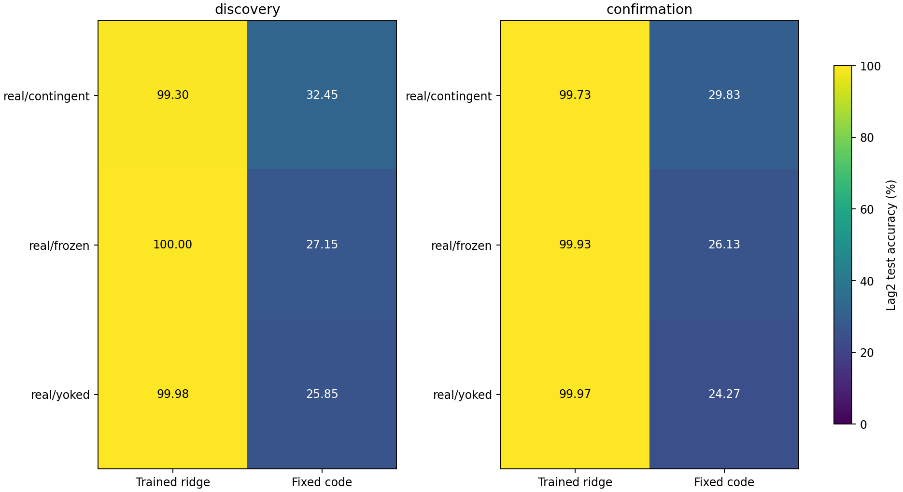
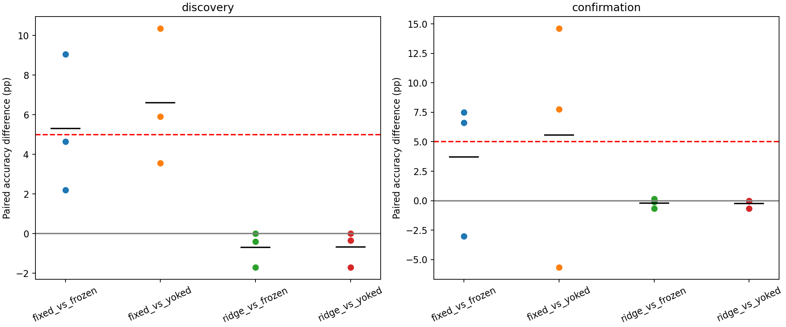
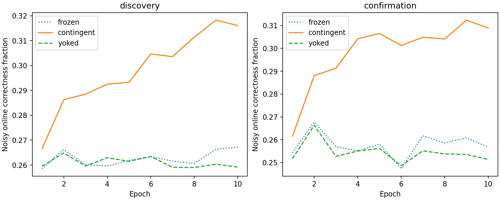

# ACT IV — 스칼라 보상과 국소 활동 흔적 결과

## 1. Repository audit

이 연구는 IV-A의 인공 정답 벡터 학습 다음에 사전 선택한 보상·국소 규칙 비교다.
기존 Phase5A `RewardPlasticity`는 학습된 출력층의 gradient를 쓰므로 이번 local-only
질문에 사용할 수 없었다. 기존 규칙을 수정하지 않고 별도 구현했다. 기존 결과
19,587개 파일은 체크섬이 유지됐다. README·로드맵에서 이전
벡터 교사 성공과 이번 scalar reward 결과를 분리한다. ACT I–III 결과는 변경하지 않았다.

## 2. Reproduced baseline

기존 `results\readout_dependency\discovery\real_aligned_c701_s221142`의 독립 내부 학습 replay와 최종 test 상태가 정확히 일치했다.
기대 fixed-code accuracy **50.80%**, 실제 **50.80%**.
이 비교는 이전 인공 교사 양성 대조의 보존을 확인한다. 새 reward seed들과 paired
양성 대조는 아니므로 두 연구의 평균 차이를 교사 제거의 인과 효과로 계산하지 않는다.
기존 lock 환경을 사용했고 새 환경 재설치라고 표현하지 않는다.

## 3. New implementation

[local_reward.py](../src/flying/brain/local_reward.py)는 presynaptic 활동과 postsynaptic
활동의 이동평균 대비 편차를 곱한 eligibility를 누적한다. Eligibility는 연결에
남는 최근 활동 흔적이다. 보상에서 이동평균 보상을 뺀 값으로 그 흔적을 가중한다.
뉴런별 plastic incoming mass를 보존하는 정규화도 적용한다. 따라서 순수한
개별 synapse-autonomous 규칙이라고 주장하지 않는다. 정답 벡터·출력층 gradient는
learner에 들어가지 않는다. 모델 부호/비가소성 연결은 고정하고 기존 KC→MBON만 바꾼다.

[Legenstein et al. (2008)](https://pmc.ncbi.nlm.nih.gov/articles/PMC2543108/)의 세 요인
학습 조직에서 동기를 얻었지만, 해당 spiking STDP 식의 구현이나 도파민 생리 모사는
아니다. 이번 것은 생물학적으로 영감을 받은 **rate covariance 계산 규칙** 하나다.
독립 검증기는 같은 learner를 호출하지 않고 갱신과 순방향 상태를 다시 계산한다.

## 4. Experiments executed

[사전등록 protocol](local-reward-protocol.md), [정확한 config](../configs/local_reward.json).
결과 전 lock commit `487f485429ce1e1ef5f56e91a4be7c0c77add0dd`. Config SHA256
`16cd6a282f51a18d14d3cc2eb95332743d41c2f9818d45796cfe2639d3341e25`. 686뉴런 부분망 c701/c702, threshold5,
3309/3241edges, 관측48MBON, K4 iid, lag2, train2000/test1000,warmup100.
Synchronous tanh, gain.9/leak.6, 입력 fraction.1/amplitude.5. 학습률.05,
10epochs/20000updates,trace decay.8,activity/reward mean rate.05,
학습 때만 MBON drive Gaussian noise SD.02. 평가 때 noise 없이 가중치 고정.

- contingent: 자기 action 정답 여부 보상으로 학습.
- frozen: 동일 noisy forward pass, 학습률0.
- yoked: contingent reward를 epoch 안에서1000위치 회전시켜 적용. 보상 개수 동일,
  자기 정답 여부는 weight update에 사용하지 않음. 완전한 독립성 보장은 아님.

각 seed의 입력·수열·코드·noise draw를 세 조건 사이에서 공유했다. 고정 nearest-code
해독기0학습 파라미터가 primary. 별도 ridge196계수/lag는 representation 진단.
Smoke3조건은 본 결과에서 제외. 본18조건, 확인18조건: 총39회 내부 학습과
78회 primary decoder 평가. Confirmation은 discovery 성공 여부와 무관하게 실행했다.

## 5. Results

아래는 회로2개를 먼저 평균한 각 seed의 **noise-free test 고정 해독 정확도(%)**다.
독립 표본은 cohort당3개이며 회로·epoch를 표본 수로 부풀리지 않았다.

| cohort | seed | contingent | frozen | yoked |
| --- | --- | --- | --- | --- |
| confirmation | 251142 | 32.3500 | 25.7500 | 17.7500 |
| confirmation | 251143 | 24.6500 | 27.6500 | 30.3000 |
| confirmation | 251144 | 32.5000 | 25.0000 | 24.7500 |
| discovery | 241142 | 37.7500 | 28.7000 | 27.4000 |
| discovery | 241143 | 31.4500 | 26.8000 | 25.5500 |
| discovery | 241144 | 28.1500 | 25.9500 | 24.6000 |

모든 회로·lag별 [raw metrics](../results/local_reward/raw-metrics.csv),
[seed blocks](../results/local_reward/seed-blocks.csv),
[paired differences](../results/local_reward/paired-differences.csv)를 보존했다.

| cohort | condition | mean_pct | median_pct | variance_pp2 | bootstrap95_pct |
| --- | --- | --- | --- | --- | --- |
| discovery | real/contingent/fixed | 32.4500 | 31.4500 | 23.7900 | 28.1500 / 37.7500 |
| discovery | real/contingent/ridge | 99.3000 | 99.6000 | 0.7900 | 98.3000 / 100.0000 |
| discovery | real/frozen/fixed | 27.1500 | 26.8000 | 1.9825 | 25.9500 / 28.7000 |
| discovery | real/frozen/ridge | 100.0000 | 100.0000 | 0.0000 | 100.0000 / 100.0000 |
| discovery | real/yoked/fixed | 25.8500 | 25.5500 | 2.0275 | 24.6000 / 27.4000 |
| discovery | real/yoked/ridge | 99.9833 | 100.0000 | 0.0008 | 99.9500 / 100.0000 |
| confirmation | real/contingent/fixed | 29.8333 | 32.3500 | 20.1558 | 24.6500 / 32.5000 |
| confirmation | real/contingent/ridge | 99.7333 | 99.8500 | 0.1158 | 99.3500 / 100.0000 |
| confirmation | real/frozen/fixed | 26.1333 | 25.7500 | 1.8658 | 25.0000 / 27.6500 |
| confirmation | real/frozen/ridge | 99.9333 | 99.9500 | 0.0058 | 99.8500 / 100.0000 |
| confirmation | real/yoked/fixed | 24.2667 | 24.7500 | 39.5508 | 17.7500 / 30.3000 |
| confirmation | real/yoked/ridge | 99.9667 | 100.0000 | 0.0033 | 99.9000 / 100.0000 |

Paired effect: 평균/중앙값은 percentage points, 분산은 pp². Dz는 paired 차이의
평균/표준편차이며 n=3으로 불안정하다. Bootstrap interval도 기술 통계다.

| cohort | contrast | mean_pp | median_pp | variance_pp2 | bootstrap95_pp | paired_dz | positive_blocks |
| --- | --- | --- | --- | --- | --- | --- | --- |
| discovery | fixed_vs_frozen | 5.3000 | 4.6500 | 12.0475 | 2.2000 / 9.0500 | 1.5270 | 3 |
| discovery | fixed_vs_yoked | 6.6000 | 5.9000 | 11.9275 | 3.5500 / 10.3500 | 1.9110 | 3 |
| discovery | ridge_vs_frozen | -0.7000 | -0.4000 | 0.7900 | -1.7000 / 0.0000 | -0.7876 | 0 |
| discovery | ridge_vs_yoked | -0.6833 | -0.3500 | 0.8058 | -1.7000 / 0.0000 | -0.7612 | 0 |
| confirmation | fixed_vs_frozen | 3.7000 | 6.6000 | 33.8700 | -3.0000 / 7.5000 | 0.6358 | 2 |
| confirmation | fixed_vs_yoked | 5.5667 | 7.7500 | 106.0908 | -5.6500 / 14.6000 | 0.5405 | 2 |
| confirmation | ridge_vs_frozen | -0.2000 | -0.1000 | 0.1675 | -0.6500 / 0.1500 | -0.4887 | 1 |
| confirmation | ridge_vs_yoked | -0.2333 | -0.0500 | 0.1308 | -0.6500 / 0.0000 | -0.6451 | 0 |





최종 판정: `{"reward_coding": false, "representation_improvement": false, "frozen_representation_access": true}`. Primary는 두 cohort 각각에서 contingent가
frequency보다 모든 seed에서5%p 이상, frozen/yoked 모두보다 평균5%p 이상,
모든 paired 차이 양수여야 한다. 결과 확인 뒤 기준을 바꾸지 않았다.

## 6. Interpretation

국소 보상 규칙은 일부 유용한 코드 변화를 만들었지만, 안정적으로 재현되는
개선이라는 사전 기준을 만족하지 못했다. Discovery에서는 frozen 대비+5.30%p,
yoked 대비+6.60%p였고 모두 양수였다. 그러나 seed241144의 frequency 초과는
3.15%p라 every-seed access 기준5%p를 충족하지 못했다. Confirmation에서는
frozen 대비+3.70%p로 평균 기준5%p에 못 미쳤고 seed251143은 frozen보다−3.00%p,
yoked보다−5.65%p였다. Yoked 대비 확인 평균+5.5667%p만 강조하면 이 실패를 숨긴다.

이는 무학습/무활동 구현 실패가 아니다. Contingent에서 약1451개의 연결이 바뀌었고
상대 plastic L2 변화는0.7006/0.7111이었다. Frozen은0이다. 중심화된 MBON 상태의
singular-value entropy effective rank는 frozen5.8048/5.7799에서
contingent4.7133/4.7874로 낮아졌다. 뉴런 평균 표준편차는 커졌고 saturation은0이다.
이것들은 표현 변화의 기술 지표이지 실패의 인과 원인을 증명하는 분석은 아니다.
학습된 ridge의 lag2 정확도는 frozen100/99.9333%,contingent99.3/99.7333%였다.
과거 기호를 읽을 수 있는 정보는 이미 존재하며, 새로운 기억 용량 증가는 지지되지 않는다.
Training figure는 noisy online correctness이고 본 판정은 noise-free held-out decoding이다.
이 둘을 같은 측정으로 비교하거나 학습 곡선 상승만으로 성공을 선언하지 않는다.

가중치 변화 요약(회로/seed별 원본 audit도 저장):

| cohort | arm | plastic_edges | changed_edges | relative_plastic_change | max_budget_error |
| --- | --- | --- | --- | --- | --- |
| confirmation | contingent | 1452.5000 | 1451.1667 | 0.7111 | 0.0000 |
| confirmation | frozen | 1452.5000 | 0.0000 | 0.0000 | 0.0000 |
| confirmation | yoked | 1452.5000 | 1451.5000 | 0.1042 | 0.0000 |
| discovery | contingent | 1452.5000 | 1451.0000 | 0.7006 | 0.0000 |
| discovery | frozen | 1452.5000 | 0.0000 | 0.0000 | 0.0000 |
| discovery | yoked | 1452.5000 | 1450.8333 | 0.0986 | 0.0000 |

표현 진단(각 조건의 원본도 보존):

| cohort | arm | effective_rank | mean_neuron_std | saturation_fraction | sparsity | mean_active |
| --- | --- | --- | --- | --- | --- | --- |
| confirmation | contingent | 4.7874 | 0.0089 | 0.0000 | 0.0000 | 646.9999 |
| confirmation | frozen | 5.7799 | 0.0044 | 0.0000 | 0.0000 | 647.0000 |
| confirmation | yoked | 5.7268 | 0.0047 | 0.0000 | 0.0000 | 647.0000 |
| discovery | contingent | 4.7133 | 0.0093 | 0.0000 | 0.0000 | 647.0000 |
| discovery | frozen | 5.8048 | 0.0042 | 0.0000 | 0.0000 | 646.9999 |
| discovery | yoked | 5.7941 | 0.0044 | 0.0000 | 0.0000 | 646.9999 |

## 7. Negative findings

고정 해독 reward-coding primary와 ridge representation-improvement가 모두 실패했다.
그렇다고 효과0이나 모든 local-rule의 불가능을 입증한 것은 아니다. 일부 paired
이득은 남아 있고 표본은 cohort당3개뿐이다. 학습률·noise·epochs·기준은 변경하지
않았고 positive seed만 고르지 않았다. 39조건 모두 완결되어 실험 실행 실패와
연구 가설의 실패를 구분할 수 있다.

## 8. What we can claim

이 실제 Drosophila 연결 구조를 사용한 부분 계산 모델에서, 정답 벡터나
학습된 head gradient 없이 scalar reward와 국소 trace로 내부 연결을 갱신할 수 있다.
갱신·대조군·평가의 계산 재현성은 확인됐다. 그러나 이번 한 규칙과 예산에서는
모든 사전 기준을 만족하는 고정 코드 개선을 확인하지 못했다. Representation,
고정/학습 decoding, 보상 기반 내부 weight update의 결과를 각각 구분해야 한다.

## 9. What we cannot claim

실제 초파리의 학습, 도파민 생리 검증, whole-brain 이득, topology의 우월성,
π 자율 회상 개선, 외부 해독 장치 완전 제거, Shannon/formal memory capacity는
입증하지 않았다. 고정 코드는 외부 해석 규칙이며 KC→MBON은 내부 출력층처럼
작동할 수 있다. 이번 입력은 계속 공급되므로 자율 회상이 아니다. 보상 binary만
전달돼도 learning objective는 인간이 지정했다. 양성/음성 어느 결과도 모든
국소 학습 규칙의 가능/불가능으로 일반화하지 않는다.

## 10. Reproducibility

[Root manifest](../results/local_reward/manifest.json),
[독립 검증](../results/local_reward_validation/checks.json),
[환경](../results/local_reward/manifest.json), [학습 기록](../results/local_reward_analysis/training-histories.csv).
Run마다 checkpoint.npz,raw/initial/final-weights.npz,metrics/history/manifest 저장.
Checkpoint에는 실제/applied rewards, action, advantage, eligibility norm,
입력/코드/기호/최종 상태/고정·학습 해독 scores가 있다. Noise는 저장 seed로 정확 재생.

39회 내부 갱신을 독립 재구현해 최종 가중치/기록 정확 일치,
78개 train/test trajectory와 468개 metric rows,
yoked 순서/보상 수/요약 통계/판정 모두 통과. 테스트229통과,8선택 의존성 skip.
Runner 315.72s,peak sampled RSS 176.64MiB.
Verifier 233.29s. Sampling interval50ms이므로 순간 peak 보장은 아니다.
Manifest SHA256 `33c04aef89209acc8ca16e9c9e4ba7ac7f3eaf7218e2ebcfdc6468d541582f31`.
Python3.12.10, Windows11, CPU12 logical cores, RAM16,905,629,696bytes,
OpenBLAS0.3.30/one numerical thread. 패키지 환경: `{"numpy": "2.3.5", "scipy": "1.17.0", "pandas": "2.2.3", "mpmath": "1.4.1", "threadpoolctl": "3.6.0", "psutil": "7.2.2", "pyarrow": "25.0.1"}`.

Clean checkout과 requirements-act1-lock.txt 환경, 기존 graph/source artifacts가 필요하다.
과거 source hash 검사에는 당시 lock revision을 사용하고 기존 결과를 덮어쓰지 않는다.
저장소 루트에서 새 output 경로로 실행:

```powershell
$env:PYTHONPATH = 'src'
.\.venv\Scripts\python.exe scripts/local_reward.py --out outputs/local_reward_new
.\.venv\Scripts\python.exe scripts/verify_local_reward.py outputs/local_reward_new --out outputs/local_reward_check_new
.\.venv\Scripts\python.exe scripts/plot_local_reward.py outputs/local_reward_new --out outputs/local_reward_figures_new
```

## 11. Next highest-information experiment

**국소 갱신 방향과 보상 민감도 방향의 정렬 진단 하나.**
초기 가중치를 고정한 상태에서 현재 규칙의 갱신 방향을 학습 입력으로만 누적하고,
그 방향의 작은 양/음 perturbation이 held-out 고정 코드 정답률을 어떻게 바꾸는지
동일 noise stream과 norm-matched 무작위 방향으로 비교한다. 부호·row mass를 유지하고
perturbation 크기·반복 수·seed·판정은 새 결과 전에 고정한다. 외부 head를 학습하거나
학습률을 바꾸지 않는다. 가중치가 움직이는 것과 보상을 높이는 방향으로 움직이는 것을
구분하는 실험이며 **이번에는 아직 실행하지 않았다**.
