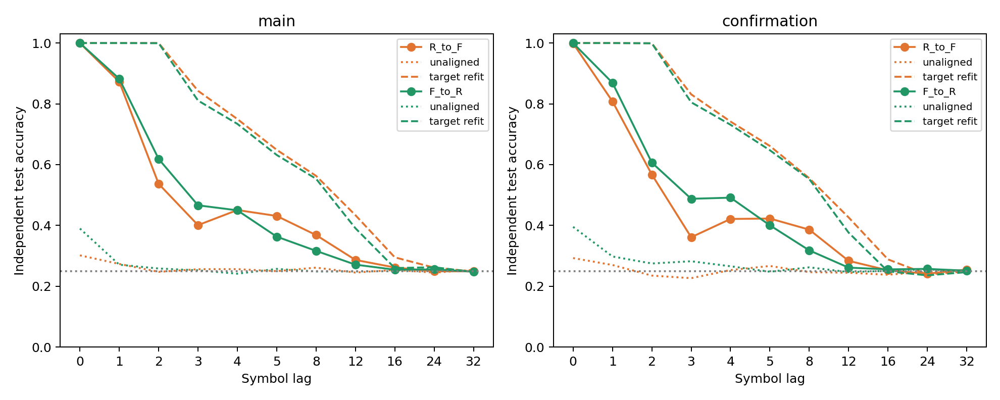

# 학습 구간 평균·표준편차 정렬 후 고정 출력층 전이 — ACT III

**정렬은 크게 개선했지만 충분하지 않았다.** 무보정 전이25–27%가 정렬 후49–53%로
올랐다. 양방향·두 집단 모두 사전 개선 기준 H1을 통과했지만, R²가 음수여서
과거 접근성의 복합 기준 H2는 실패했고 목표 refit의5%p 이내 유지 H3도 실패했다.
정확도가 대조군보다 높다는 결과를 부정하지 않으며, 사전 기준을 낮추지도 않는다.

Protocol commit `8f66851`, 실행 구현 `e83529b`.
[Protocol](moment-alignment-protocol.md) · [Config](../configs/moment_alignment.json).

## 1. Repository audit

직전 완료 revision `1f63e40`의 연구 방향, next-work, phase 상태, README·연구
문서, 기존 normalization/transfer 코드·config·checkpoint·manifest·최근 commit을
확인했다. 최초 전체 audit는 [연구 상태](research-status.md)에 유지되어 있다.
이번 작업은 이어지는 진단이며, 처음부터 모든 과거 실험을 재실행한 audit가 아니다.

앞선 “target fits=0”과 이번의 차이를 명시한다. 새 supervised 출력층 계수는
학습하지 않았지만, target 학습 상태에서 뉴런별 평균48개와 표준편차48개를
추정했다. 따라서 **head는 고정, 전처리는 적응**이다. target 정답·평가 통계는
정렬 함수에 들어가지 않는다. 기존 numerical source와 결과 7,168개는
해시가 그대로다. 현재 안내 문서의 다음 작업을 완료 상태로 갱신했다.

## 2. Reproduced baseline

모든34방향에서 source-only ridge refit과 독립 augmented least-squares 검증을
진행했고, 새 예측 전 기존 무보정 전이 checkpoint의 모든 배열을 정확 재현했다.
본 집단 R→F25.728%, F→R25.468%; 기존 확인 집단24.958%,27.172%가 유지됐다.
같은 target 상태에 대한 기존 refit은 각각80.077%,78.832%,79.817%,78.922%다.

앞서 구축한 locked Windows venv를 재사용했다. 이번에 새 환경을 만들거나
전체망을 다시 시뮬레이션하지 않았다. 실제 package/BLAS/CPU 정보는 새 manifest에
기록했고 별도 프로세스 검증을 실행했다. 새 독립 biological dataset도 아니다.

## 3. New implementation

- `scripts/moment_alignment.py`: target train feature만 받는 `fit_adapter`,
  고정 real/null head 적용, 원본 baseline 재현, paired 통계·판정·plot·manifest.
- `scripts/verify_moment_alignment.py`: 저장된 전체 trajectory에서 train 통계를
  재계산하고 symbol stream으로 label을 다시 만들며 score·raw 표·통계·판정을 검증.
- `tests/test_moment_alignment.py`: identity, 양의 affine 왜곡 복구, label/head
  변경 무관성, test 분포가 adapter를 바꾸지 않음, 상수 feature, 판정 분리를 검사.

수치적으로는 `z=(x_test−mu_target_train)/sigma_target_train`, `scores=zW_source+b_source`.
표준편차는 ddof0, floor1e−5. 이것은 source 좌표로 평균·크기를 맞춘 뒤 원래
source 표준화/head를 적용하는 식과 같으며, 그 경로도1e−9 허용치로 교차 검증했다.
source mean/scale와 실제·null 계수·절편은 byte-identical이다.

## 4. Experiments executed

R=`renormalized` D(B)B, F=`fixed_original` D(A)B. A는 실제 배선, B는 역할·차수를
보존하며 재배선한 원시망, D는 incoming absolute-sum 정규화 계수다. 이 실험의
두 조건은 **같은 재배선망 B**를 쓴다. 실제 배선 대 random의 비교가 아니다.

| circuit seed | 뉴런 | edge | threshold |
| --- | --- | --- | --- |
| 701 | 686 | 3309 | 5 |
| 702 | 686 | 3241 | 5 |


동일 입력·관측 ID와 입력 패턴, 동일 train/test 기호,48 MBON feature, K4.
warmup100 뒤 train2000/test1000; smoke는200/100. Main seed34142–34146,
archived confirmation41142–41144에 두 circuit strata701/702, 양방향을 모두 실행했다.
20 main +12 confirmation +2 smoke 방향,11lags로374개 lag 행이다.
smoke seed34001/c701은 결과 추론에서 제외했다. 독립표본 단위는 mapping seed이며
두 circuit과 여러 lag를 독립 표본으로 부풀리지 않는다.

Primary lags1,2,3,4,5,8을 평균하고 circuit 두 개를 평균했다. 모든 lag는
0,1,2,3,4,5,8,12,16,24,32. Ridge alpha1, task당48×4+4=196 supervised 계수,
11heads. 추가 target supervised fit/optimizer/update는0이다. Head 검증용 source
refit과 label-free target moment 추정은 이 숫자와 구분된다.

학습·평가 기호는 독립 iid stream이다. 평가에서 실제 기호를 계속 입력하는
과거 기호 해독이며, autonomous rollout이나 Pi Memory Score를 측정한 실험이 아니다.
confirmation은 이전 정규화 연구의 집단 이름이다. 이번 적응 설계는 그 데이터를
이미 관찰한 뒤 제안됐으므로 **새로운 fresh-seed confirmation이라고 부르지 않는다.**

## 5. Results

### 모든 mapping-seed block

정확도 단위 %, 변화량 %p. 각 값은 두 circuit과6개 primary lag 평균이다.
Circuit별 raw 결과와 모든 score/prediction은 별도로 보존했다.

| 집단 | seed | 정렬 R→F % | 정렬 F→R % | 개선 R→F pp | 개선 F→R pp |
| --- | --- | --- | --- | --- | --- |
| main | 34142 | 48.750 | 50.933 | 22.275 | 25.467 |
| main | 34143 | 55.200 | 57.700 | 29.100 | 31.800 |
| main | 34144 | 54.517 | 53.617 | 29.833 | 28.525 |
| main | 34145 | 47.650 | 46.800 | 22.842 | 21.125 |
| main | 34146 | 48.917 | 48.983 | 22.342 | 23.775 |
| confirmation | 41142 | 59.458 | 63.267 | 35.375 | 35.242 |
| confirmation | 41143 | 41.783 | 47.642 | 16.858 | 22.300 |
| confirmation | 41144 | 47.100 | 47.750 | 21.233 | 19.600 |


### 요약

| 집단 | 방향 | 무보정 % | 정렬 평균 % | 목표 refit % | 정렬 중앙값 % | 정렬 표본분산 pp² | bootstrap95 % |
| --- | --- | --- | --- | --- | --- | --- | --- |
| main | R→F | 25.728 | 51.007 | 80.077 | 48.917 | 12.6580 | [48.343, 53.773] |
| main | F→R | 25.468 | 51.607 | 78.832 | 50.933 | 17.9020 | [48.500, 55.140] |
| confirmation | R→F | 24.958 | 49.447 | 79.817 | 47.100 | 82.2335 | [41.783, 59.458] |
| confirmation | F→R | 27.172 | 52.886 | 78.922 | 47.750 | 80.8199 | [47.642, 63.267] |


| 집단 | 방향 | paired 차이 | 평균 pp | 중앙값 pp | 분산 pp² | bootstrap95 pp | paired dz | +/0/− |
| --- | --- | --- | --- | --- | --- | --- | --- | --- |
| main | R→F | 정렬−무보정 | 25.278 | 22.842 | 14.7336 | [22.415, 28.188] | 6.586 | 5/0/0 |
| main | R→F | 정렬−목표 refit | -29.070 | -31.017 | 13.4317 | [-31.847, -26.288] | -7.932 | 0/0/5 |
| main | F→R | 정렬−무보정 | 26.138 | 25.467 | 17.2302 | [23.053, 29.540] | 6.297 | 5/0/0 |
| main | F→R | 정렬−목표 refit | -27.225 | -26.742 | 16.5585 | [-30.448, -24.158] | -6.690 | 0/0/5 |
| confirmation | R→F | 정렬−무보정 | 24.489 | 21.233 | 93.6657 | [16.858, 35.375] | 2.530 | 3/0/0 |
| confirmation | R→F | 정렬−목표 refit | -30.369 | -32.283 | 103.6660 | [-39.458, -19.367] | -2.983 | 0/0/3 |
| confirmation | F→R | 정렬−무보정 | 25.714 | 22.300 | 69.9064 | [19.600, 35.242] | 3.075 | 3/0/0 |
| confirmation | F→R | 정렬−목표 refit | -26.036 | -30.508 | 94.2106 | [-32.700, -14.900] | -2.682 | 0/0/3 |


Bootstrap10,000회, seed49399; main n5, confirmation n3를 따로 계산했다.
작은 block 수에서 구간과 dz는 기술통계이며, 광범위한 모집단 보증이나 p-value
대용의 성공 판정이 아니다. Ordinary cell 통계에는 paired effect size를 붙이지 않았다.

### 대조군과 사전 판정

| 집단 | 방향 | majority % | aligned null % | R² | MSE | H1 개선 | H2 접근 | H3 유지 |
| --- | --- | --- | --- | --- | --- | --- | --- | --- |
| main | R→F | 24.043 | 23.938 | -1.6159 | 0.4908 | True | False | False |
| main | F→R | 24.043 | 25.717 | -1.5615 | 0.4806 | True | False | False |
| confirmation | R→F | 25.456 | 26.331 | -2.3973 | 0.6371 | True | False | False |
| confirmation | F→R | 25.456 | 27.272 | -1.5381 | 0.4761 | True | False | False |


모든 방향·집단에서 정확도 대조 margin은 통과했지만 평균 R²>0 조건은 실패했다.
R²는 source 학습빈도의 상수 예측보다 squared score error가 작은지를 평가한다.
Argmax 정확도와 다른 속성이므로 둘이 엇갈릴 수 있다. 예측 score는 확률이나
confidence가 아니다. 음수 R²를 제거하거나 평가 후 clip하지 않았다.



실선: 정렬, 점선: 무보정, 파선: target refit. 주황R→F, 초록F→R.
[지연별 raw](../results/moment_alignment/raw-lag-table.csv) ·
[circuit별 primary](../results/moment_alignment/raw-past-table.csv) ·
[seed block](../results/moment_alignment/seed-blocks.csv).

## 6. Interpretation

뉴런별 평균·크기를 맞추는 label-free 전처리만으로 전이 실패의 일부를 줄였다.
따라서 이전 실패의 전부를 표현 소실로 설명할 수 없다. 그러나 target에서 별도
학습한 head와의 큰 차이는 남았다. 이 실험은 평균과 scale을 함께 개입했으므로
둘 중 어느 것이 더 중요한지 분리하지 않았고, 남은 실패의 원인도 특정하지 않았다.

중심화 시간 상관이 높아도 decoder가 사용하는 작은 상태 차이가 증폭될 수 있다.
이것은 후속 진단을 위한 가설이며 이번 결과만으로 확정된 메커니즘은 아니다.
학습/평가 stream은 분리했지만 관찰된 두 집단을 다시 쓴 탐색적 후속 연구라는
한계가 있다. 구조 자체의 우위나 일반화된 정보저장 용량으로 해석하지 않는다.

## 7. Negative findings

본 집단 target refit 대비 R→F−29.070%p, F→R−27.225%p;
기존 확인 집단−30.369%p,−26.036%p. 양방향5%p 유지 기준에 실패했다.
모든 집단의 평균 R²가 음수여서 사전 복합 접근성 기준도 실패했다.
정렬로 완전 회복했다는 주장, 이전 정규화 개입의1%p 확인 실패를 뒤집는 주장,
실제 배선 또는 전체망 우위 주장은 지지되지 않는다. 실패 artifact를 모두 유지했다.

## 8. What we can claim

실제 초파리 connectome 구조에서 만든 이 계산 모델의 재배선 대조 조건들에서,
훈련 구간의 label-free 평균·표준편차 보정이 고정 외부 head의 과거 기호 정확도를
높였다. 새 target supervised 학습 없이 발생한 개선이며, 결과가 있는 모든
paired mapping-seed block에서 같은 방향이다. 다만 등록한 완전 전이 기준은 실패했다.

## 9. What we cannot claim

목표 상태에 정보가 없다는 결론, 일반적인 전이 성공, 확률 calibration, autonomous
recall 향상, formal memory capacity, 생물학적 학습, 내부 연결 학습, 전체망 또는
실제 topology 우위를 주장하지 않는다. 실제 초파리에게 π를 외우게 한 결과가 아니다.
평균·scale 이외의 좌표 보정이 성공할 것이라는 보장도 없다.

## 10. Reproducibility

34개 source refit/독립 solver 확인,34개 무보정 exact replay,34개 새 checkpoint
exact replay를 통과했다. 별도 verifier는374개 lag 행, source/target pairing,
train-only moments, 원래 label alignment, score, 통계와 모든 판정을 검증했다.
전체 테스트186개 통과, optional dependency8개 skip. 검증 로그를 함께 보존했다.

실행 시간 22.90초,50ms 간격 표본 peak RSS
163.21MiB. 샘플링 값은 실제 peak의 상한이 아니다.
Windows/Python3.12.10, NumPy2.3.5, SciPy1.17.0, pandas2.2.3, threadpoolctl3.6.0,
BLAS single thread. 전체 환경은 [manifest](../results/moment_alignment/manifest.json)에 기록했다.
별도 검증의 환경 snapshot은 thread 제한 함수가 종료된 뒤라 BLAS 기본값12를
표시한다. 실제 score/refit 검증 구간은 decorator로1thread에 고정했다.
[baseline 기록](../results/moment_alignment/baselines.json) ·
[독립 검증](../results/moment_alignment_validation/checks.json) ·
[의존성 lock](../requirements-act1-lock.txt).

저장소 루트, Python3.12 locked venv에서 항상 새 경로를 사용한다:

```powershell
$env:PYTHONPATH='src'
.venv/Scripts/python.exe scripts/moment_alignment.py --out outputs/moment_new
.venv/Scripts/python.exe scripts/verify_moment_alignment.py --out outputs/moment_check_new outputs/moment_new
```

실행 commit `e83529b`의 protocol/config/source hash는 manifest에 고정되어 있다.
원래 trajectory 생성 구현은 `1c55c80`, 무보정 전이는 `04f8b32`다. 새 checkpoint에는
frozen source 계수, target moments, 정렬·null·무보정 scores, target labels/features,
source within과 target refit scores를 저장했다. Source trajectory 경로와 manifest
hash도 각각 기록했다. 기존 결과와 historical hash를 갱신하지 않았다.

## 11. Next highest-information experiment

**정렬 후 남은 상태 차이가 출력층에서 얼마나 증폭되는지 singular-mode별로 분해한다.**
Source 학습 상태로만 PCA/SVD 기준을 정하고, paired target−source 상태 차이와
고정 head의 결합을 분해한다. 작은 분산 방향에 실린 오차가 출력 score 오차를
주도하는지 확인하는 한 진단이다. 기준·집계법을 먼저 고정하고 기존 두 집단과
양방향 모두 보고한다. 새 head·rotation fit이나 gain sweep은 하지 않는다.
이 단계는 **제안이며 아직 실행하지 않았다.**
