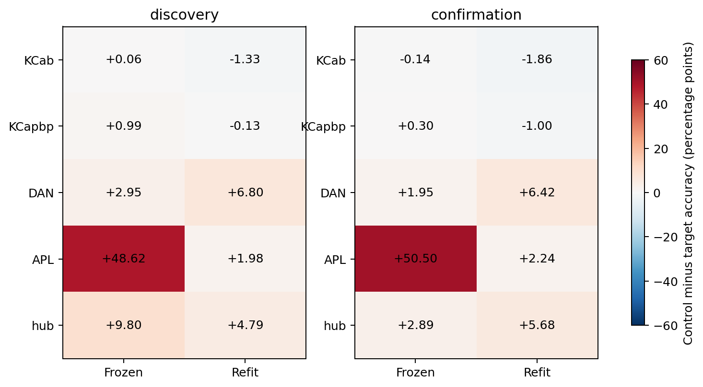

# ACT III-A: 뉴런 집단 제거 연구의 현행 모델 범위 종료

**입력 대조·집단 패널·새 seed 확인·독립 검증까지 완료했다.**
사전등록한 양쪽 cohort 확인 기준을 통과한 집단/해독 방식: **refit/DAN, frozen/APL**.
현재 두686-neuron 부분 회로의 연구 단락을 종료한다. Whole-brain/downstream
전체 위치 규명과 ACT III 전체 완료를 의미하지 않는다.

DAN 주석 집단을 제거한 뒤 재학습한 해독기의 정확도는 discovery69.364%,
confirmation68.900%였다. 제거 수·직접 입력을 맞춘 대조군은76.162%,75.317%였다.
추가 손상6.798/6.417%p가 두 cohort의 모든 seed에서 양수이며 사전5%p 기준을
통과했다. 이는 이 모델/선형 해독기에서 접근 가능한 과거 기호 정보가 감소했다는
증거이며,정보가 전부 사라졌거나 dopamine 학습이 작동했다는 뜻은 아니다.

APL은 다른 패턴이다. 확인 cohort에서 기존 출력층25.353% 대 대조75.852%로
크게 떨어졌지만 재학습하면74.803% 대77.044%였다. Frozen 추가 손상은 확인됐으나
refit 추가 손상2.242%p는5%p 기준 미달이다. 따라서 상태 변화에 대한 기존 해독기의
민감성과 재학습 후 정보 접근성을 구분해야 한다.

APL1개 제거는 평균1,140개 연결을 없애지만 random1개는평균3.94개만 없앤다.
이 큰 차이 때문에 APL이라는 세포 종류 자체의 특별한 효과라고 단정할 수 없다.
DAN도 연결 수/strength가 정확히 matched된 것은 아니다(538 edges 대750 평균).
KCab/KCapbp의 특이적5%p 손상은 지지되지 않았다. Hub는 discovery에서는 frozen,
confirmation에서는 refit gate만 통과해 SAME-mode 독립 확인은 실패했다.
유리한 cohort/해독 방식만 서로 섞어 성공으로 만들지 않는다.


## 1. Repository audit

기준 `a6bcbea`에서 README,docs,configs,scripts,src,tests,기존 결과·manifest·checkpoint,
최근 commits와 우선순위를 확인했다. 이전 KCγ frozen/refit 확인은 완료됐지만
다른 집단과 입력/연결 효과 분리가 남아 있었다. 이를 세 work package로 고정했다.
[사전 protocol](neuron-panel-protocol.md) commit `3773074`, 구현 `5e13acd`,
입력 대조 결과 `dea3c7a`; 새 결과를 본 뒤 기준을 바꾸지 않았다.

[Annotation audit](neuron-panel-annotation-audit.json): 두 회로 모두 KC512,MBON48,
DAN125,APL1. KCγ에 이어 KCab/KCapbp를 평가했다. Downstream 집단은 포함되지
않아 평가하지 못했다. MBON 전체 제거는 관측 경로 제거의 engineering control로
구분했다. 모든 집단에 degree-matched control이 있다고 표현하지 않는다.
[Seed audit](neuron-panel-seed-audit.json):126개 신규 실험 seed의 기존 config/result
seed 충돌0. 입력 대조는 기존 seed를 의도적으로 재사용했다.
집단 패널 실행 전 9,046개 결과 파일의 해시가 보존됐다.

## 2. Reproduced baseline

`results/structural_k4_main/real_c701_s34142`의 모든 checkpoint 배열·metric을 입력 대조와 패널 각각에서
정확하게 재현했다. 기대/실측 primary past-lag 정확도 **75.483%**.
새 파이프라인의 intact 기준도 각 cohort/seed/circuit에서 재생성·독립 refit했다.
기존 `requirements-act1-lock.txt` 환경을 사용했으며 이번에 환경을 새로 설치한
것은 아니다. Python·NumPy·SciPy·BLAS 등 실제 환경은 최상위 manifest에 저장했다.

## 3. New implementation

[Runner](../scripts/neuron_panel.py)는 입력-only와 full-neuron lesion을 분리한다.
전체 제거는 recurrent 행/열과 직접 입력을0으로 만들고, 입력-only는 모든 연결을
보존한다. 생존 가중치를 다시 정규화하지 않는다.48 MBON 관측 슬롯과 지연별196
readout 계수를 유지하며 frozen은 source 전처리·계수,refit은 target 학습 상태를 쓴다.
기존 수치 모듈은 수정하지 않았다.0 상태의 decay 비율은 null로 명시했다.
[Independent verifier](../scripts/verify_neuron_panel.py)는 annotation/matching,
가중치·입력 개입,별도 상태 갱신식,독립 최소제곱 해독,metric/통계를 검사한다.

## 4. Experiments executed

- 입력-only: smoke4+main24=28조건, seed71142–71144, 이전 γ/matched 마스크와
  동일 입력·수열·고정 source head. 결과는 [별도 보고서](neuron-input-results.md).
- 집단 패널: intact+5집단×(target+3controls)+all-KC/all-MBON=23조건.
  Smoke23,discovery138,confirmation138=299조건. 모든 확인 조건을 실행했다.
- Discovery mapping81142–81144, train82142–82144,test83142–83144;
  confirmation91142–91144,92142–92144,93142–93144. Control RNG는 config에 전부 명시했다.
- 고정 K4,독립 의사난수 train/test,100 wash-in,train2000/test1000,lag11개 중
  1/2/3/4/5/8을 primary로 사용.2개 회로를 seed 내 평균,독립 단위는 cohort당3개.
- incoming-L1,gain0.9,leak0.6,mbon_after_kc,input0.1/0.5,ridge alpha1 고정.
  Confirmation도 같은 두 생물학적 source 회로이므로 새로운 개체 반복이 아니다.

전체327조건 full replay/independent refit,314 frozen evaluations,
독립 구현의654 train/test trajectory 재현,총7,051 lag-metric rows 검증.
Smoke 결과는 main 통계에 포함하지 않았다. 패널 runtime 242.71s,
샘플링 peak RSS 181.31MiB;
입력 대조 39.45s/167.63MiB.
메모리는50ms 샘플링이며 순간 최댓값의 엄밀한 상한은 아니다.

## 5. Results

아래는 primary 과거 기호 해독 정확도(%). F=frozen,R=refit,대조는3 masks 평균.
Gate는 intact 대비 손상과 대조 대비 추가 손상 모두 평균5%p 이상,세 seed 모두
양수,정상 intact 접근성이라는 사전 조건이다. 같은 gate가 두 cohort에서 통과해야 확인이다.

| Cohort | Target | Target F | Control F | Target R | Control R | F gate | R gate |
| --- | --- | --- | --- | --- | --- | --- | --- |
| discovery | KCab | 26.481 | 26.543 | 78.736 | 77.406 | False | False |
| discovery | KCapbp | 25.792 | 26.785 | 77.650 | 77.523 | False | False |
| discovery | DAN | 26.283 | 29.235 | 69.364 | 76.162 | False | True |
| discovery | APL | 24.581 | 73.198 | 75.533 | 77.508 | True | False |
| discovery | hub | 24.833 | 34.637 | 72.497 | 77.283 | True | False |
| confirmation | KCab | 26.292 | 26.154 | 78.389 | 76.532 | False | False |
| confirmation | KCapbp | 25.942 | 26.246 | 77.669 | 76.670 | False | False |
| confirmation | DAN | 26.497 | 28.452 | 68.900 | 75.317 | False | True |
| confirmation | APL | 25.353 | 75.852 | 74.803 | 77.044 | True | False |
| confirmation | hub | 26.067 | 28.960 | 71.281 | 76.956 | False | True |




Seed별 raw 비교(% 및 차이%p):

| Cohort | Seed | Group | Mode | Intact | Target | Control | Intact−target | Control−target |
| --- | --- | --- | --- | --- | --- | --- | --- | --- |
| discovery | 81142 | KCab | refit | 77.658 | 78.500 | 77.344 | -0.842 | -1.156 |
| discovery | 81143 | KCab | refit | 76.867 | 78.867 | 77.264 | -2.000 | -1.603 |
| discovery | 81144 | KCab | refit | 78.033 | 78.842 | 77.608 | -0.808 | -1.233 |
| discovery | 81142 | KCapbp | refit | 77.658 | 78.092 | 77.186 | -0.433 | -0.906 |
| discovery | 81143 | KCapbp | refit | 76.867 | 77.000 | 77.336 | -0.133 | 0.336 |
| discovery | 81144 | KCapbp | refit | 78.033 | 77.858 | 78.047 | 0.175 | 0.189 |
| discovery | 81142 | DAN | refit | 77.658 | 68.958 | 75.858 | 8.700 | 6.900 |
| discovery | 81143 | DAN | refit | 76.867 | 69.500 | 75.367 | 7.367 | 5.867 |
| discovery | 81144 | DAN | refit | 78.033 | 69.633 | 77.261 | 8.400 | 7.628 |
| discovery | 81142 | APL | refit | 77.658 | 75.517 | 77.653 | 2.142 | 2.136 |
| discovery | 81143 | APL | refit | 76.867 | 75.083 | 76.850 | 1.783 | 1.767 |
| discovery | 81144 | APL | refit | 78.033 | 76.000 | 78.022 | 2.033 | 2.022 |
| discovery | 81142 | hub | refit | 77.658 | 71.858 | 76.417 | 5.800 | 4.558 |
| discovery | 81143 | hub | refit | 76.867 | 71.933 | 77.111 | 4.933 | 5.178 |
| discovery | 81144 | hub | refit | 78.033 | 73.700 | 78.322 | 4.333 | 4.622 |
| discovery | 81142 | KCab | frozen | 77.658 | 24.692 | 26.125 | 52.967 | 1.433 |
| discovery | 81143 | KCab | frozen | 76.867 | 27.675 | 26.992 | 49.192 | -0.683 |
| discovery | 81144 | KCab | frozen | 78.033 | 27.075 | 26.511 | 50.958 | -0.564 |
| discovery | 81142 | KCapbp | frozen | 77.658 | 24.883 | 26.175 | 52.775 | 1.292 |
| discovery | 81143 | KCapbp | frozen | 76.867 | 26.717 | 28.044 | 50.150 | 1.328 |
| discovery | 81144 | KCapbp | frozen | 78.033 | 25.775 | 26.136 | 52.258 | 0.361 |
| discovery | 81142 | DAN | frozen | 77.658 | 26.067 | 28.842 | 51.592 | 2.775 |
| discovery | 81143 | DAN | frozen | 76.867 | 27.433 | 27.222 | 49.433 | -0.211 |
| discovery | 81144 | DAN | frozen | 78.033 | 25.350 | 31.642 | 52.683 | 6.292 |
| discovery | 81142 | APL | frozen | 77.658 | 24.642 | 74.919 | 53.017 | 50.278 |
| discovery | 81143 | APL | frozen | 76.867 | 24.842 | 69.442 | 52.025 | 44.600 |
| discovery | 81144 | APL | frozen | 78.033 | 24.258 | 75.233 | 53.775 | 50.975 |
| discovery | 81142 | hub | frozen | 77.658 | 24.675 | 30.172 | 52.983 | 5.497 |
| discovery | 81143 | hub | frozen | 76.867 | 25.350 | 36.161 | 51.517 | 10.811 |
| discovery | 81144 | hub | frozen | 78.033 | 24.475 | 37.578 | 53.558 | 13.103 |
| confirmation | 91142 | KCab | refit | 77.125 | 77.867 | 76.047 | -0.742 | -1.819 |
| confirmation | 91143 | KCab | refit | 75.825 | 78.092 | 76.397 | -2.267 | -1.694 |
| confirmation | 91144 | KCab | refit | 78.267 | 79.208 | 77.153 | -0.942 | -2.056 |
| confirmation | 91142 | KCapbp | refit | 77.125 | 77.683 | 76.406 | -0.558 | -1.278 |
| confirmation | 91143 | KCapbp | refit | 75.825 | 76.692 | 76.106 | -0.867 | -0.586 |
| confirmation | 91144 | KCapbp | refit | 78.267 | 78.633 | 77.500 | -0.367 | -1.133 |
| confirmation | 91142 | DAN | refit | 77.125 | 67.842 | 75.442 | 9.283 | 7.600 |
| confirmation | 91143 | DAN | refit | 75.825 | 68.992 | 74.769 | 6.833 | 5.778 |
| confirmation | 91144 | DAN | refit | 78.267 | 69.867 | 75.739 | 8.400 | 5.872 |
| confirmation | 91142 | APL | refit | 77.125 | 74.683 | 77.122 | 2.442 | 2.439 |
| confirmation | 91143 | APL | refit | 75.825 | 74.292 | 75.825 | 1.533 | 1.533 |
| confirmation | 91144 | APL | refit | 78.267 | 75.433 | 78.186 | 2.833 | 2.753 |
| confirmation | 91142 | hub | refit | 77.125 | 70.708 | 76.439 | 6.417 | 5.731 |
| confirmation | 91143 | hub | refit | 75.825 | 71.075 | 76.658 | 4.750 | 5.583 |
| confirmation | 91144 | hub | refit | 78.267 | 72.058 | 77.769 | 6.208 | 5.711 |
| confirmation | 91142 | KCab | frozen | 77.125 | 27.350 | 26.314 | 49.775 | -1.036 |
| confirmation | 91143 | KCab | frozen | 75.825 | 25.733 | 25.581 | 50.092 | -0.153 |
| confirmation | 91144 | KCab | frozen | 78.267 | 25.792 | 26.567 | 52.475 | 0.775 |
| confirmation | 91142 | KCapbp | frozen | 77.125 | 24.858 | 25.983 | 52.267 | 1.125 |
| confirmation | 91143 | KCapbp | frozen | 75.825 | 25.700 | 25.711 | 50.125 | 0.011 |
| confirmation | 91144 | KCapbp | frozen | 78.267 | 27.267 | 27.044 | 51.000 | -0.222 |
| confirmation | 91142 | DAN | frozen | 77.125 | 25.633 | 28.356 | 51.492 | 2.722 |
| confirmation | 91143 | DAN | frozen | 75.825 | 26.483 | 28.267 | 49.342 | 1.783 |
| confirmation | 91144 | DAN | frozen | 78.267 | 27.375 | 28.733 | 50.892 | 1.358 |
| confirmation | 91142 | APL | frozen | 77.125 | 25.533 | 76.478 | 51.592 | 50.944 |
| confirmation | 91143 | APL | frozen | 75.825 | 25.692 | 75.808 | 50.133 | 50.117 |
| confirmation | 91144 | APL | frozen | 78.267 | 24.833 | 75.269 | 53.433 | 50.436 |
| confirmation | 91142 | hub | frozen | 77.125 | 26.175 | 28.358 | 50.950 | 2.183 |
| confirmation | 91143 | hub | frozen | 75.825 | 26.658 | 28.556 | 49.167 | 1.897 |
| confirmation | 91144 | hub | frozen | 78.267 | 25.367 | 29.967 | 52.900 | 4.600 |


Control−target 통계(variance는%p²,CI는3 seed block bootstrap95%,10,000회).
작은 표본의 구간이며 p-value나 family-wise significance 주장이 아니다.
paired dz가 크더라도 작은 표본/구조적 confound 한계는 사라지지 않는다.

| Cohort | Group | Mode | Mean | Median | Variance | CI | Paired dz | +/0/− |
| --- | --- | --- | --- | --- | --- | --- | --- | --- |
| discovery | KCab | frozen | 0.062 | -0.564 | 1.41391 | [-0.683, 1.433] | 0.052 | 1/0/2 |
| discovery | KCab | refit | -1.331 | -1.233 | 0.05709 | [-1.603, -1.156] | -5.569 | 0/0/3 |
| discovery | KCapbp | frozen | 0.994 | 1.292 | 0.30028 | [0.361, 1.328] | 1.813 | 3/0/0 |
| discovery | KCapbp | refit | -0.127 | 0.189 | 0.46020 | [-0.906, 0.336] | -0.187 | 2/0/1 |
| discovery | DAN | frozen | 2.952 | 2.775 | 10.59499 | [-0.211, 6.292] | 0.907 | 2/0/1 |
| discovery | DAN | refit | 6.798 | 6.900 | 0.78316 | [5.867, 7.628] | 7.682 | 3/0/0 |
| discovery | APL | frozen | 48.618 | 50.278 | 12.22732 | [44.600, 50.975] | 13.904 | 3/0/0 |
| discovery | APL | refit | 1.975 | 2.022 | 0.03579 | [1.767, 2.136] | 10.439 | 3/0/0 |
| discovery | hub | frozen | 9.804 | 10.811 | 15.22227 | [5.497, 13.103] | 2.513 | 3/0/0 |
| discovery | hub | refit | 4.786 | 4.622 | 0.11607 | [4.558, 5.178] | 14.048 | 3/0/0 |
| confirmation | KCab | frozen | -0.138 | -0.153 | 0.82020 | [-1.036, 0.775] | -0.152 | 1/0/2 |
| confirmation | KCab | refit | -1.856 | -1.819 | 0.03363 | [-2.056, -1.694] | -10.124 | 0/0/3 |
| confirmation | KCapbp | frozen | 0.305 | 0.011 | 0.51837 | [-0.222, 1.125] | 0.423 | 2/0/1 |
| confirmation | KCapbp | refit | -0.999 | -1.133 | 0.13312 | [-1.278, -0.586] | -2.738 | 0/0/3 |
| confirmation | DAN | frozen | 1.955 | 1.783 | 0.48706 | [1.358, 2.722] | 2.801 | 3/0/0 |
| confirmation | DAN | refit | 6.417 | 5.872 | 1.05244 | [5.778, 7.600] | 6.255 | 3/0/0 |
| confirmation | APL | frozen | 50.499 | 50.436 | 0.17428 | [50.117, 50.944] | 120.966 | 3/0/0 |
| confirmation | APL | refit | 2.242 | 2.439 | 0.40093 | [1.533, 2.753] | 3.540 | 3/0/0 |
| confirmation | hub | frozen | 2.894 | 2.183 | 2.20452 | [1.897, 4.600] | 1.949 | 3/0/0 |
| confirmation | hub | refit | 5.675 | 5.711 | 0.00640 | [5.583, 5.731] | 70.956 | 3/0/0 |


Graph audit: 제거 수는c701/c702,edge/degree는전체 main+confirmation 평균.
KC subtype만 joint in/out degree와 직접 입력 bitmask를 정확히 맞췄다.
DAN/APL/hub는 수와 입력 노출만 맞췄으며 아래 degree/edge 차이를 보존한다.
대조 pool에 target이 포함되므로 overlap이0이라고 가정하지 않는다.

| Group | Neuron count | Target edges | Control edges | Overlap range | In-degree target/control | Out-degree target/control |
| --- | --- | --- | --- | --- | --- | --- |
| KCab | 165 / 201 | 1131.0 | 1142.3 | 50.9–65.7% | 218.5/218.5 | 942.0/942.0 |
| KCapbp | 93 / 85 | 492.5 | 498.7 | 23.5–41.9% | 107.5/107.5 | 395.0/395.0 |
| DAN | 125 / 125 | 538.0 | 750.0 | 20.8–35.2% | 296.0/254.8 | 250.0/532.6 |
| APL | 1 / 1 | 1140.0 | 3.9 | 0.0–0.0% | 566.0/0.9 | 574.0/3.0 |
| hub | 32 / 32 | 1500.5 | 201.5 | 0.0–12.5% | 750.5/63.6 | 828.0/140.1 |


확인 cohort 신경 상태 평균:

| Group | Effective rank | Active neurons | MBON norm | Sparsity | Decay32 ratio |
| --- | --- | --- | --- | --- | --- |
| intact | 6.355 | 647.00 | 0.12673 | 0.000 | 6.35e-07 |
| KCab | 5.975 | 459.00 | 0.12076 | 0.000 | 2.85e-08 |
| KCapbp | 6.267 | 554.00 | 0.08278 | 0.000 | 7.56e-08 |
| DAN | 5.101 | 561.00 | 0.12014 | 0.000 | 5.17e-07 |
| APL | 6.254 | 314.66 | 0.20311 | 0.000 | 4.87e-08 |
| hub | 5.811 | 281.68 | 0.16169 | 0.000 | 1.08e-08 |
| all_KC | 0.000 | 0.00 | 0.00000 | 1.000 | undefined (zero baseline) |
| all_MBON | 0.000 | 566.50 | 0.00000 | 1.000 | undefined (zero baseline) |


전체 개별 condition/lag,확률이 아닌 affine score,checkpoint,neural/graph audit는
[raw lag table](../results/neuron_population_panel/raw-lag-table.csv),
[seed blocks](../results/neuron_population_panel/seed-blocks.csv),
[paired differences](../results/neuron_population_panel/paired-differences.csv),
[summary](../results/neuron_population_panel/summary.json),
[graph audit](../results/neuron_population_panel/graph-audit.csv),
[neural diagnostics](../results/neuron_population_panel/neural-diagnostics.csv)에 보존했다.
단일 평균만 남기지 않았다.

## 6. Interpretation

DAN 주석 집단을 제거한 뒤 재학습한 해독기의 정확도는 discovery69.364%,
confirmation68.900%였다. 제거 수·직접 입력을 맞춘 대조군은76.162%,75.317%였다.
추가 손상6.798/6.417%p가 두 cohort의 모든 seed에서 양수이며 사전5%p 기준을
통과했다. 이는 이 모델/선형 해독기에서 접근 가능한 과거 기호 정보가 감소했다는
증거이며,정보가 전부 사라졌거나 dopamine 학습이 작동했다는 뜻은 아니다.

APL은 다른 패턴이다. 확인 cohort에서 기존 출력층25.353% 대 대조75.852%로
크게 떨어졌지만 재학습하면74.803% 대77.044%였다. Frozen 추가 손상은 확인됐으나
refit 추가 손상2.242%p는5%p 기준 미달이다. 따라서 상태 변화에 대한 기존 해독기의
민감성과 재학습 후 정보 접근성을 구분해야 한다.

APL1개 제거는 평균1,140개 연결을 없애지만 random1개는평균3.94개만 없앤다.
이 큰 차이 때문에 APL이라는 세포 종류 자체의 특별한 효과라고 단정할 수 없다.
DAN도 연결 수/strength가 정확히 matched된 것은 아니다(538 edges 대750 평균).
KCab/KCapbp의 특이적5%p 손상은 지지되지 않았다. Hub는 discovery에서는 frozen,
confirmation에서는 refit gate만 통과해 SAME-mode 독립 확인은 실패했다.
유리한 cohort/해독 방식만 서로 섞어 성공으로 만들지 않는다.


Representation은 상태에 남는 과거 입력,decoding은 이를 읽는 출력층,
learning은 내부 연결 변화다. 이번에는 내부 연결을 학습하지 않았다.
입력-only에서는 γ refit 이득+0.417%p,matched+1.104%p로 두 경우 모두5%p 미만;
frozen은 각각−0.086/−0.551%p. Recurrent 활동과 상태 차이는 존재하지만
등록한 material effect는 성립하지 않았다. 차이가 정확히0이라는 뜻은 아니다.

## 7. Negative findings

두 cohort 모두 사전 기준을 통과하지 못한 모든 group/mode도 위 표와 원본에
유지했다. 관측 슬롯을 없앤 MBON control과 입력을 없앤 KC control의 실패는
작동 확인이지 특정 내부 memory circuit의 증거가 아니다. Group counts/edge
counts가 다른 집단끼리 단순 성능 순위를 곧바로 biological importance 순위로
해석할 수 없다. Unbounded frozen score의 음수R2도 clipping 없이 보존했다.
이 패널은 자율 회상 개선을 실험하지 않았고,이전 ACT I의 negative 결과를 바꾸지 않는다.

## 8. What we can claim

사전 고정된 두 부분 connectome 기반 rate 모델에서 입력 차단/뉴런 제거의
지연 기호 해독 영향을 측정했고,고정 출력층과 재학습 조건을 분리했다.
확인된 material sensitivity 목록은 `refit/DAN, frozen/APL`이며 위 matching 한계 안에서만
해석한다. 현행 모델의 ACT III-A bounded panel과 KCγ 선행 연구를 함께 완료했다.

## 9. What we cannot claim

실제 초파리의 지능/원주율 암기,생물학적 memory circuit,connectome 내부 학습,
formal reservoir memory capacity,arbitrary autonomous sequence-memory capacity,
whole-brain/downstream neuron localization은 이번 결과로 주장할 수 없다.
Neuron lesion은 incident edge 수/strength도 바꾸므로 세포 종류와 연결량의
독립 효과를 분리하지 못한 집단이 있다. ACT III-B/C/D,IV,V 전체는 미완료다.

## 10. Reproducibility

Protocol/config-before-outcome commit `3773074`, implementation-before-run `5e13acd`.
Panel execution revision `dea3c7a9da73f1bcaf069d1d3420b25fd1d2678f`.
Pinned config hash `2dd04199e44c141c8648005dc89ae0be0649d77d820b3812c5cf11a256af41b7`.
[Config](../configs/neuron_panel.json),[protocol](neuron-panel-protocol.md),
[input manifest](../results/neuron_input_control/manifest.json),
[panel manifest](../results/neuron_population_panel/manifest.json),
[input checks](../results/neuron_input_validation/checks.json),
[panel checks](../results/neuron_population_validation/checks.json),
[test suite](../results/neuron_population_validation/test-suite.json).
각 case `checkpoint.npz`는 refit,`frozen.npz`는 동일 source head의 frozen 평가,
`weights.npz`는 개입 후 고정 회로다. Manifest가 config·dataset seed·그래프/소스
해시·checkpoint 경로·환경을 묶는다. 전체 테스트 **206 passed,8 optional skipped**.
과거 검증은 기록된 revision의 source를 사용한다.

```powershell
$env:PYTHONPATH='src'
python scripts/neuron_panel.py --package input --out outputs/neuron_input_new
python scripts/verify_neuron_panel.py outputs/neuron_input_new --out outputs/neuron_input_check_new
python scripts/neuron_panel.py --package panel --out outputs/neuron_panel_new
python scripts/verify_neuron_panel.py outputs/neuron_panel_new --out outputs/neuron_panel_check_new
python -m pytest -q
```

항상 새 출력 경로 사용. Runner는 구현이 commit된 clean checkout에서 실행하며,
위 예시의 outputs 경로는 gitignored이므로 두 package를 이어 실행할 수 있다.
원본 results에 실행하면 앞 package를 검증·commit한 다음 이어 실행한다.

## 11. Next highest-information experiment

**ACT III-B: DAN 관련 연결 제거를 같은 edge 수와 사전 정의한 weight 구간을
맞춘 무작위 edge 제거와 비교하는 실험 하나.** 뉴런 수·직접 입력·48 MBON 관측을
유지하고 frozen/refit을 계속 분리한다. DAN group의 재학습 후 손상이 단순한
연결 제거량을 넘는지 검증하는 것이 목적이다. 이번에는 새 protocol만 제안하며
아직 실행하지 않았다. Internal plasticity로 넘어가지 않는다.

## Completion scope ledger

| ACT III-A 항목 | 현재 상태 |
|---|---|
| KCγ/full/disjoint matched + frozen/refit + 새 seed 확인 | 기존 연구 완료,변경 없음 |
| 같은 mask의 입력-only 대조 | 이번28조건 완료,5%p 기준 실패 |
| KCab/KCapbp/DAN/APL/high-degree hub panel | 이번299조건 완료,양 cohort 모두 보존 |
| All-KC/all-MBON controls | 입력/관측 제거 작동 확인 완료;세포 특이성 주장 제외 |
| Frozen/refit 분리,raw seeds,paired statistics,민감도 지도 | 완료 |
| Whole-brain/downstream 및 자율 회상에서의 집단 위치 규명 | 현행 패널 범위 밖,미검증 확장으로 유지 |
| ACT III-B edge / C matched topology / D critical subnetwork | 이 단락 종료와 별개,전체 완료 아님 |
