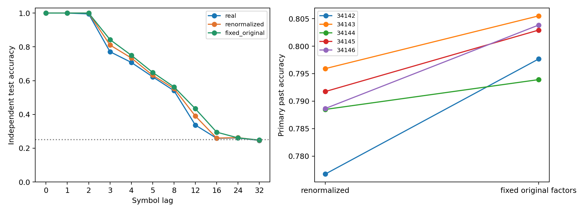
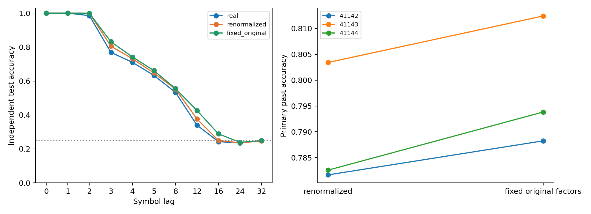
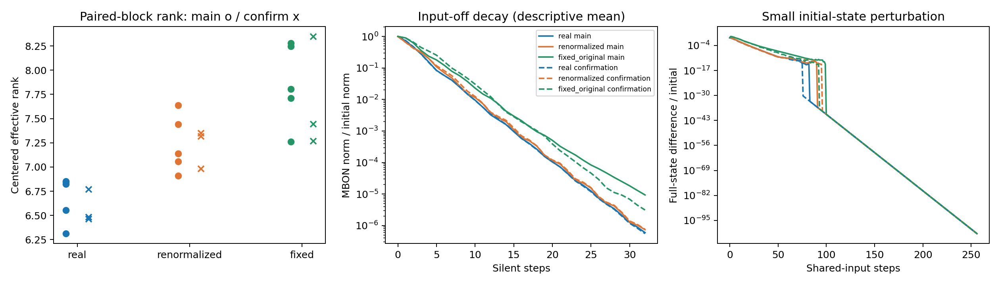

# 정규화 계수 고정 대조 — ACT III 결과

**본 실험의 차이는 발견됐지만, 사전 등록한 확인 기준은 실패했다.**
원래 실제망의 정규화 계수를 고정한 재배선망은 기존 재정규화 조건보다 과거
기호를 더 잘 해독했다. 평균 이득은 본 실험 1.245%p, 새 seed 확인 0.894%p였다.
확인 집단의 평균이 사전 기준 1%p에 못 미쳐 “1%p 이상 효과가 확인됐다”고
말하지 않는다. 두 집단을 합치거나 기준을 낮추지 않았다.

Protocol commit `0d7b8f8`, 실행 구현 `1c55c80`.
[Protocol](normalization-control-protocol.md) · [Config](../configs/normalization_control.json).

## 1. Repository audit

기준 revision `6b1d201`의 구조 대조 결과, 연구 방향·다음 작업·로드맵·원래
phase 상태, 정규화/재배선/시간 갱신/출력층 코드, checkpoint와 manifest를
확인했다. 앞 실험의 실제 76.965% / 재배선 78.603%는 그대로 보존한다.
이번에 실제 배선 우위를 다시 성공으로 정의하거나 예전 연구의 부정 결과를
지우지 않았다. 기존 6,653개 결과 파일과 수치 소스·기존 protocol은 변경하지 않았다.

주요 구분은 연결 개수 보존과 정규화된 가중치 보존이 다르다는 점이다.
이번에는 동일한 원시 재배선 그래프 B에 적용하는 행별 계수만 바꿨다.
새 조건은 입력 강도 상한을 일정하게 유지하지 않으므로 동일한 동역학적
이득까지 통제한 순수 topology 비교라고 해석할 수 없다.

## 2. Reproduced baseline

이전 K4의 c701/s34142 실제망과 재배선망을 각각 재현했다. 기존 primary
과거 정확도 **75.4833% / 76.9000%**가 일치했다. 각 checkpoint의 공통
31개 배열, 학습·평가 궤적, 표준화·출력층 계수·점수, graph identity와
기존 상태 진단 값까지 정확히 같았다.

ACT I에서 clean하게 구성한 Python 3.12.10 환경을 재사용했다. 이번에 새
환경을 구성했다고 주장하지 않는다. NumPy 2.3.5, SciPy 1.17.0,
pandas 2.2.3, threadpoolctl 3.6.0 및 전체 장비·의존성 정보는 각 manifest에 있다.

## 3. New implementation

`scripts/normalization_control.py`는 세 조건, 동일 원시 그래프 검증,
정규화 계수 저장, 상태 범위 검사, 동역학 스케줄을 반영한 수축 충분조건,
초기 상태 차이의 감쇠, 동일 예산의 독립 출력층 재학습을 구현한다.
모든 조건에서 원시·정규화 그래프와 seed별 checkpoint를 보존한다.

`scripts/verify_normalization_control.py`는 저장된 행렬·계수·수열·지연 정렬,
점수·손실·정확도·R2·paired 차이·bootstrap·판정을 별도로 검증한다.
`scripts/analyze_normalization_control.py`는 저장 상태와 역할별 계수 변화를
기술적으로 요약할 뿐 판정 기준을 바꾸지 않는다.
전체 테스트 **178 passed, 8 optional-dependency skips**.

## 4. Experiments executed

원시 실제망 A와 재배선망 B에 대해 D(X)는 각 뉴런의 절대 입력 가중치 합을
0.9로 맞추는 행별 계수다. 입력이 없는 행의 계수는 0이다.

| 조건 | 계산 | 무엇이 달라지는가 |
| --- | --- | --- |
| real | D(A) A | 실제망 기준점 |
| renormalized | D(B) B | 이전 구조 대조와 동일한 재정규화 |
| fixed_original | D(A) B | 같은 B에 원래 실제망의 계수 적용 |

- Smoke: 1 seed × c701 × 3조건 = 3회. 학습 200 / 평가 100, 본 결과에서 제외.
- Main: mapping 34142–34146, train 39142–39146, test 40142–40146,
  rewire 37142–37146, perturb 46142–46146. 기존 10개 원시 재배선망의 해시를
  확인하여 재사용하고 새 수열을 넣었다. 5 blocks × 2 circuits × 3조건 = 30회.
- Confirmation: mapping 41142–41144, train 42142–42144, test 43142–43144,
  rewire 44142–44144, perturb 46147–46149. 새 입력 배치·수열·재배선망으로 18회.
- Circuits 701/702는 각각 686 neurons, 3,309/3,241 edges, threshold 5.
  기호당 512 KC 중 51개를 amplitude 0.5로 자극하고 동일한 48 MBON만 읽었다.
- K4 iid 학습 2,000 / 평가 1,000행, stream마다 100 warmup과 별도 zero reset.
  leak 0.6, `mbon_after_kc`. lag 0/1/2/3/4/5/8/12/16/24/32.
  Primary는 과거 lag 1/2/3/4/5/8 정확도의 평균이다.
- 각 lag는 196개 계수의 affine ridge, alpha 1.0, train-only 표준화다.
  실제 정렬과 원형 이동 label null을 각각 학습한다. 모든 조건을 별도로 refit한다.
  자율 rollout, Pi Memory Score, 내부 가소성 학습은 이번 실험에 포함하지 않는다.

본 집단은 평균 절대 차이 1%p 이상, 같은 방향 4/5 이상, 두 재배선 조건의
과거 접근성 기준을 요구했다. 이를 통과하여 확인을 실행했으며, 확인은
본 집단과 같은 방향의 평균 1%p 이상과 3/3 일치를 요구했다.

## 5. Results

모든 값은 독립 테스트 수열의 과거 기호 해독 정확도다. 아래는 두 circuit을
평균한 paired seed 결과이며, 두 집단을 합쳐 통계적 표본 수를 늘리지 않았다.

| 집단 | mapping seed | 실제 % | 재정규화 % | 원래 계수 % | 재정규화−원래 계수 %p |
| --- | --- | --- | --- | --- | --- |
| main | 34142 | 77.067 | 77.675 | 79.767 | -2.092 |
| main | 34143 | 77.442 | 79.592 | 80.550 | -0.958 |
| main | 34144 | 76.508 | 78.850 | 79.392 | -0.542 |
| main | 34145 | 77.475 | 79.175 | 80.292 | -1.117 |
| main | 34146 | 77.925 | 78.867 | 80.383 | -1.517 |
| confirmation | 41142 | 77.950 | 78.167 | 78.825 | -0.658 |
| confirmation | 41143 | 76.083 | 80.342 | 81.242 | -0.900 |
| confirmation | 41144 | 77.467 | 78.258 | 79.383 | -1.125 |


집단별 요약:

| 집단 | 조건 | 평균 % | 중앙값 % | 분산 (%p²) | bootstrap 95% % |
| --- | --- | --- | --- | --- | --- |
| main | real | 77.283 | 77.442 | 0.28028 | [76.843, 77.657] |
| main | renormalized | 78.832 | 78.867 | 0.50873 | [78.21, 79.342] |
| main | fixed_original | 80.077 | 80.292 | 0.23241 | [79.665, 80.432] |
| confirmation | real | 77.167 | 77.467 | 0.93861 | [76.083, 77.95] |
| confirmation | renormalized | 78.922 | 78.258 | 1.51322 | [78.167, 80.342] |
| confirmation | fixed_original | 79.817 | 79.383 | 1.60090 | [78.825, 81.242] |


사전 지정한 contrast는 **재정규화 − 원래 계수 고정**이다. 음수이면 원래
계수 고정 조건이 높다.

| 집단 | n | 평균 %p | 중앙값 %p | 표본 분산 (%p²) | bootstrap 95% %p | paired dz | 양/동률/음 | 판정 |
| --- | --- | --- | --- | --- | --- | --- | --- | --- |
| main | 5 | -1.2450 | -1.1167 | 0.34599 | [-1.7467, -0.82] | -2.117 | 0/0/5 | True |
| confirmation | 3 | -0.8944 | -0.9000 | 0.05447 | [-1.125, -0.6583] | -3.833 | 0/0/3 | False |


본 실험 5/5, 확인 3/3에서 같은 방향이었다. 그러나 확인 평균 −0.8944%p는
절대 1%p 기준에 미달했다. 확인 구간이 0을 포함하지 않는다고 이 기준을
대체하지 않는다. n=5/3의 구간과 큰 |dz|를 과도하게 일반화하지 않는다.
과거 기호 접근성 H1은 모든 조건과 두 집단에서 통과했다.

Circuit을 합치기 전의 raw primary 결과:

| 집단 | mapping seed | circuit | 실제 % | 재정규화 % | 원래 계수 % | 차이 %p |
| --- | --- | --- | --- | --- | --- | --- |
| main | 34142 | 701 | 75.483 | 76.733 | 78.850 | -2.117 |
| main | 34142 | 702 | 78.650 | 78.617 | 80.683 | -2.067 |
| main | 34143 | 701 | 77.933 | 79.767 | 80.733 | -0.967 |
| main | 34143 | 702 | 76.950 | 79.417 | 80.367 | -0.950 |
| main | 34144 | 701 | 76.283 | 79.717 | 79.600 | +0.117 |
| main | 34144 | 702 | 76.733 | 77.983 | 79.183 | -1.200 |
| main | 34145 | 701 | 77.283 | 79.333 | 80.367 | -1.033 |
| main | 34145 | 702 | 77.667 | 79.017 | 80.217 | -1.200 |
| main | 34146 | 701 | 78.017 | 78.450 | 80.867 | -2.417 |
| main | 34146 | 702 | 77.833 | 79.283 | 79.900 | -0.617 |
| confirmation | 41142 | 701 | 77.167 | 78.850 | 79.467 | -0.617 |
| confirmation | 41142 | 702 | 78.733 | 77.483 | 78.183 | -0.700 |
| confirmation | 41143 | 701 | 74.900 | 78.817 | 80.167 | -1.350 |
| confirmation | 41143 | 702 | 77.267 | 81.867 | 82.317 | -0.450 |
| confirmation | 41144 | 701 | 76.750 | 79.167 | 79.633 | -0.467 |
| confirmation | 41144 | 702 | 78.183 | 77.350 | 79.133 | -1.783 |





[본 실험 330개 lag 결과](../results/normalization_control_main/raw-lag-table.csv) ·
[확인 198개 lag 결과](../results/normalization_control_confirmation/raw-lag-table.csv).

## 6. Interpretation

같은 재배선 그래프에서 정규화 계수만 바꿔도 해독 결과가 달라졌다.
따라서 정규화는 구조 대조에서 단순한 구현 세부사항으로 취급할 수 없다.
다만 이번 두 집단에서 **1%p 이상의 재현 가능한 크기**를 확인한 것은 아니다.

| 집단 | 조건 | effective rank | 활동 뉴런 수 | 최대 행 L1 범위 | 수축 충분조건 통과 | 작은 초기 차이 감쇠 | 최대 |state| |
| --- | --- | --- | --- | --- | --- | --- | --- |
| main | real | 6.677 | 647.0000 | [0.9, 0.9] | 10/10 | True | 0.550 |
| main | renormalized | 7.237 | 646.9999 | [0.9, 0.9] | 10/10 | True | 0.549 |
| main | fixed_original | 7.859 | 647.0000 | [5.786, 19.671] | 0/10 | True | 0.571 |
| confirmation | real | 6.574 | 646.9999 | [0.9, 0.9] | 6/6 | True | 0.585 |
| confirmation | renormalized | 7.217 | 647.0000 | [0.9, 0.9] | 6/6 | True | 0.572 |
| confirmation | fixed_original | 7.687 | 646.9999 | [6.461, 13.009] | 0/6 | True | 0.619 |


계수 고정 조건은 상태 다양성의 평균이 더 높고 무입력 감쇠가 더 느린 경향을
보였다. 활동 뉴런 수는 거의 같았다. 이는 사전 지정된 기술 진단이며,
rank나 감쇠 시간이 정확도 차이를 매개한다는 인과 결론이 아니다.

고정 조건의 최대 행 L1은 본 집단 5.786–19.671, 확인 6.461–13.009로
0.9보다 커졌다. 모든 고정 조건에서 이번 충분조건으로는 수축성을 보장할 수
없었다. 이는 불안정성의 증명이 아니다. 실행된 학습·평가 상태는 모두 유한하고
범위 내였으며, 지정된 1e−6 초기 차이는 같은 입력 256단계 후 기준 이하로
감쇠했다. 한 작은 교란에 대한 수치 결과를 모든 초기 상태·입력에 대한
안정성이나 생물학적 타당성으로 확대하지 않는다. 감쇠 곡선의 아주 작은
차이는 유한 정밀도와 비활성 성분의 영향을 받으므로 정확한 물리적 수치가 아니다.



## 7. Negative findings

사전 등록한 normalization material-effect 확인 기준은 실패했다.
조건을 더 유리하게 고치거나 확인 seed를 추가하지 않았다. 본/확인 모두
실제망 기준점의 평균은 두 재배선 조건보다 낮았다. 이는 기술적 비교이며
실제 배선 우위가 확인됐다는 결론을 뒷받침하지 않는다.
고정 계수 조건은 기존의 간단한 수축성 보장을 잃었다. 더 높은 평균 점수만으로
이 조건을 새로운 표준 baseline으로 승격하지 않는다.

## 8. What we can claim

실제 초파리 connectome 구조를 사용한 계산 모델에서, 역할·차수 보존 재배선망의
정규화 방식은 독립 수열에 대한 외부 출력층의 해독 결과와 관측 상태를 바꿨다.
두 집단 모두 원래 계수 고정 방향의 작은 평균 이득을 관측했지만,
사전 지정한 1%p 이상 효과의 확인에는 실패했다. 표현과 해독의 결과다.

## 9. What we cannot claim

실제 초파리의 기억·학습, 자율 순서 회상 개선, whole-brain 우위, 내부 연결
학습, 생물학적 homeostasis, formal memory capacity 또는 순수 topology
효과를 주장할 수 없다. 동역학의 전역적 안정성도 고정 조건에서 증명하지 않았다.
48 MBON, 두 고정 부분망, 작은 두 seed 집단과 한 재배선 방식에 한정된다.
재정규화가 이전의 재배선 우위를 만들어냈다는 해석도 이번 방향과 맞지 않는다.

## 10. Reproducibility

본/확인 48회와 smoke 3회 모두 그래프 재생성, 두 수열 재실행, 교란 probe,
출력층 독립 재학습을 수행했다. 모든 저장 배열은 정확히 일치했다.
별도 augmented least-squares 점수는 1e−9 이내, 예측 class는 정확히 일치했다.
독립 artifact 검증기는 총 561개 lag 행과 행렬·계수·집계·판정을 검증했다.
기존 6,653개 결과 파일을 덮어쓰지 않았다.

| 집단 | 실행 및 exact replay | 초 (replay 포함) | sampled peak RSS MiB |
| --- | --- | --- | --- |
| main | 30 | 68.15 | 162.53 |
| confirmation | 18 | 50.98 | 161.96 |


RSS는 50ms 간격 표본 최대치이며 실제 peak의 상한은 아니다. 전체 Git revision,
config hash, 데이터·그래프 identity, source hash, UTC 시각, 의존성·장비 정보,
48개 본/확인 checkpoint와 원시·정규화 행렬을 각 manifest에 보존했다.
[최종 검증](../results/normalization_control_validation/checks.json).

Python 3.12 환경에서 `requirements-act1-lock.txt`를 설치하고 저장소 루트에서:

```powershell
$env:PYTHONPATH='src'
.venv/Scripts/python.exe scripts/normalization_control.py --cohort smoke --out outputs/norm_smoke_new
.venv/Scripts/python.exe scripts/normalization_control.py --cohort main --out outputs/norm_main_new
.venv/Scripts/python.exe scripts/normalization_control.py --cohort confirmation --discovery outputs/norm_main_new --out outputs/norm_confirm_new
.venv/Scripts/python.exe scripts/verify_normalization_control.py --out outputs/norm_check_new outputs/norm_smoke_new outputs/norm_main_new outputs/norm_confirm_new
```

각 명령에는 새 경로를 사용한다. 확인 실행기는 main gate가 false이면 거부한다.
이번 저장 결과는 `1c55c80`의 수치 구현으로 실행했다. 최종 revision에서도
동일한 runner 바이트를 유지하며, 검증·진단 코드와 문서만 추가했다.

## 11. Next highest-information experiment

**고정 출력층을 두 정규화 조건 사이에 교차 적용하는 한 가지 전이 검사.**
저장된 상태와 출력층을 재사용해 재정규화→원래 계수 고정 및 반대 방향을
모두 검사한다. 학습된 표준화·계수·절편을 고정하고, 현재의 조건별 refit
결과와 분리해 비교한다. 출력층의 재적응 없이도 과거 기호를 읽을 수 있는지
알아보는 것으로, 성능이 높은 정규화 값을 찾는 탐색은 하지 않는다.
새 protocol을 먼저 작성해야 하며 아직 실행하지 않았다. ACT IV 내부 가소성을
앞당기지 않고 ACT III의 표현·해독 메커니즘 진단으로 남긴다.
