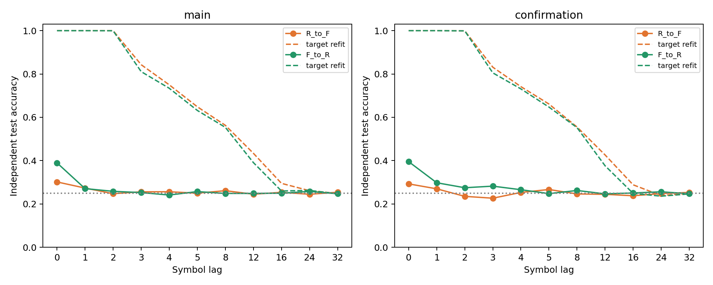

# 고정 출력층의 정규화 조건 간 전이 — ACT III 결과

**양방향 전이 모두 실패했다.** 조건별로 학습한 출력층은 과거 기호를 약
79–80% 맞혔지만, 계수·절편·표준화를 그대로 옮기면 평균 25–27%였다.
기존 본 집단과 확인 집단 모두 과거 접근성 및 5%p 유지 기준을 통과하지 못했다.
목표 상태에서 정보가 사라진 결과와 혼동하지 않는다. 같은 목표 상태를
그 조건에서 학습한 출력층은 여전히 잘 해독했다.

Protocol commit `6fd75d2`, 실행 구현 `04f8b32`.
[Protocol](normalization-transfer-protocol.md) · [Config](../configs/normalization_transfer.json).
R은 재배선 후 계수를 다시 계산한 조건(`renormalized`), F는 원래 실제망의
계수를 고정한 조건(`fixed_original`)이다. R/F는 같은 원시 재배선망을 쓴다.

## 1. Repository audit

기준 revision `3ba4ee9`의 정규화 대조, 연구 방향·다음 작업·phase 상태,
기존 cross-arm 전이 코드, affine ridge·표준화·checkpoint 구조와 source
manifest를 확인했다. 이전 정규화 개입의 1%p 확인 기준 실패는 그대로다.
이전 ACT II의 수열 간 전이는 다른 질문이며 이번 결과로 덮어쓰지 않는다.

이번에는 두 조건의 원시 그래프, 입력·관측 ID, symbol stream, label과
시간 정렬이 같음을 확인했다. 바뀌는 것은 정규화된 동역학과 그 상태이다.
기존 7,053개 결과 파일과 기존 수치 소스·protocol을 보존했다.

## 2. Reproduced baseline

각 전이의 source 출력층을 먼저 원래 조건에서 검증했다. 저장된 평균·표준편차,
계수·절편·within 점수와 source만 사용한 ridge 재학습이 정확히 일치했다.
본 집단의 R/F 기준 평균은 78.832% / 80.077%, 기존 확인 집단은
78.922% / 79.817%다. 목표 조건의 기존 refit baseline도 그대로 대조했다.

수치 검증을 위한 source-only refit은 모델을 개선하는 추가 실험이 아니다.
새 target fitting은 **0회**다. 기존 Python 3.12.10 환경을 재사용했으며
이번에 새 clean environment를 만들었다고 주장하지 않는다.

## 3. New implementation

`scripts/normalization_transfer.py`는 source의 표준화·계수·절편을 고정하고
target의 held-out feature에 적용한다. 예측 함수에는 target 정답이나 target
출력층 계수를 전달하지 않는다. shifted-label 출력층도 고정해 전이한다.
원래 source 성능, target의 기존 refit 성능, frozen 전이 성능을 각각 저장한다.

`scripts/verify_normalization_transfer.py`는 저장 배열로 정렬, 점수, 지연별
정확도·MSE·R2, paired 집계, bootstrap과 판정 기준을 독립 재계산한다.
identity 전이, target label/계수 변경의 비영향, source 표준화 유지 테스트를
포함했다. 전체 테스트 **181 passed, 8 optional-dependency skips**.

## 4. Experiments executed

- 별도 smoke 2방향: s34001/c701, 학습 200·평가 100행. 본 결과에서 제외했다.
- 본 집단: s34142–34146 × c701/702 × R→F/F→R = 20개 전이 조건.
- 기존 확인 집단: s41142–41144 × c701/702 × 두 방향 = 12개 전이 조건.
- 기존 독립 K4 train 2,000 / test 1,000행, 각 100 warmup 이후 상태를 재사용했다.
  각 조건의 train/test는 독립이며 R/F 사이에는 정확히 같은 train/test를 쓴다.
- 관측은 동일한 48 MBON, 지연당 196개 계수의 affine ridge 출력층이다.
  source std floor 1e−5와 alpha 1.0을 그대로 유지했다.
- lag 0/1/2/3/4/5/8/12/16/24/32를 모두 저장했다. Primary는 과거
  1/2/3/4/5/8 정확도의 평균이며 lag0은 현재 입력 접근성이다.
- 본 결과 32방향, smoke 포함 34방향을 정확히 replay했다. 새 수열·신경망
  궤적·target 출력층·정렬·보정은 생성하거나 학습하지 않았다.

이 연구의 확인 집단은 **기존에 수집한 집단의 재사용**이다. 이번 전이를 위해
새로 수집한 confirmation으로 표현하지 않는다. 새로운 main 결과와 관계없이
양쪽 집단과 두 방향을 모두 평가하도록 사전 등록했다.

## 5. Results

각 seed 값은 두 circuit 평균이다. `전이−target refit`이 primary 유지 지표다.

| 집단 | 전이 | seed | 전이 정확도 % | target 기존 refit % | 차이 %p |
| --- | --- | --- | --- | --- | --- |
| main | R→F | 34142 | 26.475 | 79.767 | -53.292 |
| main | R→F | 34143 | 26.100 | 80.550 | -54.450 |
| main | R→F | 34144 | 24.683 | 79.392 | -54.708 |
| main | R→F | 34145 | 24.808 | 80.292 | -55.483 |
| main | R→F | 34146 | 26.575 | 80.383 | -53.808 |
| main | F→R | 34142 | 25.467 | 77.675 | -52.208 |
| main | F→R | 34143 | 25.900 | 79.592 | -53.692 |
| main | F→R | 34144 | 25.092 | 78.850 | -53.758 |
| main | F→R | 34145 | 25.675 | 79.175 | -53.500 |
| main | F→R | 34146 | 25.208 | 78.867 | -53.658 |
| confirmation | R→F | 41142 | 24.083 | 78.825 | -54.742 |
| confirmation | R→F | 41143 | 24.925 | 81.242 | -56.317 |
| confirmation | R→F | 41144 | 25.867 | 79.383 | -53.517 |
| confirmation | F→R | 41142 | 28.025 | 78.167 | -50.142 |
| confirmation | F→R | 41143 | 25.342 | 80.342 | -55.000 |
| confirmation | F→R | 41144 | 28.150 | 78.258 | -50.108 |


집단별 요약:

| 집단 | 전이 | source within % | target refit % | 전이 평균 % | 전이 중앙값 % | 전이 분산 (%p²) | 전이 bootstrap95% |
| --- | --- | --- | --- | --- | --- | --- | --- |
| main | R→F | 78.832 | 80.077 | 25.728 | 26.100 | 0.8377 | [25.017, 26.44] |
| main | F→R | 80.077 | 78.832 | 25.468 | 25.467 | 0.1096 | [25.213, 25.727] |
| confirmation | R→F | 78.922 | 79.817 | 24.958 | 24.925 | 0.7959 | [24.083, 25.867] |
| confirmation | F→R | 79.817 | 78.922 | 27.172 | 28.025 | 2.5171 | [25.342, 28.15] |


전이−target refit의 paired 통계:

| 집단 | 전이 | 평균 %p | 중앙값 %p | 분산 (%p²) | bootstrap95% %p | paired dz |
| --- | --- | --- | --- | --- | --- | --- |
| main | R→F | -54.348 | -54.450 | 0.7091 | [-54.993, -53.73] | -64.542 |
| main | F→R | -53.363 | -53.658 | 0.4259 | [-53.712, -52.777] | -81.770 |
| confirmation | R→F | -54.858 | -54.742 | 1.9702 | [-56.317, -53.517] | -39.083 |
| confirmation | F→R | -51.750 | -50.142 | 7.9222 | [-55.0, -50.108] | -18.386 |


큰 |dz|는 제한된 집단에서 큰 공통 손실과 작은 seed 간 분산의 조합이다.
n=5/3의 좁은 bootstrap 구간을 모든 그래프·동역학에 대한 정밀도로 해석하지
않는다. 두 방향과 두 집단을 합쳐 표본 수를 늘리지 않았다.

| 집단 | 전이 | frequency 대조 % | 전이 null % | 평균 R2 | test MSE | H1 접근성 | H2 유지 |
| --- | --- | --- | --- | --- | --- | --- | --- |
| main | R→F | 24.043 | 24.575 | -11492.269 | 2156.660 | False | False |
| main | F→R | 24.043 | 24.728 | -501.784 | 94.335 | False | False |
| confirmation | R→F | 25.456 | 24.397 | -18131.424 | 3401.411 | False | False |
| confirmation | F→R | 25.456 | 24.867 | -689.367 | 129.441 | False | False |


R2의 큰 음수와 MSE를 제거하거나 절삭하지 않았다. affine 출력은 확률이
아니며 source 분포 밖으로 적용하면 매우 큰 오차가 날 수 있다. 이 수치를
신뢰도나 확률로 해석하지 않는다. 정확도 역시 대조군을 안정적으로 웃돈다는
사전 기준에 도달하지 못했다. 단순히 25%와 같다는 통계적 동등성을 주장하지 않는다.



실선은 고정 전이, 같은 색 점선은 그 방향의 목표 조건에서 별도로 학습한
기존 출력층이다. 주황은 R→F, 초록은 F→R이다.
[전체 지연별 raw 결과](../results/normalization_transfer/raw-lag-table.csv) ·
[circuit을 합치기 전 raw primary](../results/normalization_transfer/raw-past-table.csv).

## 6. Interpretation

이번 affine decoder는 학습한 정규화 조건의 feature 좌표에 크게 의존했다.
높은 within-condition 정확도가 같은 가중치를 다른 조건에 바로 적용할 수
있다는 뜻은 아니었다. 반면 target refit이 높은 점수를 유지하므로 이번 실패를
“target reservoir가 과거 정보를 보존하지 않는다”로 해석할 수 없다.

label을 쓰지 않은 학습 feature 진단은 다음과 같다. 진단값을 예측 보정에
적용하지 않았으며, 점수를 개선하는 후속 조건을 추가하지 않았다.

| 집단 | 전이 | 평균 절대 mean 이동 (source std 단위) | feature std 비율의 중앙값 평균 | 중심화 feature 상관 | 같은 시점 state cosine |
| --- | --- | --- | --- | --- | --- |
| main | R→F | 3.807 | 1.080 | 0.984 | 0.736 |
| main | F→R | 1.358 | 0.928 | 0.984 | 0.736 |
| confirmation | R→F | 4.572 | 1.072 | 0.976 | 0.748 |
| confirmation | F→R | 1.751 | 0.933 | 0.976 | 0.748 |


같은 뉴런의 중심화된 시간 변화는 높은 상관을 보이지만, 상태 평균은 source
표준편차 단위로 상당히 이동했다. 따라서 좌표의 평균·스케일 변화가 실패의
후보 설명이다. 상관과 평균 이동만으로 그 원인을 확정하지 않는다.

## 7. Negative findings

R→F와 F→R 모두 본·확인 집단에서 H1 과거 접근성과 H2 유지에 실패했다.
target refit 대비 평균 손실은 약 52–55%p로 사전 허용치 5%p를 크게 넘었다.
분포가 바뀐 상태에 source 표준화와 head를 그대로 적용하는 방법은 이번
설정에서 이식 가능하지 않았다. 원래 정규화 개입의 확인 실패와 실제 배선
우위 부정 결과도 그대로 남는다.

## 8. What we can claim

실제 초파리 connectome 구조를 사용한 계산 모델에서, 동일 원시 재배선망·입력·
관측 뉴런을 유지해도 정규화 조건을 바꾸면 고정된 외부 출력층의 해독이 크게
저하될 수 있다. 목표 조건에 맞춰 학습한 출력층은 같은 목표 상태를 잘 읽는다.
이는 표현의 존재와 특정 decoder의 휴대성이 다른 질문임을 보여준다.

## 9. What we cannot claim

과거 정보가 모든 상태에서 소실됐다거나, 조건 간 정렬로도 회복할 수 없다거나,
비선형 decoder도 실패한다고 말할 수 없다. 정규화 차이가 반드시 평균·표준편차
이동만으로 설명된다고도 단정하지 않는다. 자율 회상, formal memory capacity,
실물 초파리의 기억·학습, 내부 연결 학습 또는 whole-brain 우위의 결과가 아니다.

## 10. Reproducibility

프로토콜은 새 전이 예측 전에 고정했다. 각 checkpoint는 source 계수·표준화,
target feature·label, source within/target refit 점수, 전이·null 점수와 예측,
feature 진단을 포함한다. source/target 원본 경로와 manifest hash도 보존했다.
34개 전이 모두 정확 replay, source-only 검증 refit과 독립 augmented
least-squares 점수(1e−9) 및 동일 class 검증을 통과했다. 별도 artifact 검증은
smoke 22개를 포함한 총 374개 lag 행과 통계·판정을 확인했다.

Runtime은 무결성·source refit 검증을 포함해 23.42초,
50ms 표본 peak RSS는 158.61MiB였다.
실제 peak의 상한은 아니다. 실제 의존성·BLAS·하드웨어는 manifest에 기록했다.
이전 7,053개 결과 파일과 수치 소스는 그대로다.
[실행 manifest](../results/normalization_transfer/manifest.json) ·
[독립 검증](../results/normalization_transfer_validation/checks.json).

Python 3.12와 `requirements-act1-lock.txt` 환경에서 저장소 루트 기준:

```powershell
$env:PYTHONPATH='src'
.venv/Scripts/python.exe scripts/normalization_transfer.py --out outputs/norm_transfer_new
.venv/Scripts/python.exe scripts/verify_normalization_transfer.py --out outputs/norm_transfer_check_new outputs/norm_transfer_new
```

항상 새 경로를 사용한다. 저장 결과의 수치 구현은 `04f8b32`이며 최종 revision도
그 runner 바이트를 유지한다. source checkpoint의 이전 refit은 `1c55c80` 구현이다.

## 11. Next highest-information experiment

**정답을 사용하지 않는 학습 feature의 평균·표준편차 정렬 후 고정 출력층 전이.**
source와 target의 학습 구간 feature 통계만으로 뉴런별 좌표를 맞추고,
출력층 계수·절편은 그대로 둔다. target 평가 구간이나 정답은 정렬에 쓰지 않는다.
이번 실패가 간단한 좌표 이동으로 얼마나 설명되는지 검사하는 한 조건이다.
새 protocol을 먼저 고정해야 하며 아직 실행하지 않았다. 정규화 값 탐색이나
target label로 출력층을 재학습하는 조건을 섞지 않는다.
