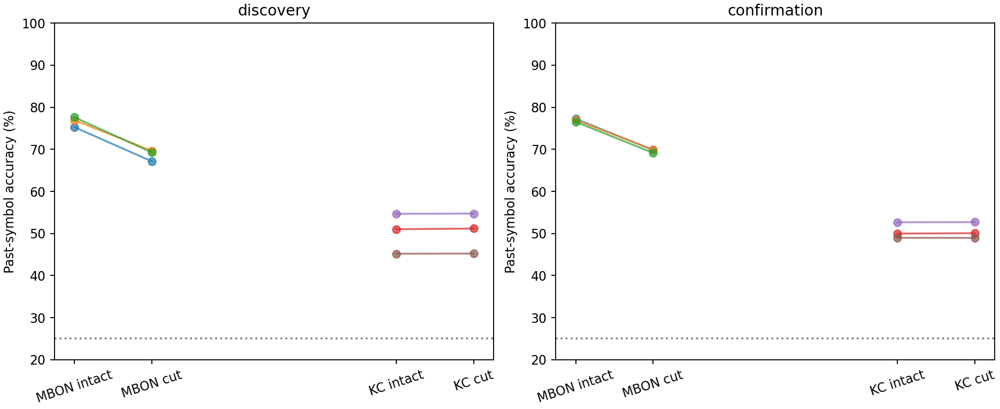
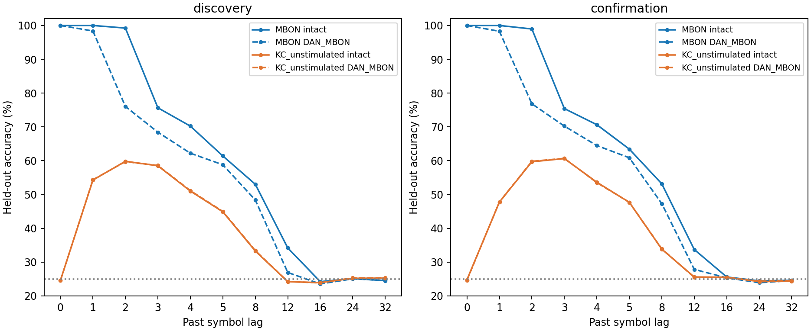

# ACT IV-A entry diagnostic — 관측 위치와 출력층 의존성

DAN→MBON 제거의 손상은 관측 위치에 의존했다. 본/확인 MBON 평균 손상은
7.8833/7.2722%p였지만 직접 입력을 받지 않는 KC48개에서는 −0.0778/−0.0361%p였다.
음수는 아주 작은 정확도 증가이며 개선 효과로 주장하지 않는다. 두 cohort 모두
사전 접근성·유지·상호작용 기준을 통과했다. 같은 고정 연결망·입력에서 출력층이
어느48개 뉴런을 읽는지에 따라 절단의 효과가 달라졌다는 제한적 근거다.


## 1. Repository audit

III-D 종료 `c583786`의 코드·결과·실험 방향·다음 작업을 확인했다.
이전 DAN→MBON refit 손상은 실제 계산 결과였지만 정보 저장 위치와 MBON으로
정보를 전달하는 경로를 구분하지 못했다. 이번에는 관측 예산을 유지한 위치 대조를
실행했다. 이전 III-B/C의 부정 결과와 III-D 자료를 수정하지 않았다.
기존 result 17,479개 파일 해시 보존을 독립 확인했다.

## 2. Reproduced baseline

[기존 III-D MBON intact](../results/pathway_memory/discovery/intact_c701_s181142/manifest.json)의
공통 저장 배열·학습 head·지표를 정확히 재현했다.
[재현 기록](../results/observation_location/baseline.json). 기존 Python 고정 환경을
재사용했으며 새 clean environment를 설치한 것은 아니다.

## 3. New implementation

[실행기](../scripts/observation_location.py), [독립 검증기](../scripts/verify_observation_location.py),
[테스트](../tests/test_observation_location.py), [그림 재현 코드](../scripts/plot_observation_location.py)를 추가했다. 입력을 직접 받지 않는 KC만
후보로 삼고 root ID 정렬 후 사전 seed로48개를 선택했다. 후보 수329–345개,
활동·성능 기반 선택이나 재추첨은 없다. [선택 ID와 seed 감사](observation-location-selection.json).
MBON과 KC 관측은 같은 궤적에서 추출하며 관측 위치가 신경 업데이트를 바꾸지 않는다.
각 관측은 독립 refit이고 서로 다른 뉴런 슬롯 사이에 frozen head를 옮기지 않는다.

## 4. Experiments executed

c701/c702 각686뉴런, threshold5,3309/3241 edges. 각 관측48개, K4 iid,
train2000/test1000,warmup100; gain0.9,incoming-L1,leak0.6,mbon_after_kc.
지연0,1,2,3,4,5,8,12,16,24,32; primary1,2,3,4,5,8. Ridge alpha1,
훈련 데이터만으로 표준화, std floor1e-5, 지연마다196계수. 내부 연결 학습 없음.

Intact, DAN→MBON 제거, 기존 disjoint matched masks3개 × 관측2개.
Smoke10 + 본60 + 확인60 = **130 fits/정확 반복**, **1430 lag metric rows**.
독립 검증은 관측별 train/test260회(서로 다른 기저 궤적은130개)를 다시 계산했다.
본 seed201142–201144, 확인211142–211144; 각각 n=3 paired blocks.
같은 connectome의 두 부분 그래프·lag·대조 draw를 독립 표본으로 세지 않는다.
평균 순서는 lag→circuit→control draw이며 cohort를 합치지 않는다.

D 단계의 모든3 대조 mask를 그대로 사용했다. 연결 수·부호는 동일하고 raw/normalized
가중치 총량은0.5% 이내로 맞췄다. 뉴런별 degree/strength나 endpoint population을
맞춘 것은 아니다. 새 입력·수열·관측 seed29개는 기존 config의 숫자 토큰과 충돌0.
대조 mask는 기존 자료 재사용이므로 새로운 edge ensemble 확인은 아니다.

Protocol/code lock `a6f49a3d6f5d4d7ee9029de8625d4555eec16d12` 뒤에 모든 새 결과를 생성했다.
[사전 프로토콜](observation-location-protocol.md), [정확한 config](../configs/observation_location.json).

## 5. Results

정확도%, loss=intact−target(%p), extra=matched control−target(%p).

| Cohort | Site | Seed | Intact | DAN→MBON cut | Control | Loss pp | Extra pp |
|---|---|---|---|---|---|---|---|
| discovery | MBON | 201142 | 75.2667 | 67.1667 | 75.7056 | +8.1000 | +8.5389 |
| discovery | MBON | 201143 | 76.9000 | 69.6833 | 76.9861 | +7.2167 | +7.3028 |
| discovery | MBON | 201144 | 77.6083 | 69.2750 | 77.1639 | +8.3333 | +7.8889 |
| discovery | KC_unstimulated | 201142 | 51.0167 | 51.1750 | 48.7083 | -0.1583 | -2.4667 |
| discovery | KC_unstimulated | 201143 | 54.6833 | 54.7250 | 53.5944 | -0.0417 | -1.1306 |
| discovery | KC_unstimulated | 201144 | 45.1917 | 45.2250 | 43.8806 | -0.0333 | -1.3444 |
| confirmation | MBON | 211142 | 77.2583 | 69.8667 | 76.5083 | +7.3917 | +6.6417 |
| confirmation | MBON | 211143 | 77.0167 | 69.9500 | 77.4417 | +7.0667 | +7.4917 |
| confirmation | MBON | 211144 | 76.5417 | 69.1833 | 76.4306 | +7.3583 | +7.2472 |
| confirmation | KC_unstimulated | 211142 | 49.9833 | 50.0750 | 49.4333 | -0.0917 | -0.6417 |
| confirmation | KC_unstimulated | 211143 | 52.6667 | 52.7000 | 51.1778 | -0.0333 | -1.5222 |
| confirmation | KC_unstimulated | 211144 | 48.9750 | 48.9583 | 47.9583 | +0.0167 | -1.0000 |

상호작용=MBON loss−KC loss. 다음은 block3개의 기술 통계다. Variance 단위(%p)².

| Cohort | Contrast | Mean | Median | Variance | Bootstrap95 | Paired dz |
|---|---|---|---|---|---|---|
| discovery | MBON loss | +7.8833 | +8.1000 | 0.346944 | [7.2167, 8.3333] | 13.383814897142159 |
| discovery | KC loss | -0.0778 | -0.0417 | 0.004884 | [-0.1583, -0.0333] | -1.1129000869240853 |
| discovery | Interaction | +7.9611 | +8.2583 | 0.373356 | [7.2583, 8.3667] | 13.029022610216453 |
| confirmation | MBON loss | +7.2722 | +7.3583 | 0.031968 | [7.0667, 7.3917] | 40.673559004885966 |
| confirmation | KC loss | -0.0361 | -0.0333 | 0.002940 | [-0.0917, 0.0167] | -0.6660101754521307 |
| confirmation | Interaction | +7.3083 | +7.3417 | 0.037569 | [7.1, 7.4833] | 37.705175000407934 |

사전 판정: intact 두 관측과 cut KC 모두 접근성 통과, MBON 평균 손상≥5%p와 모든 block 양수, KC 평균 손상≤2%p, 평균 상호작용≥5%p와 모든 block 양수. 두 cohort 모두 통과했다. 이는 정식 동등성 검정이나 생물학적 표본 확증이 아니다. MBON matched specificity 보조 기준도 두 cohort에서 통과했다.





[모든 raw lag](../results/observation_location/raw-lag-table.csv), [seed별 paired table](../results/observation_location/paired-differences.csv), [전체 통계](../results/observation_location/summary.json), [state rank/sparsity/activity/decay](../results/observation_location/neural-diagnostics.csv).

## 6. Interpretation

DAN→MBON 제거의 손상은 관측 위치에 의존했다. 본/확인 MBON 평균 손상은
7.8833/7.2722%p였지만 직접 입력을 받지 않는 KC48개에서는 −0.0778/−0.0361%p였다.
음수는 아주 작은 정확도 증가이며 개선 효과로 주장하지 않는다. 두 cohort 모두
사전 접근성·유지·상호작용 기준을 통과했다. 같은 고정 연결망·입력에서 출력층이
어느48개 뉴런을 읽는지에 따라 절단의 효과가 달라졌다는 제한적 근거다.

KC intact 정확도는 본50.2972%/확인50.5417%, MBON은76.5917%/76.9389%였다.
각각 chance25% 및 frequency/shifted-null 대조보다 높고 사전 접근성 기준을 통과했다.
KC 정확도가 낮아 같은 지연의 같은 정보를 읽는다는 의미는 아니다. 지연별 정보
범위·기본 성능·비선형 상태 분포가 다르므로 순수한 관측 위치의 단독 기전으로
해석하지 않는다. 다만 검사한 KC 상태에서 일부 과거 정보가 제거 후에도 선형으로
해독 가능하므로, 모든 신경 상태에서 과거 정보가 소멸했다는 설명은 지지되지 않는다.

## 7. Negative findings

KC에서 MBON과 비슷한 큰 해독 손상은 나타나지 않았다. 기본 KC 해독 성능은
MBON보다 낮았으며 작은 음수 loss를 기억 향상이라고 부르지 않는다. 과거 III-B/C
부정 결과를 뒤집는 실험도 아니다. 새 관측 집단이나 유리한 seed를 찾아 재시험하지 않았다.

## 8. What we can claim

실제 초파리 connectome 구조를 사용한 이 두 부분 계산 모델에서 DAN→MBON 제거의
과거 기호 해독 손상은 관측 집단에 의존했다. 고정된48개 대체 KC에서도 손상 후
일부 과거 정보 접근성이 남았다. Representation/decoding 근거이며 내부 learning이 아니다.

## 9. What we cannot claim

기억 저장 위치·유일한 경로·생물학적 기억 회로·전체 뇌 일반화·자율 π 회상 개선·
Shannon/formal memory capacity·도파민 학습은 입증하지 않았다. 부분망2개는 독립
동물 표본이 아니고 n=3씩이다. 다른 관측 집단/더 긴 지연까지 보존됐다고 할 수 없다.
KC와 MBON의 baseline 및 temporal profile 차이, 현재 gain/timing, 외부 ridge readout,
고정한 control masks에 대한 의존성이 남는다. ACT IV-A의 진입 진단 하나를 완료한
것이며 ACT IV 전체나 내부 plasticity 비교를 완료했다는 뜻은 아니다.

## 10. Reproducibility

Config hash `158f97ab140cf9bd6c4f9424b08df57091a9897101e0dbca46394a943bfba681`.
[Root manifest](../results/observation_location/manifest.json), [독립 검증](../results/observation_location_validation/checks.json),
[분석 manifest](../results/observation_location_analysis/manifest.json), [테스트 기록](../results/observation_location_analysis/tests.json).
각 cohort/arm/site/circuit/seed 폴더에 checkpoint.npz,weights.npz,metrics.json,neural.json,
graph.json,manifest.json이 있으며 기호·특징·라벨·예측·null score·head·mask·관측 ID를 저장했다.
모든 raw 실행은 별도 경로에 보존했고 이전 결과를 덮어쓰지 않았다.

Python/NumPy/SciPy 3.12.10/2.3.5/1.17.0,
`requirements-act1-lock.txt`,수치 라이브러리1thread. Runtime 185.38s,
sampled peak RSS 184.29MiB. 상한3600s/3GiB.
독립 검증 86.95s. RSS는50ms sampling이므로 절대 최대 보장은 아니다.
Tests **224 passed,8 optional skipped**. 신경 상태 요약130개도 저장 특징에서 재검사했다. 공개한 그림 코드로 두 PNG를
다시 생성하여 원본 그림과 SHA256이 같음을 확인했다.

```powershell
$env:PYTHONPATH='src'
python scripts/observation_location.py --out outputs/observation_location_new
python scripts/verify_observation_location.py outputs/observation_location_new --out outputs/observation_location_check_new
python scripts/plot_observation_location.py outputs/observation_location_new --out outputs/observation_location_plots_new
python -m pytest -q
```

Clean committed checkout, 기존 source graph/result/mask bank가 필요하며 새 경로를 사용한다.

## 11. Next highest-information experiment

**공통으로 해독 가능한 지연에서 관측 위치별 손상을 비교하는 분석 하나.**
이번 KC는 MBON보다 기본 정확도와 지연별 정보량이 낮다. 이미 저장한 상태를
사용하되 비교 지연을 정하는 규칙과 본/확인 분리를 먼저 고정하여, 단순히 KC가
읽지 못하던 오래된 정보 때문에 평균 손상 차이가 난 것인지 검사한다. 결과를
본 뒤 유리한 지연을 골라 현재 성공 기준을 다시 정의하지 않는다. 새 분석으로
분리하고, 이번 턴에는 실행하지 않는다. 내부 plasticity 확장은 그 뒤 별도 판단한다.
