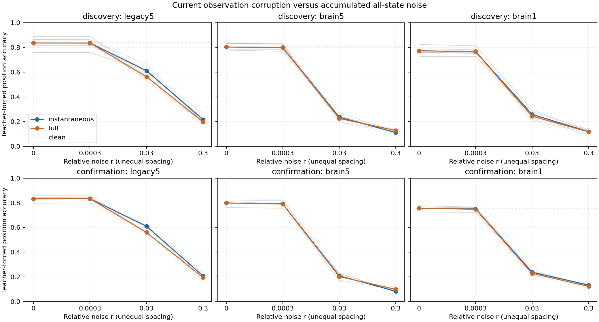

# ACT V diagnostic — 현재 관측값의 잡음과 누적 상태 잡음

**Brain1의 누적 잡음 추가 비용은 사전 지정한 기준을 통과하지 못했다.**
추가 비용이 두 집단에서 확인된 그래프: `[]`.
별도의 근접 허용 범위를 두 집단에서 만족한 그래프: `['brain5', 'brain1']`.
두 판정은 다르며, 전자의 실패를 후자의 성공으로 자동 변환하지 않는다.

## 1. Repository audit

[상대 잡음 결과](relative-noise-results.md)와 그 독립 검증을 먼저 완료했다.
고정 출력층의 teacher 정확도도 낮아졌으므로, 현재 관측값의 오염만으로 생기는
해독 저하와 상태에 누적된 잡음의 영향을 구분하는 다음 실험을 선택했다.
이전 절대 잡음·상대 잡음 결과와 smoke 파서 실패 기록은 변경하지 않았다.

## 2. Reproduced baseline

부모 실험의48개 모델을 모두 재사용했다. 기존7142–7146, 새 확인381142–381144,
circuits701/702,legacy5/brain5/brain1이다. 여기서 새로 학습한 모델이나 새로운
확인 seed는 없다. 부모의48개 clean 출력·확률을 다시 확인했고, 같은 checkpoint와
고정 전처리를 사용했다. 부모는160개 지정 동역학 replay와6개 exact refit을 통과했다.

## 3. New implementation

[대조 실행기](../scripts/observation_noise.py), [독립 검증기](../scripts/verify_observation_noise.py),
[테스트](../tests/test_observation_noise.py). Canonical root ID와 시간 순서로 같은
Gaussian을 복원한다. 깨끗한 teacher 상태의 관측값에 현재 잡음만 더하고 clip한
뒤 고정 출력층을 적용한다. 오염된 관측값이 다음 상태나 다음 입력을 바꾸지 않는다.

## 4. Experiments executed

[Protocol](observation-noise-protocol.md), [config](../configs/observation_noise.json).
등록 source commit`f863100c927209918d4c24aa03a678c620f73113`. Parent manifest는 config에 고정했다.
동일48 MBON과482개 출력층 파라미터,π200/prompt314,평가197위치를 유지한다.
상대 강도r=[.0003,.03,.3],sigma=r×clean 학습 MBON 표준편차 중앙값이다.

새 현재 관측 잡음 평가144개를 수행하고, 기존 누적 상태 잡음 teacher 궤적144개와
대응 비교했다. 모든 조건에서 정답 과거 기호를 공급한다. **새 자율 회상이나
전체 신경 상태 시뮬레이션은 실행하지 않았다.** 현재 관측 대조는 잡음의 과거를
모두 제거하며, 관측 뉴런 자체의 과거 잡음도 제거한다. 숨은 뉴런만 제거하는 대조는 아니다.

## 5. Results

아래는 seed별 추가 history 비용(현재 관측만 오염한 정확도−누적 상태 잡음 정확도),
단위%p다. 세 비영 강도와 두 circuit을 먼저 평균했다. 음수도 그대로 보존한다.

| cohort | seed | legacy5 | brain5 | brain1 |
| --- | --- | --- | --- | --- |
| discovery | 7142 | 1.777 | -0.085 | 0.508 |
| discovery | 7143 | 4.653 | 1.015 | 0.169 |
| discovery | 7144 | 1.777 | -0.761 | 0.677 |
| discovery | 7145 | 1.354 | -0.592 | 0.169 |
| discovery | 7146 | 1.692 | -0.508 | 1.184 |
| confirmation | 381142 | 2.030 | -0.000 | 0.931 |
| confirmation | 381143 | 1.692 | 0.169 | 1.015 |
| confirmation | 381144 | 2.623 | -0.931 | 0.338 |

같은 grid 평균의 teacher 정확도(%):

| cohort | graph | clean % | current observation % | accumulated state % | material cost gate | near tolerance gate |
| --- | --- | --- | --- | --- | --- | --- |
| discovery | legacy5 | 83.655 | 55.465 | 53.215 | False | False |
| discovery | brain5 | 80.406 | 38.206 | 38.393 | False | True |
| discovery | brain1 | 77.310 | 38.105 | 37.563 | False | True |
| confirmation | legacy5 | 83.249 | 55.048 | 52.933 | False | False |
| confirmation | brain5 | 79.865 | 36.125 | 36.379 | False | True |
| confirmation | brain1 | 75.635 | 37.394 | 36.633 | False | True |

추가 비용의 paired 기술 통계(평균·중앙값·구간은%p,분산은 정확도 비율 단위의 제곱):

| cohort | graph | mean | median | variance | bootstrap95 | paired dz | wins/ties/losses |
| --- | --- | --- | --- | --- | --- | --- | --- |
| discovery | legacy5 | 2.250 | 1.777 | 0.000183448 | 1.523 / 3.486 | 1.662 | 5/0/0 |
| discovery | brain5 | -0.186 | -0.508 | 5.13197e-05 | -0.643 / 0.440 | -0.260 | 1/0/4 |
| discovery | brain1 | 0.541 | 0.508 | 1.77508e-05 | 0.237 / 0.880 | 1.285 | 5/0/0 |
| confirmation | legacy5 | 2.115 | 2.030 | 2.21884e-05 | 1.692 / 2.623 | 4.490 | 3/0/0 |
| confirmation | brain5 | -0.254 | -0.000 | 3.5072e-05 | -0.931 / 0.169 | -0.429 | 1/0/2 |
| confirmation | brain1 | 0.761 | 0.931 | 1.35994e-05 | 0.338 / 1.015 | 2.065 | 3/0/0 |

Brain5 seed381142의 `-0.000`은 약−7×10⁻¹⁸의 부동소수점 잔차다.
저장 통계의 엄격한 부호 비교에서는 loss로 집계됐지만, 실질적 손상으로
해석하지 않는다. 원자료와 등록된 집계 결과는 그대로 보존했다.

[개별 모델/강도 원자료](../results/observation_noise_main/raw-metrics.csv),
[모든 dose/seed](../results/observation_noise_main/dose-seed-table.csv),
[전체 통계·판정](../results/observation_noise_main/summary.json).
표본은 같은 connectome의 n5/n3 모델 seed다. 두 집단을 합치지 않았고, 소표본
bootstrap을 생물학적 모집단의 정밀한 신뢰구간으로 해석하지 않는다.



## 6. Interpretation

Brain1에서 현재 관측만 오염한 경우와 누적 상태 잡음의 grid 평균 정확도 차이는
기존 집단0.54%p, 확인 집단0.76%p였다. 두 전체망은 등록한 근접 허용 범위를
만족했다. 따라서 현재 관측값의 오염만으로도 전체 상태 실험의 해독 저하와
가까운 결과를 낼 수 있다. 과거 잡음의 영향이 정확히0이라는 뜻은 아니다.
Brain1의 추가 비용은 모든 seed에서 양수였으나5%p의 material 기준보다 작았다.

부분망의 평균 추가 비용은2.25%p와2.12%p로,5%p material 기준에도2%p 평균
근접 기준에도 해당하지 않았다. 특히 중간 강도r=.03에서는 약4.92%p와4.99%p의
추가 비용이 있었다. Grid 평균만으로 모든 강도에서 과거 잡음이 무관하다고
일반화하지 않는다. Brain5의 최대 강도에서는 반대로 누적 상태 조건의 정확도가
약1.6–1.7%p 높았다. 이런 음수 비용도 숨기지 않았다.

추가 비용의 material gate는 두 집단 모두 평균>=5%p 및4/5·3/3seed 양수다.
별도 near tolerance는 두 집단 모두 평균의 절댓값<=2%p,각 seed의 절댓값<=5%p다.
후자는 정식 동등성 검정이 아니다. 첫 예측 시점에는 prompt가 깨끗하고 같은
현재 잡음을 사용하므로 두 관측값이 같아야 한다.144조건 모두 이를 확인했다.

이 비교는 고정 해독기의 성능에 대한 과거 잡음의 추가 영향을 측정한다.
현재 관측 잡음만으로도 정확도가 낮아진다면, 전체 상태 실험의 실패를 곧바로
기억 정보 소실이라고 해석할 수 없다. 반대로 작은 평균 차이만으로 과거 잡음이
모든 시점·강도·집단에서 무관하다고 단정할 수도 없다. 각 강도의 곡선을 함께 본다.

## 7. Negative findings

어느 그래프도 두 집단에서 material history-cost 기준을 함께 통과하지 못했다.
부분망은 near-tolerance도 통과하지 못했다. 이 두 실패를 서로 같은 결론으로
취급하지 않는다. 전체망의 해독 저하는 현재 관측 잡음만으로도 상당 부분 나타났지만,
잡음에 강건한 자율 회상이나 손상된 정보의 복원을 달성한 것은 아니다.

Primary·secondary·근접 허용 판정을 모두 summary에 보존했다. 추가 비용 기준에
실패한 조건을 성공으로 바꾸지 않았고, teacher 결과를 자율 기억의 회복으로
표현하지 않는다. 새로운 학습 규칙, noise-aware refit, dose search는 실행하지 않았다.

## 8. What we can claim

실제 초파리 connectome 구조를 사용한 계산 모델에서 동일한 고정 출력층과
현재 잡음 draw를 유지하고, 관측 잡음과 누적 상태 잡음의 해독 결과를 비교했다.
이것은 representation·decoding·internal learning 중 해독과 상태 동역학에 관한
진단이다. 내부 연결이 학습해 기억을 저장했다는 주장이 아니다.

## 9. What we cannot claim

현재 관측 대조와 전체 상태 조건의 총 잡음 에너지는 같지 않다. 비교는 과거
관측 잡음과 다른 뉴런에서 전파된 잡음을 분리하지 않는다. 전체 뇌의 정보량,
특정 생물학적 기억 회로, 실제 초파리의 능력이나 생리학적 잡음에 관한 결론이 아니다.
원래 실험의 결과를 보고 이 질문을 골랐고 같은 모델 집단을 재사용한 exploratory
후속 진단이다. 새로운 별도 holdout 집단으로 확인한 실험이라고 표현하지 않는다.

## 10. Reproducibility

[Main manifest](../results/observation_noise_main/manifest.json),
[독립 검증](../results/observation_noise_validation/checks.json),
[24개 관련 테스트](../results/observation_noise_tests/manifest.json).
Config SHA256`3384771dcfd5c8d93d5cdb2023292049cc982d77e0442cd85e074d6624c05049`; main manifest SHA256`556733b5aa7aacedb2f0c59b5c4a26ea2e703987651026772d3a1c1e700af10e`.
전체144개 신규 대조와48개 clean 출력,
첫 시점144개 일치, 지표·통계·hash를 검증했다.
최대 수치 차이0. 새로운 전체 동역학 replay는0개다.
부모 실험의 검증 범위와 구분한다. 이전 파일24,454개가 그대로다.
Main132.7s, .05s sampled process RSS peak0.152GiB.
환경 버전은 main/environment.json에 저장했다. 원래 checkpoint는 부모 manifest로 고정했다.

```powershell
$env:PYTHONPATH='src'
../venv-act1/Scripts/python.exe scripts/observation_noise.py run --out outputs/observation_noise_new
../venv-act1/Scripts/python.exe scripts/verify_observation_noise.py outputs/observation_noise_new --out outputs/observation_noise_check_new
../venv-act1/Scripts/python.exe scripts/observation_noise.py plot --source outputs/observation_noise_new --out outputs/observation_noise_plot_new
```

## 11. Next highest-information experiment

**총 관측 잡음 에너지를 맞춘 채, MBON별 학습 변동에 비례해 잡음을 배분하는
고정 출력층 대조 하나**를 제안한다. 현재는 모든 관측 좌표에 같은 raw sigma를
사용하므로 작은 변동의 좌표가 상대적으로 더 강하게 오염될 수 있다. 같은
기대 제곱합을 유지하면서 좌표별 분포만 바꾸어, 중앙값 보정 뒤에도 남은 차이가
이 비균일한 상대 잡음과 관련되는지 검사한다. 이는 미래 가설이며 아직 실행하거나
사전등록하지 않았다. 출력층 재학습이나 성공을 찾기 위한 강도 탐색으로 대체하지 않는다.
