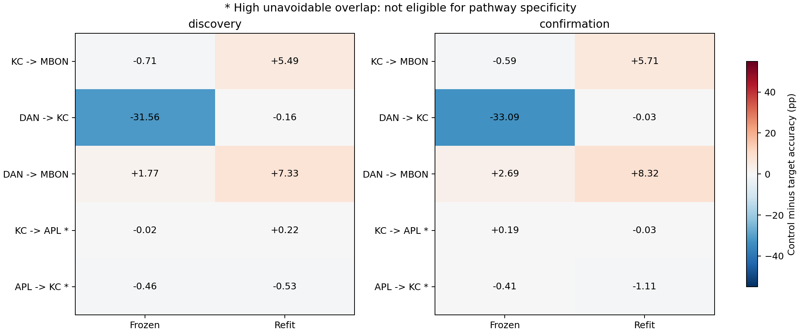
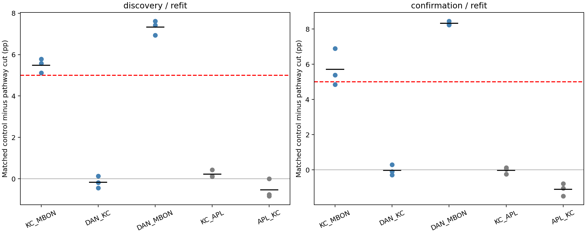
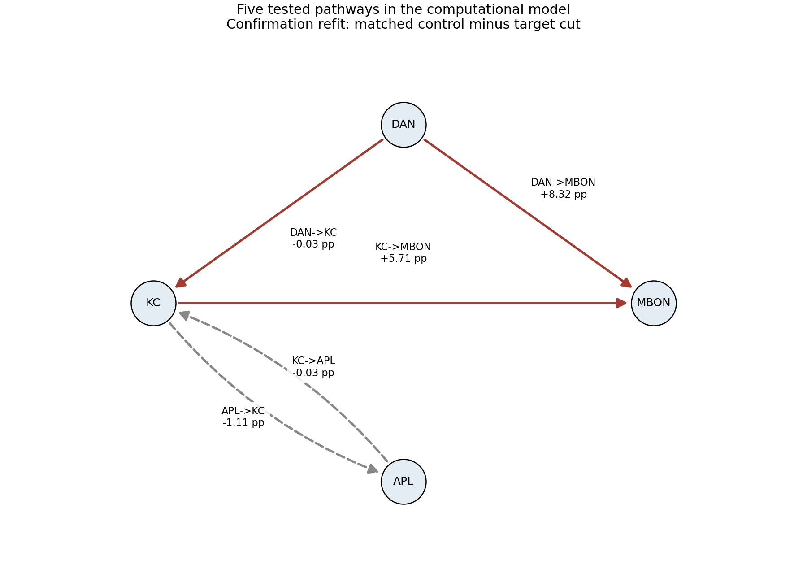

# ACT III-D — 이 계산 모델에서 어떤 경로의 제거가 특히 큰 영향을 주는가?

**현재 두 부분 모델에서 사전 정의한 다섯 경로의 III-D 패널을 완료했다.**
주 분석 DAN→MBON refit의 양-cohort 확인: **True**.
확인된 refit 후보: **KC_MBON, DAN_MBON**.
이는 현재 과제·모델·대조에 대한 후보 판정이며 실제 동물의 기억 회로 발견이 아니다.

주 분석 DAN→MBON은 readout을 다시 학습해도 matched 대조보다 추가 손상이
본 실험7.3306%p, 새 seed 확인8.3204%p였다. 두 cohort의 모든 seed에서 같은
방향이며 사전5%p 기준을 통과했다. 이 경로의 대조는 원래 경로와 완전히
겹치지 않고, 제거 수·부호와 raw/normalized 가중치 총량을 맞췄다.
따라서 이 관측·동역학·과제에서 과거 기호 해독에 불균형하게 중요한 경로 후보다.
DAN 주석이 있다는 사실은 도파민 학습이나 내부 plasticity를 검증했다는 뜻이 아니다.

Secondary KC→MBON도 추가 손상5.4907/5.7083%p로 수치 기준을 통과했다.
하지만 대조와68.79–71.14%가 겹치고, 확인 실험의 현재 기호(lag0) 정확도가
이 경로 제거 시24.0167%로 떨어졌다(대조100%). 현재 입력의 관측 접근성이나
지연도 바뀔 수 있으므로 순수한 기억 저장 효과로 읽지 않는다. DAN→MBON 제거는
같은 lag0 정확도100%를 유지했다. 이 lag0 비교는 사전 기록한 지표의 설명용
분석이며 별도의 사후 성공 기준으로 사용하지 않았다.

DAN→KC의 refit 추가 손상은 −0.1648/−0.0269%p로 확인되지 않았다.
KC→APL/APL→KC는 겹침이 약90–91%여서 사전 특이성 판정 대상에서 제외했다.
이들 효과가 없다는 뜻은 아니다. Frozen의 큰 손상과 refit 후 정보 해독은
다른 질문이며, 이번에는 frozen 특이성 기준을 통과한 경로가 없었다.

두 후보 모두 관측하는 MBON으로 들어오는 연결이다. 현재 증거는 이 계산 모델의
'과거 정보 해독에 중요한 접근 경로'를 지지하며, 기억이 그 연결에 저장됐다거나
다른 뉴런의 상태에서 정보가 사라졌다는 결론은 지지하지 않는다. 최소·유일한
memory-critical subnetwork나 생물학적 기억 회로로 부르지 않는다.

III-B의 전체 DAN incident-edge 대조와 이번 특정 방향 경로 대조는 제거 범위,
matching 방식(구간별 분포 대 총량),겹침과 seed가 다르다. 이번 양성 결과로 과거
부정 결과를 지우거나 같은 가설의 재검정이 성공했다고 포장하지 않는다.
균일하지 않은 최적화 대조, 뉴런별 degree/strength 미통제, n=3씩의 계산 seed와
같은 connectome의 두 부분 그래프라는 한계를 유지한다.


## 1. Repository audit

III-C 종료 `5c9bd56`에서 연구 방향·현황·AGENTS·기존 코드/결과/checkpoint를 확인했다.
III-C는 원본 배선의 해독 우위를 확인하지 못했다. 이번 질문은 전체 배선 우위와
별도로, 지정 경로 제거가 같은 연결 수와 유효 가중치량 제거보다 더 큰 손상을
만드는가이다. Biological roles를 사용하며 무작위 단일 뉴런 탐색은 하지 않는다.

Graph-only 검사는 KC→MBON/APL 경로의 독특한 가중치 구조 때문에 기존 joint-bin
대조의 겹침이 높다는 것을 보였다. 이에 count/sign/raw L1/normalized L1 제약 아래
최소 겹침을 구한 뒤, 그 겹침에서 seeded random-cost 대조를 고정했다.
Protocol 최초 commit `bb24fe5`; 새 실험·bootstrap seed127개 충돌0.
대조은행 사전 고정 commit `bd3419e`. 모든 신경 과제 결과는 이 이후 생성했다.

준비 단계의 실패와 수정도 보존한다. v1/v2는 NumPy bool 직렬화 오류(첫 수정 helper의
환경 누락으로 같은 오류가 재실행됨), v3는 random-cost 최적화60초 제한,
v4는 solver 기본 정밀도 때문에 정규화 가중치 경계를7.52e-7만큼 벗어난 사례다.
[실패 v1](../results/pathway_masks/failure.json), [v2](../results/pathway_masks_v2/failure.json),
[v3](../results/pathway_masks_v3/failure.json), [v4](../results/pathway_masks_v4/failure.json).
원본/부분 마스크를 지우지 않았다. 신경 결과를 보기 전에 protocol에 수정 이유를
추가했다. 수치 경계·seed·5%p 성공 기준·80% 겹침 기준은 유지했다.
최종 v5는 이미 유효했던7묶음을 재검사해 재사용하고 남은6묶음을 완성했다.
실행·검증에서 과거 result 15,299개 파일 해시가 같았다.

최초 independent verifier는 273개 사례 검사 뒤 frozen KC→APL의 0 차이를
flat reduction에서 +2.78e-17로 계산하여 win count 검사에서 중단했다.
[검증 중단 기록](../results/pathway_memory_validation/failure.json)을 보존했다.
검증 코드를 사전 정의한 lag→circuit→control-draw 평균 순서로 맞춘 뒤 새 경로에서
전체를 다시 검증했다. 실험 결과·통계·판정 기준·수치 허용값은 바꾸지 않았다.

## 2. Reproduced baseline

기존 `results/structural_k4_main/real_c701_s34142`의 모든 저장 배열과 지표를
정확히 재현했다. Primary 과거 기호 해독 정확도75.4833%.
[Baseline evidence](../results/pathway_memory/baseline.json).
이번에는 기존 고정 환경을 재사용했고 새 clean environment를 설치하지 않았다.

## 3. New implementation

[Mask builder](../scripts/pathway_masks.py), [runner](../scripts/pathway_memory.py),
[independent verifier](../scripts/verify_pathway_memory.py), [tests](../tests/test_pathway_memory.py).
모든 조건에 기존 동역학·readout 절차를 유지한다. Frozen은 intact의 학습 평균/
표준편차·head를 고정, refit은 별도 head 재학습이다. 내부 연결은 학습되지 않는다.
새 경로 민감도 그림과 tested-pathway network diagram을 만들었다.

## 4. Experiments executed

c701/c702 각686뉴런, threshold5, 연결3309/3241. 같은 connectome의 기존 부분
그래프이며 독립 동물 표본이 아니다. 모든 조건에서 같은 입력 배치와48 MBON
관측을 유지한다. K4 iid 독립 train/test stream, warmup100, train2000/test1000,
smoke200/100; gain0.9 incoming-L1, leak0.6, mbon_after_kc.
Lags0,1,2,3,4,5,8,12,16,24,32; primary1,2,3,4,5,8.
Ridgealpha1, train-only moments, std floor1e-5, 지연마다196개 계수.
π 자율 회상이나 formal memory capacity 과제가 아니라 과거 입력 기호 해독이다.

다섯 경로 × (전체 경로 제거1 + matched controls3) + intact1 =21arms.
Smoke21, 본126, 확인126: **273 fits/full replays,260 frozen,546 independent
train/test trajectories,5863 per-lag metric rows**. Smoke는 통계에서 제외한다.
본 seed181142–181144, 확인191142–191144; 전체 데이터·마스크 seed는 config에 있다.
각 cohort n=3 paired blocks. 회로/lag/대조 draw는 block 내부 평균이며 독립 n이 아니다.

대조는 연결 수·음수 연결 수를 정확히 맞추고, raw/normalized absolute weight 합을
각각0.5% 이내로 맞춘다(상대 수치 guard1e-7). 제거 후 재정규화하지 않는다.
개별 가중치 분포나 뉴런별 degree/strength까지 맞춘 것은 아니다.
최소 overlap은 MILP 최적해와 dual bound를 기록하고, 별도 계산에서 더 작은 겹침이
불가능함을 검사했다. 동일 HiGHS backend를 사용하므로 독립 solver의 증명은 아니다.

최소 overlap 안에서 seeded uniform(-1,1) 비용을 쓰는 최적화 대조다. **균일한
matched subset 표본이 아니다.** Draw는10초 내 feasible incumbent를 허용하고,
없으면 같은 비용으로60초 재시도한다. 실제 시간제한 해는 5/195개,
최대 기록된 상대 objective gap 0.011729였다.
이는 random-cost 최적성 gap이며 가중치 matching 오차와 다르다. 모든 마스크의
실제 matching 오차를 별도로 검사했다: raw 최대 0.498661%,
normalized 최대 0.499996%.

### 사전에 고정한 경로 식별 가능성

양 회로에서 최소 overlap≤80%인 경로만 특이성 후보 판정에 사용한다.
80%는 사전 실용 기준이며 생물학적 상수는 아니다. APL 경로는 수치상 gate가
통과해도 specificity 후보로 선정하지 않는다. 민감도와 모든 대조 결과는 보고한다.

| Pathway | c701 edges | c702 edges | c701 minimum overlap | c702 minimum overlap | Specificity eligible |
|---|---|---|---|---|---|
| KC_MBON | 1474 | 1431 | 68.792% | 71.139% | True |
| DAN_KC | 24 | 20 | 0.000% | 0.000% | True |
| DAN_MBON | 189 | 189 | 0.000% | 0.000% | True |
| KC_APL | 512 | 512 | 91.016% | 91.016% | False |
| APL_KC | 512 | 512 | 89.844% | 90.625% | False |

실행 434.33s, sampled peak RSS 231.21MiB.
독립 검증 170.61s. Sampling RSS는 순간의 절대 최대를 보장하지 않는다.
Resource cap3600s/3GiB. 대조 생성의 중단 시간은 별도 기록이며 위 실행 시간에 포함하지 않는다.

## 5. Results

Primary DAN→MBON, 나머지 eligible refit 경로는 탐색적 secondary다.
Specificity gate: intact−target와 control−target의 평균이 각각≥5%p, 각각 모든 seed
양수, intact의 frequency/null 대비 차이≥5%p per block 및 mean R²>0.
동일 mode가 본·확인 양 cohort에서 통과하고 graph eligibility도 충족해야 한다.
Sensitivity gate는 intact−target만 위 기준으로 검사하며 특이성 주장이 아니다.

### 전체 refit seed 표

회로·primary lag 평균, 대조는3 draw 평균. 정확도%, 차이%p.

| Cohort | Pathway | Seed | Intact | Target cut | Matched cut | Extra impairment pp |
|---|---|---|---|---|---|---|
| discovery | KC_MBON | 181142 | 77.7000 | 71.4417 | 76.5556 | +5.1139 |
| discovery | KC_MBON | 181143 | 76.8167 | 70.9000 | 76.4722 | +5.5722 |
| discovery | KC_MBON | 181144 | 78.0667 | 71.0833 | 76.8694 | +5.7861 |
| discovery | DAN_KC | 181142 | 77.7000 | 77.6750 | 77.4972 | -0.1778 |
| discovery | DAN_KC | 181143 | 76.8167 | 76.9333 | 76.4889 | -0.4444 |
| discovery | DAN_KC | 181144 | 78.0667 | 77.8500 | 77.9778 | +0.1278 |
| discovery | DAN_MBON | 181142 | 77.7000 | 69.6750 | 77.2972 | +7.6222 |
| discovery | DAN_MBON | 181143 | 76.8167 | 69.9833 | 77.4111 | +7.4278 |
| discovery | DAN_MBON | 181144 | 78.0667 | 70.8083 | 77.7500 | +6.9417 |
| discovery | KC_APL | 181142 | 77.7000 | 75.4417 | 75.5500 | +0.1083 |
| discovery | KC_APL | 181143 | 76.8167 | 74.9917 | 75.4278 | +0.4361 |
| discovery | KC_APL | 181144 | 78.0667 | 75.3500 | 75.4806 | +0.1306 |
| discovery | APL_KC | 181142 | 77.7000 | 75.2583 | 74.5000 | -0.7583 |
| discovery | APL_KC | 181143 | 76.8167 | 75.2750 | 74.4361 | -0.8389 |
| discovery | APL_KC | 181144 | 78.0667 | 75.3167 | 75.3139 | -0.0028 |
| confirmation | KC_MBON | 191142 | 77.7750 | 70.9000 | 76.2889 | +5.3889 |
| confirmation | KC_MBON | 191143 | 75.9833 | 70.9500 | 75.7972 | +4.8472 |
| confirmation | KC_MBON | 191144 | 77.1250 | 69.3667 | 76.2556 | +6.8889 |
| confirmation | DAN_KC | 191142 | 77.7750 | 77.7250 | 77.6389 | -0.0861 |
| confirmation | DAN_KC | 191143 | 75.9833 | 76.0333 | 76.3222 | +0.2889 |
| confirmation | DAN_KC | 191144 | 77.1250 | 77.1417 | 76.8583 | -0.2833 |
| confirmation | DAN_MBON | 191142 | 77.7750 | 69.4667 | 77.6972 | +8.2306 |
| confirmation | DAN_MBON | 191143 | 75.9833 | 67.8000 | 76.0806 | +8.2806 |
| confirmation | DAN_MBON | 191144 | 77.1250 | 68.4833 | 76.9333 | +8.4500 |
| confirmation | KC_APL | 191142 | 77.7750 | 75.7083 | 75.8278 | +0.1194 |
| confirmation | KC_APL | 191143 | 75.9833 | 74.3000 | 74.3389 | +0.0389 |
| confirmation | KC_APL | 191144 | 77.1250 | 75.3167 | 75.0778 | -0.2389 |
| confirmation | APL_KC | 191142 | 77.7750 | 75.5833 | 74.8028 | -0.7806 |
| confirmation | APL_KC | 191143 | 75.9833 | 74.3917 | 72.9000 | -1.4917 |
| confirmation | APL_KC | 191144 | 77.1250 | 74.9083 | 73.8611 | -1.0472 |

### 전체 mode/family 통계

추가 손상(control−target)의 mean/median/variance/95% bootstrap/dz. Variance 단위 (%p)².

| Cohort/mode/pathway | Mean | Median | Variance | Bootstrap95 | Paired dz | Sensitivity | Eligible specificity |
|---|---|---|---|---|---|---|---|
| discovery/refit/KC_MBON | +5.4907 | +5.5722 | 0.117950 | [5.1139, 5.7861] | 15.9875 | True | True |
| discovery/refit/DAN_KC | -0.1648 | -0.1778 | 0.081986 | [-0.4444, 0.1278] | -0.5756 | False | False |
| discovery/refit/DAN_MBON | +7.3306 | +7.4278 | 0.122878 | [6.9417, 7.6222] | 20.9122 | True | True |
| discovery/refit/KC_APL | +0.2250 | +0.1306 | 0.033549 | [0.1083, 0.4361] | 1.2284 | False | False |
| discovery/refit/APL_KC | -0.5333 | -0.7583 | 0.212739 | [-0.8389, -0.0028] | -1.1563 | False | False |
| discovery/frozen/KC_MBON | -0.7148 | -0.7972 | 0.144678 | [-1.0472, -0.3000] | -1.8793 | True | False |
| discovery/frozen/DAN_KC | -31.5639 | -30.8889 | 4.722600 | [-33.9944, -29.8083] | -14.5245 | False | False |
| discovery/frozen/DAN_MBON | +1.7667 | +1.6444 | 1.909475 | [0.4500, 3.2056] | 1.2785 | True | False |
| discovery/frozen/KC_APL | -0.0194 | +0.0000 | 0.024051 | [-0.1833, 0.1250] | -0.1254 | True | False |
| discovery/frozen/APL_KC | -0.4620 | +0.9306 | 6.554555 | [-3.4167, 1.1000] | -0.1805 | True | False |
| confirmation/refit/KC_MBON | +5.7083 | +5.3889 | 1.118634 | [4.8472, 6.8889] | 5.3972 | True | True |
| confirmation/refit/DAN_KC | -0.0269 | -0.0861 | 0.084493 | [-0.2833, 0.2889] | -0.0924 | False | False |
| confirmation/refit/DAN_MBON | +8.3204 | +8.2806 | 0.013228 | [8.2306, 8.4500] | 72.3432 | True | True |
| confirmation/refit/KC_APL | -0.0269 | +0.0389 | 0.035342 | [-0.2389, 0.1194] | -0.1428 | False | False |
| confirmation/refit/APL_KC | -1.1065 | -1.0472 | 0.129053 | [-1.4917, -0.7806] | -3.0801 | False | False |
| confirmation/frozen/KC_MBON | -0.5944 | -1.3583 | 2.378248 | [-1.6056, 1.1806] | -0.3855 | True | False |
| confirmation/frozen/DAN_KC | -33.0944 | -33.6083 | 10.059406 | [-35.9778, -29.6972] | -10.4344 | False | False |
| confirmation/frozen/DAN_MBON | +2.6907 | +2.5389 | 4.322919 | [0.6917, 4.8417] | 1.2941 | True | False |
| confirmation/frozen/KC_APL | +0.1889 | +0.0861 | 0.175795 | [-0.1694, 0.6500] | 0.4505 | True | False |
| confirmation/frozen/APL_KC | -0.4111 | -0.6944 | 2.462708 | [-1.8194, 1.2806] | -0.2620 | True | False |

모든 frozen seed도 [paired raw table](../results/pathway_memory/paired-differences.csv)에 남겼다. [전체 지연별 raw](../results/pathway_memory/raw-lag-table.csv), [회로별 primary](../results/pathway_memory/raw-past-table.csv), [seed별 raw](../results/pathway_memory/seed-blocks.csv). n=3 bootstrap은 기술 통계이며 모집단 확증으로 과장하지 않는다.







그림의 빨간 실선은 graph eligibility, 회색 점선은 high-overlap 제외를 표시한다.
빨간 선 자체가 성공을 뜻하지 않으며 DAN→KC는 기준을 통과하지 않았다.

### State diagnostics

아래는 본·확인의 target-cut 평균이다. 인과 기전 증명이나 독립 표본 수 증가가 아니다.

| Arm | Effective rank | Active neurons | Observed sparsity | Observed decay ratio32 |
|---|---|---|---|---|
| intact | 6.4611 | 647.00 | 0.00000 | 6.48745e-07 |
| KC_MBON | 3.9801 | 647.00 | 0.00000 | 1.11734e-06 |
| DAN_KC | 6.4529 | 647.00 | 0.00000 | 6.58331e-07 |
| DAN_MBON | 5.2405 | 647.00 | 0.00000 | 6.87223e-07 |
| KC_APL | 6.3546 | 647.00 | 0.00000 | 7.06887e-08 |
| APL_KC | 6.3461 | 328.78 | 0.00000 | 6.13152e-08 |

[모든 neural raw](../results/pathway_memory/neural-diagnostics.csv), [edge audits](../results/pathway_memory/edge-audit.csv).

## 6. Interpretation

주 분석 DAN→MBON은 readout을 다시 학습해도 matched 대조보다 추가 손상이
본 실험7.3306%p, 새 seed 확인8.3204%p였다. 두 cohort의 모든 seed에서 같은
방향이며 사전5%p 기준을 통과했다. 이 경로의 대조는 원래 경로와 완전히
겹치지 않고, 제거 수·부호와 raw/normalized 가중치 총량을 맞췄다.
따라서 이 관측·동역학·과제에서 과거 기호 해독에 불균형하게 중요한 경로 후보다.
DAN 주석이 있다는 사실은 도파민 학습이나 내부 plasticity를 검증했다는 뜻이 아니다.

Secondary KC→MBON도 추가 손상5.4907/5.7083%p로 수치 기준을 통과했다.
하지만 대조와68.79–71.14%가 겹치고, 확인 실험의 현재 기호(lag0) 정확도가
이 경로 제거 시24.0167%로 떨어졌다(대조100%). 현재 입력의 관측 접근성이나
지연도 바뀔 수 있으므로 순수한 기억 저장 효과로 읽지 않는다. DAN→MBON 제거는
같은 lag0 정확도100%를 유지했다. 이 lag0 비교는 사전 기록한 지표의 설명용
분석이며 별도의 사후 성공 기준으로 사용하지 않았다.

DAN→KC의 refit 추가 손상은 −0.1648/−0.0269%p로 확인되지 않았다.
KC→APL/APL→KC는 겹침이 약90–91%여서 사전 특이성 판정 대상에서 제외했다.
이들 효과가 없다는 뜻은 아니다. Frozen의 큰 손상과 refit 후 정보 해독은
다른 질문이며, 이번에는 frozen 특이성 기준을 통과한 경로가 없었다.

두 후보 모두 관측하는 MBON으로 들어오는 연결이다. 현재 증거는 이 계산 모델의
'과거 정보 해독에 중요한 접근 경로'를 지지하며, 기억이 그 연결에 저장됐다거나
다른 뉴런의 상태에서 정보가 사라졌다는 결론은 지지하지 않는다. 최소·유일한
memory-critical subnetwork나 생물학적 기억 회로로 부르지 않는다.

III-B의 전체 DAN incident-edge 대조와 이번 특정 방향 경로 대조는 제거 범위,
matching 방식(구간별 분포 대 총량),겹침과 seed가 다르다. 이번 양성 결과로 과거
부정 결과를 지우거나 같은 가설의 재검정이 성공했다고 포장하지 않는다.
균일하지 않은 최적화 대조, 뉴런별 degree/strength 미통제, n=3씩의 계산 seed와
같은 connectome의 두 부분 그래프라는 한계를 유지한다.


## 7. Negative findings

가설 실패와 graph-control 식별 불가능을 구분한다. High overlap의 APL 경로를
특이성이 없다고 결론내리지 않는다. 어느 seed도 삭제하지 않았고, 실패한 criterion을
바꾸거나 새 hyperparameter sweep을 실행하지 않았다. Frozen hit는 refit 후보와 다르다.

## 8. What we can claim

실제 초파리 connectome 구조를 사용한 두 부분 계산 모델에서 지정한 다섯 경로의
제거 민감도와 count/sign/두 가중치량 matched 대조를 평가했다. 본·확인 cohort를
분리했고 모든 raw result를 보존했다. 후보가 있다면 이 설계에서의 과거 정보 해독
경로 후보이며, 더 작거나 유일한 memory-critical subnetwork를 찾았다는 뜻은 아니다.
Representation/decoding에 관한 결과이고 내부 연결 학습은 없다.

## 9. What we cannot claim

실제 초파리의 기억·지능, biological memory circuit, whole-brain 일반화,
자율 π 회상에서의 같은 효과, formal memory capacity, 내부 synaptic learning,
모든 역할 경로/motif를 조사한 최소 회로 발견은 주장할 수 없다.
관측기로 전달되는 신호 경로와 내부 정보 저장 위치는 다르다. 같은 관측 슬롯이어도
그쪽으로 가는 연결 제거는 decoding 접근성을 바꿀 수 있다. 현행 K4 과제와 readout에
대한 의존성을 제거하지 않았다. 비균일 대조 sampler, 일부 overlap, per-neuron
strength 미통제와 작은 n이 한계다. III-D 현재 패널 완료이며 ACT IV/V 전체 완료가 아니다.

## 10. Reproducibility

[Protocol](pathway-memory-protocol.md), [config](../configs/pathway_memory.json),
[manifest](../results/pathway_memory/manifest.json), [independent checks](../results/pathway_memory_validation_v2/checks.json),
[mask-bank checks](../results/pathway_masks_validation/checks.json), [tests](../results/pathway_memory_validation_v2/test-suite.json).

Execution commit `bd3419e1771d8d93160a990d8b49c51c572f55c6`.
Config hash `d4bc67f5ed08941b3715a4a7db8bcc75fd4fefa815698b63529e834b6e166b44`.
Result manifest hash `b32c6a94c6af2a1c3a9b0ff55eac9ff55271374effa0976121f5e48e231ec0dd`.
Tests **222 passed, 8 optional skipped**, failure/error0.
Python/NumPy/SciPy 3.12.10 / 2.3.5 / 1.17.0.
`requirements-act1-lock.txt`, single-thread numerical libraries, metadata는 manifest 참조.

각 cohort/arm/circuit/seed에 `checkpoint.npz`, `weights.npz`, `graph.json`,
`metrics.json`, `neural.json`, manifest가 있고 제거 조건에 `frozen.npz`를 추가했다.
Checkpoint에 실제 기호·상태·labels·head·scores·제거 mask를 보존한다.
Root manifest가 모든 경로와 해시를 연결한다. 최종 precommitted bank는
`results/pathway_masks_v5`이며 원본 그래프 순서 기준 boolean masks와 solver log를 가진다.
중단된 v1–v4를 최종 mask bank로 사용하지 않는다.

```powershell
$env:PYTHONPATH='src'
python scripts/pathway_memory.py --out outputs/pathway_memory_new
python scripts/verify_pathway_memory.py outputs/pathway_memory_new --out outputs/pathway_memory_check_new
python -m pytest -q
```

Clean committed checkout과 기존 mask bank/source artifacts가 필요하며 항상 새 경로를 쓴다.
Solver 시간 의존 대조를 매번 다시 뽑는 대신 고정된 mask bank로 exact replay한다.
과거 검증은 [historical reproduction](historical-reproduction.md)과 실행 revision을 따른다.

## 11. Next highest-information experiment

**ACT IV-A 진입을 위한 readout 의존성 진단 하나: DAN→MBON 제거 후 관측 위치 대조.**
관측 예산48개와 같은 선형 head를 유지하면서 MBON 관측과 사전 지정한 대체
뉴런 집단 관측을 비교한다. 각 관측 조건에서 intact baseline의 과거 정보 접근성을
먼저 확인하고, 같은 DAN→MBON 절단의 refit 손상이 유지되는지 검사한다.
목표는 MBON에 정보를 전달하는 경로의 손상과 reservoir 전체에서의 정보 소실을
구분하는 것이다. 대체 관측은 main comparison과 별도 진단이며, 관측 집단 자체의
차이도 명시해야 한다. 이 한 실험을 먼저 사전등록하고, biological plasticity의
대규모 확장이나 여러 학습 규칙 혼합으로 건너뛰지 않는다. 이번에는 실행하지 않았다.
