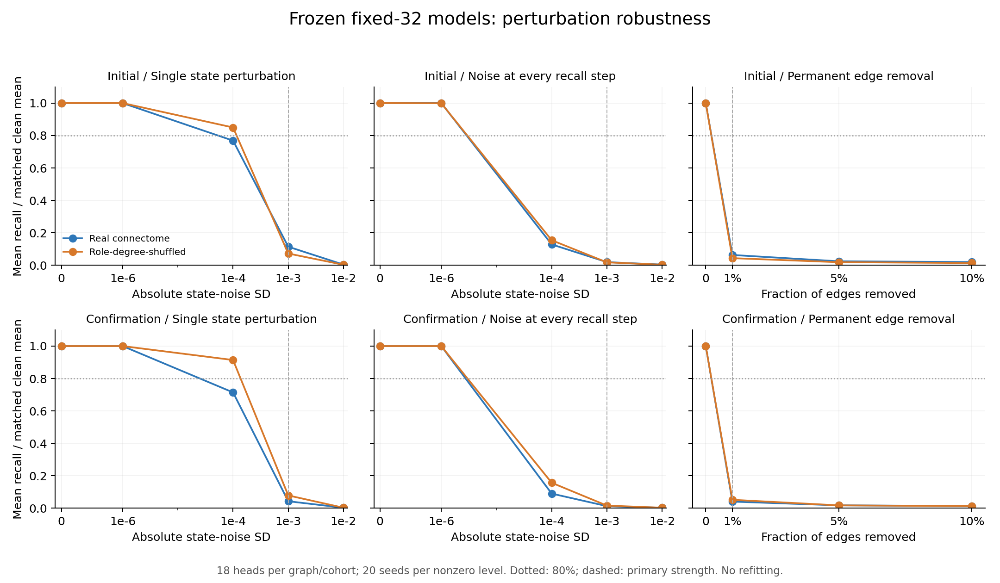

# Phase 2 강건성 후속: 교란 없는 회상은 재현되지만 강건성 기준은 실패

**현재 고정 32자리 가중 모델은 두 seed 집단 모두에서 사전 강건성 기준에
실패했다. 확인 집단의 실제 연결 평균 회상은 깨끗한 조건에서 36.83자리였으나,
대표 강도의 단발 상태 교란에서 1.59자리, 지속 잡음에서 0.48자리,
연결 1% 제거에서 1.51자리로 감소했다.**

[고정 설계](phase2-robustness-protocol.md) · [설정](../configs/phase2_robustness.json) ·
[전체 기록](../results/phase2_robustness) · [전체 phase 현황](phase-status.md)

## 범위와 표본

기존 두 실험에 저장된 고정 32자리 가중·6,000회 학습 모델을 전부 사용했다.
초기 집단은 model seed 3142/3143/3144, 확인 집단은 4142/4143/4144다.
각 집단에 두 부분망 × 세 seed × 실제/role-degree-shuffled 연결 × 세 초기화,
36개 모델이 있어 총 **72개 모델**이다. 모든 모델은 원래 offset 0의 200자리를
학습한 출력층을 사용하며, 이번에 **새로 학습한 모델은 없다**.

각 비영 교란 강도마다 20개 noise seed를 사용했다. 초기 집단은 5100–5119,
확인 집단은 6100–6119로 분리했다. 두 집단의 설정은 함께 사전 고정했고,
첫 집단 결과를 보고 두 번째 집단의 강도나 판정 기준을 바꾸지 않았다.
모델 seed가 다른 계산적 확인이지 새로운 개체나 미학습 원주율 검증은 아니다.

모델마다 깨끗한 회상 1회, 교란 세 종류의 영점 대조 3회, 비영 교란 220회를
실행했다. 합계 **16,128회**이며, 이 중 비영 교란은 15,840회다. 각 회상은
`314`만 제공하고 자기 예측을 피드백해 197자리를 생성했다. 정답은 별도 채점에
사용하고, 점수는 제공한 세 자리를 제외한 첫 오류까지의 연속 정답 수다.
오류 이후를 포함한 전체 출력도 저장했다.

이 실험은 원래 Phase 2에 남은 강건성 질문을 **현재 MB 기준 모델에서** 확인한
후속이다. 원래 450개 모델 조건을 전부 재실험한 것은 아니다. 지연 기억 과제는
이미 Phase 3b에서 별도로 수행했다.

## 사전 지정 대표 강도의 결과

상태 교란은 모델의 차원 없는 rate-state에 절대 표준편차 σ=0.001인 Gaussian
잡음을 더한다. 단발은 깨끗한 prompt 직후 한 번, 지속은 매 예측 직전이다.
연결 제거는 prompt 이전부터 적용하고 남은 가중치를 재정규화하지 않는다.
출력층과 그 정규화도 재학습·재보정하지 않았다.

| 조건 | 초기 집단 평균 회상 | 깨끗한 평균 대비 | 확인 집단 평균 회상 | 깨끗한 평균 대비 |
|---|---:|---:|---:|---:|
| 교란 없음 | 31.67 | 100% | 36.83 | 100% |
| 단발 상태 교란, σ=.001 | 3.62 | 11.43% | 1.59 | 4.31% |
| 지속 상태 잡음, σ=.001 | 0.61 | 1.94% | 0.48 | 1.30% |
| 연결 1% 제거 | 2.01 | 6.33% | 1.51 | 4.10% |

각 비영 셀은 18개 실제 연결 모델 × 20개 noise seed, 360회 평균이다.
깨끗한 조건은 같은 18개 모델이다. 반복 수가 늘었다고 독립 개체 표본 수가
360개가 되는 것은 아니다.

사전 기준은 평균 회상 80% 이상 유지, 6개 부분망×model-seed 조건 중 5개 이상에서
80% 유지, 깨끗한 조건에서 32자리를 완주한 모델의 교란 시험 중 80% 이상이
32자리를 유지하는 것이었다. **두 집단의 세 교란 모두 세 항목에 실패**했다.
80% 평균을 유지한 조건은 모든 대표 교란에서 0/6개였다.

| 대표 교란 | 초기 집단의 32자리 유지율 | 확인 집단의 32자리 유지율 |
|---|---:|---:|
| 단발 상태 교란 | 9.33% | 2.81% |
| 지속 상태 잡음 | 0% | 0% |
| 연결 1% 제거 | 0% | 0% |

분모는 원래 32자리를 완주한 초기 집단 15개×20회=300회,
확인 집단 16개×20회=320회다. 원래 실패한 모델을 유지율 분모에 넣지 않았다.
80%와 5/6은 사전 엔지니어링 기준이며 생물학적 용량이나 유의성 검정이 아니다.

## 강도에 따른 변화

| 교란 | 강도 | 초기 실제 연결 | 확인 실제 연결 |
|---|---:|---:|---:|
| 단발 상태 | 1e-6 | 31.67 | 36.83 |
| 단발 상태 | 1e-4 | 24.34 | 26.31 |
| 단발 상태 | 1e-3 | 3.62 | 1.59 |
| 단발 상태 | 1e-2 | 0.13 | 0.12 |
| 지속 상태 | 1e-6 | 31.67 | 36.83 |
| 지속 상태 | 1e-4 | 4.07 | 3.33 |
| 지속 상태 | 1e-3 | 0.61 | 0.48 |
| 지속 상태 | 1e-2 | 0.13 | 0.11 |
| 연결 제거 | 1% | 2.01 | 1.51 |
| 연결 제거 | 5% | 0.77 | 0.66 |
| 연결 제거 | 10% | 0.62 | 0.49 |

약한 σ=1e-6에서는 실제 연결의 평균 점수가 유지됐지만, 그 결과로 사전 지정한
σ=.001 실패를 대체하지 않았다. 위 표는 평균 점수이며 비영 잡음에서 전체
197자리 출력이 반드시 그대로라는 뜻은 아니다.



## 강도의 해석과 연결 대조군

실제 연결의 깨끗한 학습 상태에서, 48개 MBON 표준편차의 중앙값은 조건별
약 .003435–.004420이었다. 따라서 σ=.001은 그 값의 약 23–29%이고,
σ=.0001은 약 2.3–2.9%다. 모든 뉴런에 같은 절대 잡음을 넣기 때문에
변동이 작은 뉴런은 상대적으로 더 큰 영향을 받는다. 이를 모든 뉴런에서
동일한 상대 강도 또는 실제 뇌에서 측정된 잡음으로 해석하지 않는다.

연결 제거는 1%에서 32–33개, 5%에서 162–165개, 10%에서 324–330개의 기존
연결을 제거했다. 살아남은 가중치·부호는 그대로다. 배선과 총 입력 세기가
함께 바뀌므로 효과를 순수 배선 변화만으로 돌리지 않는다.

섞은 연결 역시 대표 교란에 민감했다. 초기 집단의 깨끗한 평균 37.11자리에서
단발/지속/1% 제거는 2.68/.66/1.62자리였고, 확인 집단의 41.44자리에서는
3.27/.68/2.16자리였다. 현재 결과로 실제 배선만의 강건성 우위를 주장하지 않는다.
전체 조건에서 상태 clipping은 0회였고, 197자리 완주도 없었다.

깨끗한 특징에 맞춰 학습한 출력층을 고정했으므로 교란 후 특징 분포 변화와
분류 경계 민감성이 성능 저하에 기여할 수 있다. 이 결과만으로 신경망 안의
모든 기억 정보가 소실됐다고 단정하지 않는다. 잡음 포함 학습이나 재보정의
회복 효과는 이번에 시험하지 않았다.

## 결정과 다음 단계

Phase 2의 **이번 범위 강건성 실험은 완료하되 결과는 기준 실패로 기록**한다.
기존 깨끗한 회상 결과는 그대로 재현되지만, 교란에 견디는 모델이라고 확대
해석하지 않는다. 더 약한 교란만 골라 성공으로 바꾸거나 모델을 사후 선택하지 않는다.

다음 원래 단계는 **Stage B/C의 근거 있는 LIF 모델과 작은 회로 검증**이다.
시간 단위·파라미터 근거·수치 검증부터 정하고, Phase 5B 도파민 구획 학습과
Phase 6 전체 뇌 확장을 별도 단계로 유지한다. 잡음 학습 효과를 확인했다거나
LIF로 바꾸면 이 실패가 해결된다고 가정하지 않는다.

## 재현

검증 결과:

- 전체 **148 tests 통과**. 잡음 주입 시점의 수동 계산 대조, clipping,
  정확한 개수·중첩 연결 제거, 원본 불변, 별도 집단 판정, 중단/재개 및 손상
  checkpoint 거부를 포함한다.
- **72개 저장 모델 재구축, 16,128회 전체 생성열과 교란 기록 정확히 재생**.
- 세 교란 종류의 영점 대조 **216회 모두** 원래 깨끗한 출력과 정확히 일치했다.
- 원본 연결·출력층 불변, 점수·집계·판정 재계산, 두 π 생성기의 200자리 일치를 확인했다.
- 실제 실행은 첫 모델 저장 후 별도 프로세스로 재개하여 1개를 재사용하고
  71개를 새로 평가했다. 모델의 새 학습은 0회다.

[기계 판독 검증 기록](../results/phase2_robustness/verification.json).

고정 설계와 실행 소스 커밋: `15f7700`. 기록된 환경에서 새 폴더로 실행한다.
원본 두 연구의 저장 결과는 변경하지 않았다.

```bash
python -m pip install -r requirements-lock.txt
python -m pip install -e .
python -m pytest -q
python -m flying.training.phase2_robustness --output outputs/robustness_repeat --max-models 1
python -m flying.training.phase2_robustness --output outputs/robustness_repeat --resume
python -m flying.training.phase2_robustness --output outputs/robustness_repeat --verify
python scripts/summarize_phase2_robustness.py --output outputs/robustness_repeat
```
