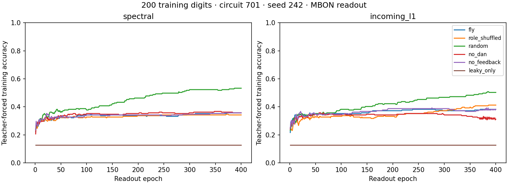
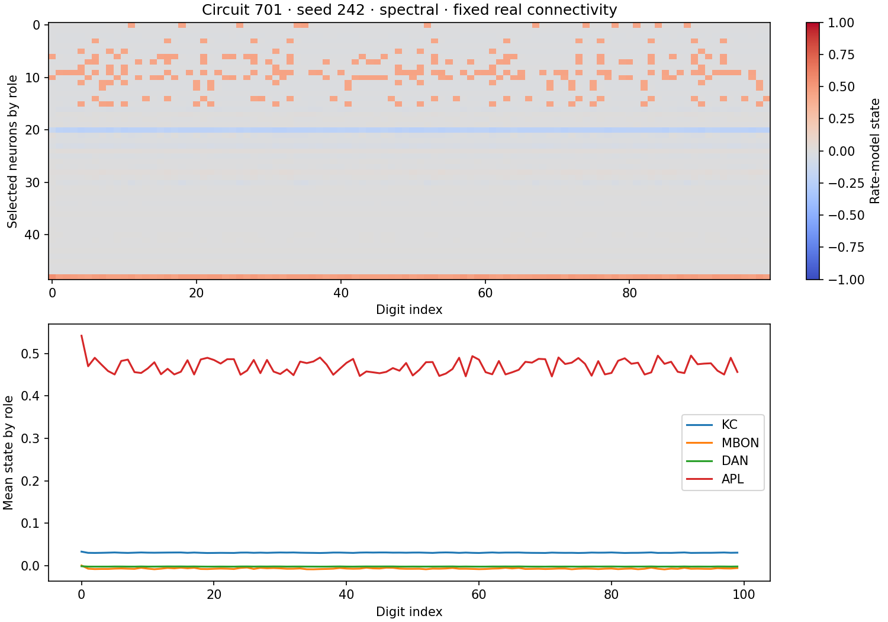
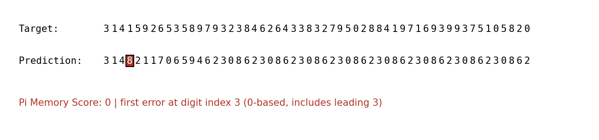

# Phase 3 — KC input, MBON output

Flying — Can a Fly Brain Memorize Pi?

This experiment uses annotated FlyWire connectivity, keeps recurrent weights fixed, and trains only an affine softmax readout. It does not simulate a living fly's learning or establish special mathematical ability.

## Data and extraction

The bundled circuits each contain **686 neurons: 512 KC, 48 MBON, 125 DAN and 1 APL**, all annotated as left hemisphere. KC samples use seeds 701 and 702 and contain **3,309 and 3,241 directed edges**, respectively. Counts are extracted from the pinned annotation snapshot, not inferred from names or estimated from a diagram.

Connectivity is Shiu et al.'s processed FlyWire v783 data, pinned to commit `91bdd1e7dcf193f3e7ca5a8933497fcef63b7960`. Annotations come from [flyconnectome/flywire_annotations](https://github.com/flyconnectome/flywire_annotations), commit `8587524c1748ce5ef2080822a2fc890fc03bf597`. These are updated annotations for release 783, not a claim to reproduce the annotation table at the original publication date. Exact file SHA256s and selected string root IDs accompany each subset.

Selection: identify exact classes `Kenyon_Cell`, `MBON`, `DAN`, plus exact cell type `APL`; take left-side neurons; uniformly sample 512 of 2,580 KC without replacement; retain all 48 left MBON and the left APL. Of 166 left DAN, retain the 125 with a direct connection of at least five synapses in either direction to the **full** left KC/MBON pool, before KC sampling. Induce connections on the selected IDs, threshold at five synapses, and remove autapses. All eligible annotation IDs were found in the connectivity file. Annotation status flags are retained. This is a sampled MB-associated circuit, not a complete mushroom body or whole brain; some DAN connections can disappear after KC sampling.

## Protocol

- Identical seeded sparse input patterns stimulate **KC only**: 51 of 512 KC per digit, amplitude 0.5, independently sampled populations that can overlap. No positional input or teacher label enters the reservoir.
- Four synchronous leaky-tanh updates per digit, holding stimulation throughout. Leak 0.6. Updates are dimensionless, not milliseconds. Four updates allow activity to propagate to MBON. They also change temporal memory relative to earlier one-update experiments, so phases are not directly comparable.
- Two predeclared normalizations: spectral radius 0.9 and incoming absolute-row-sum 0.9. Signs come from the processed connectivity, not newly inferred from annotation neurotransmitter labels.
- Primary readout observes only 48 MBON. The all-686-neuron readout is a diagnostic with more fitted parameters, not an equal-capacity comparison. Affine 10-class softmax, 400 Adam epochs; feature standardization uses training states only.
- Train on the first 50 or 200 digits including leading `3`. Reset state, supply `314`, then feed back only predicted digits. Score excludes these three supplied digits. Evaluation caps are 47 and 197; a capped score is a lower bound, not an estimate of maximum capacity.
- Teacher-forced held-out targets are zero-based digit positions 2000–2099. Their true preceding context drives the reservoir, but neither held-out labels nor statistics train the readout. This measures next-digit prediction on unseen positions, separately from memorization of the training prefix.
- Two circuit samples × three fresh seeds (242–244) × two normalizations × six models × two lengths × two observation sets = **288 runs**. Config fixed before execution; no selection of a winning seed.

## Controls

`role_shuffled` performs directed double-edge swaps within source/target role blocks. It preserves node count, edge count, every neuron's in/out degree, role-to-role edge counts and outgoing weight multiset. Five successful swaps per edge were completed. Edge overlap with the original remained 48.4–49.8%; constrained blocks, especially the singleton APL, cannot be freely rewired. This is not proof of independent uniform graph sampling.

`random` matches N/E and absolute weight multiset with source signs; it does not match role blocks or degree sequence and is a weaker anatomical control. `no_dan` removes edges touching DAN; `no_feedback` removes specifically **non-KC→KC** edges, not every recurrent path; `leaky_only` sets recurrent weights to zero. Ablations happen after real-graph normalization, with surviving weights unchanged. Nodes and masks remain present. With KC-only input, the leaky-only MBON readout sees a constant zero state.

DAN are ordinary signed nodes here. Neither dopamine modulation, reward, plasticity, nor compartment-specific neuromodulation is implemented. An effect of removing DAN would be a graph perturbation effect under these assumptions.

## Measured results

For 50 training digits, real connectivity with incoming-L1 normalization reached the **47-generated-digit cap in all six runs** using only MBON. Spectral normalization reached 47 in five runs and 17 in one. Both shuffled and random controls reached 47 in all runs under both normalizations. Thus this short trained prefix is reproducible, but does not demonstrate an advantage of the real wiring.

For 200 training digits, the primary MBON readout on real connectivity scored **0 in all twelve runs**. Training accuracy averaged 36.4% (spectral) and 38.6% (incoming-L1); held-out accuracy averaged 8.2% and 7.8%. Random controls scored 1–3 and 2–3, respectively. The all-neuron real-network diagnostic scored only 0–2. The longer sequence is not reliably memorized in this protocol.

Across six runs per table row (two circuit samples and three seeds), for 200 training digits and MBON readout:

| Normalization | Model | Pi Memory Score mean [min–max] | Training accuracy | Held-out accuracy |
|---|---|---:|---:|---:|
| incoming_l1 | fly | 0.00 [0–0] | 38.6% | 7.8% |
| incoming_l1 | leaky_only | 0.00 [0–0] | 12.6% | 10.0% |
| incoming_l1 | no_dan | 0.00 [0–0] | 34.8% | 8.7% |
| incoming_l1 | no_feedback | 0.00 [0–0] | 37.9% | 7.7% |
| incoming_l1 | random | 2.17 [2–3] | 52.1% | 6.3% |
| incoming_l1 | role_shuffled | 0.00 [0–0] | 40.2% | 10.5% |
| spectral | fly | 0.00 [0–0] | 36.4% | 8.2% |
| spectral | leaky_only | 0.00 [0–0] | 12.6% | 10.0% |
| spectral | no_dan | 0.00 [0–0] | 36.3% | 7.5% |
| spectral | no_feedback | 0.00 [0–0] | 36.0% | 8.2% |
| spectral | random | 2.33 [1–3] | 53.6% | 8.7% |
| spectral | role_shuffled | 0.33 [0–1] | 36.3% | 9.5% |








## Interpretation and limitations

A high training-prefix score is memorization, not prediction of new π digits. Approximately 10% unseen-digit accuracy provides no evidence of learning a rule for π. Two samples from one brain and three encoder/shuffle seeds do not constitute independent biological replicates or a statistical population study. No formal significance claim is made. The normalization and update rate are computational choices. Missing projection-neuron inputs, sampled KC, thresholded edges, simplified signs and absent modulation all limit biological interpretation. DAN/feedback ablations did not uncover a robust 200-digit memory capacity under these conditions; this is not a biological necessity/sufficiency result.

Before adding learning rules, vary only the per-digit update count and measure delayed-input memory with matched readout capacity. This can distinguish loss of temporal information from readout limitations. Then add explicitly defined KC→MBON plasticity and a separate dopamine/reward protocol; retain the present fixed reservoir as a baseline.

## Reproduce

From the repository root, after the standard editable install:

```bash
python scripts/run_phase3.py --output outputs/phase3
python scripts/summarize_phase3.py --output outputs/phase3
python -m pytest -q
```

Bundled subsets suffice; no authentication or full-data download is needed. To rebuild them from source into a new directory (requires the raw connectivity file from the existing download script):

```bash
python scripts/build_mushroom_body.py --output outputs/rebuilt_mb
```

The builder fetches and SHA-verifies the pinned annotation TSV if absent, then verifies the raw connectivity hash. Change circuit paths in a copied config if using rebuilt files.

`results/phase3/` preserves config, source manifest, 288 measurements, every autoregressive target/prediction, role-shuffle mixing, selected activity, training history, and derived figures. The summary script independently recomputes every score and verifies condition uniqueness and expected count. `reproducibility.json` records the full repeat comparison. Timing is excluded from numerical reproducibility checks.
