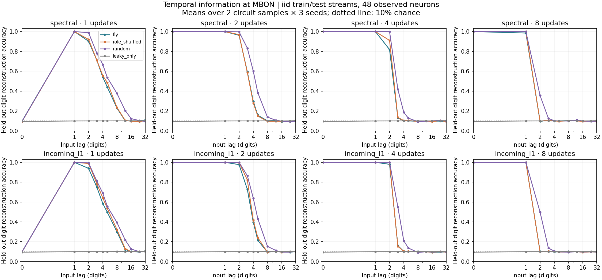
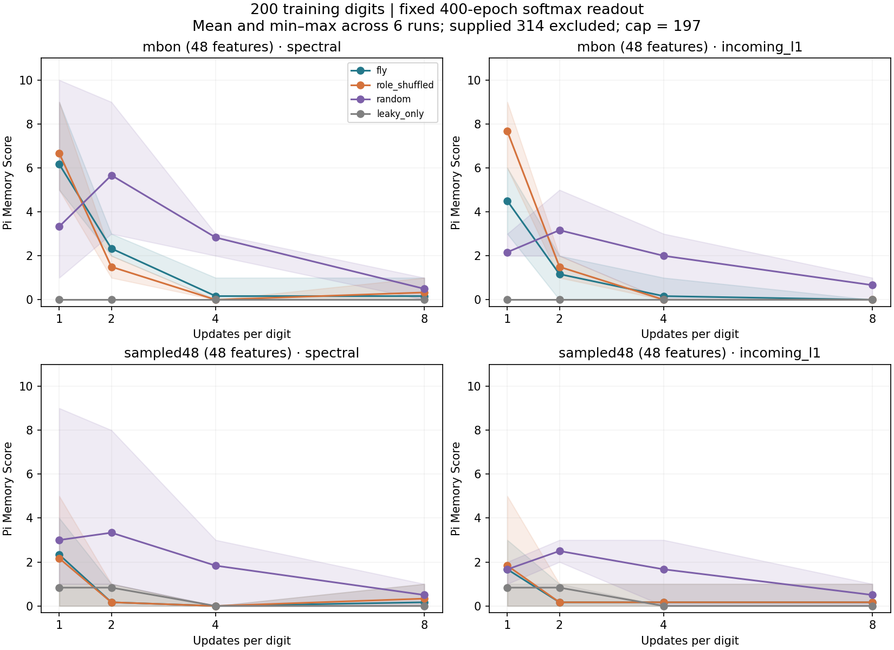
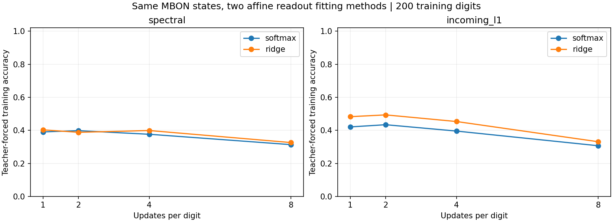

# Phase 3b — how quickly does the model forget?

**Finding:** per-digit integration length materially changes temporal decoding and trained-prefix recall. At MBON, three-digit-old iid inputs were reconstructed with 71–75% accuracy using one update per digit, versus 13–16% with four. With 200 training digits, real-circuit softmax recall improved to 5–9 digits (spectral) or 3–6 (incoming-L1) at one update. Shuffled circuits performed comparably or better. This is evidence about this model's dynamics, not evidence that the real fly wiring is superior.

## Question and controlled protocol

Phase 3 used four leaky-tanh updates per digit. We now sweep **1, 2, 4, 8** updates, holding each digit's stimulation throughout its updates. This changes both the time available for recurrent propagation and the time for old inputs to decay; it is not a pure change of one memory parameter. It does not specify physiological milliseconds.

Data remain the two pinned, real FlyWire v783 left MB-associated subsets (686 neurons each), with KC-only stimulation. No connectivity is trained. No new external data or guessed API was needed. Original provenance is copied into the run manifest. See [Phase 3](phase3-results.md) for the exact selection, roles, signs, data terms and structural limitations.

All readouts observe exactly **48 neurons**: either the 48 MBON or 48 uniformly sampled neurons from the complete 686-node subset. Observed root IDs and their role counts are logged. These observation sets and input patterns are shared across graph controls for each circuit/seed. Equal feature count equalizes nominal affine parameter count; it does **not** equalize effective rank, active-neuron count, signal amplitude or input accessibility. The random 48-neuron set is a diagnostic, not a biologically matched output population.

Conditions were specified before running: 2 circuit samples × 3 new seeds (342–344) × 2 normalizations × 4 graph conditions × 4 update counts × 2 observation sets = **384 state/observation conditions**. Graphs are real, role-preserving shuffled, random N/E-matched, and zero-recurrence leaky-only. Normalization and shuffle guarantees are unchanged from Phase 3. The two zero-recurrence normalization conditions are duplicates retained for the factorial design, not extra independent evidence.

## Independent random-input memory probe

For each seed, independent iid uniform digit streams supply 2,000 training and 1,000 test examples, each after 100 warmup digits. State resets separately for each stream. Neither π nor its positions are used. At time t, the current state predicts the digit at t−k, for k = 0, 1, 2, 3, 4, 5, 8, 12, 16, 24, 32. Lag 0 means current-input accessibility, not past memory.

An affine ridge decoder fits 10 one-hot targets per lag, using train-only means/scales, an unpenalized intercept, and fixed penalty 1.0 on the unnormalized summed squared error. The multiple targets are fitted together as independent outputs; no target from another lag is supplied as a feature. Decoding accuracy uses argmax. A second metric is 1−SSE/SSE_baseline, with the training class-frequency vector as baseline; negative values are retained. This metric is explicitly named `r2_vs_training_frequency` and is not a standard total reservoir memory-capacity estimate. We do not sum digit accuracies into an unsupported capacity score.

The test chance expectation is 10%; realized majority-class accuracy is also logged. All 4,224 lag accuracy measurements were independently recalculated from **4,224,000 saved test predictions**. Delay-alignment tests include a known shift register that recovers all tested past digits and a memoryless encoder that does not recover earlier iid digits.

## π task and readout diagnostic

Each state/observation condition fits two affine 10-class readouts to the first 200 π digits: the unchanged 400-epoch Adam softmax, and a closed-form ridge classifier with fixed penalty 0.001. This makes **768 π runs**. Ridge and softmax have equal nominal input/output dimensions but different objectives and regularization; this comparison cannot prove that the softmax optimizer has converged or that nonlinear decoding would fail.

Free recall resets the reservoir, supplies `314`, and generates 197 digits using only its own predictions. The Pi Memory Score counts consecutive correct generated digits before the first error, excluding the prompt. Teacher-forced training accuracy is logged separately. Held-out teacher-forced targets use previously unused zero-based π positions 3000–3099, with true preceding context; they never fit a readout or its standardization. We did not select settings using those held-out labels.

## Measured results

Real circuit, primary MBON observation, means over the two circuit samples and three seeds:

| Normalization | Updates/digit | Lag-3 reconstruction | Softmax Pi Memory Score mean [min–max] | Softmax training accuracy | Ridge training accuracy |
|---|---:|---:|---:|---:|---:|
| spectral | 1 | 71.1% | 6.17 [5–9] | 39.0% | 40.3% |
| spectral | 2 | 59.4% | 2.33 [2–3] | 39.8% | 38.8% |
| spectral | 4 | 13.0% | 0.17 [0–1] | 37.6% | 39.9% |
| spectral | 8 | 10.8% | 0.17 [0–1] | 31.3% | 32.6% |
| incoming_l1 | 1 | 74.9% | 4.50 [3–6] | 42.0% | 48.2% |
| incoming_l1 | 2 | 72.7% | 1.17 [0–2] | 43.4% | 49.3% |
| incoming_l1 | 4 | 16.0% | 0.17 [0–1] | 39.5% | 45.3% |
| incoming_l1 | 8 | 10.4% | 0.00 [0–0] | 30.7% | 33.1% |







At one update, lag-0 accuracy at MBON is about chance while lag-1 accuracy is 100%. This follows the synchronous model: KC receives the current input, but MBON uses the previous KC state and has no direct digit stimulation. At two or more updates, current digits become accessible to MBON. High lag-1 accuracy alone is therefore partly a propagation delay, not evidence of long memory.

At one update, the role-shuffled softmax control scores 5–9 digits (spectral) and 6–9 (incoming-L1), versus real 5–9 and 3–6. The random control ranges overlap or sometimes exceed the real score. No consistent advantage for real anatomy is established. Full results include both observation sets and both readouts; the best run is not treated as a representative result.

Even the alternative ridge fit achieves only 33–49% training accuracy on the real MBON states across settings. Thus longer Adam training alone is not an established solution; information loss and limited linear separability remain plausible contributors. The probe directly shows reduced *linearly decodable* past information with more updates. It does not prove that all information has vanished from the entire network, or that readout limitations are eliminated. A nonlinear probe or controlled noise study would answer different questions.

The new four-update recall runs sometimes score one digit, unlike the previous seeds' zeros. This is ordinary seed dependence, not a reproduction discrepancy: Phase 3b uses new seeds. The complete new experiment was separately rerun with identical settings; see `reproducibility.json`.

## Limits and next experiment

All states are noise-free floating-point model states. Linear standardization can exploit small traces; decodability here is not biological robustness. Subsets, synapse threshold, ordinary signed DAN edges, uniform dimensionless time steps and fixed input coding remain modeling assumptions. Six runs per summary cell are computational repeats using two overlapping samples of one brain; they are not six independent biological specimens. The many comparisons are descriptive; no formal significance or generalization claim is made.

Next add an explicitly specified **KC→MBON plasticity experiment**, keeping the fixed baseline and graph controls. The present diagnostics justify retaining several update counts rather than treating four as biologically correct. Plasticity should have its own training-only signal, a clear train/evaluate freeze boundary, and a check against equal-parameter non-anatomical controls. A dopamine reward rule should be a subsequent separate condition; no dopamine learning has been implemented here.

## Reproduce

From the repository root after the standard editable install:

```bash
python scripts/run_phase3b.py --output outputs/phase3b
python scripts/summarize_phase3b.py --output outputs/phase3b
python -m pytest -q
# Optional full independent repeat and exact comparison:
python scripts/run_phase3b.py --output outputs/phase3b_repeat
python scripts/verify_phase3b_repeat.py --reference results/phase3b --repeat outputs/phase3b_repeat
```

CPU only; bundled circuits suffice. `configs/phase3b.json` specifies every experimental hyperparameter. Results include the config, package versions, source hashes, observed IDs, graph mixing, 768 complete recall sequences, 4,224 lag measurements, saved delayed predictions and independent score checks. The runner resets each input stream and writes complete CSV/JSONL snapshots rather than appending partial records.
