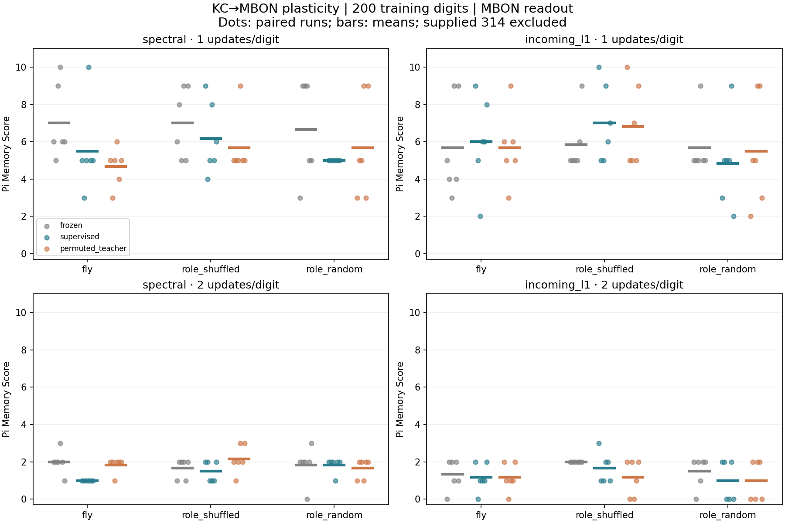
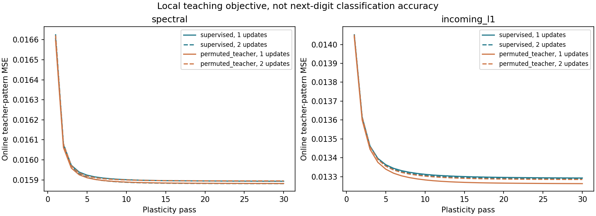
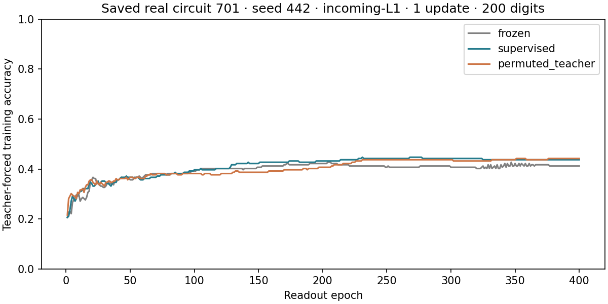

# Phase 4 — learning only at existing KC→MBON synapses

**Outcome:** the first explicitly supervised plasticity rule changes the intended synapses and is reproducible, but does not consistently improve π recall. For 200 training digits, real-circuit scores improved in 5 of 24 paired comparisons, tied in 3 and worsened in 16 versus frozen connectivity. This is a negative result for this specific rule and configuration, not a general result about fly learning or all possible plasticity.

## What changes and what stays fixed

We retain the two real FlyWire v783, left MB-associated 686-neuron subsets and their provenance from [Phase 3](phase3-results.md). KC-only digit stimulation and a 48-MBON observation set remain unchanged. Only **existing KC→MBON edge weights** can change: 1,474 parameters in circuit 701 and 1,431 in circuit 702. No edges or neurons are added, no other recurrent weights change, and synaptic signs are retained.

This rule is an artificial supervised teaching experiment. It is not a physiological KC→MBON learning law, dopamine modulation, reward learning, spiking simulation or whole-brain learning. DAN remain ordinary signed nodes. The supplied next-digit labels are available only during training.

## Precisely defined update

For each training input digit, perform the configured 1 or 2 leaky-tanh microsteps while holding KC stimulation constant. Let u be the state immediately before the **last** microstep, a = tanh(Wu + input), and x = (1−leak)u + leak·a. For the known next digit y, a fixed seeded sparse code c(y) specifies desired MBON activity: 12 of the 48 MBON receive target 0.25 and the rest target 0. These target patterns are independent of the KC input patterns and never directly stimulate neurons.

For an existing plastic synapse from KC j to MBON i, write its sign sᵢⱼ and nonnegative magnitude mᵢⱼ. Compute:

```math
\delta_{ij}=(c_i(y)-x_i)\,\ell(1-a_i^2)\,u_j,
\qquad
\widetilde m_{ij}=\max\left(10^{-4}m^{(0)}_{ij},\ m_{ij}+\frac{0.05\,s_{ij}\delta_{ij}}{1+\sum_{k\in P_i}u_k^2}\right).
```

Then redistribute magnitudes within each MBON's incoming plastic edges:

```math
m'_{ij}=B_i\frac{\widetilde m_{ij}}{\sum_{k\in P_i}\widetilde m_{ik}},
\qquad B_i=\sum_{k\in P_i}m^{(0)}_{ik},\qquad W'_{ij}=s_{ij}m'_{ij}.
```

Here Pᵢ contains only original KC→MBON edges. This is a one-step semi-gradient followed by a row competition constraint; it stops gradients through prior state, earlier microsteps and other time steps. It is not full backpropagation through time. The floor is applied **before** row normalization and ensures positive magnitudes; it is not a claimed final lower bound relative to the initial weight.

The update happens after computing x. The label cannot alter the current forward state directly. We reset the neural state, but retain learned weights, between each of 30 chronological passes through the training prefix. Online mean squared error against the teaching code is recorded; it is not the same objective as next-digit classification or free-recall score.

The incoming absolute plastic weight budget is conserved. Nonplastic weights are unchanged, so total absolute incoming row strength also stays fixed. Incoming-L1 normalization therefore keeps its contraction bound. In the spectral condition, normalization to radius 0.9 is performed **only before learning**; the spectral radius itself is not constrained afterward. Row conservation is a modeling choice that limits the family of learning rules tested.

## Controls and evaluation boundary

Every graph is run in three paired conditions:

- **Frozen:** no synaptic learning; only the final readout is fitted.
- **Supervised:** chronological training input with the correct next-digit teaching code.
- **Permuted teacher:** the same next-digit labels are shuffled across training positions once and held fixed across epochs, preserving class frequencies while disrupting their alignment with the input sequence.

All three conditions subsequently train a new identical affine softmax readout on the **correct** training labels. Thus the permuted condition tests whether the earlier teaching signal helps, rather than sabotaging the output classifier.

Graphs are real, role-preserving degree-shuffled, and a new **role-block-random** control. The shuffled graph retains each neuron's in/out degree and outgoing weight multiset, as before. The role-block-random graph retains N, E, every role-to-role edge count, each block's absolute weight multiset and observed source signs, but does not preserve individual degrees. A source without observed outgoing edges defaults to positive sign in this synthetic control. All three match the nominal number of adjustable KC→MBON edge weights. Row-budget constraints mean matching edge counts alone does not guarantee identical effective degrees of freedom; the degree-shuffled control is the stronger match. The weaker random control is labeled separately from earlier unrestricted random graphs.

After plasticity, create a **new fixed reservoir** from the learned weights. No teaching target or plasticity update is accessible during readout fitting or evaluation. Fit the same 400-epoch softmax readout using train-only feature scaling. Weight hashes are checked before and after evaluation. Every run audits unchanged nonplastic edges, preserved signs and conserved row budgets; the largest observed budget error was below 3×10⁻¹⁵.

Config: two circuits, fresh seeds 442/443/444, two normalizations, three graphs, one/two microsteps, 50/200 training digits, three teaching conditions = **432 runs**. Hyperparameters were fixed before execution; no search for a winning rule or seed was performed. Held-out teacher-forced targets are previously unused zero-based positions 4000–4099; they never train synapses, the output layer or its statistics.

Free recall resets state, supplies `314`, then feeds back predictions. Score excludes the prompt and stops counting at the first error; horizons are 47 or 197. These measure recall of a training prefix, not a discovered rule for generating unseen π digits.

## Results

Real circuit, 200 training digits, mean score over two circuit samples × three seeds:

| Initial normalization | Updates/digit | Frozen | Supervised plasticity | Permuted teacher |
|---|---:|---:|---:|---:|
| spectral | 1 | 7.00 | 5.50 | 4.67 |
| spectral | 2 | 2.00 | 1.00 | 1.83 |
| incoming_l1 | 1 | 5.67 | 6.00 | 5.67 |
| incoming_l1 | 2 | 1.33 | 1.17 | 1.17 |

The supervised real-circuit score averaged 0.58 fewer digits than its paired frozen control across these 24 conditions. Versus permuted teaching, it improved in 5, tied in 11 and worsened in 8, with a mean gain of only 0.08 digits. These are descriptive paired differences, not formal significance claims or independent biological replicates.

At 50 training digits all real-graph runs, including frozen and permuted controls, reached the 47-digit evaluation cap. That ceiling cannot demonstrate a plasticity advantage. At 200 digits the supervised real-graph readout training accuracy was only about 39–43% across settings; held-out accuracy was roughly 10–14%. No evidence of learning a general rule for unseen π is claimed.

Weights changed substantially: the relative L2 change of the plastic weight vector averaged about 1.0–1.1 for supervised real circuits at 200 digits. This rules out “nothing was updated” as an explanation. Online teacher-pattern MSE decreased modestly for both correct and permuted teaching, yet recall did not consistently improve. Matching artificial activity codes is not equivalent to solving long sequence memory; this rule also lacks temporal credit assignment beyond the last microstep.







The selected training-curve example uses circuit 701, seed 442, incoming-L1, one update and 200 digits. It was specified before evaluation, not chosen for its score. All graphs and teaching conditions are included in the CSVs and paired-score table.

## Verification and limitations

The complete 432-run experiment was executed twice; numerical results, learned weight hashes and autoregressive digit sequences matched exactly. Every recall score was independently recomputed from saved strings. Nine predetermined network/readout checkpoints were loaded and replayed, and all nine readouts were independently refitted to exactly reproduce their stored coefficients. Thirty tests cover the existing pipeline, role-block randomization, zero-learning equivalence, teacher-signal causality, mask/sign/budget invariants and a small case where the local update reduces its intended loss.

This tests one constrained rule and one learning rate, not an exhaustive plasticity study. Two samples from one brain, noise-free states, simplified signs, ordinary signed DAN nodes, absent projection-neuron inputs and artificial teaching codes all limit biological interpretation. The local teacher gradient is not a gradient of the final softmax classifier or Pi Memory Score.

The next meaningful extension is a separately defined reward-modulated eligibility-trace condition (Phase 5), with training-only next-digit reward and frozen evaluation. It should retain frozen, permuted-signal and topology controls, and make the source of the teaching/reward signal explicit. A reward variable is not automatically a faithful simulation of dopamine biology. Neither that extension nor spiking/whole-brain learning is implemented here.

## Reproduce

```bash
python scripts/run_phase4.py --output outputs/phase4
python scripts/summarize_phase4.py --output outputs/phase4
python -m pytest -q
# Optional complete repeat comparison:
python scripts/run_phase4.py --output outputs/phase4_repeat
python scripts/verify_phase4_repeat.py --reference results/phase4 --repeat outputs/phase4_repeat
```

CPU only, using bundled subsets. Config includes both plasticity and readout parameters. Results preserve source hashes, teaching codes, all 432 recalls, weight audits/hashes, training curves, paired differences and predetermined checkpoints. `verification.json` and `reproducibility.json` record independent checks.
