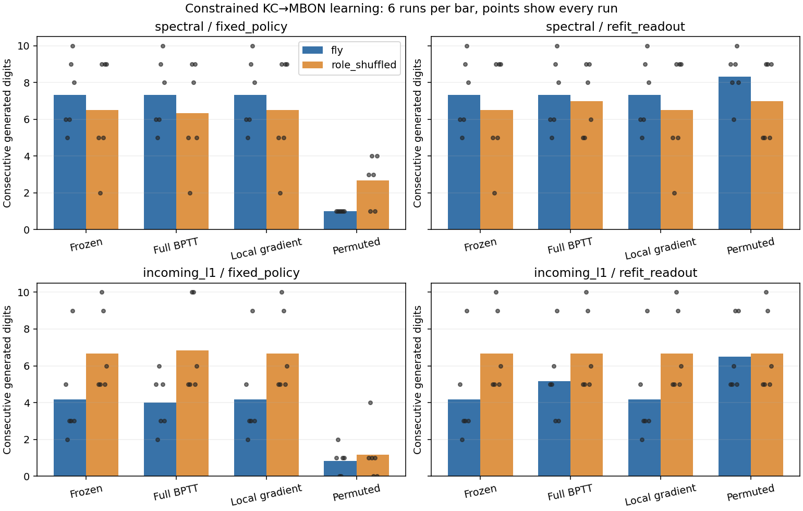

# Constrained BPTT — better training objective, no reliable recall gain

**결론: 정확한 시간 역전파는 정답 예측의 학습 오차를 줄였지만, 실제 π 자유 회상은 일관되게 개선하지 못했습니다.** 따라서 Phase 5의 실패를 단순히 reward/eligibility 근사 하나의 문제로만 설명할 수는 없습니다. 반대로 이번 결과도 회로의 학습 불가능성을 증명하지는 않습니다.

[사전 프로토콜](phase5-bptt-protocol.md) · [설정](../configs/phase5_bptt.json) · [원자료](../results/phase5_bptt)

## What changed

The same existing KC→MBON edges were trained with the exact gradient of teacher-forced next-digit cross entropy, differentiating through the entire 199-step recurrent sequence. The supervised warm-started policy, feature statistics, encoder, other edges, signs and incoming absolute strengths stayed fixed. This is a computational positive-control learner, not dopamine or reward-only learning.

Three fresh seeds (742–744), two real circuit samples, two normalizations, real/role-degree-shuffled topology, four conditions and two readout views yielded **96 network conditions, 72 optimization runs and 192 evaluations**. Conditions were frozen, exact full BPTT, a last-step-only derivative of the same objective, and full BPTT with permuted training labels. Each optimizer ran a predeclared 100 Adam epochs at .01 with bounded edge logits. Selection used minimum training objective, including epoch zero, never recall score. No hyperparameter search or whole-brain simulation was run.

## Real-circuit results

Scores count newly generated consecutive correct digits after the supplied `314`, stopping at the first error. Each mean uses both circuits and all three seeds.

| Normalization | Evaluation | Frozen | Correct full BPTT | Last-step gradient | Permuted-label BPTT |
|---|---|---:|---:|---:|---:|
| spectral | Original fixed policy | 7.33 | 7.33 | 7.33 | 1.00 |
| incoming-L1 | Original fixed policy | 4.17 | 4.00 | 4.17 | 0.83 |
| spectral | New supervised readout | 7.33 | 7.33 | 7.33 | 8.33 |
| incoming-L1 | New supervised readout | 4.17 | 5.17 | 4.17 | 6.50 |

With the original policy, correct BPTT beat frozen in **1/12** real-network pairs, tied in 10 and lost in 1. Under spectral normalization all six pairs tied. Beating the damaged permuted-label policy does not by itself establish a gain over frozen connectivity.

After an additional supervised readout refit, incoming-L1 improved by 1.00 digits on average (2 wins, 4 ties), while spectral stayed unchanged. But permuted-label BPTT followed by the same correct-label refit scored higher on average under both normalizations. Correct BPTT versus permuted-refit had 1 win, 7 ties and 4 losses across the 12 real pairs. Therefore the observed refit gain does not establish useful sequence-specific connection learning.

Role-shuffled networks did not show a consistent anatomical disadvantage: their frozen/fixed full-BPTT means were 6.50/6.33 (spectral) and 6.67/6.83 (incoming-L1). Real-fly wiring superiority remains unestablished.



## What did improve?

Correct full BPTT reduced the true training cross entropy in **all 24 graph/circuit/seed/normalization conditions**, without changing the original policy:

| Real circuit | Frozen cross entropy | Full BPTT cross entropy | Frozen training accuracy | Full BPTT training accuracy |
|---|---:|---:|---:|---:|
| spectral | 1.6979 | 1.6707 | 38.69% | 39.87% |
| incoming-L1 | 1.6394 | 1.6180 | 42.13% | 44.39% |

Plastic-weight relative L2 changes averaged 8.93% and 8.68%, respectively. The optimizer made real, objective-improving changes; it was not a no-op. However, improving mean teacher-forced cross entropy does not necessarily move the first greedy autoregressive error, much less create a stable long sequence.

This narrows the interpretation: the constraints admit useful changes to the supervised objective, but this bounded optimization protocol did not demonstrate useful autonomous-memory gains. Full BPTT and permuted BPTT selected epoch 100 in every condition, so **convergence is not established**. Different optimization duration, parameterization, jointly trained readout or sensory timing could change the result; none was tested here.

## Why did the local-gradient rows equal frozen?

All 24 last-step-gradient runs selected epoch zero because none of their later training losses beat the initial objective. They did attempt updates. Across those runs, mean loss rose from 1.6393 initially to 1.6729 after the first update and 4.1940 at epoch 100. Including epoch zero prevented reporting a damaged model as the best local learner.

A separate post hoc diagnosis compared initial full and local gradient directions without retraining or selecting another model. For real circuits their mean cosine similarities were only **0.0403 (spectral)** and **0.0648 (incoming-L1)**; some were negative. Finite differences along the negative local direction agreed with the full derivative in all 24 cases. The last-step approximation can therefore give a substantially different direction from the full-sequence objective. This does not prove that every local update is uphill, or isolate the effect of Adam's step size; the numeric directions, norms and signs are retained in `gradient_diagnostics.csv`.

## Decision before whole-brain scaling

Keep whole-brain scaling deferred. We now have evidence that (1) last-step credit assignment poorly approximates the full objective in these states, and (2) replacing it with the exact recurrent gradient improves fitting but still does not establish longer autonomous recall under this protocol. Scaling neuron count alone does not resolve that gap.

The next design decision should examine the model's temporal input/output access and the difference between teacher-forced fitting and autonomous rollout. In particular, the one-update KC-input/MBON-output setup makes the current digit unavailable at MBON until a later update, as Phase 3b already showed. That is a computational timing choice, not a biological measurement. A subsequent controlled timing/observation experiment should preserve the strongest current baselines and avoid changing several capacities at once. It is not implemented in this change.

## Verification and limitations

- **45 tests passed**, including full recurrent finite differences at zero/nonzero logits, exact frozen forward equivalence, objective descent with invariant edges/signs/budgets, deterministic toy replay and target-free forward-state checks.
- All **192 complete recall strings** independently scored, and **all 192 checkpoint/readout combinations** independently rebuilt/refitted and replayed exactly.
- All **96 training-objective checkpoint selections** independently checked against saved histories, including the 24 local-gradient epoch-zero selections.
- Every materialized matrix preserves the edge mask, source signs, nonplastic weights and incoming budgets. The primary policy is frozen during connection optimization and evaluation.
- The full numerical study took approximately **74 seconds on this host**. It was run once; independent replay is not a second optimization run.
- Two overlapping subsets from one brain and three computational seeds are not independent biological replicates. No formal significance, unseen-π prediction, maximum-capacity, biological-learning or impossibility claim is made.

## Reproduce

```bash
python -m pytest -q
python scripts/run_phase5_bptt.py --output outputs/phase5_bptt
python scripts/verify_phase5_bptt.py outputs/phase5_bptt
python scripts/summarize_phase5_bptt.py outputs/phase5_bptt
python scripts/diagnose_bptt_gradients.py outputs/phase5_bptt
```

Use a new output directory. Only the existing declared scientific dependencies are needed; the exact sparse BPTT implementation uses NumPy/SciPy, not a new neural-network framework. Source/data hashes and runtime versions are in the manifest. All measured conditions, histories, theta checkpoints, complete predictions and verification records are retained.
