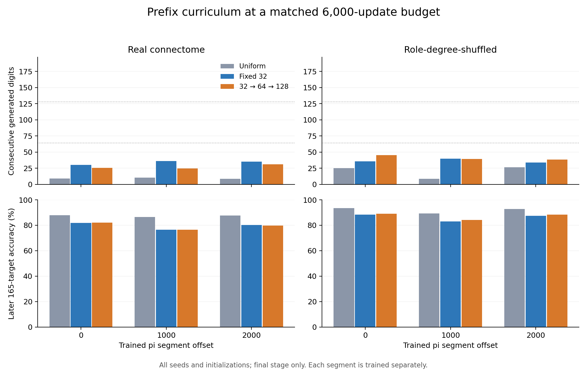

# 누적 접두사 학습: 같은 6,000회 예산에서의 비교

**32→64→128 누적 가중 학습은 이번 설계에서 고정 32자리 가중 학습보다 연속
회상을 늘리지 못했다. 실제 연결의 평균 회상은 고정 방식 33.87자리, 누적 방식
27.19자리였다. 세 구간 모두 사전 회상 기준과 공동 개선 기준에 실패했다.**

[고정 프로토콜](phase5-curriculum-protocol.md) ·
[설정](../configs/phase5_curriculum.json) ·
[전체 결과와 저장 모델](../results/phase5_curriculum) ·
[Windows 재현 보고](phase5-windows-reproduction.md) ·
[작업 우선순위](next-work.md)

## 설계

이전 결과가 제안한 누적 학습 범위 32→64→128을 하나의 개입으로 시험했다.
각 구간의 200자리, incoming-L1, mbon_after_kc, 48 MBON 관측, 482개 출력층
파라미터와 고정 연결을 유지했다. 두 부분망 × 세 새 seed 2142–2144 ×
실제/role-degree-shuffled 연결 × offsets 0/1000/2000으로 36개 상태 조건이다.

모든 방식에 같은 6,000회 full-batch Adam 업데이트, 학습률 .03, L2=1e-5를 준다.
균등 학습은 모든 target의 비중이 1이다. 고정 방식은 처음 생성하는 32개 target에
4배를 준다. 누적 방식은 2,000회마다 그 범위를 32→64→128로 넓힌다. 범위 밖
target도 항상 비중 1로 학습하며, 손실은 비중 합으로 나눈다.

단계가 바뀌어도 모델·Adam 모멘트·bias-correction step을 이어간다. 표준화는
전체 학습 상태에서 비가중으로 한 번만 계산한다. 방식별 입력 상태와 초기화가 같다.
상태 조건마다 세 초기화 × 세 방식으로 총 324개 모델이며, 각 모델의 2,000·4,000·
6,000회 상태를 저장해 972개 평가가 된다. 주 평가는 **마지막 6,000회 모델만** 쓴다.
각 구간은 처음부터 별도로 학습하므로 미학습 π의 즉석 예측을 뜻하지 않는다.

## 판정 기준과 해석 단위

실제 연결의 각 구간에서 누적 방식이 두 비교군 모두보다 평균 회상이 길고,
각 비교에서 초기화 평균으로 6개 조건 중 4개 이상을 이기면 회상 기준을 충족한다.
세 구간 모두에서 이 조건을 만족해야 전체 회상 기준을 통과한다. 더 강한 공동
기준은 각 구간의 후반 165자리 정확도도 고정 방식 이상이어야 한다.

이 기준은 실행 전에 고정한 기술적 비교이며 통계적 유의성 검정이 아니다.
초기화·구간·한 개체에서 겹치는 두 부분망을 독립 생물학적 반복으로 세지 않는다.
최고 시드나 중간 epoch를 대표 결과로 선택하지 않는다.

## 최종 결과: 실제 연결

회상은 제공된 세 숫자를 제외하고 첫 오류까지 생성한 연속 정답 수다.
각 셀은 두 부분망 × 세 seed × 세 초기화의 18개 모델 평균이다.

| 시작 인덱스 | 균등 | 고정 32 | 누적 32→64→128 | 누적−고정 | 누적이 고정을 이긴 조건 |
|---|---:|---:|---:|---:|---:|
| 0 | 9.00 | 30.33 | 25.83 | −4.50 | 2/6 |
| 1000 | 10.56 | 36.22 | 24.83 | −11.39 | 1/6 |
| 2000 | 8.67 | 35.06 | 30.89 | −4.17 | 1/6 |

누적 방식은 균등 방식보다 각 구간 평균이 높았고, 조건 평균으로 각각 5/6,
5/6, 6/6을 이겼다. 그러나 더 강한 고정 가중 비교군에는 세 구간 모두 평균이
낮았다. 따라서 두 비교군을 모두 이겨야 하는 사전 기준을 충족하지 않는다.

| 실제 연결, 세 구간 합계 | 균등 | 고정 32 | 누적 |
|---|---:|---:|---:|
| 평균 회상 | 9.41 | 33.87 | 27.19 |
| 32자리 완주 | 3/54 | 48/54 | 29/54 |
| 64자리 완주 | 0/54 | 0/54 | 1/54 |
| 128자리 완주 | 0/54 | 0/54 | 0/54 |
| 197자리 완주 | 0/54 | 0/54 | 0/54 |

64자리 완주 한 건을 대표 성과로 선택하지 않는다. 128자리까지 가중해도
128자리 연속 회상은 없었으며, 가중 범위와 실제 연속 기억 길이는 다르다.

## 초반 유지와 위치별 대가

누적 방식의 2,000회 시점에 초반 32자리를 완주했던 48개 실제 모델 중,
4,000회에는 5개, 6,000회에는 **19개**가 그 완주 능력을 잃었다. 고정 방식은
같은 48개에서 중간·최종 모두 손실이 0개였다. 누적 방식의 실제 평균 회상은
33.46→36.54→27.19자리로 변했다. 중간 4,000회 결과를 선택해 성공으로
바꾸지 않는다. 주 평가는 사전에 정한 6,000회다.

| 실제 연결 정확도, 세 구간 동일 비중 | 균등 | 고정 32 | 누적 |
|---|---:|---:|---:|
| 생성 위치 1–32 | 88.37% | 99.65% | 97.86% |
| 생성 위치 33–64 | 87.44% | 78.07% | 86.00% |
| 생성 위치 65–128 | 88.08% | 79.77% | 85.91% |
| 생성 위치 129–197 | 86.71% | 80.01% | 70.53% |
| 후반 165자리 전체, 위치 33–197 | 87.39% | 79.54% | 79.49% |

누적 방식은 33–128자리의 정확도를 높였지만, 초반 정확도와 마지막 69자리
정확도가 낮아졌다. 첫 오류 지표에서는 작은 초반 정확도 손실도 회상을 크게
줄일 수 있다. 구간별 후반 정확도는 고정→누적 순서로 81.89→82.19%,
76.43→76.46%, 80.30→79.83%다. 후반 비용을 개선했다는 일관된 결과도 아니다.
전체 199-target 정확도는 고정 82.84%, 누적 82.47%이며, 비가중 교차엔트로피는
고정 .5511, 누적 .6070이다.

## 섞은 연결과 해석

| 시작 인덱스 | 섞은 연결 균등 | 고정 32 | 누적 | 누적이 고정을 이긴 조건 |
|---|---:|---:|---:|---:|
| 0 | 25.11 | 35.67 | 45.11 | 3/6 (1개 동률) |
| 1000 | 8.67 | 39.83 | 39.17 | 3/6 |
| 2000 | 26.39 | 34.00 | 38.44 | 3/6 |

섞은 연결은 전체 평균에서 36.50→40.91자리로 늘었지만 구간별 효과가 일정하지
않았다. 누적 방식의 64자리 완주는 8/54, 128자리 완주는 2/54였다. 균등 방식도
128자리를 2/54 완주했다. 어떤 방식·연결도 최종 197자리 전체를 완주하지 못했다.
실제 생물학적 배선의 우위나 실제 초파리의 기억에 대한 근거로 해석하지 않는다.



## 다음 한 가지

이 curriculum을 기본 방식으로 승격하지 않는다. 다음 연구 후보는 **초반 32자리의
유지 조건을 명시한 학습 범위 확장**이다. 현재 규칙에서 초반 32자리가 전체 비중에서
차지하는 몫은 `128/(199+3W)`이므로 창 W=32/64/128에서 43.39%→32.74%→21.96%로
줄어든다. 이것이 손실의 원인이라는 증명은 아니지만, 유지 실패와 함께 검토할
구체적인 가설이다. 새 개입은 별도의 고정 예산·새 seed·사전 기준으로 설계해야 한다.
이번 결과를 본 뒤 현재 설정을 바꾸거나 추가 학습하지 않았다.

## 검증

- **84 tests 통과**. `core.autocrlf=true`로 새로 clone한 Windows 환경에서도 모두
  통과했다. 기존 71개와 curriculum 13개이며 Windows 경로 회귀 검사도 포함한다.
- 36개 상태를 재구축하고 **972개 저장 head와 모든 회상 문자열**을 정확히 재생했다.
  위치별 예측·지표·집계·고정 연결·파일 해시도 검증했다.
- 첫 실제 부분망·첫 seed의 세 구간에서 세 방식 × 세 초기화, **27개 모델을 독립
  재학습**했다. 최종 모델뿐 아니라 81개 단계별 head와 학습 기록까지 정확히 일치했다.
- π 2,200자리를 mpmath와 Decimal로 교차 확인했다.
- 첫 조건을 저장하고 프로세스를 종료한 뒤 재개했다. manifest는 기존 1개 재사용과
  35개 신규 조건을 기록한다. 소스 커밋은 `7716410ea75a792c94361417193afc8cff8baf3d`다.
- 테스트는 schedule 경계, 고정 비중 schedule과 기존 학습의 정확한 일치, 수동 Adam
  계산과의 일치, 고정 표준화, 중단·재개, 변경된 문맥·손상 checkpoint 거부를 포함한다.

이 검증은 현재 Windows 환경 내부의 정확한 재현이다. 앞선 실험의 환경 간
파라미터 차이는 [별도 보고](phase5-windows-reproduction.md)했으며 해결됐다고
주장하지 않는다. 기존 결과는 덮어쓰지 않았다.

## 재현

```bash
python -m pip install -r requirements-lock.txt
python -m pip install -e .
python -m pytest -q
python -m flying.training.phase5_curriculum --output outputs/curriculum_reproduce --max-conditions 1
python -m flying.training.phase5_curriculum --output outputs/curriculum_reproduce --resume
python -m flying.training.phase5_curriculum --output outputs/curriculum_reproduce --verify
python scripts/summarize_phase5_curriculum.py --output outputs/curriculum_reproduce
```

출력 폴더를 새로 만들며, 같은 폴더에는 한 프로세스만 쓴다. 소스·설정·원자료·
프로토콜·Python/패키지 버전이 달라지면 resume과 검증이 거부된다. 실행 커밋의
소스와 일치하는 환경에서 검증해야 한다. epoch 중간이 아니라 조건 경계에서 재개한다.
Windows의 새 clone에서는 `.gitattributes`가 원자료와 보관 결과의 바이트를 유지한다.
