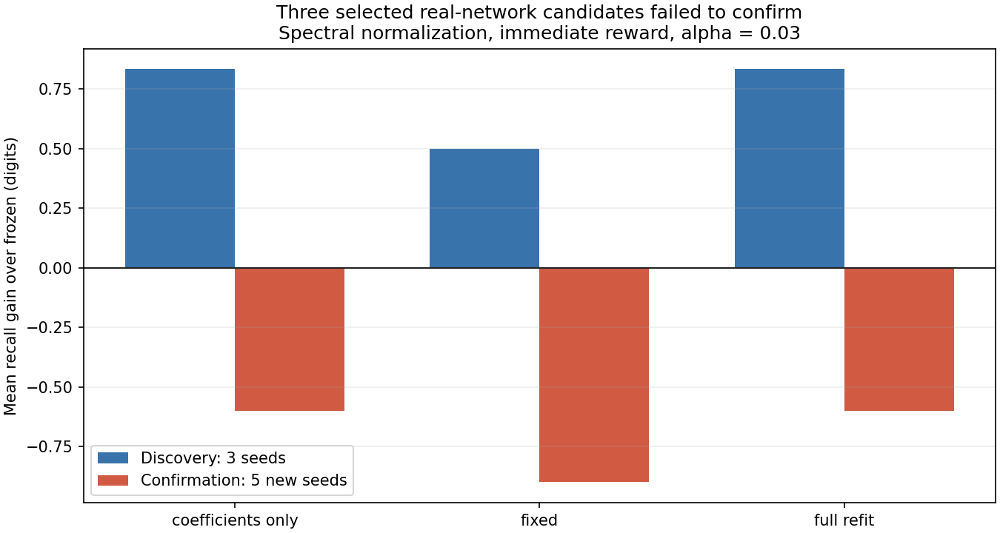
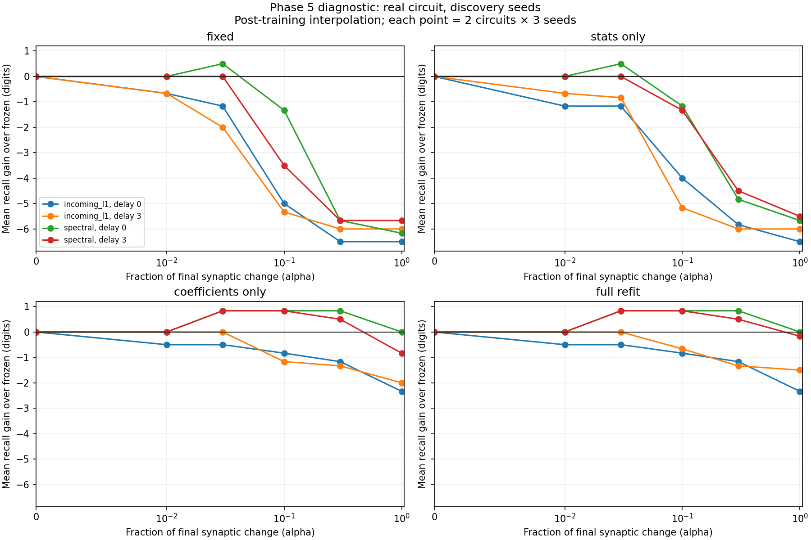

# Phase 5 follow-up — learning gains did not survive new seeds

**결론: 가중치 변화량을 줄였을 때 보인 작은 개선은 새 seed에서 재현되지 않았습니다. 평균·표준편차만 보정해서는 Phase 5의 성능 하락을 해결하지 못했고, 분류기 계수를 다시 학습해야 상당 부분 회복됐습니다. 추가적인 π 암기 이득은 확인되지 않았습니다.**

This is a computational diagnosis of one constrained reward rule, not a claim that all reward learning fails or that a living fly cannot learn sequences. Whole-brain scaling remains deferred.

## Design and scope

[Protocol](phase5-diagnostic-protocol.md) · [Configuration](../configs/phase5_diagnostic.json) · [All results](../results/phase5_diagnostic)

We retained the two 686-neuron circuits, 200 training digits, KC input/48-MBON output, one update per digit, spectral/incoming-L1 normalization and reward delays 0/3. Real and role-preserving degree-shuffled graphs were paired with identical input codes. Correct-reward trace and unrelated-yoked reward endpoints were regenerated with the original Phase 5 seeds and settings.

For each endpoint, interpolate the final change by alpha = 0, .01, .03, .1, .3 or 1. Support, signs, nonplastic weights and incoming absolute strength remain fixed. Cross old/new feature statistics with old/new classifier coefficients. Every correction sees only the training prefix; all components are frozen during free recall. Coefficient refits are supervised; statistics-only calibration also uses true training-prefix inputs, but no class labels in its calibration step.

- Discovery: seeds 542–544, **2,304 evaluations**, 96 endpoint training runs.
- Confirmation: new seeds 642–646, **2,080 evaluations**, 160 endpoint training runs. Uses the locked selected alpha plus predeclared .1/1 diagnostic anchors and alpha=0.
- Total: **4,384 evaluations**, 256 endpoint training runs and **1,018,880 checked reward events**. These counts are computational conditions, not independent biological samples.
- Every score excludes the supplied `314` and counts consecutive correct generated digits before the first error, capped at 197. No unseen π prediction is tested here.

## 1. Three small improvements were selected; none confirmed

A candidate had to have a positive mean paired recall gain over both frozen and yoked controls. Selection maximized the smaller of those two gains, with a smaller-alpha tie break. The selection file and its configuration/results hashes were saved before confirmation.

Only **spectral normalization, immediate reward, alpha=.03** produced eligible real-network candidates. Three readout views qualified; the other 13 normalization/delay/view cells had no candidate. Each discovery mean covers two circuit samples × three seeds; each confirmation mean covers two samples × five fresh seeds.

| Selected view | Discovery gain vs frozen | Confirmation frozen | Confirmation trace | Confirmation yoked | Confirmation gain vs frozen | Win / tie / loss vs frozen |
|---|---:|---:|---:|---:|---:|---:|
| Fixed readout | +0.50 | 7.00 | 6.10 | 5.70 | **−0.90** | 1 / 6 / 3 |
| Refit coefficients, old statistics | +0.83 | 7.00 | 6.40 | 7.00 | **−0.60** | 1 / 7 / 2 |
| Refit both | +0.83 | 7.00 | 6.40 | 7.00 | **−0.60** | 1 / 7 / 2 |

The fixed-policy candidate still beat yoked by 0.40 digits on average, but fell below frozen connectivity. Beating a harmful control does not establish a learning benefit. Both supervised-refit candidates fell below frozen and yoked.

The two coefficient-refit views have identical recall scores here; they are not independent successful/failed discoveries. Role-shuffled confirmation gains were −0.60 (fixed) and +0.10 (each refit), the latter coming from one improvement and nine ties. This tiny descriptive control result is not a robust learning or anatomical advantage.



## 2. Statistics alone do not explain the full-endpoint collapse

At alpha=1, real-network confirmation means were:

| Normalization | Reward delay | Frozen | Fixed readout | Statistics only | Coefficients only | Full refit |
|---|---:|---:|---:|---:|---:|---:|
| spectral | 0 | 7.0 | 1.0 | 1.4 | 5.6 | 5.6 |
| spectral | 3 | 7.0 | 0.3 | 0.4 | 5.8 | 5.3 |
| incoming-L1 | 0 | 5.6 | 0.4 | 0.4 | 5.3 | 5.0 |
| incoming-L1 | 3 | 5.6 | 0.8 | 0.8 | 4.9 | 5.1 |

Every fixed-policy real-network comparison at alpha=1 worsened: **40/40** confirmation pairs, following **24/24** discovery pairs. Statistics-only calibration also remained below frozen in all 40 confirmation pairs. Relearning classifier coefficients with the old statistics recovered most of the deficit. Changing statistics as well provided no consistent additional benefit under this fixed optimization protocol.

Thus, the tested mean/scale correction is insufficient. Relearning how the changed neural states map to digit labels is much more effective, consistent with representational/readout mismatch. This does not uniquely locate lost information, prove the old representation is recoverable by a particular transformation, or show that the adapted circuit stores more history. Standardization and regularization interact, and full refit need not dominate coefficient-only refit after 400 Adam epochs.

At alpha=.1, incoming-L1 networks returned to the 5.6-digit frozen mean after coefficient/full refits in both delays; yoked did so too. That is recovery, not a reward-specific gain. Smaller post-training interpolation is not a smaller-learning-rate training trajectory, and this experiment does not rule out all alternative learning rates or constrained learning rules.



## 3. Updated project judgment

The successful interventions remain Phase 2 normalization and Phase 3b timing changes to fixed reservoirs. Phase 4 and Phase 5 still do not establish synaptic-learning gains. This follow-up adds a useful negative result: the apparent small-update gains were seed-sensitive, and the full-endpoint collapse is not rescued by a simple per-feature mean/scale recalibration.

Do not scale this reward rule to whole brain on the premise that it is already improving memory. A useful next decision would be a small-circuit positive-control learner with an objective directly aligned to next-digit prediction and explicit recurrent temporal gradients, constrained to the same adjustable edges and compared to the same frozen/topology controls. That would test whether the current edge/observation constraints permit useful learned changes at all, before attributing failure entirely to the approximate local credit-assignment rule. Such a learner is a computational diagnostic, not a biological dopamine claim. It is not implemented in this change.

## Verification and execution notes

- **41 tests pass**, including five new diagnostic tests and an atomic-archive roundtrip test, on top of the previous 35.
- All **4,384 stored recall scores** and first-error/censoring values independently recomputed from complete predicted strings; design counts and condition uniqueness checked.
- All **1,018,880 true binary rewards** checked against sampled actions and training labels; yoked positive counts checked per pass.
- **384 endpoint comparisons** reproduced Phase 5 scores, training accuracy and exact weight hashes. These are repeated checks across views/directions, not 384 independent baselines.
- **72 predetermined checkpoint/readout combinations** independently refitted and replayed exactly: 48 discovery and 24 confirmation, first circuit/first seed/incoming-L1/delay-3 real graph.
- Discovery numerical results were run twice: seven text artifacts and **771 checkpoint/reward arrays** matched exactly. Confirmation was run once and independently audited/replayed; a full confirmation rerun is not claimed.
- The first discovery run completed numerical calculations but failed at final metadata serialization (`numpy.int64` in selection). A native-integer conversion fixed it. The repeat produced identical numerical artifacts.
- Workspace synchronization truncated the second discovery NPZ after creation. The complete first-run archive had exactly the SHA256 expected by the second-run manifest, so those identical bytes were restored before successful independent replay. The committed runner now publishes complete NPZ snapshots atomically. `execution_runner.py` preserves the actual executed runner, matching its recorded source hash; the change in the committed runner affects archive publication only.

The two circuit samples overlap and come from one animal. Seeds vary computational input/shuffle/action conditions, not biological subjects. Reported comparisons are descriptive; no formal population significance claim is made. Frozen baselines repeated across reward delays/directions/views must not be counted as extra independent observations.

## Reproduce

From the repository root, after installing the project:

```bash
python -m pytest -q
python scripts/run_phase5_diagnostic.py --output outputs/phase5_diag_discovery
python scripts/verify_phase5_diagnostic.py outputs/phase5_diag_discovery
python scripts/run_phase5_diagnostic.py --stage confirmation \
  --selection outputs/phase5_diag_discovery/selection.json \
  --output outputs/phase5_diag_confirmation
python scripts/verify_phase5_diagnostic.py outputs/phase5_diag_confirmation
# Summarize the committed discovery/confirmation pair:
python scripts/summarize_phase5_diagnostic.py --output results/phase5_diagnostic
```

Output directories must not already exist. Configuration, selection, complete predictions, paired metrics, reward events, endpoint arrays, summaries and verification reports are committed alongside this report.
