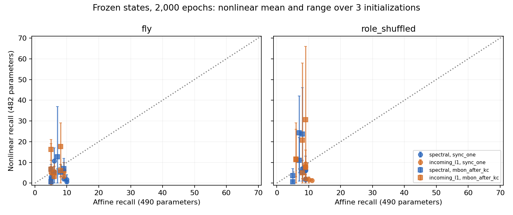

# Matched-parameter readout — stronger fitting, unreliable prefix recall

**결론: 같은 고정 신경 상태를 읽는 비선형 출력층은 다음 숫자 학습 정확도를 크게 높였습니다. 그러나 실제 연결의 평균 연속 회상은 6.92→5.75자리로 줄었습니다. 현재 확인된 성과는 출력층의 학습 데이터 적합 개선이며, 안정적인 π 회상 향상이나 연결 학습의 성공은 아닙니다.**

[Protocol](phase5-readout-protocol.md) · [Configuration](../configs/phase5_readout.json) · [Raw results](../results/phase5_readout)

## What was held fixed

Two 686-neuron FlyWire subsets, fresh seeds 942–944, spectral/incoming-L1 normalization, real/role-degree-shuffled graphs, and sync_one/mbon_after_kc schedules give **48 fixed-state conditions**. Every paired head receives exactly the same 48 MBON observations and training-only feature means/scales. Reservoir weights never change.

The affine head has **490** parameters (48→10); the nonlinear head has **482** (48→8 tanh→10). Neither gets a position input, target during generation, recurrent readout state or digit lookup table. Both use full-batch Adam, learning rate .03, L2=1e-5 on nonbias weights, and 400/2,000-epoch evaluations. Primary comparison was fixed at **2,000 vs 2,000**. All three prespecified nonlinear initializations are retained; no best-seed or best-checkpoint selection.

There are **384 evaluations**: 96 affine heads plus 144 nonlinear trajectories with two checkpoints each. The task trains on a 200-digit π prefix, prompts with `314`, and counts consecutive correct generated digits up to horizon 197. This measures a trained prefix, not unseen π prediction.

## Primary results on real connections

Each row contains six paired state conditions (two subsets × three seeds). Nonlinear scores average all three initializations within each condition, then average conditions. Win/tie/loss compares that mean with one affine baseline per condition; initializations do not multiply the independent graph count.

| Normalization | Schedule | Affine train accuracy | Nonlinear train accuracy | Affine recall | Nonlinear recall | Paired win/tie/loss |
|---|---|---:|---:|---:|---:|---:|
| spectral | sync_one | 41.54% | 80.09% | 7.50 | 3.33 | 1 / 0 / 5 |
| spectral | mbon_after_kc | 46.82% | 87.07% | 6.67 | 6.22 | 2 / 0 / 4 |
| incoming-L1 | sync_one | 47.74% | 80.26% | 7.17 | 4.28 | 0 / 1 / 5 |
| incoming-L1 | mbon_after_kc | 55.11% | 87.38% | 6.33 | 9.17 | 3 / 0 / 3 |
| **All real conditions** | | **47.80%** | **83.70%** | **6.92** | **5.75** | **6 / 1 / 17** |

Real-circuit cross entropy fell from **1.4832 to 0.4960**. Across both real and shuffled graphs, every one of the 144 primary nonlinear heads achieved higher training accuracy than its matched affine head. Thus the fixed states support substantially better fitting with this alternative decoder. This is a measured decoder result, not evidence that synapses learned or that the state gained information.

The incoming-L1 staged row is a candidate interaction, not an established success: its mean improves by 2.83 digits, but three of six pairs lose, and only one of six beats affine for all three initializations. Across all 24 real conditions, only **1/24** improves for every initialization. Ten of the 72 real nonlinear runs fail on the first generated digit. Their recall median is 3.5, versus 6 for the 24 affine runs. The real nonlinear maximum is 37, but it is an exploratory best run among many, not the headline outcome or a confirmed capacity.

## Controls and training duration

Shuffled graphs show the same broad schedule interaction, often more strongly:

| Normalization | Schedule | Shuffled affine recall | Shuffled nonlinear recall | Paired win/tie/loss |
|---|---|---:|---:|---:|---:|
| spectral | sync_one | 8.83 | 4.11 | 0 / 0 / 6 |
| spectral | mbon_after_kc | 6.67 | 11.44 | 3 / 0 / 3 |
| incoming-L1 | sync_one | 9.50 | 5.00 | 1 / 0 / 5 |
| incoming-L1 | mbon_after_kc | 7.67 | 14.50 | 4 / 0 / 2 |

No shuffled condition beats affine for all three nonlinear initializations. Its largest individual recall is 66, exceeding the real maximum of 37. These samples do not establish a biological-wiring advantage or a formal claim that shuffling is universally better.

At 400 epochs, real nonlinear mean recall is below affine in all four normalization/schedule rows: 3.00 vs 6.67; 4.44 vs 6.17; 3.56 vs 5.00; 5.72 vs 6.00 (table order above). Additional training helps both heads in aggregate and changes the staged incoming-L1 result. Therefore comparing a 2,000-epoch nonlinear model only against the old 400-epoch baseline would be misleading. Two thousand epochs is a controlled budget, not a convergence guarantee.



Points are state-condition means over nonlinear initializations; bars show their full range, **not confidence intervals**. The dotted line marks equal recall. Complete per-initialization scores, loss histories, and both epoch budgets are retained.

## What this changes about the project

The project now has direct evidence that the **same fixed neural representation can support much better average next-digit classification with a different decoder at a similar parameter count**. Parameter count alone did not predict fitting quality. Equal parameter counts nevertheless do not equalize function class, optimizer behavior, initialization, regularization or computational cost; this is not a pure isolation of nonlinearity from every other difference.

That gain does not establish better error-free memorization. The deterministic identity checked in the timing study also holds in all 384 evaluations: first-error free-recall length equals the initial correct teacher-forced segment after the same prompt. Thus the shorter prefix comes from an early clean-trajectory classification error, before wrong-output feedback can play a role. Better mean loss and accuracy can allocate errors differently across positions while reducing the total number of errors.

Taken with Phases 2–5: normalization and decoder choice can improve fitting or selected trained-prefix recall; timing can improve access to the current input. Reward traces and constrained recurrent learning have still not established reliable recall improvement over frozen connections. These are distinct outcomes. Neither this result nor the larger number of evaluations supports whole-brain scaling yet.

## One next experiment

Test **uniform versus prespecified early-prefix-weighted training loss on the same frozen states and the same nonlinear head**. This asks whether the early mistakes reflect how a limited decoder distributes its fitting effort, rather than requiring more neurons or learned connections.

A concrete diagnostic would fix the primary setup to incoming-L1 with mbon_after_kc, use fresh seeds and all three initializations, and assign weight 4 to the first 32 scored next-digit positions and weight 1 to the rest (normalize by total weight). Keep the 2,000-step budget, learning rate, feature statistics and parameter count identical. Include the corresponding role-shuffled controls, and report all initializations, full-prefix recall, per-position errors and accuracy outside those 32 positions. Do not tune the weighting/window using recall or select an initialization.

An improved prefix accompanied by worse later accuracy would demonstrate redistribution of finite decoding capacity toward the evaluation objective, not increased total memory or generalization. Consistent improvement across fresh conditions would justify a separate confirmation; failure would reject this particular weighting choice, not prove an information-theoretic limit. This is one proposed diagnostic, **not executed in this report**.

## Verification and limits

- **48 state conditions rebuilt; all 384 complete generated strings replayed exactly.** All saved predictions, train metrics, feature statistics, parameter budgets, weights/readout/state hashes and first-error/censoring records were checked.
- **Eight prespecified checkpoints independently retrained and matched exactly**: first subset, seed 942, real incoming-L1 sync_one, both affine budgets and all three nonlinear initializations at both checkpoints. The other checkpoints were replayed from saved parameters, not independently retrained.
- **27 targeted tests passed**: 23 existing timing/plasticity/π checks and four new nonlinear-head checks, including finite-difference gradients with regularization, XOR fitting, parameter/observation constraints, checkpoint reproducibility and stateless prediction. **The full pytest suite was not run** because pytest was unavailable in this runtime. This is not a claim that all repository tests passed.
- Experiment runtime was approximately **255 seconds** on this host. The verified Decimal π fallback was used because mpmath was absent.
- Two overlapping subsets from one animal and three computational seeds are not independent biological replicates. There is no statistical population claim, capacity bound, unseen-target evaluation, noise robustness result or whole-brain experiment here.

## Reproduce

```bash
PYTHONPATH=src python scripts/run_phase5_readout.py --output outputs/phase5_readout
PYTHONPATH=src python scripts/verify_phase5_readout.py outputs/phase5_readout
PYTHONPATH=src python scripts/summarize_phase5_readout.py outputs/phase5_readout
PYTHONPATH=src python scripts/verify_timing_offline_tests.py --output outputs/phase5_readout/targeted_existing_tests.json
PYTHONPATH=src python scripts/verify_readout_offline_tests.py --output outputs/phase5_readout/targeted_readout_tests.json
# In an environment with the declared test dependency installed:
python -m pytest -q
```

Use a new output directory. Source/data hashes, configuration, all recall strings, all saved heads, training histories, summaries and verification records accompany this report.
