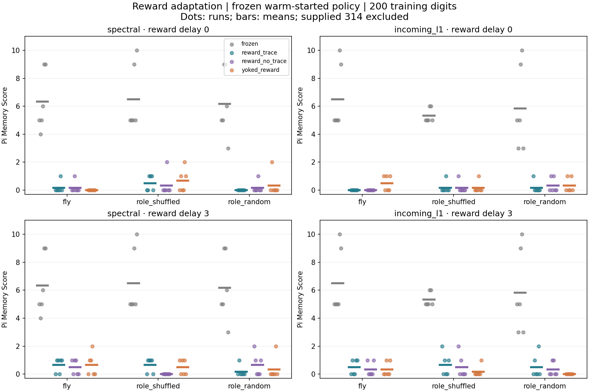
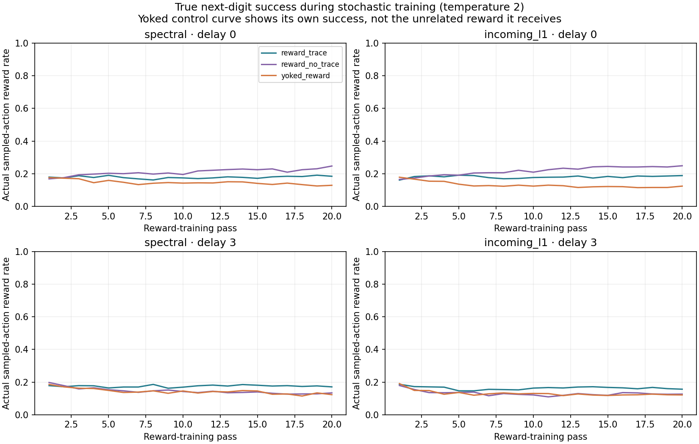
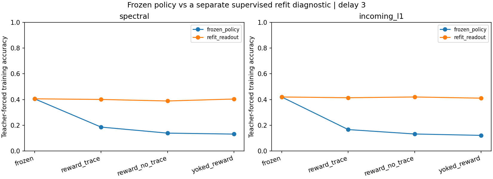

# Phase 5 — reward and eligibility traces

**Outcome:** the first reward-modulated rule did not improve π recall. With the original warm-started output classifier frozen, real-circuit trace learning performed worse than frozen connectivity in all 24 paired comparisons. Refitting a new output classifier after adaptation recovered much of the performance, but did not establish an advantage over frozen or unrelated-reward controls.

This is a computational reward experiment on a small FlyWire-derived model. It is not a validated simulation of dopamine, not a claim about a living fly's memory, and not learning from rewards alone from scratch.

## Source and scope

The same two annotated FlyWire v783 left MB-associated subsets contain 686 neurons each. KC-only stimulation and MBON-only observation continue. The only adjustable recurrent weights are the existing KC→MBON edges: 1,474 or 1,431 per circuit. Signs, edge support and each MBON's incoming absolute plastic strength remain fixed. Source hashes, annotation version and roles are retained in the manifest; [Phase 3](phase3-results.md) details the anatomical extraction and data terms.

Real, degree-preserving role-shuffled and role-block-random graphs are compared. The latter two controls have the same nominal plastic edge count. The degree-shuffled graph is the stronger structural match; role-block-random does not preserve individual degrees or necessarily the effective number of parameters after row constraints. No whole-brain simulation is run.

## Warm start and frozen policy

First train the existing affine softmax classifier on the first 200 π digits using the **unmodified** reservoir (400 Adam epochs, training-only feature scaling). Then freeze its coefficients, bias, mean and scale for the entire reward stage. This is a supervised warm start shared by every learning condition for a given graph/seed/normalization.

At each reward-training input, update the reservoir once and sample a proposed next digit from softmax(logits / 2). The only label information delivered to the synaptic update is a scalar **1 if that sampled digit is correct, 0 otherwise**. The correct class itself does not enter the eligibility calculation. Digit input remains teacher-forced during training; evaluation is greedy autoregressive generation.

A second, clearly separated `refit_readout` evaluation fits a new supervised classifier and fresh feature scaling after synaptic adaptation. This diagnoses whether adapted states remain useful to a newly fitted readout; it is not counted as reward-only performance. The primary result uses `frozen_policy` throughout.

## Explicit teaching rule

Let u be the state before the final microstep, a=tanh(Wu+input), x=(1−ℓ)u+ℓa. For sampled action z and probabilities p, with fixed classifier feature coefficients B, scale σ and sampling temperature T=2:

```math
g_{ij}=\ell(1-a_i^2)u_j\frac{B_{i,z}-\sum_c p_c B_{i,c}}{T\sigma_i},
\qquad e_{ij,t}=\lambda e_{ij,t-1}+g_{ij,t}.
```

This differentiates the sampled log probability only through the last local update and the fixed readout. It **stops gradients through previous recurrent states**. Eligibility traces retain these local scores over time; they are not a full recurrent gradient or a guarantee of correct temporal credit assignment.

When reward r arrives, compute advantage r−b using the previous baseline b. Normalize the eligibility vector for each postsynaptic neuron only when its L2 norm exceeds one, then update signed magnitudes with learning rate 0.001. Apply the same positive floor and row-budget normalization as [Phase 4](phase4-results.md). Finally update b←b+0.05(r−b). The floor, norm cap, row competition and approximate recurrent derivative make this a constrained heuristic, **not an unbiased policy-gradient estimator** or an algorithm with guaranteed ascent.

Weights persist for 20 chronological passes. Neural state, eligibility and baseline (0.1) reset at each pass. Policy parameters remain frozen and their hashes are checked. This rule uses global classifier feedback and an artificial scalar reward; DAN nodes themselves do not calculate or transmit that signal.

## Timing and controls

Reward delay is either **0** or **3 digit steps**. After the final input, outstanding rewards are delivered on schedule with eligibility decay but no extra input or action. Every sampled action receives exactly one delivered reward. Delays describe computation steps, not biological milliseconds.

- `frozen`: no recurrent weight changes.
- `reward_trace`: correct scalar reward, eligibility decay λ=0.8.
- `reward_no_trace`: correct scalar reward, λ=0. The same reward delays are retained; delayed rewards can therefore act on unrelated current scores, and final flushes have no retained score.
- `yoked_reward`: λ=0.8, but receives the paired trace run's binary rewards permuted across positions **within each pass**. It has exactly the same positive-reward count per pass as the trace source. Its own chosen actions and actual successes are logged separately. This is an offline, deliberately unrelated control signal, not a deployable reward provider.

All stochastic conditions use paired random action draws; the yoked permutation uses a separate seeded stream. Frozen conditions are duplicated across delay settings for the factorial design; these duplicates are not extra independent evidence.

Fixed config: 2 circuits × fresh seeds 542/543/544 × 2 initial normalizations × 3 graphs × 2 reward delays × 4 conditions = **288 network conditions**, each evaluated with two readouts = **576 evaluations**. There are 216 reward-training runs and **859,680 binary reward events**. Microsteps=1 follows the earlier temporal diagnosis; length is fixed at 200 to avoid the 50-digit ceiling. One learning rate and one nonzero trace decay were tested, without selecting settings on held-out performance.

After training, copy the adapted weights into a new fixed reservoir. Reset state, give `314`, then generate 197 digits using only predictions. Pi Memory Score excludes the prompt and stops counting at the first error. Teacher-forced training accuracy and held-out accuracy are separate; held-out targets occupy previously unused zero-based positions 5000–5099 and never train weights, classifiers or scaling statistics.

## Results

Real circuit, primary frozen-policy evaluation, mean score over two circuits × three seeds:

| Initial normalization | Reward delay | Frozen | Reward + trace | Reward without trace | Yoked reward |
|---|---:|---:|---:|---:|---:|
| spectral | 0 | 6.33 | 0.17 | 0.17 | 0.00 |
| spectral | 3 | 6.33 | 0.67 | 0.50 | 0.67 |
| incoming_l1 | 0 | 6.50 | 0.00 | 0.00 | 0.50 |
| incoming_l1 | 3 | 6.50 | 0.50 | 0.33 | 0.33 |

The real trace condition declined in all 24 pairs versus frozen connectivity, with a mean difference of −6.08 generated digits. Versus no trace, it improved in 6, tied in 14 and worsened in 4; versus yoked reward, 5 improved, 14 tied and 5 worsened. There is no consistent trace benefit or real-anatomy advantage established here. These are descriptive paired counts, not formal significance tests. Repeated runs on two overlapping samples of one brain are not independent biological subjects.

With a new supervised readout, the real trace network's mean scores recovered to 4.17–6.33 across settings, versus 6.33–6.50 for frozen connectivity. Across the 24 refit comparisons, only 2 improved, 13 tied and 9 worsened. This is consistent with a mismatch between the old classifier and changed neural states, rather than complete loss of usable state information. However, the refit changes both feature scaling and classifier coefficients, so it does not isolate which change explains recovery. It still does not demonstrate a reward-learning gain.

Primary real-network training accuracy after trace learning was about 17–21%, versus 40–42% for the original classifier on the original states. Held-out next-digit accuracy remained around chance; no rule for predicting unseen π digits is claimed. The relative L2 change in the real plastic weight vector was about 0.19–0.23 for trace runs, so these were substantive synaptic changes, not a no-op.







Training reward curves measure sampled-action success at temperature 2, not greedy teacher-forced accuracy or autonomous recall. For the yoked condition the curve shows its **own true success**, not the unrelated reward signal applied to its synapses.

## Verification and reproducibility

The complete experiment was run twice and compared exactly: measurement CSVs, all 576 autoregressive sequences, reward histories, sampled actions, true and applied rewards, weight hashes, and checkpoint arrays. Every binary true reward was independently checked against the sampled action and its training label; each yoked pass was checked for the source pass's positive-reward count. All recall scores were independently recalculated.

Eight predetermined saved network/readout combinations were reloaded and generated identical sequences. These examples use real circuit 701, seed 542, incoming-L1 and reward delay 3; they were not selected for performance. Unit tests cover the local score derivative against finite differences, delayed delivery including terminal flushes and delays longer than the sequence, zero learning, seed reproducibility, frozen policy/weights and a yoked run whose updates cannot depend on the correct class once its external reward stream is fixed. The full suite passes **35 tests**.

The exact frozen-baseline check initially exposed a sparse summation-order discrepancy after normalization. Sorting sparse column indices before warm-start fitting and adaptation resolved it. The finalized results use that canonical ordering throughout; no failed partial run is presented as a completed result.

## Limits and next step

This is one approximate reward rule, one learning rate and one nonzero decay, with a supervised warm start, noise-free rate states, artificial global feedback and constrained weights. It does not establish that reward learning is ineffective generally, or that biological dopamine behaves this way. Spectral radius is normalized only before learning; incoming-L1 row bounds remain conserved, but spectral radius can change after redistribution.

Before scaling to whole brain, test a smaller learning-rate range and an explicit cap on deviation from the initial synapses. Separate a train-only feature-statistics recalibration from refitting classifier coefficients. This would directly investigate the observed fixed-readout collapse without silently treating extra supervised learning as reward learning. Spiking, biologically validated neuromodulation and whole-brain learning remain unimplemented.

## Reproduce

```bash
python scripts/run_phase5.py --output outputs/phase5
python scripts/summarize_phase5.py --output outputs/phase5
python -m pytest -q
# Optional complete repeat and exact comparison:
python scripts/run_phase5.py --output outputs/phase5_repeat
python scripts/verify_phase5_repeat.py --reference results/phase5 --repeat outputs/phase5_repeat
```

CPU only; bundled circuits suffice. Config, source hashes, package versions, all reward events, event-to-condition keys, paired differences, training curves, checkpoint files and verification reports are retained in `results/phase5/`.
