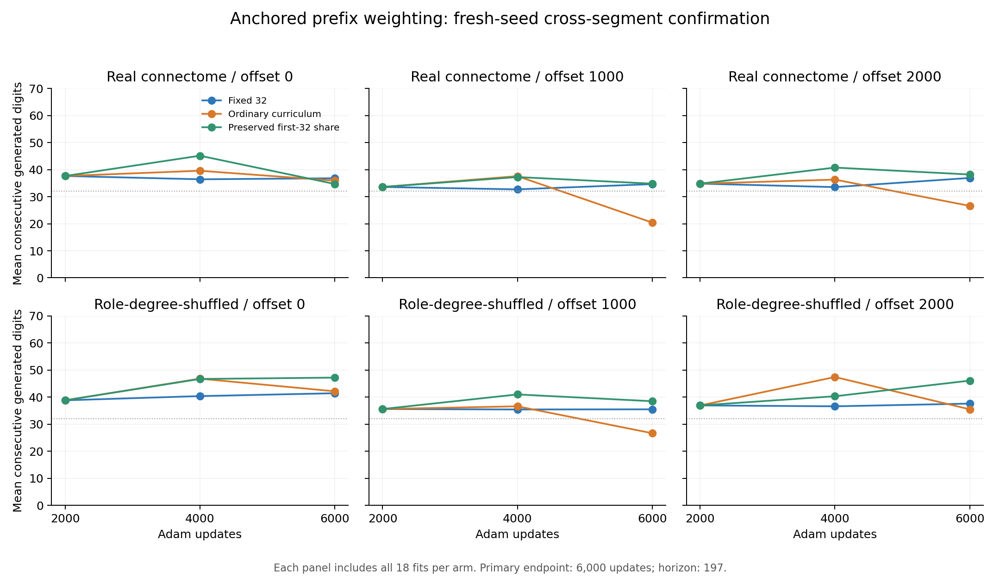

# 초반 기억 유지 확인: 사전 기준 실패, 기본 모델 유지

**새 seed와 세 원주율 구간에서 확인한 결과, 초반 비중 유지 방식은 사전 고정한
회상·유지 기준을 통과하지 못했다. 시작 구간의 평균 회상은 고정 방식
36.83자리보다 낮은 34.72자리였고, 세 구간 모두 초반 유지·완주 기준이 실패했다.
앞선 탐색의 31.67→38.89자리 이득을 일반적인 개선으로 확정하지 않는다.**

[고정 프로토콜](phase5-retention-confirmation-protocol.md) ·
[전체 기록](../results/phase5_retention_confirmation) ·
[원래 phase 현황](phase-status.md)

## 무엇을 확인했나

새 model seed 4142/4143/4144, 두 부분망, 실제/role-degree-shuffled 연결,
초기화 0/1/2, offsets 0/1000/2000에서 고정 32자리 가중·기존 누적 가중·초반
비중 유지 가중을 비교했다. 모든 방식은 같은 6,000회 Adam 업데이트를 썼고,
기존 탐색의 파라미터·학습률·손실 비중·초기화를 바꾸지 않았다.

총 **36개 상태 조건, 324개 독립 학습, 972개 단계별 head**다. 각 구간의
200자리를 별도로 학습하고 처음 세 숫자를 제공한 뒤 197자리를 자율 생성했다.
offset 1000/2000은 이 개입의 추가 구간이지만 이전 가중 연구에서는 사용된
구간이다. 미학습 원주율 예측이나 완전히 손대지 않은 테스트 데이터로 부르지 않는다.

## 실제 연결의 최종 결과

각 셀은 두 부분망 × 세 seed × 세 초기화, 18개 모델 전체의 평균이다.
점수는 제공된 세 숫자를 제외하고 첫 오류까지 연속 정답 수다.

| 시작 위치 | 고정 32 | 기존 누적 | 초반 비중 유지 | 고정 대비 차이 | 회상 기준 | 유지 기준 | 공동 기준 |
|---|---:|---:|---:|---:|---|---|---|
| 0 | 36.83 | 35.94 | 34.72 | −2.11 | 실패 | 실패 | 실패 |
| 1000 | 34.67 | 20.44 | 34.83 | +0.17 | 통과 | 실패 | 실패 |
| 2000 | 36.94 | 26.61 | 38.22 | +1.28 | 통과 | 실패 | 실패 |

회상 기준은 평균이 두 비교군보다 높고, 초기화를 평균 낸 여섯 상태 조건 중
각 비교에서 4개 이상 승리해야 한다. 고정 대비 조건 승/무/패는 순서대로
2/1/3, 4/0/2, 4/0/2였다. 기존 누적 대비는 4/0/2, 6/0/0, 5/1/0이었다.
offset 0은 기존 누적 대비 4조건을 이겼어도 전체 평균이 낮아 회상 기준 실패다.

모든 구간에서 회상과 유지를 함께 통과해야 하는 **전체 주 기준은 실패**다.
후반 정확도를 추가한 더 강한 공동 기준도 실패했다. 다른 구간의 양의 평균으로
실패를 상쇄하지 않았으며, 결과에 맞춰 통과 기준을 완화하지 않았다.

## 왜 유지 기준에 실패했나

| 시작 위치 | 첫 단계 32자리 완주 | 고정의 최종 유지 실패 | 새 방식의 최종 유지 실패 | 고정의 최종 32자리 완주 | 새 방식의 최종 32자리 완주 |
|---|---:|---:|---:|---:|---:|
| 0 | 17/18 | 1 | 2 | 16/18 | 15/18 |
| 1000 | 17/18 | 0 | 2 | 17/18 | 16/18 |
| 2000 | 16/18 | 0 | 0 | 17/18 | 16/18 |

세 방식의 첫 단계는 동일하다. offset 2000에서는 이미 완주한 모델을 잃지는
않았지만, 최종 완주 수가 고정보다 적어 사전 유지 기준의 두 번째 조건에 실패했다.
offset 1000의 작은 평균 이득 역시 유지 실패를 보완하지 못한다.

새 방식의 최종 64자리 완주는 0/18, 0/18, 1/18이었다. 실제 연결의 모든 방식과
구간에서 128자리·197자리 완주는 없었다. 새 방식의 최소/중앙/최대는
offset 0에서 1/35/58, 1000에서 4/34/50, 2000에서 19/36/80자리다.
최고 80자리만 대표 실력으로 선택하지 않는다.

## 후반 정확도와 학습 단계

| 시작 위치 | 고정 후반 165자리 정확도 | 기존 누적 | 초반 비중 유지 | 고정 이상 기준 |
|---|---:|---:|---:|---|
| 0 | 82.49% | 82.19% | 80.71% | 실패 |
| 1000 | 75.29% | 76.40% | 75.39% | 통과 |
| 2000 | 79.39% | 80.84% | 79.66% | 통과 |

이는 정답을 입력하는 teacher-forced 정확도이며 자율 회상 점수와 다르다.
새 방식의 비가중 교차엔트로피는 세 구간 모두 고정보다 높았다
(고정→새 방식: .4811→.5873, .6729→.7735, .5659→.6409).
후반 평균 정확도가 약간 높았던 두 구간도 전체 적합이 일관되게 개선된 것은 아니다.

새 방식의 실제 연결 평균 회상은 2,000→4,000→6,000회에서 각각
37.67→45.17→34.72, 33.61→37.28→34.83, 34.83→40.78→38.22자리였다.
중간 시점이 더 좋아 보여도 최종 모델을 주 평가로 고정한 규칙을 유지했다.
이 결과만으로 4,000회 조기 종료를 새 기본값으로 고르지 않는다.



## 섞은 연결과 해석 범위

| 시작 위치 | 고정 32 | 기존 누적 | 초반 비중 유지 |
|---|---:|---:|---:|
| 0 | 41.44 | 42.17 | 47.22 |
| 1000 | 35.50 | 26.67 | 38.50 |
| 2000 | 37.61 | 35.50 | 46.11 |

섞은 연결의 새 방식 평균은 세 구간에서 모두 더 높았다. 그러나 후반 정확도는
모두 고정보다 낮았고, offset 1000에서는 초반 유지 실패도 더 많았다.
실제 배선만의 우위나 안정적인 생물학적 기억 개선을 입증한 결과가 아니다.
부분망 둘은 같은 개체에서 겹치며 seed와 초기화는 독립 개체 표본이 아니다.
판정 기준은 기술적 확인 규칙이며 통계적 유의성 검정이 아니다.

## 결정과 다음 원래 단계

초반 비중 유지 후보를 기본 모델로 승격하지 않는다. 기존 고정 32자리 모델과
콘솔 상대 artifact를 유지한다. 이 확인 질문은 **실패 결과로 종료**하며 같은
데이터의 최고 checkpoint를 골라 성공으로 바꾸는 추가 조정을 하지 않는다.

원래 roadmap 전체가 완료된 것은 아니다. 다음은 Phase 2에 남은 잡음·교란에
대한 회상 강건성 실험이다. 이후 Stage B/C LIF, Phase 5B 구획별 도파민 학습,
Phase 6 전체 뇌 확장은 각각 근거·구현·검증을 갖춰 진행한다. 사용자 요청에
따라 게임 화면은 보류한다. [완료 여부와 단계별 조건](phase-status.md).

## 재현 명령

검증 결과:

- 전체 **132 tests 통과**: 구간별 판정, 평균 이득과 유지 실패의 분리,
  누락 구간·기존 seed·잘못된 runner 거부, 중단/재개, 문맥 변경·손상 검사를 포함한다.
- **36개 상태 재구축, 972개 head와 전체 자율 생성열 정확히 재생**.
- 첫 실제 부분망·첫 seed의 세 구간에서 **27개 모델 독립 재학습**, 81개
  단계별 head와 학습 기록이 정확히 일치했다.
- 고정 연결, 집계·위치별 지표, π 생성기 두 구현의 2,200자리 일치를 확인했다.
- 본 실행도 첫 조건 저장 후 다른 프로세스에서 재개했다. 최종 호출은
  1개 조건을 재사용하고 35개를 새로 학습했다.

[기계 판독 검증 결과](../results/phase5_retention_confirmation/verification.json).

학습 소스와 고정 설계 커밋은 `5e33117`이다. 기록된 Python/패키지 환경과
해당 소스에서 새 출력 폴더를 사용한다.

```bash
python -m pip install -r requirements-lock.txt
python -m pip install -e .
python -m pytest -q
python -m flying.training.phase5_retention_confirmation --output outputs/retention_confirmation --max-conditions 1
python -m flying.training.phase5_retention_confirmation --output outputs/retention_confirmation --resume
python -m flying.training.phase5_retention_confirmation --output outputs/retention_confirmation --verify
```

최종 보고서 커밋에는 별도 도표 스크립트
`scripts/summarize_phase5_retention_confirmation.py`도 포함한다. 기존 결과를
덮어쓰지 않는다. 환경 간 bitwise 수치 일치는 이번 확인의 범위가 아니다.
