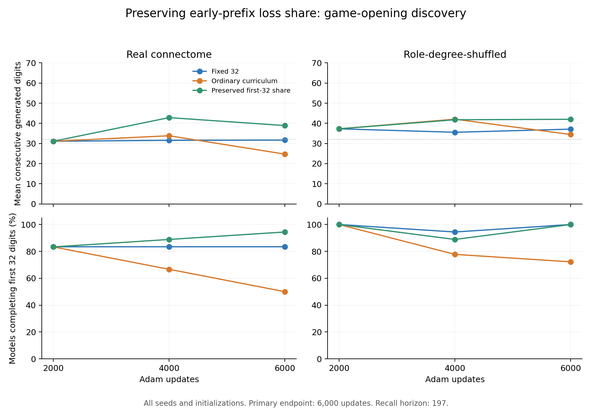

# 초반 비중 유지: 게임 시작 구간의 회상 개선, 후반 정확도 비용

**초반 32자리의 정규화된 학습 비중을 유지하니, 새 seed의 실제 연결 평균 회상이
고정 방식 31.67자리에서 38.89자리로 늘었다. 처음 32자리를 완주했던 15개 모델은
모두 이를 유지했다. 회상·유지 기준은 통과했지만, 후반 정확도는 81.58%→80.00%로
낮아져 더 강한 공동 개선 기준은 실패했다.**

[고정 프로토콜](phase5-retention-protocol.md) · [설정](../configs/phase5_retention.json) ·
[전체 기록과 checkpoint](../results/phase5_retention) · [게임 방향](game-direction.md)

## 무엇을 바꿨나

이 연구의 목적은 사람과 원주율 암기 대결을 할 모델을 만드는 것이다. 이번에는
기본 시작 prompt `314`에 해당하는 **offset 0만** 시험했다. 다른 구간에 대한
확인 실험이나 게임 UI 구현까지 완료했다는 뜻은 아니다.

고정 32자리 가중, 기존 32→64→128 누적 가중, 초반 비중을 유지하는 누적 가중
세 방식을 같은 6,000회 Adam 업데이트로 비교했다. 새 seed 3142/3143/3144,
두 부분망, 실제/role-degree-shuffled 연결, 세 초기화로 **108개 모델**이다.
2,000·4,000·6,000회 시점을 저장했으며 최종 6,000회만 주 평가로 사용했다.

새 방식은 초반 32자리의 표본 가중치 합이 전체에서 차지하는 비율을 128/295,
약 43.39%로 유지한다. 누적 창이 32/64/128일 때 초반 각 표본 비중은
4/6.2994/10.8982가 된다. 나머지 위치의 비중은 기존 누적 방식과 같다.
출력층 파라미터·Adam 상태·비가중 표준화를 유지하며 연결과 입력은 학습하지 않는다.
비중 보존은 정답 보존의 보장이 아니라 이번에 시험한 하나의 개입이다.

## 실제 연결의 최종 비교

각 방식의 18개 모델을 모두 포함했다. 회상은 제공한 세 숫자를 제외하고
첫 오류까지 자율 생성한 연속 정답 수이며 평가 한도는 197자리다.

| 지표 | 고정 32 | 기존 누적 | 초반 비중 유지 |
|---|---:|---:|---:|
| 평균 회상 | 31.67 | 24.72 | **38.89** |
| 32자리 완주 | 15/18 | 9/18 | **17/18** |
| 64자리 완주 | 0/18 | 1/18 | 1/18 |
| 128자리 / 197자리 완주 | 0 / 0 | 0 / 0 | 0 / 0 |
| 처음 완주한 15개 중 최종 32자리 유지 실패 | 0 | 6 | **0** |
| 초반 32자리 정확도 | 99.48% | 97.92% | 99.83% |
| 후반 165자리 정확도 | 81.58% | 82.26% | **80.00%** |
| 전체 199-target 정확도 | 84.31% | 84.59% | 83.00% |
| 비가중 교차엔트로피 | .5082 | .5509 | .6106 |

초반 비중 유지 방식은 초기화 평균을 낸 여섯 상태 조건에서 **6/6 모두** 두
비교군을 이겼다. 평균 차이는 고정 대비 +7.22자리, 기존 누적 대비 +14.17자리다.
개별 초기화로 보면 고정 대비 12승/6무/0패, 기존 누적 대비 9승/6무/3패다.
모든 초기화에서 기존 누적보다 좋아졌다고 주장하지 않는다.

최소/중앙/최대 회상은 새 방식 6/39.5/66자리다. 평균 약 39자리라는 수치를
매 대결에서 보장되는 난이도로 쓰면 안 된다. 최고 66자리만 대표 성능으로
선택하지 않는다. 새 방식에서도 64자리 완주는 1/18뿐이다.

## 단계별 유지와 비용

실제 연결의 평균 회상은 새 방식에서 31.11→42.83→38.89자리로 변했다.
4,000회 값을 사후 선택해 주 결과로 바꾸지 않았다. 처음 완주한 15개는
4,000회와 6,000회 모두 유지했고, 최종에는 두 모델이 추가로 32자리를 완주했다.

고정→새 방식의 위치별 정확도는 33–64자리 80.56→85.94%,
65–128자리 81.34→86.98%, 129–197자리 **82.29→70.77%**다.
초반과 중간의 우선순위를 높이면서 먼 후반의 오차가 커졌다. 따라서 이번 성과는
첫 오류 대결에 중요한 회상 길이·초반 유지의 개선이며, 전체 수열 적합이나
총 기억 용량이 늘었다는 결과는 아니다.

사전 기준은 다음과 같이 판정됐다.

- 회상: 평균이 두 비교군보다 높고 각각 4/6 이상 조건 승리 → **통과**.
- 유지: 고정 방식보다 초반 유지 실패가 많지 않고 최종 32자리 완주도 적지 않음 → **통과**.
- 더 강한 공동 기준: 위 조건과 함께 후반 정확도도 고정 이상 → **실패**.

## 섞은 연결

섞은 연결의 평균 회상은 고정 37.11, 기존 누적 34.44, 새 방식 42.00자리다.
새 방식은 각 비교에서 조건 평균 5승/1무였고, 최종 32자리 완주는 18/18이었다.
다만 4,000회에는 처음 완주한 18개 중 2개가 일시적으로 유지에 실패했다가
최종에 회복했다. 최종 상태만 보고 모든 단계에서 유지됐다고 말하지 않는다.
후반 정확도는 고정 86.97%, 새 방식 85.79%로 낮아졌다.

효과가 실제 배선에만 고유한 것은 아니다. 두 부분망은 한 개체에서 겹치며,
seed와 초기화를 독립 생물학적 표본으로 세지 않는다. 이번 기준은 기술적
탐색 판정이며 통계적 유의성 검정이 아니다.



## 검증과 다음 작업

- 전체 **96 tests 통과**: 기존 84개와 새 12개. 표본 비중 불변성, 처음 단계의
  세 방식 일치, 같은 계산 예산, 초반 실패를 평균 이득으로 가리지 않는 판정,
  변경된 설정·손상·누락 checkpoint 거부와 중단·재개를 검사했다.
- **12개 상태 재구축, 저장 모델 324개와 전체 생성 문자열 정확히 재생**.
- 첫 실제 부분망·첫 seed에서 **9개 모델을 독립 재학습**하여 27개 단계별 head와
  학습 기록이 정확히 일치했다. π 200자리도 Decimal과 일치했다.
- 첫 조건을 별도 프로세스에서 저장한 뒤 1개 재사용/11개 새 학습으로 재개했다.
  학습 소스 커밋은 `5c18836778a144f7e7e66c60b93ef2186d8e9436`다.

새 방식은 **추가 확인할 게임 상대 후보**로 남긴다. 기본 모델로 바로 승격하지
않고, 새 seed와 다른 구간의 고정 설계 확인이 연구 후속 과제다. 제품 후속 과제는
검증된 저장 모델을 한 자리씩 실행하는 상대 어댑터와 공통 대결 규칙이다.
기존 고정 32자리 기준 모델로도 이를 진행할 수 있어 연구가 게임 제작을 계속
막는 선행조건이 되지 않게 한다.

```bash
python -m pip install -r requirements-lock.txt
python -m pip install -e .
python -m pytest -q
python -m flying.training.phase5_retention --output outputs/retention_reproduce --max-conditions 1
python -m flying.training.phase5_retention --output outputs/retention_reproduce --resume
python -m flying.training.phase5_retention --output outputs/retention_reproduce --verify
python scripts/summarize_phase5_retention.py --output outputs/retention_reproduce
```

새 출력 폴더와 한 writer를 사용한다. 이전 기록의 검증에는 해당 소스 커밋과
기록된 Python/패키지 환경이 필요하다. 환경 간 수치 일치 문제는
[Windows 재현 보고](phase5-windows-reproduction.md)의 미해결 한계로 유지한다.
