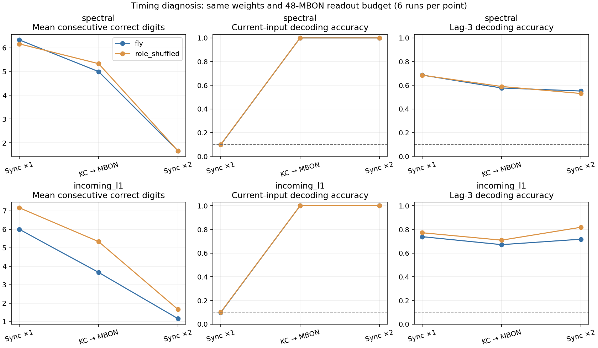

# Timing diagnosis — current-input access improved, prefix recall did not

**결론: 출력 뉴런이 현재 숫자를 늦게 읽는 현상은 실제로 있었지만, 이를 해결해도 π를 더 길게 외우지는 못했습니다. 현재 입력 복원은 약 10%에서 100%로 개선됐고 평균 학습 정확도도 올랐지만, 첫 오류까지의 연속 회상은 오히려 짧아졌습니다.**

[Protocol](phase5-timing-protocol.md) · [Configuration](../configs/phase5_timing.json) · [All results](../results/phase5_timing)

## Controlled comparison

The same two 686-neuron circuits, all weights/signs, KC-only stimulation and exactly 48 MBON readout features were held fixed. Three fresh seeds (842–844), real/role-degree-shuffled graphs and two normalizations were crossed with:

1. `sync_one`: the existing one synchronous update. MBON uses previous KC states.
2. `mbon_after_kc`: each neuron integrates once; MBON alone reads newly updated KC through the existing KC→MBON edges. All other presynaptic states used by MBON, and all updates to KC/DAN/APL, retain old-state semantics.
3. `sync_two`: two existing synchronous updates with the digit held, permitting propagation but also advancing every neuron's decay twice.

No recurrent weight was trained, no skip connection/position input was added, and no decoder gained extra features. Every π readout used the same 400-epoch affine-softmax fitting settings. The staged schedule is a computational intervention, not verified biological timing; it changes state dynamics as well as access latency.

There were **72 π evaluations and 432 independent-input lag measurements**. All π tasks fit 200 digits, receive `314` and generate the remaining 197. Iid probes use independent train/test streams with 2,000/1,000 examples after 100 warmup digits. Probe labels concern current/past random inputs, not π.

## Real-circuit results

Means below use both circuits and all three seeds per row. Current/past decoding accuracies are on independent iid test inputs, while next-digit training accuracy concerns the learned π prefix.

| Normalization | Schedule | Current-digit decoding | Lag-3 decoding | π training accuracy | Consecutive recall |
|---|---|---:|---:|---:|---:|
| spectral | Existing sync ×1 | 9.82% | 68.60% | 39.95% | 6.33 |
| spectral | KC then MBON | **100%** | 57.70% | **42.55%** | **5.00** |
| spectral | Sync ×2 | 100% | 55.15% | 38.19% | 1.67 |
| incoming-L1 | Existing sync ×1 | 9.88% | 73.87% | 42.21% | 6.00 |
| incoming-L1 | KC then MBON | **100%** | 67.15% | **49.92%** | **3.67** |
| incoming-L1 | Sync ×2 | 100% | 71.75% | 41.79% | 1.17 |

The staged schedule versus sync ×1 improved recall in **0/12** real pairs: five ties and seven losses. Mean losses were −1.33 digits (spectral) and −2.33 (incoming-L1). It did outperform sync ×2, showing that simply adding an extra global update imposes other costs; that does not make it better than the existing baseline.

Lag-8 decoding also dropped from 25.72% to 19.67% (spectral) and 30.40% to 24.60% (incoming-L1) under the staged schedule. Current-input access and linearly decodable older history do not move together. Because changing schedule shifts representation timing, these comparisons are not a pure measurement of a biological forgetting rate or proof that all past information vanished.

Role-shuffled circuits showed the same broad tradeoff. Their sync ×1 / staged recall means were 6.17 / 5.33 (spectral) and 7.17 / 5.33 (incoming-L1). No real-anatomy advantage is established.



## A useful scoring identity

All 72 cases satisfied this exact identity:

**First-error free-recall length equals the initial consecutive-correct teacher-forced segment after the same prompt and reset.**

Before the first generated error, the model's generated digits equal the true digits. A deterministic model receiving those same inputs must follow the same states as the teacher-forced run. The two trajectories can diverge only after an incorrect digit has already been produced; the first-error score has already stopped then. This is an implication of this evaluation design, independently checked from saved teacher predictions and generated strings, not 72 independent empirical discoveries.

Consequently, instability after feeding an incorrect digit cannot explain the current short first-error score. The readout already makes an early error on the clean training trajectory. Improving average training accuracy can coexist with an earlier first mistake; for example incoming-L1 rose from 42.21% to 49.92% while recall fell from 6.00 to 3.67. The strict-prefix metric remains meaningful for error-free memorization, but average cross entropy/accuracy is not the same objective.

This identity does not apply unchanged to perturbed initial states, noise, alternate prompts or later error recovery. Those are separate robustness questions, not tested here.

## Updated decision

Current-input latency is real but insufficient to explain the recall bottleneck. The staged schedule fixes current-digit access and improves average fitting, yet loses some linearly decodable older information and fails to extend the error-free prefix. This is another model diagnosis, not synaptic-learning progress.

Keep whole-brain scaling deferred. A more focused next question is whether the available 48-MBON states are usable by a more suitable decoder, rather than continuing to change the whole network. A parameter-budget-controlled comparison could use the current affine classifier (490 parameters) and an eight-unit nonlinear readout (482 parameters), with the same states and topology controls. Any gain would initially be a decoding result, not proof that the fly wiring learned more. This comparison is only a proposed next experiment and is not implemented here.

## Verification and runtime limitation

- All **72 readouts were independently refitted**, their saved arrays matched exactly, and all **72 complete generated strings replayed exactly**.
- All **432 iid lag decoders were independently refitted**; all **432,000 saved digit predictions** and all accuracy/R² measurements matched.
- Frozen weight hashes, 48-feature budgets, unique design counts, prompt exclusion, first-error positions and censoring were checked.
- **23 targeted checks passed**: 16 existing dependency-free assertions, four new timing/causality assertions and three standard-library unittest checks for π generation. This is **not a full pytest-suite pass**. Pytest was absent in this runtime and its package download timed out, so the full suite was not rerun or emulated. Exact executed checks are recorded in `targeted_tests.json`.
- `mpmath` was also absent. A standard-library Decimal Gauss–Legendre fallback was added, retaining mpmath as the default when installed. The actual 200 training digits were checked byte-for-digit against the preceding BPTT experiment, against a known π prefix and against a higher-precision 1,000-digit computation. No synthetic data replaced connectome data or π targets.
- The numerical experiment took approximately **23 seconds on this host**. Independent verification rebuilt both the π fits and random-input probes. There was no hyperparameter selection or search for a winning seed.

The two overlapping subsets come from one animal. Three computational seeds are not biological replicates. Floating-point, noise-free rate dynamics and artificial update scheduling limit biological interpretation. No maximum-capacity, unseen-π prediction or formal population-significance claim is made.

## Reproduce

```bash
python scripts/run_phase5_timing.py --output outputs/phase5_timing
python scripts/verify_phase5_timing.py outputs/phase5_timing
python scripts/summarize_phase5_timing.py outputs/phase5_timing
# Full suite in an environment with the declared test dependency installed:
python -m pytest -q
# Explicit targeted check path used in this restricted runtime:
python scripts/verify_timing_offline_tests.py --output outputs/phase5_timing/targeted_tests.json
```

Use a new experiment output directory. Configuration, data/source hashes, all recall strings, trained readout arrays, iid predictions, summaries and verification records are retained with the report.
