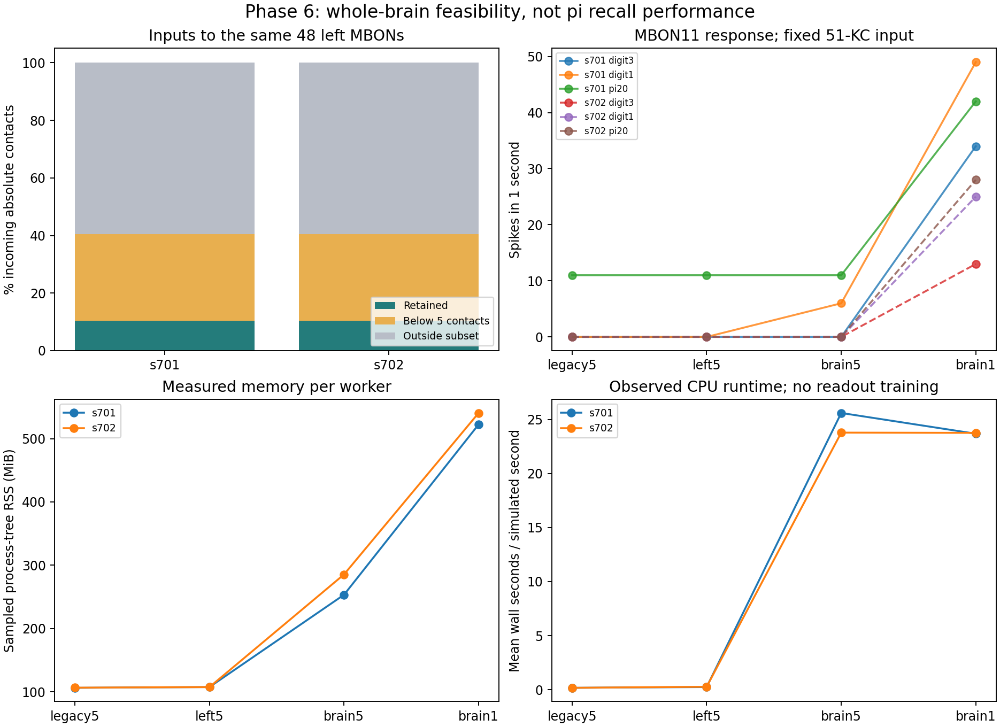

# Phase 6 — whole-brain execution and input coverage

The complete author-distributed v783 graph now executes locally: **138,639
neurons and 15,091,983 signed connections**, with every source node and edge
retained. Eight graph/input conditions and 24 one-second probes completed;
all 24 reset repetitions reproduced every spike, count and final voltage/drive
array exactly. The largest workers used **522–541 MiB sampled process-tree RSS**.

Restoring weak connections recovered MBON11 responses that were silent in the
small circuits. This diagnoses a limitation of the earlier input-restricted
model. No readout was trained, no autonomous pi recall was measured, and the
Phase 5B learning criterion has not been rerun or retrospectively passed.

[Locked protocol](phase6-protocol.md), committed as `59b6eea` before activity
outcomes; execution implementation `bdfc228`. Raw evidence is in
[`results/phase6`](../results/phase6), derived tables and the figure in
[`results/phase6_analysis`](../results/phase6_analysis), and test logs in
[`results/phase6_validation`](../results/phase6_validation).



## What was executed

The source node universe comes from the pinned author's completeness table,
not just edge endpoints. All 138,639 IDs are preserved as integers or decimal
strings. Every parquet pre/post index was checked against its exact ID; duplicate
pairs, inconsistent outgoing signs, invalid counts and changed hashes are
rejected. Fourteen cells lack annotations and remain OTHER; their IDs are listed
in graph provenance. The source has **zero autapses**, so the no-autapse policy
removes no edges in the full threshold-1 graph.

| Level | Neurons | Connections | Input |
|---|---:|---:|---|
| legacy5 s701 / s702 | 686 | 3,309 / 3,241 | Original sampled KC maps |
| left5 | 2,795 | 15,120 | Same exact stimulated root IDs |
| brain5 | 138,639 | 2,700,513 | Same exact stimulated root IDs |
| brain1 | 138,639 | 15,091,983 | Same exact stimulated root IDs |

`5` and `1` denote minimum contacts per connection. Both legacy circuits equal
their source-induced graphs exactly. Left5 includes all 2,580 left KCs, 48 MBONs,
166 DANs and one APL. Brain levels contain 5,177 annotated KCs, 96 MBONs, 331 DANs,
two APLs and 133,033 OTHER cells. Each digit directly stimulates **51 KCs**, using
the original seed-6142 maps on each sampled circuit. Added neurons receive no
new external input. This controls stimulation dose while changing graph coverage.

Each condition starts from rest for three probes: twenty digit-3 windows, twenty
digit-1 windows and the first twenty pi digits. Each window is 50 ms and each
probe is one simulated second. Pi20 is supplied input, not recall. All recurrent
weights are frozen and unconditioned. Source-inspired uniform LIF parameters,
0.1 ms grid and deterministic 100 Hz digit pulses remain unchanged.

## Input loss was substantial

Coverage counts absolute synaptic contacts, separating excitatory and inhibitory
inputs instead of allowing cancellation. The denominator is the full incoming
input to the same 48 left MBONs: **184,805 contacts**.

| Original sample | Retained contacts | Retained total input | Retained left-KC input |
|---|---:|---:|---:|
| s701 | 19,312 | 10.45% | 11.72% |
| s702 | 19,111 | 10.34% | 11.50% |

The original samples contain 19.84% of left KCs, but that cell fraction is not the
retained synaptic-input fraction. Of all MBON input contacts, 55,559 are on
below-threshold edges; another 109,934 / 110,135 are on above-threshold edges
whose presynaptic cells lie outside the respective sample. These losses are
disjoint; the per-cell CSV includes their exact decomposition and signs.

MBON11 receives 9,427 source contacts (8,968 excitatory, 459 inhibitory), of which
8,323 originate from left KCs. The original s701/s702 circuits retain only
**1,681 / 1,350 contacts (17.83% / 14.32%)**. Thresholding removes 3,269 contacts;
excluding outside cells removes another 4,477 / 4,808 above-threshold contacts.

## MBON11 activity changes with graph coverage

Numbers are spikes in one second, ordered **digit3 / digit1 / pi20**. They are not
memorized-digit scores.

| Graph | s701 input map | s702 input map |
|---|---:|---:|
| legacy5 | 0 / 0 / 11 | 0 / 0 / 0 |
| left5 | 0 / 0 / 11 | 0 / 0 / 0 |
| brain5 | 0 / 6 / 11 | 0 / 0 / 0 |
| brain1 | **34 / 49 / 42** | **13 / 25 / 28** |

Extending the threshold-5 left MB alone leaves these responses and total spike
counts unchanged under matched input. Extending to the threshold-5 whole brain
changes network activity, but only one of four isolated MBON11 responses becomes
nonzero. Restoring weak edges at fixed whole-brain node coverage makes all four
isolated responses nonzero. Thus connectivity preprocessing materially affects
this model's probe response. The experiment does not isolate which weak edges,
direct inputs or feedback paths cause the change.

The full graph is not globally active: each brain1 probe activates **63–670 of
138,639 neurons** under this sparse stimulus. These timing/memory measurements
do not establish performance under broad sensory drive or high firing rates.
Raw metrics report all MBONs; the derived activity table additionally reports the
same 48 left MBONs at every scale to support matched comparisons.

The previous Phase 5B result remains a failed functional-response test on its
registered small circuits. Testing local dopamine conditioning on the expanded
graph requires a new fixed protocol. It cannot be inferred from restored
unconditioned activity.

## Numerical and resource verification

- Brian2 comparison: six full one-second legacy probes have identical spike
  indices, ticks and window counts. Maximum final-state differences are
  **5.33e-13 mV** for voltage and **4.26e-14 mV** for drive, below the locked
  1e-8 mV tolerance. Brian2 was not run on the whole brain in this study.
- All eight conditions repeat all three probes exactly from reset, including
  full per-neuron counts and final states. Every saved archive is read back and
  compared, then checked by a SHA-256 manifest. Analysis independently verifies
  matched input root IDs across levels. This is same-environment reproducibility;
  cross-platform bit identity remains untested.
- LIF environment: **193 tests pass**, with 29 upstream Pyparsing deprecation
  warnings. Original rate environment: **154 pass, 9 skip** (optional Brian2 or
  psutil checks). Existing dependency locks and archived experiments are unchanged.

| Level | Sparse CSC storage | Peak worker RSS, two maps | Wall seconds per simulated second |
|---|---:|---:|---:|
| legacy5 | 0.040 MiB | 106.4–106.6 MiB | 0.167–0.173 |
| left5 | 0.184 MiB | 107.6 MiB | 0.237–0.275 |
| brain5 | 31.43 MiB | 253.4–285.5 MiB | 23.28–31.01 |
| brain1 | 173.24 MiB | 522.4–540.5 MiB | 23.18–24.54 |

Graph construction took 16.56 wall seconds including worker startup, with
895.5 MiB sampled peak RSS; raw downloads already existed. Whole-brain delay-ring
storage is 20.10 MiB. No dense N-by-N matrix or time-by-all-neurons trace is kept.
The resource watchdog sampled the entire worker process tree every 0.2 seconds,
including the Windows virtualenv redirector and real interpreter. All workers
stayed below the locked 3 GiB / 1,800-second limits.

Host: Windows 11, Python 3.12.10, approximately 15.75 GiB RAM; NumPy 2.3.5,
SciPy 1.17.0, Brian2 2.10.1. Each worker uses one numerical thread. Times are
observed local wall times, not isolated hardware benchmarks. The source-default
biological assumptions remain model assumptions: uniform cell parameters,
source transmitter signs, all-KC zero refractory adaptation, and engineered
voltage stimulation do not constitute physiological calibration.

## Reproduce

For the archived run, use revision `503aa9e` in a separate clone, as explained in
[historical reproduction](historical-reproduction.md). Run from that repository
root. Install a separate
Python 3.12 environment using `requirements-phase6-lock.txt`; it includes the
unchanged LIF lock plus pyarrow and psutil. Raw data and graph caches stay ignored.

```powershell
python -m venv .venv-phase6
.\.venv-phase6\Scripts\python.exe -m pip install -r requirements-phase6-lock.txt
$env:PYTHONPATH = "src"
.\.venv-phase6\Scripts\python.exe -m flying.training.phase6 prepare
.\.venv-phase6\Scripts\python.exe -m flying.training.phase6 run --out outputs/phase6_new
.\.venv-phase6\Scripts\python.exe -m flying.training.phase6 verify --out results/phase6 --compare outputs/phase6_new
.\.venv-phase6\Scripts\python.exe scripts/summarize_phase6.py --source outputs/phase6_new --out outputs/phase6_analysis_new
.\.venv-phase6\Scripts\python.exe -m pytest -q
```

The compare command checks all regenerated arrays exactly; resource timings can
differ. Changed source/protocol or artifact hashes are rejected. Use a fresh
output directory for each run. Interrupted runs keep partial evidence and do not
receive a completion manifest; this small fixed study has no resume command.
The reported 24 repetitions were reset repeats within each isolated condition
worker, not a separate second invocation of the entire CLI.

## Phase scope and next research

The original Phase 6 engineering acceptance work is now executed: complete
source graph, quantified input coverage, measured sparse scaling, a numerically
checked backend and reproducible whole-brain trajectories. Each original phase
now has executed evidence within the scope recorded in the [phase audit](phase-status.md).
This does not turn negative learning results into successes or establish a
physiologically calibrated whole-brain memory model.

Keep the existing fixed-32 research baseline. The next question is a matched
whole-brain versus partial-brain pi-training and autonomous-recall comparison.
Expanded-graph Phase 5B conditioning remains a distinct follow-up study.
