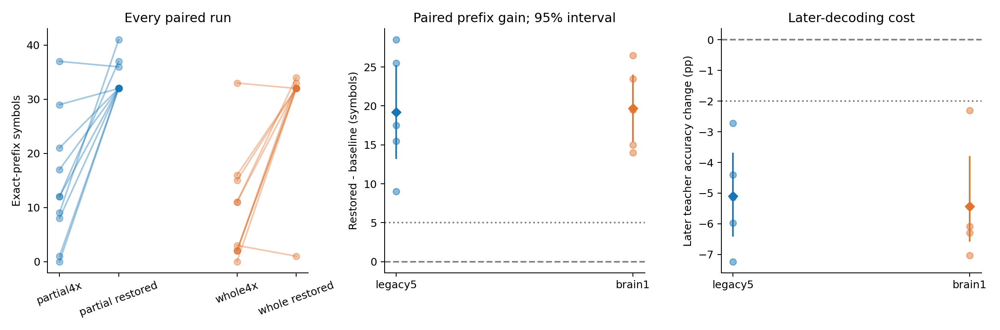
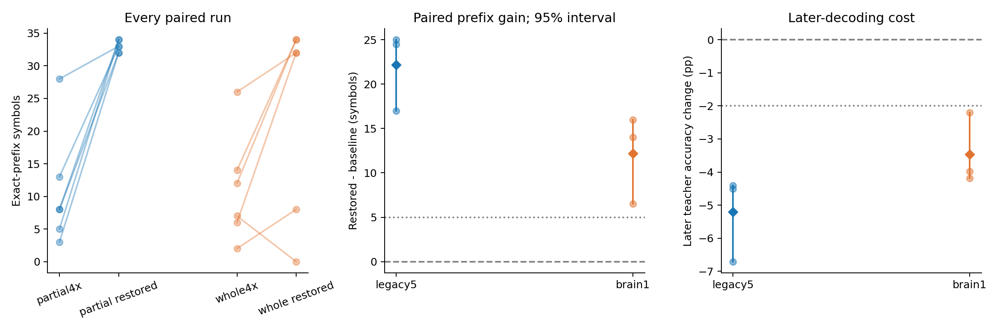

# ACT II — N512 prefix loss-mass diagnostic

**Increasing normalized early-target loss mass improves prefix recall on both
graphs, including fresh-seed confirmation, but sacrifices later teacher-forced
accuracy.** Main means: legacy5 14.6→33.8, brain1 9.5→29.2; confirmation:
10.83→33.00 and11.17→23.33. Confirmation later costs are5.21 and3.46 percentage
points. Both graphs pass the declared paired-block prefix gates; neither passes
the separate late-cost tolerance. This is evidence of a decoder-objective
tradeoff on unchanged state trajectories, not more memory stored in a connectome.

Protocol **a7badad** was committed before treatment outcomes. Cached-refit and
analysis implementation: **2dfc1d9**. This is a decoder-training intervention,
not a change to connectome dynamics or an internal learning rule.
[Protocol](prefix-mass-protocol.md) · [Config](../configs/prefix_mass.json).

## 1. Repository audit

Continued from length-scaling publication3553ddd. Reviewed the current research
direction, handoff, source/config/checkpoints and the older failed anchored-window
confirmation. Retained that negative result. Existing ACT I/II numerical modules
and prior artifacts are unchanged. Used verified N512 state caches rather than
rerunning the existing baseline cohort unnecessarily.

## 2. Reproduced baseline

Checked all20 archived N512 run hashes and their exact-replay proofs. Newly
replayed and independently refitted the first block11142/11242, stratum701:
expected and actual prefixes legacy5=12, brain1=33. All20 original baseline
scores remain in the analysis (means14.6 /9.5); these are reused data, not new
independent observations. [Baseline validation](../results/mass_baseline/report.json).

## 3. New implementation

Added a bounded cached-feature refit worker and paired analysis. The worker
checks source checkpoint/code/graph hashes, reinitializes the external decoder,
fits on exactly the same features, and uses the existing target-free rollout.
Independent verification regenerates features and decay from the graph, then
replays predictions/probabilities/losses. Means/scales, symbols, observed IDs,
singular values and training-state/decay diagnostics match baseline exactly.

## 4. Experiments executed

- Main:20 new treatment heads paired with20 existing baseline heads; model/data
  blocks11142/11242 through11146/11246, strata701/702, legacy5 and brain1.
- N512, K10, prompt314,511 training pairs,509 autonomous outputs. First32
  generated targets correspond to training indices[2,34); all other weights1.
- Baseline multiplier4 gives prefix loss mass128/607≈.210873. The single
  treatment multiplier4×479/167≈11.4730538922 restores the N200 pilot mass
  128/295≈.433898. No multiplier search or other parameter adjustment.
- Same frozen graph, input/observation IDs,48 MBON features, train-only scaling,
  original initialization,482-parameter48→8 tanh→10 readout and2000 Adam updates.
  LR.03, L2=1e-5, incoming-L1 gain.9, leak.6, mbon_after_kc remain unchanged.
- Smoke:2 cached treatment fits at20 updates, block11139/11239,stratum701;
  independent replay/refit passed; smoke is excluded from scientific estimates.
- Confirmation triggered by the locked discovery rule: fresh blocks13142/13242,
  13143/13243,13144/13244, both strata/graphs/conditions. Twelve new baseline
  fits plus12 cached treatment fits; every baseline trajectory is computed once
  and shared by its treatment. These fresh sequences are separately trained,
  not unseen-next-symbol prediction tests.

## 5. Results

The primary measure is consecutive correct generated symbols before the first
error. Later accuracy below is teacher-forced accuracy on generated positions
33–509 (477 targets), separate from autonomous late accuracy.

| Cohort | Graph | Baseline prefix | Restored prefix | Paired gain | 95% block interval | W/T/L | Later accuracy delta (pp) | Prefix gate | Within late-cost gate |
|---|---|---:|---:|---:|---|---|---:|---|---|
| Main | legacy5 | 14.60 | 33.80 | +19.20 | [13.300, 25.100] | 5/0/0 | -5.094 | True | False |
| Main | brain1 | 9.50 | 29.20 | +19.70 | [15.500, 23.900] | 5/0/0 | -5.430 | True | False |
| Confirmation | legacy5 | 10.83 | 33.00 | +22.17 | [17.000, 25.000] | 3/0/0 | -5.206 | True | False |
| Confirmation | brain1 | 11.17 | 23.33 | +12.17 | [6.500, 16.000] | 3/0/0 | -3.459 | True | False |

Each computational block averages two strata before inference. Discovery has
five blocks, confirmation three if triggered; bootstrap uses10,000 paired block
resamples, seed13399. Model/data seeds are paired, not crossed; these are not
independent animals. Small-sample intervals are descriptive, without a p-value gate.

Raw per-run medians/variances and block effect sizes are reported below. A null
d_z means zero delta variance, not an estimated zero standardized effect.

| Cohort | Graph | Baseline raw median / variance | Restored raw median / variance | Gain median / variance | Gain d_z | Later delta 95% interval (pp) |
|---|---|---|---|---|---:|---|
| Main | legacy5 | 12.00 / 138.04 | 32.00 / 9.96 | 17.50 / 61.70 | 2.444323294805739 | [-6.394, -3.711] |
| Main | brain1 | 7.00 / 103.39 | 32.00 / 98.62 | 19.50 / 28.83 | 3.6692860364580535 | [-6.562, -3.816] |
| Confirmation | legacy5 | 8.00 / 82.17 | 33.00 / 0.80 | 24.50 / 20.08 | 4.946323221982252 | [-6.709, -4.403] |
| Confirmation | brain1 | 9.50 / 71.37 | 32.00 / 231.47 | 14.00 / 25.08 | 2.4292878885849842 | [-4.193, -2.201] |

### Main: every seed

Each cell is stratum701 /702.

| Model / dataset seed | legacy5 baseline | legacy5 restored | brain1 baseline | brain1 restored |
|---|---:|---:|---:|---:|
| 11142 / 11242 | 12 / 0 | 37 / 32 | 33 / 2 | 32 / 33 |
| 11143 / 11243 | 21 / 8 | 32 / 32 | 11 / 16 | 34 / 32 |
| 11144 / 11244 | 1 / 12 | 32 / 32 | 2 / 3 | 32 / 1 |
| 11145 / 11245 | 37 / 9 | 36 / 41 | 11 / 0 | 32 / 32 |
| 11146 / 11246 | 29 / 17 | 32 / 32 | 2 / 15 | 32 / 32 |



### Confirmation: every seed

Each cell is stratum701 /702.

| Model / dataset seed | legacy5 baseline | legacy5 restored | brain1 baseline | brain1 restored |
|---|---:|---:|---:|---:|
| 13142 / 13242 | 3 / 13 | 32 / 33 | 26 / 12 | 32 / 34 |
| 13143 / 13243 | 5 / 28 | 34 / 33 | 7 / 14 | 0 / 34 |
| 13144 / 13244 | 8 / 8 | 32 / 34 | 2 / 6 | 8 / 32 |



### Common-objective diagnostic

Weighted training losses use different objectives, so their raw values should
not be compared as if they used a common scale. These are cross-entropy changes
of the same saved heads under a common weighting, excluding the L2 penalty.

| Cohort | Graph | Unweighted CE delta | Common4x CE delta | Early CE delta | Later CE delta |
|---|---|---:|---:|---:|---:|
| Main | legacy5 | +0.1903 | +0.1105 | -0.3141 | +0.2243 |
| Main | brain1 | +0.1676 | +0.0871 | -0.3411 | +0.1987 |
| Confirmation | legacy5 | +0.1795 | +0.0985 | -0.3329 | +0.2128 |
| Confirmation | brain1 | +0.1439 | +0.0542 | -0.4230 | +0.1866 |

All early/later teacher and autonomous accuracies, controls, probabilities and
loss histories remain in the raw artifacts. Neural training-state diagnostics
are explicitly reused and invariant, not newly improved representations.

## 6. Interpretation

Discovery requires mean prefix gain>=5 with>=4/5 positive blocks per graph.
Confirmation requires mean gain>=5 with all3 blocks positive for a discovery-
qualifying graph. The separate late-cost gate allows at most2 percentage points
mean loss, with at least4/5 discovery blocks (all3 confirmation blocks) within
that margin. Passing that tolerance is not literally zero cost.

Discovery qualifiers: **['legacy5', 'brain1']**. Confirmed prefix effects: **['legacy5', 'brain1']**. Confirmed effects also meeting both cohorts' late-cost gate: **[]**.

The intervention changes only external decoder loss emphasis on fixed states.
A supported effect concerns that training procedure; it cannot be attributed
to newly created information in the reservoir, stronger biological connectivity
or internal synaptic learning. Unchanged training representation can support
different early decoding after a different fit. Later losses matter equally.

## 7. Negative findings

Preserve every failing gate and low/negative seed in the tables. No extra
multiplier, seed replacement, architecture change or optimizer extension was
used. The earlier anchored-window confirmation remains negative; this study
does not retrospectively establish that method or promote a new default.

Not every individual fit improves. In confirmation, brain1 seed13143 /dataset13243
/stratum701 falls from7 to0, while its paired stratum rises14→34; the registered
block mean gain is6.5. Another brain1 treatment reaches only8. All these runs
remain in the raw table. Main legacy5 includes37→36; main brain1 includes33→32
and3→1. This is not uniform reliability across input mappings or a robustness test.
First32 completion in main rises1/10→10/10 for legacy5 and1/10→9/10 for brain1;
confirmation treatment completes that prefix6/6 and4/6 respectively. No model
completes the509-symbol task. A longer early prefix is not general full-task recall.

The common-baseline4x cross entropy also worsens in both graphs and cohorts;
the intervention is not a better fit to the original objective. Late autonomous
accuracy remains separately reported; the declared late cost specifically
concerns teacher-forced decoding, not an assertion that every late rollout worsens.

## 8. What we can claim

The tables quantify an isolated normalized-loss-weight intervention in trained
external decoders on computational models using actual Drosophila connectome
structure. Claims are scoped to the declared graph/cohort/gates and tradeoffs.

## 9. What we cannot claim

No living-fly memory, unseen-next-symbol prediction, internal connectome
learning, intrinsic/formal memory capacity, whole-brain superiority, universal
random-sequence memory or general cost-free improvement is implied. The early
prefix weighting does not test equal priority for all509 outputs. Small paired
computational cohorts do not establish biological population effects.

## 10. Reproducibility

- Main: 20 exact replays /2 independent exact refits.
- Smoke: 2 exact replays /2 independent exact refits.
- Confirmation baseline: 12 exact replays /2 independent exact refits.
- Confirmation treatment: 12 exact replays /2 independent exact refits.

Tests:146 passed /8 optional-dependency skips. Existing numerical source is
unchanged; requirements-act1-lock.txt /Python3.12.10, one numerical thread.
Cached treatment runtime excludes teacher-state regeneration and must not be
compared directly to baseline generation runtime. Per-run process-tree peak RSS,
runtime and environment metadata are saved, with limits1800s/3GiB.

Scientific fit worker wall-time sums: main cached260.99s, fresh baseline371.33s,
confirmation cached194.72s (827.03s total). Maximum sampled process-tree RSS:
985.5MiB. Replay overlapped some fits; these are not isolated speed benchmarks.
All3,054 earlier result files passed final SHA-256 checks. New scientific heads:
44 exact replays /6 exact independent refits; smoke2/2 and selected historical
baseline2/2 are additional validation, not extra independent scientific samples.

[Main manifest](../results/mass_main/manifest.json),
[main verification](../results/mass_verification/manifest.json),
[decision record](../results/mass_decision/decision.json),
[environment](../results/mass_validation/environment.json).
[Final integrity checks](../results/mass_validation/final-checks.json).

From the repository root, using fresh output paths:

```powershell
$env:PYTHONPATH = 'src'
python -m pip install -r requirements-act1-lock.txt
python -m flying.training.phase6 prepare --cache outputs/act1-graphs
python scripts/run_prefix_mass.py run --source results/scaling_main/n512 --out outputs/mass_new
python scripts/verify_sequence_memory_stream.py --source outputs/mass_new --out outputs/mass_verify_new
python scripts/summarize_prefix_mass.py --source results/scaling_main/n512 --treatment outputs/mass_new --out outputs/mass_analysis_new
```

Reproduce the registered confirmation in separate fresh directories:

```powershell
python -m flying.training.sequence_memory run --config configs/prefix_mass_confirmation_baseline.json --out outputs/mass_confirm_baseline_new
python scripts/verify_sequence_memory_stream.py --source outputs/mass_confirm_baseline_new --out outputs/mass_confirm_baseline_verify_new
python scripts/run_prefix_mass.py run --config configs/prefix_mass_confirmation.json --source outputs/mass_confirm_baseline_new --out outputs/mass_confirm_new
python scripts/verify_sequence_memory_stream.py --source outputs/mass_confirm_new --out outputs/mass_confirm_verify_new
python scripts/summarize_prefix_mass.py --source outputs/mass_confirm_baseline_new --treatment outputs/mass_confirm_new --out outputs/mass_confirm_analysis_new
```

Archived checkpoints and exact generated sequences are included in results;
raw graph caches are regenerated from source hashes.

## 11. Next highest-information experiment

**An independent-stream delayed-symbol decoding comparison of legacy5 and
brain1 under the current matched48-MBON dynamics.** Train identical probes
on one iid random stream and evaluate recovery of past input symbols on a
separate stream, across predefined lags. Separate current-input accessibility
(lag0) from past-input decoding; do not infer absence of all information from
failure of a particular probe. No prefix weighting or trained-sequence rollout
is involved in this diagnostic. Preregister streams, probe capacity, lags and
decision rules before execution.

다음 실험 하나는 **학습에 쓰지 않은 random 입력에서 과거 기호를 복원하는
비교**다. 같은48개 MBON 관측으로 부분망과 whole-brain을 비교해, 특정 수열의
초반을 외부 출력층에 우선 학습시킨 효과와 과거 입력의 해독 가능성을 구분한다.
아직 실행하지 않았다.

The existing [Phase3b partial-network study](phase3b-results.md) provides a
tested independent-stream probe, but used different timing/model conditions and
did not execute this matched whole-brain comparison. Reuse its alignment tests
and preserve its negative topology findings; do not relabel historical results
as new evidence. This is a representation/decoding diagnostic, not ablation or
internal plasticity, and it does not establish formal memory capacity.
