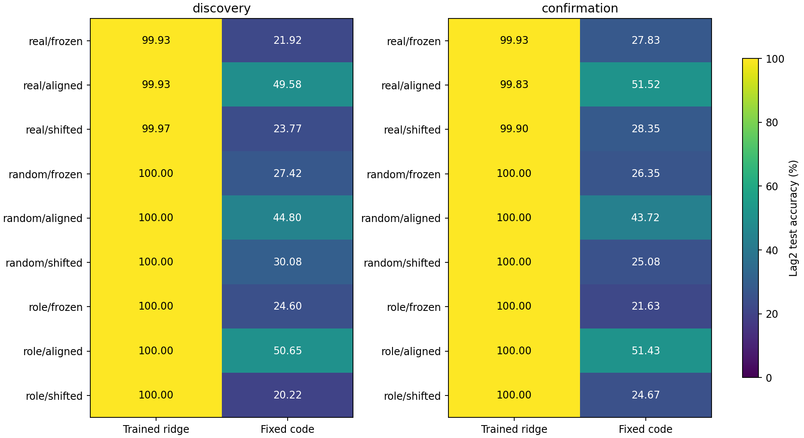
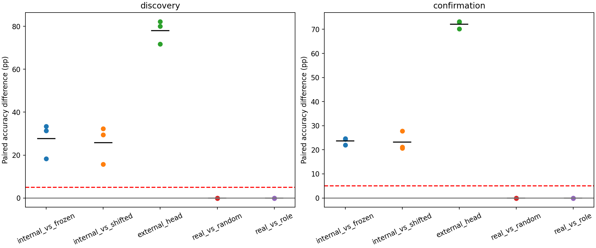
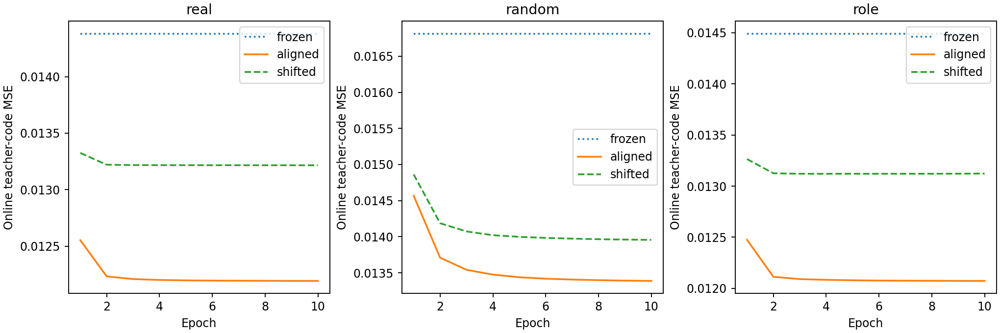

# ACT IV-A — 외부 출력층 의존성: 현재 부분 모델의 비교 완료

**현재 부분 rate 모델의 A/B/C/D 비교를 모두 실행·검증했다.**
이는 전체 ACT IV의 생물학적 내부 학습 성공이나 모든 가능한 모델의 완료를 뜻하지 않는다.
기존 관측 위치 진단, 사후 공통 지연 분석, 새 seed의 matched factorial을 구분한다.

실제망에서 내부 교사 학습 뒤 고정 코드 해독 정확도는 본49.5833%·확인51.5167%로,
고정 연결의21.9167%·27.8333%와 shifted 교사의23.7667%·28.3500%보다 높았다.
두 cohort의 모든 paired seed 방향과 사전5%p·frequency 접근 기준을 충족했다.
학습된 외부 출력층 없이도 이 인공 코드의 정확도가 개선되는 조건을 확인했다.

동시에 내부 학습 전의 선형 출력층은 이미99.9333%/99.9333%였다. 내부 학습 뒤
99.9333%/99.8333%로 표현 개선 기준을 충족하지 않았다. 따라서 새로운 기억 용량을
만들었다기보다 이미 해독 가능하던 과거 정보를 사전 지정한 코드로 읽기 쉽게
바꾸었다는 해석이 더 적절하다. 학습 위치를 관측 직전 KC→MBON 연결로 옮긴
효과일 수도 있다. 그 연결이 기능상 내부 출력층처럼 작동할 가능성을 배제하지 않는다.

Random/role의 frozen ridge도100%였다. 원본 배선 우위 기준은 실패했지만 이 lag2
과제는 ceiling이라 구조 간 우위에 대한 식별력이 낮다. 구조가 동등하다거나 실제
배선이 쓸모없다고 결론내리지 않는다. Role의 aligned fixed 정확도50.65%/51.4333%도
실제망과 비슷하다. 이를 사후 새 성공 검정으로 바꾸지 않고 전체 표에 그대로 남긴다.
Random graph는 plastic KC→MBON edge 수까지 맞춘 것이 아니므로 plastic arm의
네트워크 간 차이는 학습 파라미터 수 차이에도 영향을 받을 수 있다.

이 결과의 C는 인공 벡터 정답 교사, D는 고정 외부 코드 해석이다. 뉴런이 실제
도파민으로 순서를 배웠다거나 자율 π 회상을 향상시켰다는 증거가 아니다.
A/B/C/D의 현재 부분 모델 비교는 마쳤고, 생물학적 동기 규칙으로 같은 기능을
얻을 수 있는지는 별도의 ACT IV 질문으로 남는다.


## 1. Repository audit

기준 `584026d`에서 연구 방향·로드맵·최신 관측 결과와 phase4/5/5B 규칙을 확인했다.
관측 위치 진단만으로는 원래 요청한 A/B/C/D 비교가 완결되지 않았다. 이를 명시하고
이번에 내부 연결 학습 유무와 출력 해독 학습 유무를 교차한 비교를 추가했다.
기존 KCMBONPlasticity는 **인공 교사 기반 one-step semi-gradient**다. 도파민 모델이
아니라는 소스 설명을 따랐다. 기존 Phase5B의 생물학적 동기 규칙은 별도 모델이며
국소 작동 확인·기능 개선 실패라는 기존 결론을 유지한다.
과거 result 18,279개 파일의 해시를 보존했다.

## 2. Reproduced baseline

[기준 재현 기록](../results/readout_dependency/baseline.json): 기존 structural K4 기준의
배열과 지표를 정확히 재현했다. 새 비교는 동시 업데이트, 주 지연2이므로 과거
mbon_after_kc·6-lag 평균과 직접 점수를 비교하지 않는다. 기존 고정 환경을 재사용했다.

## 3. New implementation

[Runner](../scripts/readout_dependency.py), [독립 update/trajectory verifier](../scripts/verify_readout_dependency.py),
[tests](../tests/test_readout_dependency.py), [그림 재현](../scripts/plot_readout_dependency.py).
새 plasticity rule을 만들거나 섞지 않고 기존 감독형 규칙 하나를 사용했다.
정답은 현재 forward state 계산이 끝난 뒤 연결 갱신에만 사용한다. 평가에서는
정답 없이 입력 기호만으로 상태를 만들고 내부 가중치도 고정한다.

## 4. Experiments executed

| 원래 질문 | 이번 구현 | 해석 범위 |
|---|---|---|
| A. frozen connectome + trained readout | real/frozen + affine ridge | 고정 실제 구조의 해독 가능한 표현 |
| B. random connectome + trained readout | random/frozen 및 role/frozen + 같은 ridge | 무작위·정교한 구조 대조와 비교 |
| C. trained/plastic connectome + simple readout | real/aligned + ridge 및 fixed code | 인공 교사가 바꾼 내부 연결의 효과 |
| D. direct internal decoding 가능성 | 학습 계수0인 nearest-code 해독 | 외부 학습 없는 고정 코드 해석 대리 지표 |

C는 생물학적 dopamine 학습이 아니다. D도 출력을 숫자로 바꾸는 고정 계산이 있으므로
문자 그대로 출력 장치가 없는 뇌라고 부르지 않는다. 한 fixed decoder의 실패가
모든 무학습 decoder의 불가능성을 증명하지 않는다.

Network real/random/role × frozen/aligned/shifted-target × 2부분 회로 × 3seed/cohort.
Smoke9 + discovery54 + confirmation54 = **117 network/training cases**,
주 지연에서 ridge/fixed 합234평가. 독립 검증은117회 내부 학습과234개 최종 궤적을
재계산했다. 총1404개 metric rows. Smoke는 추론에서 제외한다.

c701/c702,686뉴런,threshold5,3309/3241edges,48MBON, K4 iid independent streams,
train2000/test1000,warmup100. 입력 fraction0.1/amplitude0.5, gain0.9 incoming-L1,
leak0.6,**synchronous/1microstep**. 내부 학습10epochs ×2000updates, lr0.05,
projection floor1e-4. Warmup에서는 갱신하지 않고 매 epoch state를 초기화한다.
기존 edge/sign과 각 MBON의 KC incoming absolute mass를 보존하고 다른 연결은 고정한다.
Plastic 후보 연결 수는 real/role1431–1474개, random155–189개로 다르다. Real aligned는
1428–1474개를 바꿨고 초기 대비 plastic weight 벡터의 상대 L2 변화 평균은1.809였다.
Frozen은 변경0이다. 큰 가중치 재배치를 생리적으로 교정된 변화라고 주장하지 않는다.
Shifted는 훈련 정답을1000만큼 원형 이동하여 교사/갱신 예산을 맞춘 대조다.

48MBON을 사전 code seed로4개 그룹(각12개)으로 나눠 target amplitude0.25를 부여한다.
Fixed decoder는 제곱거리 최소 code 선택, 학습 파라미터0. Ridge는 final weights에서
새로 모은 훈련 상태만으로 학습; alpha1,std floor1e-5,지연별196계수.
Primary lag2는 이전 곡선에 근거해 새 결과 전에 고정한 데이터 기반 선택이다.
Lags0,1,2,3,4,5,8,12,16,24,32의 ridge 결과도 모두 저장한다.

본 seed221142–221144, 확인231142–231144, smoke221001. Train+1000,test+2000,
code+3000,graph+5000. Bootstrap236399,10000 block draws. 회로는 block 안에서 평균,
각 cohort n=3이며 합치지 않는다. 같은 connectome의 부분망은 독립 동물 표본이 아니다.
Random은 edge 수·signed raw weights를 보존하지만 degree/role/strength는 보존하지 않는다.
Role control은 signed degree,role 구성과 per-postsynaptic incoming weights를 보존한다.
그 밖의 outgoing strength와 균일 ensemble mixing을 보장하지 않는다.

Protocol/code lock `53065a2d7c29c77fe27b0b64bb6666c96e3c201b`가 모든 새 과제 결과보다 앞선다.
[Protocol](readout-dependency-protocol.md), [config](../configs/readout_dependency.json), [seed audit](readout-dependency-seed-audit.json).

## 5. Results

### 완료된 관측 위치 진단의 사후 공통 지연 분석

기존 결과를 이미 본 뒤의 **retrospective exploratory** 분석이다. 새 confirmatory 결과로
세지 않는다. Discovery intact에서 두 site 모두 접근성 기준을 충족한 지연만 고정:
**[1, 2, 3, 4, 5]**. 지연8은 KC 기준을 충족하지 않아 제외됐다.
Lesion 손상이나 confirmation 결과를 보고 지연을 다시 고르지 않았다.

| Cohort | MBON loss pp | KC loss pp | Interaction pp |
|---|---|---|---|
| discovery | +8.5300 | -0.0667 | +8.5967 |
| confirmation | +7.5533 | -0.0233 | +7.5767 |

[모든 포함/제외 지연](../results/readout_dependency/common-delays/all-lags.csv), [paired lag 결과](../results/readout_dependency/common-delays/paired-lags.csv), [통계](../results/readout_dependency/common-delays/summary.json).

### 새 factorial 평균 정확도(%)

| Network/training | Discovery ridge | Discovery fixed | Confirmation ridge | Confirmation fixed |
|---|---|---|---|---|
| real/frozen | 99.9333 | 21.9167 | 99.9333 | 27.8333 |
| real/aligned | 99.9333 | 49.5833 | 99.8333 | 51.5167 |
| real/shifted | 99.9667 | 23.7667 | 99.9000 | 28.3500 |
| random/frozen | 100.0000 | 27.4167 | 100.0000 | 26.3500 |
| random/aligned | 100.0000 | 44.8000 | 100.0000 | 43.7167 |
| random/shifted | 100.0000 | 30.0833 | 100.0000 | 25.0833 |
| role/frozen | 100.0000 | 24.6000 | 100.0000 | 21.6333 |
| role/aligned | 100.0000 | 50.6500 | 100.0000 | 51.4333 |
| role/shifted | 100.0000 | 20.2167 | 100.0000 | 24.6667 |

### 실제망의 전체 seed 표(정확도%)

| Cohort | Seed | Ridge frozen | Ridge aligned | Ridge shifted | Fixed frozen | Fixed aligned | Fixed shifted |
|---|---|---|---|---|---|---|---|
| discovery | 221142 | 99.9500 | 99.9500 | 99.9500 | 17.7000 | 51.1500 | 18.8500 |
| discovery | 221143 | 99.8500 | 99.8500 | 99.9500 | 19.8000 | 51.1000 | 21.7000 |
| discovery | 221144 | 100.0000 | 100.0000 | 100.0000 | 28.2500 | 46.5000 | 30.7500 |
| confirmation | 231142 | 99.9500 | 99.8500 | 100.0000 | 27.0500 | 51.7000 | 23.9500 |
| confirmation | 231143 | 100.0000 | 99.6500 | 99.9000 | 29.8500 | 51.8500 | 30.7000 |
| confirmation | 231144 | 99.8500 | 100.0000 | 99.8000 | 26.6000 | 51.0000 | 30.4000 |

Random/role를 포함한 모든 seed는 [raw block table](../results/readout_dependency/seed-blocks.csv)에 보존했다. [모든 지연/기호 평가](../results/readout_dependency/raw-metrics.csv).

### 사전 판정과 대비 통계

| Endpoint | Discovery | Confirmation | Confirmed |
|---|---|---|---|
| internal_coding | True | True | True |
| representation_access | True | True | True |
| original_graph_advantage | False | False | False |
| representation_improvement | False | False | False |
| external_head_dependence | True | True | True |
| Cohort | Contrast | Mean pp | Median pp | Variance pp² | Bootstrap95 pp | Paired dz |
|---|---|---|---|---|---|---|
| discovery | internal_vs_frozen | +27.6667 | +31.3000 | 67.660833 | [18.25, 33.45] | 3.3635 |
| discovery | internal_vs_shifted | +25.8167 | +29.4000 | 78.105833 | [15.75, 32.3] | 2.9212 |
| discovery | real_vs_random | -0.0667 | -0.0500 | 0.005833 | [-0.15, 0.0] | -0.8729 |
| discovery | real_vs_role | -0.0667 | -0.0500 | 0.005833 | [-0.15, 0.0] | -0.8729 |
| discovery | representation_vs_frozen | +0.0000 | +0.0000 | 0.000000 | [0.0, 0.0] | undefined |
| discovery | representation_vs_shifted | -0.0333 | +0.0000 | 0.003333 | [-0.1, 0.0] | -0.5774 |
| discovery | external_head | +78.0167 | +80.0500 | 30.663333 | [71.75, 82.25] | 14.0889 |
| confirmation | internal_vs_frozen | +23.6833 | +24.4000 | 2.140833 | [22.0, 24.65] | 16.1864 |
| confirmation | internal_vs_shifted | +23.1667 | +21.1500 | 15.830833 | [20.6, 27.75] | 5.8225 |
| confirmation | real_vs_random | -0.0667 | -0.0500 | 0.005833 | [-0.15, 0.0] | -0.8729 |
| confirmation | real_vs_role | -0.0667 | -0.0500 | 0.005833 | [-0.15, 0.0] | -0.8729 |
| confirmation | representation_vs_frozen | -0.1000 | -0.1000 | 0.062500 | [-0.35, 0.15] | -0.4000 |
| confirmation | representation_vs_shifted | -0.0667 | -0.1500 | 0.055833 | [-0.25, 0.2] | -0.2821 |
| confirmation | external_head | +72.1000 | +72.9000 | 2.882500 | [70.15, 73.25] | 42.4669 |

주 기준은 real/aligned fixed가 frequency보다 모든 seed에서5%p 이상 높고, frozen 및 shifted fixed보다 평균5%p 이상·모든 paired seed 양수인 조건을 두 cohort 모두 충족하는가다. Ridge 성공으로 fixed 실패를 대체하지 않는다. 다른 endpoint도 각각 고정된5%p 대비와 접근성 조건을 적용했다. 작은 n의 bootstrap/dz는 기술 통계이며 p-value로 성공을 주장하지 않는다.







학습 곡선은 본·확인 전체의 설명용 평균이고 endpoint 통계는 cohort별로 분리했다.

[모든 학습 곡선](../results/readout_dependency_analysis/training-histories.csv), [neural rank/sparsity/activity](../results/readout_dependency/neural-diagnostics.csv).

## 6. Interpretation

실제망에서 내부 교사 학습 뒤 고정 코드 해독 정확도는 본49.5833%·확인51.5167%로,
고정 연결의21.9167%·27.8333%와 shifted 교사의23.7667%·28.3500%보다 높았다.
두 cohort의 모든 paired seed 방향과 사전5%p·frequency 접근 기준을 충족했다.
학습된 외부 출력층 없이도 이 인공 코드의 정확도가 개선되는 조건을 확인했다.

동시에 내부 학습 전의 선형 출력층은 이미99.9333%/99.9333%였다. 내부 학습 뒤
99.9333%/99.8333%로 표현 개선 기준을 충족하지 않았다. 따라서 새로운 기억 용량을
만들었다기보다 이미 해독 가능하던 과거 정보를 사전 지정한 코드로 읽기 쉽게
바꾸었다는 해석이 더 적절하다. 학습 위치를 관측 직전 KC→MBON 연결로 옮긴
효과일 수도 있다. 그 연결이 기능상 내부 출력층처럼 작동할 가능성을 배제하지 않는다.

Random/role의 frozen ridge도100%였다. 원본 배선 우위 기준은 실패했지만 이 lag2
과제는 ceiling이라 구조 간 우위에 대한 식별력이 낮다. 구조가 동등하다거나 실제
배선이 쓸모없다고 결론내리지 않는다. Role의 aligned fixed 정확도50.65%/51.4333%도
실제망과 비슷하다. 이를 사후 새 성공 검정으로 바꾸지 않고 전체 표에 그대로 남긴다.
Random graph는 plastic KC→MBON edge 수까지 맞춘 것이 아니므로 plastic arm의
네트워크 간 차이는 학습 파라미터 수 차이에도 영향을 받을 수 있다.

이 결과의 C는 인공 벡터 정답 교사, D는 고정 외부 코드 해석이다. 뉴런이 실제
도파민으로 순서를 배웠다거나 자율 π 회상을 향상시켰다는 증거가 아니다.
A/B/C/D의 현재 부분 모델 비교는 마쳤고, 생물학적 동기 규칙으로 같은 기능을
얻을 수 있는지는 별도의 ACT IV 질문으로 남는다.


## 7. Negative findings

위 endpoint 표의 실패를 그대로 유지한다. 새 seed, 더 긴 학습, 다른 learning rate나
유리한 codebook을 찾아 재실행하지 않았다. 원래 구조의 우위·내부 코드 형성·표현 개선·
출력층 의존성은 서로 다른 판정이며 한 성공으로 다른 실패를 덮지 않는다.
이전 Phase4/5/5B와 III-B/C 부정 결과도 삭제하거나 이번 설계와 합쳐 해석하지 않는다.

## 8. What we can claim

실제 초파리 connectome 구조를 사용한 두 부분 계산 모델에서 A/B/C/D를 같은
과제·관측·동역학 안에서 비교했다. 내부 가중치가 바뀐 사실, 최종 상태에서 정보를
읽을 수 있는 사실, 고정 코드로 읽을 수 있는 사실을 각각 분리했다.
검증된 endpoint의 범위에서만 representation/decoding/artificial teaching을 주장한다.

## 9. What we cannot claim

실제 초파리 기억·생물학적 회로 학습·dopamine 효과·전체 뇌 일반화·자율 π 회상 개선·
formal memory capacity·readout 자체가 전혀 없는 시스템은 입증하지 않았다.
C의 정답 교사와 인위적 codebook은 생물학적 제약을 완화한 계산 대조다. 이것을
ACT IV의 biologically motivated learning 성공이라고 부르지 않는다.
A단계 완료는 현재 부분 모델의 유한 비교 패널 종료이며 생물학적 내부 학습의
큰 질문은 남는다. 코딩 방식·동시 업데이트·lag2·10epochs·n=3씩의 한계를 유지한다.

## 10. Reproducibility

Config hash `9e422bb0652d3d61e6070c402b08f591e23ff5ca6cca07ac4e47bdbc8027796a`.
[Root manifest](../results/readout_dependency/manifest.json), [independent checks](../results/readout_dependency_validation/checks.json),
[test record](../results/readout_dependency_validation/test-suite.json), [figure manifest](../results/readout_dependency_analysis/manifest.json).
각 조건에 checkpoint.npz, raw.npz, initial-weights.npz, final-weights.npz,
metrics.json,fixed-metrics.json,history.json,plastic-audit.json,graph-audit.json,neural.json,
manifest.json을 보존했다. Codebook·기호·교사 labels·상태·head·null scores도 저장했다.
독립 코드로117개 내부 학습의 최종 가중치가 **배열 단위로 정확히 일치**했고,
신경 궤적·fixed 해독·ridge augmented least-squares·통계·결론도 확인했다.

Tests **227 passed,8 optional skipped**.
Python/NumPy/SciPy 3.12.10/2.3.5/1.17.0,
`requirements-act1-lock.txt`,수치 라이브러리1thread. 실행 481.15s,
sampled peak RSS 172.98MiB; 독립 검증 486.19s.
상한7200s/3GiB. RSS는50ms sampling으로 순간 절대 최대 보장이 아니다.

```powershell
$env:PYTHONPATH='src'
python scripts/readout_dependency.py --out outputs/readout_dependency_new
python scripts/verify_readout_dependency.py outputs/readout_dependency_new --out outputs/readout_dependency_check_new
python scripts/plot_readout_dependency.py outputs/readout_dependency_new --out outputs/readout_dependency_plots_new
python -m pytest -q
```

Clean committed checkout 및 기존 graph/source artifact가 필요하며 새 경로를 사용한다.

## 11. Next highest-information experiment

**벡터 정답 교사를 제거한 단일 보상·eligibility 규칙 대조 하나.**
이번에 고정한 입력·관측·코드 해독기를 유지하면서 KC→MBON 갱신에 정답 code 벡터를
주지 않고 scalar correctness reward와 국소 pre/post eligibility만 허용하는 조건을
사전등록한다. No-learning 및 yoked-reward 대조와 비교하고 한 학습률·예산만 사용한다.
질문은 같은 고정 코드 기능을 강한 인공 교사 없이 만들 수 있는가다. 이 규칙의
생물학적 동기와 실제 생리 검증은 구분하고, 기존 Phase5A의 classifier-gradient
feedback를 국소 규칙이라고 재명명하지 않는다. 이번에는 실행하지 않았다.
