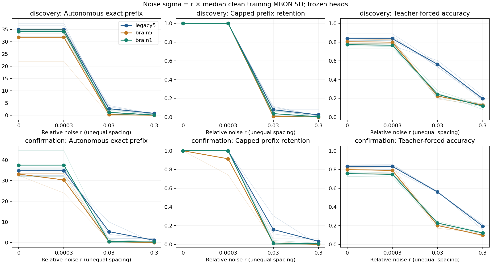

# ACT V extension — 상대 잡음 크기를 맞춘 회상 비교

**상대 잡음 크기를 맞춰도 전체망 우위는 확인되지 않았다.** 사전 지정한 세 비교 모두 확인 기준에 실패했다.
이번 보정 실험은 별도 연구이며, 이전 절대 잡음 결과와 ACT I의 clean 결과는 그대로 보존한다.

## 1. Repository audit

[ACT V](act5-robustness-results.md)의 절대 잡음은 clean MBON 변동 대비 크기가
부분망과 전체망에서 달랐다. 기존 코드·checkpoint·manifest를 확인하고 그대로
재사용했다. 첫 smoke 검증에서 기본 CSV 파서의 미세한 소수 복원 오차가 발견됐다.
[공학 감사](relative-noise-engineering-audit.md)에 실패를 남겼으며, 허용 오차를
늘리지 않고 round-trip 파서로 수정했다. 새 디렉터리의 재시험을 통과한 뒤 main을 실행했다.

## 2. Reproduced baseline

기존30개 head의 clean 출력·확률·상태를 정확히 재현했다. 새 seed381142–381144의
18개 head는 동일 clean 학습으로 만들었다. 이전 확인 seed371142–371144와 다르다.
기존 Python3.12 격리 환경을 사용했으며 새로운 환경 설치로 표현하지 않는다.

| cohort | graph | clean PMS | clean teacher % |
| --- | --- | --- | --- |
| discovery | legacy5 | 35.000 | 83.655 |
| discovery | brain5 | 31.800 | 80.406 |
| discovery | brain1 | 34.100 | 77.310 |
| confirmation | legacy5 | 34.833 | 83.249 |
| confirmation | brain5 | 33.167 | 79.865 |
| confirmation | brain1 | 37.500 | 75.635 |

## 3. New implementation

[실행기](../scripts/relative_noise.py), [검증기](../scripts/verify_relative_noise.py),
[그림](../scripts/plot_relative_noise.py), [테스트](../tests/test_relative_noise.py).
q는 clean 학습199개 시점×48 MBON의 원래 표준편차(ddof0) 중앙값이다.
출력층 전처리의 최소값 보정이나 평가 상태는 사용하지 않는다. sigma=r×q.
q가 유효하지 않으면 중단하며 작은 양수로 대신하지 않는다.

## 4. Experiments executed

[Protocol](relative-noise-protocol.md), [config](../configs/relative_noise.json),
[seed audit](relative-noise-seed-audit.json). 설계 commit2f5d62c, main source
commit`10106a771879b9ba90e7acc2bfa46274446f6110`. 부분망/전체threshold5/전체threshold1,
기존5seed와 새3seed, circuit701/702:48개 모델. 동일 입력 IDs,48 MBON,
482개 readout 파라미터,π offset0/length200/prompt314,자율197자리.
gain.9/leak.6/mbon_after_kc,Adam2000/LR.03/L2=1e-5/first32 target4×.
교란 후 head·전처리·연결을 학습하지 않는다.

r=[.0003,.03,.3]와 영점. 모든 뉴런에 매 예측 직전 Gaussian을 더하고[-1,1]로 clip한다.
같은 root ID에는 같은 draw를 사용하고 강도 간 stream을 재사용한다. Canonical
stream seed는[372001,model_seed,circuit,1]. 한 모델당 하나의 교란 realization이다.
각 dose에서 autonomous와 teacher를 별도로 평가했다. 실제384궤적,
영점 alias48행. Smoke는 main에서 제외했다.

## 5. Results

각 칸은 세 비영 강도와 두 circuit을 평균한 PMS / capped retention이다.
Retention=min(PMS/clean PMS,1); clean PMS0은 판별 불가이며 제외하지 않는다.
독립 통계 단위는 기존 n5와 새 n3이며, 두 집단을 합산하지 않는다.

| cohort | seed | legacy5 | brain5 | brain1 |
| --- | --- | --- | --- | --- |
| discovery | 7142 | 13.167 / 0.361 | 11.333 / 0.338 | 11.833 / 0.338 |
| discovery | 7143 | 12.500 / 0.373 | 11.667 / 0.333 | 11.500 / 0.359 |
| discovery | 7144 | 12.833 / 0.342 | 11.833 / 0.338 | 11.833 / 0.338 |
| discovery | 7145 | 13.333 / 0.376 | 7.333 / 0.333 | 11.500 / 0.338 |
| discovery | 7146 | 12.333 / 0.385 | 11.333 / 0.339 | 12.333 / 0.359 |
| confirmation | 381142 | 14.167 / 0.435 | 11.333 / 0.339 | 10.667 / 0.333 |
| confirmation | 381143 | 13.167 / 0.373 | 8.333 / 0.258 | 15.000 / 0.337 |
| confirmation | 381144 | 14.000 / 0.385 | 11.167 / 0.333 | 12.667 / 0.352 |

| cohort | contrast | metric | mean | median | variance | bootstrap95 | paired dz | wins/ties/losses | gate |
| --- | --- | --- | --- | --- | --- | --- | --- | --- | --- |
| discovery | brain1-legacy5 | pi_memory_score | -1.033 | -1.000 | 0.45 | -1.533 / -0.467 | -1.540 | 0/1/4 | False |
| discovery | brain1-legacy5 | retention | -0.021 | -0.023 | 0.000158017 | -0.030 / -0.011 | -1.649 | 0/0/5 | False |
| discovery | brain5-legacy5 | pi_memory_score | -2.133 | -1.000 | 4.825 | -4.133 / -0.933 | -0.971 | 0/0/5 | False |
| discovery | brain5-legacy5 | retention | -0.031 | -0.039 | 0.000308988 | -0.044 / -0.016 | -1.770 | 0/0/5 | False |
| discovery | brain1-brain5 | pi_memory_score | 1.100 | 0.500 | 3.14722 | 0.033 / 2.700 | 0.620 | 3/1/1 | False |
| discovery | brain1-brain5 | retention | 0.010 | 0.005 | 0.000149613 | 0.001 / 0.020 | 0.849 | 3/2/0 | False |
| confirmation | brain1-legacy5 | pi_memory_score | -1.000 | -1.333 | 7.19444 | -3.500 / 1.833 | -0.373 | 1/0/2 | False |
| confirmation | brain1-legacy5 | retention | -0.057 | -0.037 | 0.00149868 | -0.102 / -0.033 | -1.476 | 0/0/3 | False |
| confirmation | brain5-legacy5 | pi_memory_score | -3.500 | -2.833 | 1.33333 | -4.833 / -2.833 | -3.031 | 0/0/3 | False |
| confirmation | brain5-legacy5 | retention | -0.088 | -0.097 | 0.00107359 | -0.115 / -0.052 | -2.682 | 0/0/3 | False |
| confirmation | brain1-brain5 | pi_memory_score | 2.500 | 1.500 | 14.1944 | -0.667 / 6.667 | 0.664 | 2/0/1 | False |
| confirmation | brain1-brain5 | retention | 0.031 | 0.019 | 0.00187879 | -0.005 / 0.079 | 0.709 | 2/0/1 | False |

[전체 원자료](../results/relative_noise_main/raw-metrics.csv),
[dose/seed](../results/relative_noise_main/dose-seed-table.csv),
[paired differences](../results/relative_noise_main/paired-differences.csv),
[전체 통계](../results/relative_noise_main/summary.json).

작은 n=5/3의 부트스트랩 구간과 효과 크기는 기술 통계다. 생물학적 모집단의 정밀한 신뢰구간으로 해석하지 않는다.



## 6. Interpretation

동일한 기존 seed 집단에서 brain1−부분망의 곡선 유지율 차이는 이전 절대 잡음
정의의−22.10%p에서 이번 상대 잡음 정의의−2.07%p로 작아졌다. 이는 잡음 크기를
어떻게 정의하는지가 비교 결과에 중요하다는 증거다. 전체망 우위로 바뀐 것은
아니며, 새 집단의 차이도−5.71%p였다. 이전과 새 확인 집단은 seed가 다르므로
두 확인 집단의 전후 차이를 paired effect로 해석하지 않는다.

두 집단 모두 유지율 평균 이득>=.10,회상 평균 이득>=2자리 및4/5·3/3seed 양수를
만족해야 우위를 확인한다. 결과를 보고 기준이나 강도를 변경하지 않았다.
최대 상대 잡음 r=.3의 모드별 위치 정확도와 teacher 상태 진단은 다음과 같다.

| cohort | graph | autonomous % | teacher % | teacher standardized MSE |
| --- | --- | --- | --- | --- |
| discovery | legacy5 | 10.914 | 19.695 | 0.985 |
| discovery | brain5 | 11.726 | 12.741 | 20.005 |
| discovery | brain1 | 11.320 | 11.675 | 16.259 |
| confirmation | legacy5 | 9.729 | 19.459 | 0.798 |
| confirmation | brain5 | 9.391 | 9.898 | 27.709 |
| confirmation | brain1 | 12.098 | 12.267 | 13.401 |

Teacher accuracy는 정답 과거 입력을 공급한 진단이다. 자율 기억으로 대체하지 않는다.
스케일 보정 결과만으로 이전 차이의 원인을 하나로 식별할 수 없다. 기존 집단에서는
동일 모델·stream을 사용하지만 비교 grid가 바뀌었고, 새 확인 집단의 모델 seed도
이전 ACT V와 다르다. 기존/새 집단을 섞은 전후 차이를 paired effect로 보고하지 않는다.

## 7. Negative findings

Primary와 두 secondary 모두 두 집단에서 함께 통과하지 못했다. Brain1−부분망의
평균 회상 차이는 기존 집단−1.03자리, 새 집단−1.00자리였다. 특히 r=.03에서도
전체망의 teacher 정확도는 약20–24%로 떨어져, 올바른 이전 기호를 계속 공급하는
것만으로 해독 저하를 해소하지 못했다. 전체 seed와 모든 강도를 보존했다.

모든 실패·판별 불가 및 secondary 판정을 summary에 보존했다. Primary 통과 여부는
위의 고정 판정이다. 절대 잡음 실험의 실패를 이번 보정의 결과로 덮어쓰지 않았다.
파라미터 탐색과 교란 후 출력층 재학습은 실행하지 않았다.

## 8. What we can claim

실제 초파리 connectome 구조를 사용한 계산 모델에서, 관측 학습 상태의 중앙값
스케일을 맞춘 지속 잡음 대조와 새 seed 확인을 수행했다. 현재 결과의 범위는
고정 출력층의 학습된 π 회상이며 representation·decoding·internal learning은 구분한다.

## 9. What we cannot claim

모든 뉴런의 개별 SNR, 전체 잡음 에너지, 상관 잡음, 생리학적 잡음을 맞춘 것이 아니다.
한 모델별 scalar 보정이며, 출력층 경계와 상태의 방향별 민감도 차이가 남는다.
전체망의 순수 topology 효과, 모든 과제의 강건성, 실제 동물의 기억/학습,
Shannon capacity나 내부 정보의 완전한 소실을 주장하지 않는다.

## 10. Reproducibility

[Main manifest](../results/relative_noise_main/manifest.json),
[독립 검증](../results/relative_noise_validation/checks.json),
[수정된 smoke 검증](../results/relative_noise_smoke_v2_validation/checks.json),
[원래 실패](../results/relative_noise_smoke_validation/failure.json),
[배열 동등성](../results/relative_noise_smoke_equivalence/checks.json),
[20개 테스트](../results/relative_noise_tests_v2/manifest.json).
Config SHA256`e66e0aa27e445308e9252bb3f1c46e8f3ef748d42acdebf87286301b57bef68b`; main manifest SHA256`cc7b8219ff64f72335a36316eaeebb1eab7c196902a245f3f1ac51a877e38af2`.
전 행432개와 통계/판정,파일 hash를 확인했고 160개
지정 궤적을 독립 replay했다. 새 head6개를 정확히 refit했다.
최대 수치 차이0. 전체망 모든 궤적의 독립 replay는 아니다.
기존 파일23,762개가 그대로다. Main1255.8s,
worker-tree sampled peak0.997GiB.
각 case.json의 환경 버전과 checkpoint/생성열/확률/상태를 보존했다.

```powershell
$env:PYTHONPATH='src'
../venv-act1/Scripts/python.exe scripts/relative_noise.py run --out outputs/relative_noise_new
../venv-act1/Scripts/python.exe scripts/verify_relative_noise.py outputs/relative_noise_new --out outputs/relative_noise_check_new
../venv-act1/Scripts/python.exe scripts/plot_relative_noise.py outputs/relative_noise_new --out outputs/relative_noise_plot_new
```

Pinned graph cache와 원래 ACT I artifact가 필요하다. 패키지 설치는 README의
requirements-act1-lock.txt 절차를 따른다. 항상 새 output 폴더를 사용한다.

## 11. Next highest-information experiment

다음 하나는 **현재 관측값의 잡음만으로 해독 저하가 나타나는지 확인하는 대조**다.
깨끗한 teacher 상태의48 MBON 값에 같은 현재 잡음만 더한 출력과, 이미 저장한
누적 상태 잡음의 출력을 비교한다. 출력층과 잡음 draw는 고정하고, 과거 잡음의
추가 비용을 평가한다. 정답 입력 진단이며 자율 기억의 성공으로 해석하지 않는다.
실행 전 별도 protocol과 판정을 고정한다.
