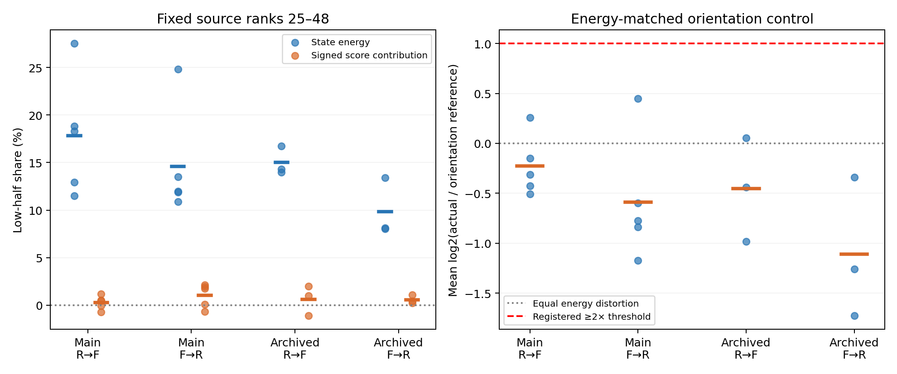

# ACT III 두 후속 진단: 상태 차이의 방향과 출력 왜곡

**두 사전 가설 모두 지지되지 않았다.** 학습 상태의 하위24개 저분산 방향은
출력 왜곡의 주된 원인이 아니었다. 같은 상태 차이 크기를 보존한 방향 대조에서도
실제 왜곡은 무작위 방향의 기대값보다 평균적으로 작았다. 실패를 설명하기 위해
mode cutoff, 가중치 또는 점수 기준을 바꾸지 않았다.

현재 위치: **ACT III의 정규화·출력층 의존성 진단**. ACT III 전체 ablation이나
ACT IV 내부 학습 완료를 뜻하지 않는다. 사용자 요청에 따라 첫 작업의 검증을
통과한 뒤 두 번째 작업까지 진행했다.

## 1. Repository audit

기준 `dae7a5e`의 AGENTS, 연구 방향, next-work, phase 상태, 최신 정렬 결과,
source·target·전이 checkpoint와 manifest를 확인했다. 최초 전체 audit는
[연구 상태](research-status.md)에 보존되어 있다. 첫 작업은 기존 결과
7,283개, 두 번째는 첫 작업을 포함한 7,396개 파일의
해시 보존을 확인했다. 기존 negative result와 numerical source를 변경하지 않았다.

문서상 “작은 분산 방향에서 증폭될 수 있다”는 가설과 실제 artifact를 구분한다.
그 가설은 이번 고정24/24분할에서 실패했다. 방향 대조는 수학적 상태 대조이며
graph rewiring이나 biological ablation이 아니라는 점도 명시했다.

## 2. Reproduced baseline

각 작업의34방향에서 source within과 정렬 후 real/null scores를 정확 재현했다.
정렬 정확도 main R→F51.007%,F→R51.607%; archived confirmation49.447%,52.886%.
기존 무보정25–27%, target refit79–80% 및 음수 R²는 그대로다.
두 번째 작업은 첫 작업의 모든 checkpoint 배열도 정확 재현했다.
새 환경을 만들지 않고 기존 dependency-lock Windows venv를 사용했다.

## 3. New implementation

- `residual_modes.py`: source train-only SVD, mode별 상태/score 에너지,
  signed attribution, low/high 및 cross-term, raw 통계·manifest.
- `residual_orientation.py`: 같은 low/high 에너지를 보존한 signed permutation
  16개와 무작위 방향 기대값의 해석적 계산. 새로운 head/adapter 학습은0이다.
- 각각 독립 artifact verifier, synthetic tests, 공통 결과 그림을 추가했다.
  상쇄, SVD 부호 불변성, train-only basis, 2차원 exhaustive ensemble의 정확한
  기대값, 에너지·covariance spectrum 보존을 검증했다.

## 4. Experiments executed

R=`renormalized` D(B)B, F=`fixed_original` D(A)B. 같은 rewired 원시망 B의 정규화
조건 비교다.686뉴런,threshold5,circuit701의3309edges/circuit702의3241edges,
48MBON 관측,동일 입력/관측 ID·기호 stream, K4,학습2000/평가1000,warmup100.
각 lag의 고정 출력층은48×4+4계수이고,11개 lag를 모두 보존했다.

Main seeds34142–34146, archived confirmation41142–41144 ×circuit701/702 ×양방향.
Smoke34001/c701은200/100기호,추론 제외. 작업마다20+12+2=34방향,374lag행.
Primary lags1,2,3,4,5,8을 평균한 뒤 circuit을 평균, n5/n3집단 별도로 분석했다.
이는 이미 관찰된 집단의 탐색적 진단이며 fresh-seed confirmation이 아니다.

첫 작업은 source 학습 상태의 SVD rank1–24와25–48을 사전에 고정했다.
왜곡은 **같은 입력에서 정렬 target score−source within score**이며 정답 대비
오류와 구별한다. 각 mode 기여와 전체 왜곡의 내적을 signed attribution으로
사용했다. 합은 실제 왜곡 에너지와 같고, 음수/100%초과가 가능하므로 확률이 아니다.
단순 mode별 제곱합도 보존하되, cross-term 없이 총 왜곡으로 해석하지 않았다.

두 번째 작업은 같은24/24분할 안에서 좌표 순서와 부호만 바꿨다. Test row별
두 group norm과 covariance 고유값은 보존하고 readout 및 개별 singular axis와의
방향 대응은 파괴한다. 뉴런 정체성·marginal mode variance·동역학은 보존하지 않는다.
주 대조값은 group 상태 에너지×group readout squared norm/24를 두 group에서
더한 **정확한 기대값**이다. Monte Carlo 오차가 없는 비교다. 고정 seed51400–51415의
16개 변환도 전부 저장했다(작업 전체5984개 replicate-lag 에너지). 유리한 변환을
고르거나 이16개로 p-value를 만들지 않았다.

## 5. Results

Low=rank25–48. Actual/reference는 lag·circuit·seed의 평균 log2 ratio를 역변환한
기하평균 비율이며, 에너지 평균들의 비율 또는 개별 비율의 산술평균과 다르다.

| 집단 | 방향 | low 상태 % | low signed 출력 % | 평균 log2비 | 기하평균 비 | bootstrap95 비 | 가설1 | 가설2 |
| --- | --- | --- | --- | --- | --- | --- | --- | --- |
| main | R→F | 17.817 | 0.281 | -0.2276 | 0.8541 | [0.7396, 1.0202] | False | False |
| main | F→R | 14.610 | 1.047 | -0.5873 | 0.6656 | [0.5027, 0.9720] | False | False |
| confirmation | R→F | 15.024 | 0.637 | -0.4550 | 0.7295 | [0.5062, 1.0390] | False | False |
| confirmation | F→R | 9.855 | 0.584 | -1.1088 | 0.4637 | [0.3022, 0.7898] | False | False |


### 모든 mapping-seed block

| 집단 | seed | low 출력 R→F % | low 출력 F→R % | 방향 대조 비 R→F | 방향 대조 비 F→R |
| --- | --- | --- | --- | --- | --- |
| main | 34142 | 0.499 | 1.742 | 0.9012 | 0.6610 |
| main | 34143 | 0.476 | 0.099 | 0.7455 | 0.5595 |
| main | 34144 | -0.729 | -0.687 | 1.1946 | 1.3637 |
| main | 34145 | 1.202 | 1.939 | 0.8052 | 0.5850 |
| main | 34146 | -0.041 | 2.142 | 0.7031 | 0.4427 |
| confirmation | 41142 | 1.017 | 0.241 | 0.5062 | 0.3022 |
| confirmation | 41143 | 1.994 | 1.093 | 0.7380 | 0.4177 |
| confirmation | 41144 | -1.099 | 0.419 | 1.0390 | 0.7898 |


### Paired 기술통계

| 집단 | 방향 | metric | mean | median | sample variance | bootstrap95 | standardized mean | +/0/− |
| --- | --- | --- | --- | --- | --- | --- | --- | --- |
| main | R→F | low signed−state (%p) | -17.5353 | -18.3185 | 47.8988 | [-22.9578, -12.6428] | -2.5337 | 0/0/5 |
| main | R→F | log2(actual/reference) | -0.2276 | -0.3126 | 0.0912 | [-0.4353, 0.0289] | -0.7536 | 1/0/4 |
| main | F→R | low signed−state (%p) | -13.5630 | -10.7805 | 44.9900 | [-19.6245, -10.2121] | -2.0221 | 0/0/5 |
| main | F→R | log2(actual/reference) | -0.5873 | -0.7735 | 0.3786 | [-0.9923, -0.0409] | -0.9545 | 1/0/4 |
| confirmation | R→F | low signed−state (%p) | -14.3869 | -15.4287 | 4.2999 | [-15.7331, -11.9990] | -6.9381 | 0/0/3 |
| confirmation | R→F | log2(actual/reference) | -0.4550 | -0.4383 | 0.2692 | [-0.9821, 0.0553] | -0.8770 | 1/0/2 |
| confirmation | F→R | low signed−state (%p) | -9.2710 | -7.7039 | 11.5964 | [-13.1778, -6.9314] | -2.7225 | 0/0/3 |
| confirmation | F→R | log2(actual/reference) | -1.1088 | -1.2595 | 0.4973 | [-1.7265, -0.3404] | -1.5723 | 0/0/3 |


가설1: low signed 출력≥75%, low 상태≤50%, positive excess4/5및3/3.
가설2: 평균 log2비≥1(기하평균2배), positive block4/5및3/3.
둘 다 양방향·두 집단에서 실패했다. 분모와 mode 분할 경계는 모두 유효했다.
가설1에는 bootstrap seed50399, 가설2에는51399, 각각10000회 mapping-block
bootstrap을 사용했다. 작은 n5/n3에서 구간과 effect size는 기술통계다.
평균/중앙값/분산/구간은 모든 보조 지표에도 저장했다.



왼쪽은 low group의 상태 에너지 비율과 signed 출력 기여, 오른쪽은 actual/reference
log2비다. 점은 각 mapping seed, 짧은 선은 평균이다. 오른쪽0은 동일 왜곡,
1은 등록한2배 기준이다.

[첫 작업 모든 raw lag](../results/residual_modes/raw-lag-table.csv) ·
[첫 작업 circuit별 raw](../results/residual_modes/raw-past-table.csv) ·
[첫 작업 전체 통계](../results/residual_modes/summary.json) ·
[두 번째 모든 raw lag](../results/residual_orientation/raw-lag-table.csv) ·
[두 번째 circuit별 raw](../results/residual_orientation/raw-past-table.csv) ·
[두 번째 전체 통계](../results/residual_orientation/summary.json).

## 6. Interpretation

관찰된 전이 실패를 “하위 절반의 작은 분산 방향에서 생기는 과도한 증폭”으로
설명하는 가설은 맞지 않았다. 같은 residual 에너지에서 무작위 방향은 더 큰
평균 score 왜곡을 만들었다. 실제 residual이 readout에 특별히 불리하게 정렬됐다는
주장도 지지되지 않는다. 이것이 생물학적 보호 메커니즘의 증거는 아니다.
일부 seed의 비율은1보다 크고 R→F의 bootstrap 구간은 두 집단 모두1을 포함한다.
따라서 모든 seed에서 왜곡이 작다거나 일반적인 억제 효과를 확립했다고 말하지 않는다.

상위24개 안에서 일부 약한 방향의 역할은 여전히 가능하지만, 결과를 본 뒤
cutoff를 바꿔 검사하지 않았다. 두 진단은 상태와 head의 대수적 관계를 설명한다.
정답 경계·argmax 정확도·MSE 실패의 원인을 하나로 확정한 연구가 아니다.

## 7. Negative findings

두 가설이 모두 실패했고, 새로운 recall 개선은 없었다. 기존 정렬 후79–80%
target refit와의 차이, 음수 R², 실제 배선 우위/전체망 우위 부정 결과도 유지된다.
분석을 성공 쪽으로 바꾸기 위한 cutoff·gain·head sweep을 하지 않았다.

## 8. What we can claim

실제 초파리 connectome 구조를 사용하는 계산 모델에서 파생된 이 재배선 대조의
R/F 상태 차이를 정확 분해했다. 등록한 좌표계에서 low-half 기여는 작았고,
에너지 보존 방향 대조 대비 실제 왜곡의 기하평균 비는 두 집단·양방향 모두1미만이다.
이는 frozen readout 해독의 제한된 계산적 특성에 대한 결과다.

## 9. What we cannot claim

실제 초파리가 π를 외웠거나, 뇌 내부가 학습했거나, memory-critical neuron group을
찾았다고 말할 수 없다. 이 SVD 방향은 뉴런 population이 아니다. whole-brain
advantage, formal memory capacity, autonomous recall 향상, causal neural ablation,
decoder calibration 또는 모든 방향에서의 증폭 부재도 입증하지 않았다.

## 10. Reproducibility

첫 protocol `8e62dc5`→구현 `9e5f70f`→부정 결과 `ca7f7ef`를 먼저 고정했다.
그 뒤 두 번째 protocol `537fffc`→구현 `919e9b4`에서 실행했다.
[첫 protocol](residual-modes-protocol.md), [둘째 protocol](residual-orientation-protocol.md).
각 작업34 exact replays 및374행 독립 검증, 두 번째5984개 대조 에너지 검증.
첫 작업 전체189tests, 마지막192tests 통과; 모두 optional dependency8개 skip.

Runtime 첫 47.89초 / 둘째 23.49초,
50ms sampled peak RSS 193.12 /
193.78MiB. 실제 peak 상한이 아니다.
Python3.12.10,NumPy2.3.5,SciPy1.17.0,pandas2.2.3,threadpoolctl3.6.0,
numerical BLAS1thread. Verifier 밖의 environment snapshot에는 기본12thread가
표시되지만 실제 검증 함수는1thread decorator 안에서 실행했다.

[첫 manifest](../results/residual_modes/manifest.json) ·
[첫 검증](../results/residual_modes_validation/checks.json) ·
[둘째 manifest](../results/residual_orientation/manifest.json) ·
[둘째 검증](../results/residual_orientation_validation/checks.json) ·
[첫 config](../configs/residual_modes.json) · [둘째 config](../configs/residual_orientation.json).

저장소 루트, dependency-lock venv에서 새 출력 경로로 실행한다. 두 runner는
config에 지정된 보존된 source artifact를 사용하므로 각각 독립 재현 가능하다.

```powershell
$env:PYTHONPATH='src'
.venv/Scripts/python.exe scripts/residual_modes.py --out outputs/modes_new
.venv/Scripts/python.exe scripts/verify_residual_modes.py outputs/modes_new --out outputs/modes_check_new
.venv/Scripts/python.exe scripts/residual_orientation.py --out outputs/orientation_new
.venv/Scripts/python.exe scripts/verify_residual_orientation.py outputs/orientation_new --out outputs/orientation_check_new
```

첫 checkpoint에 basis/singular values,residual,고정 head,mode별/그룹별 score
기여와 원래 scores를 저장했다. 두 번째에는 같은 배열과16개 permutation/sign,
draw별 에너지,정확 기대값을 추가했다. 원본 source/target/parent manifest hash와
코드/config/git/environment를 보존했다. 학습 head와 정렬을 새로 맞추지 않았다.

## 11. Next highest-information experiment

**미관찰 paired seeds에서 무보정·mean/std정렬·target refit 비교를 고정 설계로 재현한다.**
기존49–53% 개선이 두 관찰된 집단에만 국한됐는지 확인하는 독립 확인 연구다.
새 seed를 먼저 등록하고 gain/cutoff/readout을 그대로 유지한다. 개선과 기존
access/retention 실패를 따로 보고한다. 이번 두 부정 가설을 다시 살리기 위한
튜닝은 하지 않는다. 이 세 번째 작업은 제안이며 아직 실행하지 않았다.
