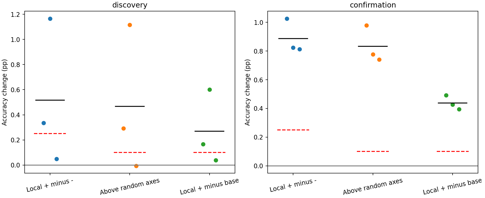
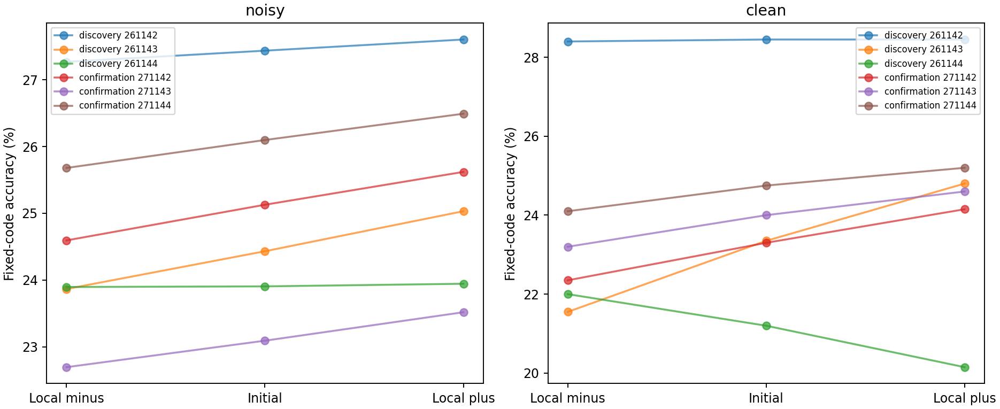
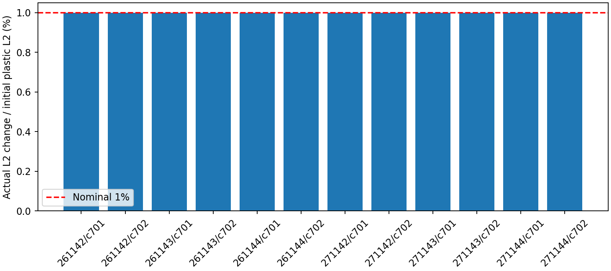

# ACT IV — 국소 갱신 방향과 보상 반응 진단

## 1. Repository audit

직전 보상 학습의 primary는 실패했지만 연결은 실제로 변했고 일부 seed는 개선됐다.
이번 질문은 초기 연결에서 그 규칙이 제안하는 방향에 유용한 보상 정보가 있는가다.
ACT IV의 제한된 기전 진단이며 ACT IV 전체 완료 선언이 아니다. 기존 연구의
가설·성공 기준을 수정하지 않았고 20,034개 과거 결과 파일의
체크섬을 보존했다. 기존 결과를 새 학습 성공으로 승격하지 않는다.

실행 전 인공 그래프 테스트에서 배치와 scalar distance 계산의 메모리 배치에 따른
약1e-17 반올림 차이를 발견했다. 관측 배열을 contiguous로 바꿔 정확한 독립 재현을
복구했다. 새 실험 결과 전 수정이며 점수 반올림·허용오차 완화는 없었다.

## 2. Reproduced baseline

`results/local_reward/discovery/real_contingent_c701_s241142`의 이전 보상 학습을 독립 재구현했다.
기대 정확도 **38.10%**, 실제 **38.10%**.
가중치·학습 기록·최종 상태가 정확히 일치했다. 기존 lock 환경을 사용했으며,
이번에 새 환경을 설치했다고 표현하지 않는다.

## 3. New implementation

[실행기](../scripts/reward_direction.py)는 가중치를 초기값에 고정한 채 기존 규칙의
one-step 제안을 누적한다. 제안을 다음 순방향 계산에 적용하지 않는다. 입력·국소
활동 흔적·스칼라 정답 보상만 사용하며, 평가 수열은 방향 선택에서 제외한다.
20,000개 제안의 평균 방향과 무작위 방향5개에 대해 양/음 perturbation을 적용했다.
무작위 방향은 초기 연결 크기로 가중한 Gaussian을 뉴런별 입력 총량 보존 공간으로
투영한다. 전역 등방성 분포나 모든 가능한 방향의 대표 표본이라고 주장하지 않는다.
[검증기](../scripts/verify_reward_direction.py)는 별도 수식과 scalar trajectory로 재구현한다.

## 4. Experiments executed

[사전등록](reward-direction-protocol.md), [정확한 config](../configs/reward_direction.json).
Lock revision `fea0e551bc25580107d735812aadf5a77dfe5ad2`; config SHA256
`3b762ded6d494351ee9f782ae06cc8cae66f6132d3d1997ca28cf2439c5db5d8`.
부분망 c701/c702,686뉴런,threshold5,3309/3241edges,48MBON,K4,lag2.
Train2000/test1000,warmup100,동일 입력 코딩·고정 코드 해독기. Gain.9,leak.6,
학습 제안 lr.05,trace.8,EMA.05,noise SD.02,10passes. 새 외부 출력층 학습 없음.

실제 연결 변화량의 global L2를 원래 plastic magnitudes의1%로 맞췄다. 같은 회로의
local/random와 양/음 모두 동일 반경이다. 부호·뉴런별 plastic 입력 총량·비가소성
연결은 보존한다. 양쪽 부호 보존이 어려우면 사전 공식으로 모든 방향을 함께 축소한다.
방향의 크기는 성능을 보고 고르지 않는다. 실제 반경은 아래와 같다.

| cohort | seed | circuit_seed | relative_radius | boundary_limited | resolution_limited | local_proposal_norm |
| --- | --- | --- | --- | --- | --- | --- |
| discovery | 261142 | 701 | 0.01000 | False | False | 0.00002 |
| discovery | 261142 | 702 | 0.01000 | False | False | 0.00001 |
| discovery | 261143 | 701 | 0.01000 | False | False | 0.00001 |
| discovery | 261143 | 702 | 0.01000 | False | False | 0.00001 |
| discovery | 261144 | 701 | 0.01000 | False | False | 0.00001 |
| discovery | 261144 | 702 | 0.01000 | False | False | 0.00001 |
| confirmation | 271142 | 701 | 0.01000 | False | False | 0.00001 |
| confirmation | 271142 | 702 | 0.01000 | False | False | 0.00001 |
| confirmation | 271143 | 701 | 0.01000 | False | False | 0.00001 |
| confirmation | 271143 | 702 | 0.01000 | False | False | 0.00001 |
| confirmation | 271144 | 701 | 0.01000 | False | False | 0.00002 |
| confirmation | 271144 | 702 | 0.01000 | False | False | 0.00001 |

Smoke1블록과 본·확인 각6회로 블록: **13개 방향 추정,169개 probe graphs**.
각 graph는 동일 평가 기호에32개 공통 잡음 반복(primary)과 noise-free1회(secondary).
Smoke만 noisy2회. 총 **5,187개 평가 궤적**을 독립 재현했다.
32반복은 잡음 평균을 추정하며 독립 seed32개가 아니다. 회로2개를 먼저 평균하고
각 cohort의 독립 paired seed는3개다. Confirmation은 본 실험 성공과 무관하게 실행했다.

## 5. Results

모든 수치는 정확도는 %, 차이는 percentage points다. Local directional은
local+ minus local−, random absolute는5개 무작위 축의 양/음 차이 절댓값 평균,
above random은 둘의 차이, forward gain은 local+ minus 초기 모델이다.
무작위 축마다 유리한 부호를 허용하는 비교는 사전 지정했으며 best seed 선택이 아니다.

| cohort | seed | baseline | local_plus | local_minus | local_directional | random_absolute | above_random | forward_gain |
| --- | --- | --- | --- | --- | --- | --- | --- | --- |
| confirmation | 271142 | 25.12813 | 25.62031 | 24.59375 | 1.02656 | 0.04688 | 0.97969 | 0.49219 |
| confirmation | 271143 | 23.09062 | 23.51719 | 22.69375 | 0.82344 | 0.04562 | 0.77781 | 0.42656 |
| confirmation | 271144 | 26.09844 | 26.49219 | 25.67969 | 0.81250 | 0.07125 | 0.74125 | 0.39375 |
| discovery | 261142 | 27.43750 | 27.60469 | 27.27031 | 0.33437 | 0.04344 | 0.29094 | 0.16719 |
| discovery | 261143 | 24.43125 | 25.03125 | 23.86562 | 1.16562 | 0.05031 | 1.11531 | 0.60000 |
| discovery | 261144 | 23.90469 | 23.94375 | 23.89531 | 0.04844 | 0.05437 | -0.00594 | 0.03906 |

[회로별 원본](../results/reward_direction/circuit-effects.csv),
[모든 graph/mode 결과](../results/reward_direction/raw-metrics.csv),
[seed별 결과](../results/reward_direction/seed-blocks.csv),
[실제 반경](../results/reward_direction/radii.csv).
각 checkpoint에는 반복별 정확도와 모든 점수가 있다. 점수는 음의 거리이며 확률이 아니다.

| cohort | mode | metric | mean_pp | median_pp | variance_pp2 | bootstrap95_pp | paired_dz | positive_blocks |
| --- | --- | --- | --- | --- | --- | --- | --- | --- |
| discovery | noisy | baseline | 25.25781 | 24.43125 | 3.63260 | 23.90469 / 27.43750 | 13.25218 | 3 |
| discovery | noisy | local_plus | 25.52656 | 25.03125 | 3.53462 | 23.94375 / 27.60469 | 13.57754 | 3 |
| discovery | noisy | local_minus | 25.01042 | 23.89531 | 3.83057 | 23.86563 / 27.27031 | 12.77878 | 3 |
| discovery | noisy | local_directional | 0.51615 | 0.33438 | 0.33681 | 0.04844 / 1.16562 | 0.88937 | 3 |
| discovery | noisy | random_absolute | 0.04938 | 0.05031 | 0.00003 | 0.04344 / 0.05438 | 8.93069 | 3 |
| discovery | noisy | above_random | 0.46677 | 0.29094 | 0.33749 | -0.00594 / 1.11531 | 0.80348 | 2 |
| discovery | noisy | forward_gain | 0.26875 | 0.16719 | 0.08640 | 0.03906 / 0.60000 | 0.91431 | 3 |
| discovery | clean | baseline | 24.33333 | 23.35000 | 13.86583 | 21.20000 / 28.45000 | 6.53474 | 3 |
| discovery | clean | local_plus | 24.46667 | 24.80000 | 17.30583 | 20.15000 / 28.45000 | 5.88137 | 3 |
| discovery | clean | local_minus | 23.98333 | 22.00000 | 14.68083 | 21.55000 / 28.40000 | 6.25942 | 3 |
| discovery | clean | local_directional | 0.48333 | 0.05000 | 6.64333 | -1.85000 / 3.25000 | 0.18752 | 2 |
| discovery | clean | random_absolute | 0.18000 | 0.23000 | 0.01290 | 0.05000 / 0.26000 | 1.58481 | 3 |
| discovery | clean | above_random | 0.30333 | 0.00000 | 6.49523 | -2.08000 / 2.99000 | 0.11902 | 1 |
| discovery | clean | forward_gain | 0.13333 | 0.00000 | 1.57583 | -1.05000 / 1.45000 | 0.10621 | 1 |
| confirmation | noisy | baseline | 24.77240 | 25.12813 | 2.35664 | 23.09062 / 26.09844 | 16.13694 | 3 |
| confirmation | noisy | local_plus | 25.20990 | 25.62031 | 2.33899 | 23.51719 / 26.49219 | 16.48379 | 3 |
| confirmation | noisy | local_minus | 24.32240 | 24.59375 | 2.28418 | 22.69375 / 25.67969 | 16.09315 | 3 |
| confirmation | noisy | local_directional | 0.88750 | 0.82344 | 0.01453 | 0.81250 / 1.02656 | 7.36174 | 3 |
| confirmation | noisy | random_absolute | 0.05458 | 0.04688 | 0.00021 | 0.04563 / 0.07125 | 3.77810 | 3 |
| confirmation | noisy | above_random | 0.83292 | 0.77781 | 0.01649 | 0.74125 / 0.97969 | 6.48612 | 3 |
| confirmation | noisy | forward_gain | 0.43750 | 0.42656 | 0.00251 | 0.39375 / 0.49219 | 8.72872 | 3 |
| confirmation | clean | baseline | 24.01667 | 24.00000 | 0.52583 | 23.30000 / 24.75000 | 33.11987 | 3 |
| confirmation | clean | local_plus | 24.65000 | 24.60000 | 0.27750 | 24.15000 / 25.20000 | 46.79349 | 3 |
| confirmation | clean | local_minus | 23.21667 | 23.20000 | 0.76583 | 22.35000 / 24.10000 | 26.52972 | 3 |
| confirmation | clean | local_directional | 1.43333 | 1.40000 | 0.12333 | 1.10000 / 1.80000 | 4.08138 | 3 |
| confirmation | clean | random_absolute | 0.15667 | 0.18000 | 0.00243 | 0.10000 / 0.19000 | 3.17597 | 3 |
| confirmation | clean | above_random | 1.27667 | 1.21000 | 0.09943 | 1.00000 / 1.62000 | 4.04866 | 3 |
| confirmation | clean | forward_gain | 0.63333 | 0.60000 | 0.04083 | 0.45000 / 0.85000 | 3.13419 | 3 |

Bootstrap은 paired seed3개를 재표집한 기술 통계다. Raw accuracy 행의 mean/median은
percentage, 분산은 pp²이다. Paired dz는 차이 지표에서만 효과크기로 해석하며,
raw accuracy의 mean/std를 처치 효과크기로 해석하지 않는다.





Primary 판정: **confirmed_noisy_alignment=False**.
각 cohort에서 directional 평균>=.25%p,above-random>=.10%p,forward gain>=.10%p와
각 차이의 모든 seed 양수가 모두 필요하다. Clean 결과는 primary 실패를 대체하지 못한다.
이는1% perturbation의 방향 진단이며 이전5%p 학습 성공 기준을 바꾼 것이 아니다.

## 6. Interpretation

Noisy 방향 반응은 본+0.51615%p, 확인+0.88750%p였고, local+ minus 초기 모델은
+0.26875/+0.43750%p였다. 여섯 seed 모두 두 차이가 양수였다. 따라서 이번 규칙의
초기 방향에 유용한 신호가 전혀 없다는 결론은 지지되지 않는다.
다만 본 seed261144의 above-random은−0.0059375%p라 모든 seed 양수 조건에 실패했다.
본 cohort의 다른 두 noisy gate와 확인 cohort의 세 gate는 통과했지만 전체 확인은
실패다. 이 작은 음수 하나를 삭제하거나 반복 수를 늘려 판정을 바꾸지 않았다.

Noise-free secondary에서는 본 seed261144의 local+가 초기보다−1.05%p였다.
Noisy 조건의 같은 seed+0.03906%p와 방향이 다르다. 확인 cohort는 clean에서도 모두
양수다. 이는 모델/입력 seed에 따라 잡음 조건에 대한 전이가 다를 가능성을 보여 주며,
이전 최종 학습의 실패를 설명하는 인과 증거는 아직 아니다. 모든 실제 반경은
정확히1%였으므로 이번 실패를 boundary 축소로 설명할 수 없다.

## 7. Negative findings

전체 preregistered alignment 기준은 실패했다. Clean에서 본 cohort의 세 기준도
실패했다. Noisy 평균 이득만 제시하거나 통과한 확인 cohort만 선택하지 않는다.
한 회로/seed의 차이와 한 반경의 결과를 규칙 전체의 불가능으로 일반화하지 않는다.

## 8. What we can claim

현재 부분 계산 모델의 초기 가중치에서 scalar reward·local trace가 제안한 방향으로
1% 이동하면 noisy 평가의 평균 정답률이 여섯 seed 모두 올랐다. 무작위 축의 유리한
방향 대비 추가 이득은5/6seed에서 양수였지만 사전 확인 기준 전체는 통과하지 못했다.
이것은 초기 finite directional response이며 장기 내부 학습 성공을 뜻하지 않는다.

## 9. What we cannot claim

전체 gradient, 학습 후 전 궤적의 credit assignment, 수렴, 안정적 학습 성공,
π 자율 회상, 기억 용량 증가, 실제 초파리의 학습은 확인하지 않았다. 초기 가중치의
한 반경·한 입력 과제에 한정된다. Local 방향은 noisy training에서 추정됐고, clean
평가는 별도 secondary다. 기존 보상 학습 실패를 이 작은 방향 실험으로 덮어쓰지 않는다.
5개 random axes와3개 seed는 작고, 회로2개도 생물학적 표본2개를 뜻하지 않는다.

## 10. Reproducibility

[Root manifest](../results/reward_direction/manifest.json),
[독립 검증](../results/reward_direction_validation/checks.json).
가중치 변형169개, mean proposal·방향·수열·코드·모든 noisy 점수·clean MBON 상태,
제안 과정 기록·반경·source hashes를 보존했다. 학습 checkpoint가 아니라 고정된
방향 probe checkpoint다. 모든 원본이 검증 대상이다.

232 tests passed,8 optional-dependency skips. 독립 방향13개,probe graphs169개,
scalar trajectories5187,metric rows338 재현 및 제약·판정 검증 통과.
Runner 152.50s,peak sampled RSS 193.97MiB;
verifier 192.25s. RSS50ms 간격 표본값. Root manifest SHA256
`469a0d5cbb8b2de8b5ad9143cafd4936cda1f852b3f6e5f053400e9c4dc2ba54`. Python3.12.10,
Windows-11-10.0.26200-SP0,logical CPU12,RAM16905629696bytes,
one numerical thread. Packages: `{"numpy": "2.3.5", "scipy": "1.17.0", "pandas": "2.2.3", "mpmath": "1.4.1", "threadpoolctl": "3.6.0", "psutil": "7.2.2", "pyarrow": "25.0.1"}`.

Clean checkout 및 requirements-act1-lock.txt 환경, 기존 source/graph artifacts가 필요하다.
아래는 저장소 루트에서 실행하며 새 경로를 사용한다. 기존 결과를 덮어쓰지 않는다.

```powershell
$env:PYTHONPATH='src'
.\.venv\Scripts\python.exe scripts/reward_direction.py --out outputs/reward_direction_new
.\.venv\Scripts\python.exe scripts/verify_reward_direction.py outputs/reward_direction_new --out outputs/reward_direction_check_new
.\.venv\Scripts\python.exe scripts/plot_reward_direction.py outputs/reward_direction_new --out outputs/reward_direction_plots_new
```

## 11. Next highest-information experiment

**이전 최종 체크포인트의 학습·평가 잡음 일치 비교 하나.**
기존 local_reward의 frozen/contingent/yoked 최종 가중치를 모두 고정하고, 기존 clean
평가와 학습 때와 같은 SD.02 noisy 평가를 비교한다. 새 noise seed·반복 수·판정 기준을
먼저 고정하고 출력층이나 내부 연결을 재학습하지 않는다. 두 대조군 대비 학습 이득의
noisy-minus-clean 상호작용을 평가하여, 단순한 잡음 효과와 학습 효과를 구분한다.
이 보고서의 실험에는 포함하지 않은 별도 후속 비교이며 결과는 별도 문서로 기록한다.

후속 실행 완료: [최종 가중치 잡음 일치 결과](reward-noise-results.md). 별도 protocol과
새 noise seeds로 평가했고, 기존 학습 primary를 회복하지 못했다.
