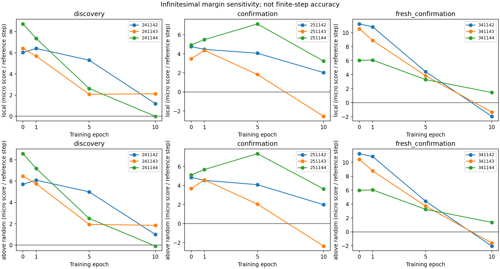
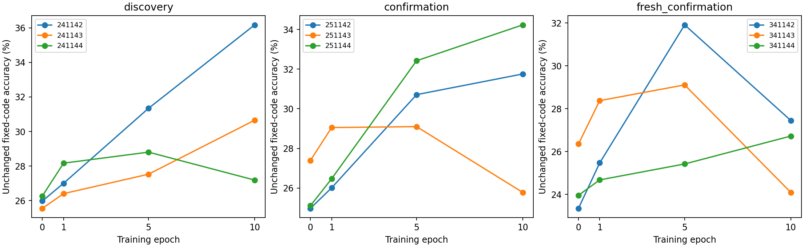

# ACT IV — 고정 코드 점수 차이의 방향 미분 진단

## 1. Repository audit

[이전 시간축 비교](reward-trajectory-results.md)는 작은 연결 때문에 유한 변화량이
부족해 판별 불가였다. 이번에는 실제 가중치를 움직이지 않는 analytic sensitivity를
별도 사전등록했다. 정확도 기준을 점수 기준으로 사후 교체한 것이 아니다.
원래 finite-accuracy 결과와 실패한 scalar-reward 기준은 그대로 보존했다.

ACT IV 종료 요청에 따라 [완료 범위](act4-completion-plan.md)도 결과 전에 고정했다.
실험 완료와 생물학적 성공은 다른 상태다. 현재 부분 모델의 지정 실험은 종료
감사 대상이며,전체 생물학적 질문의 해결로 표시하지 않는다.

## 2. Reproduced baseline

기존50checkpoint의 baseline 점수와 clean state를 그대로 재현했다. 대표 원래
c701/s241142의 clean 정확도38.10%도 유지된다. 새 paired seed3개×회로2개는
동일 규칙으로 새로 학습했고,그6학습의0/1/5/10epoch 연결 및 frozen proposals를
독립 수식으로 검증했다. 기존50개의 원래 학습 자체는 직전 연구에서 이미 정확히
재현했으며,이번에는 보존한 연결에서의 점수를 재현했다.
기존 격리 환경을 재사용했고 새로운 환경 설치로 표현하지 않는다.

## 3. New implementation

[실행기](../scripts/reward_margin.py)는 가중치 변화에 따른 신경 상태의 미소 변화를
순방향으로 계산한다. [검증기](../scripts/verify_reward_margin.py)는 역방향 adjoint로
평균 점수의 변화율을 별도 계산한다. 합성 회로의 중앙차분과도 비교했다.
정답은 진단 목적의 점수 계산에만 사용하고,미분을 학습 규칙에 전달하지 않는다.
실제 연결 해시가 진단 전후 같음을 확인했다.

Margin은 **정답 코드 점수−나머지 세 코드의 평균 점수**다. 각 점수는 관측 상태와
고정 코드의 음의 평균제곱거리다. 미분에는 온도·새 출력층·추가 최적화가 없다.
1% original plastic-L2는 미분의 단위를 정하는 reference scale이며,그 크기의
유한 변화가 가능하다거나 실제 정확도가 그만큼 오른다는 뜻이 아니다.

## 4. Experiments executed

[Protocol](reward-margin-protocol.md), [config](../configs/reward_margin.json).
Lock commit `2062bf7b41ecb326be044a8ee78949f21aac64a0`.
Config SHA256 `95b1cc1bc72940c439739e487e5028be63ed47967e37672b2b79b13a44fd55f3`.
686뉴런,48MBON,K4 iid,lag2,warmup100,train2000/test1000,10epochs,
gain.9/leak.6,동일 local covariance rule(.05 learning rate,.8 trace,
.05 EMA,noiseSD.02). 원래 floor와 row mass를 유지했다. Fitted decoder parameters=0.

기존 두 cohort의6seed를 유지하고 새341142–341144를 무조건 추가했다.
각 seed의 회로701/702를 평균한 뒤 n=3/cohort로 분석했다. 신규 cohort도 같은
두 graph를 사용하므로 독립된 생물학적 표본이 아니다. 32잡음 반복은 Monte Carlo
적분이며 sample size32로 세지 않는다. 새 seed 파생값은 config와
[seed audit](reward-margin-seed-audit.json)에 있다.

총19blocks,74checkpoints,2,382baseline trajectories,14,292방향별 평균 민감도,
888direction/mode metrics. Main 각checkpoint에32noisy+1clean,smoke2noisy+1clean.
국소 방향1개와 현재 연결 크기로 가중한 무작위 방향5개를 사용했다.
무작위 방향은 전체 방향 공간의 균등 표본이 아니다.

## 5. Results

표의 local/above_random 단위는 **micro-score/reference step(원 단위×10⁶)**이며
정확도%p가 아니다. Accuracy는 변경하지 않은 연결의 고정 코드 정확도(%)다.

| cohort | seed | epoch | local | above_random | accuracy |
| --- | --- | --- | --- | --- | --- |
| confirmation | 251142 | 0 | 4.768391 | 4.857478 | 24.978125 |
| confirmation | 251142 | 1 | 4.469066 | 4.552395 | 26.012500 |
| confirmation | 251142 | 5 | 4.066674 | 4.096768 | 30.712500 |
| confirmation | 251142 | 10 | 2.034041 | 1.991928 | 31.754687 |
| confirmation | 251143 | 0 | 3.477424 | 3.697769 | 27.392187 |
| confirmation | 251143 | 1 | 4.370003 | 4.600742 | 29.053125 |
| confirmation | 251143 | 5 | 1.834229 | 2.051855 | 29.100000 |
| confirmation | 251143 | 10 | -2.559818 | -2.361286 | 25.784375 |
| confirmation | 251144 | 0 | 4.933998 | 5.121105 | 25.110938 |
| confirmation | 251144 | 1 | 5.489878 | 5.684336 | 26.471875 |
| confirmation | 251144 | 5 | 7.141260 | 7.357432 | 32.421875 |
| confirmation | 251144 | 10 | 3.244985 | 3.649337 | 34.229687 |
| discovery | 241142 | 0 | 6.040619 | 5.710981 | 25.981250 |
| discovery | 241142 | 1 | 6.409222 | 6.088350 | 27.006250 |
| discovery | 241142 | 5 | 5.301371 | 5.000425 | 31.342187 |
| discovery | 241142 | 10 | 1.191792 | 0.995214 | 36.168750 |
| discovery | 241143 | 0 | 6.412395 | 6.472670 | 25.554688 |
| discovery | 241143 | 1 | 5.682607 | 5.748926 | 26.407812 |
| discovery | 241143 | 5 | 2.078480 | 1.944627 | 27.531250 |
| discovery | 241143 | 10 | 2.123016 | 1.852864 | 30.654688 |
| discovery | 241144 | 0 | 8.727621 | 8.577637 | 26.270312 |
| discovery | 241144 | 1 | 7.354491 | 7.191269 | 28.170313 |
| discovery | 241144 | 5 | 2.621844 | 2.503268 | 28.807812 |
| discovery | 241144 | 10 | -0.005753 | -0.086556 | 27.192187 |
| fresh_confirmation | 341142 | 0 | 11.248247 | 11.257563 | 23.350000 |
| fresh_confirmation | 341142 | 1 | 10.839511 | 10.846198 | 25.471875 |
| fresh_confirmation | 341142 | 5 | 4.432885 | 4.419809 | 31.909375 |
| fresh_confirmation | 341142 | 10 | -1.952145 | -2.044672 | 27.450000 |
| fresh_confirmation | 341143 | 0 | 10.547992 | 10.437092 | 26.353125 |
| fresh_confirmation | 341143 | 1 | 8.901289 | 8.792053 | 28.376563 |
| fresh_confirmation | 341143 | 5 | 3.845178 | 3.716450 | 29.109375 |
| fresh_confirmation | 341143 | 10 | -1.340951 | -1.609627 | 24.093750 |
| fresh_confirmation | 341144 | 0 | 6.036006 | 5.984209 | 23.959375 |
| fresh_confirmation | 341144 | 1 | 6.091911 | 6.048679 | 24.678125 |
| fresh_confirmation | 341144 | 5 | 3.299545 | 3.247972 | 25.421875 |
| fresh_confirmation | 341144 | 10 | 1.449176 | 1.370510 | 26.723438 |

평균·중앙값·분산·bootstrap95·paired standardized effect를 아래에 보존했다.
n=3의 구간은 기술 통계이며 모집단 정밀 추정으로 과장하지 않는다.

| cohort | epoch | contrast | mean_micro | median_micro | variance_micro2 | bootstrap95 | paired_dz | positive |
| --- | --- | --- | --- | --- | --- | --- | --- | --- |
| discovery | 0 | local | 7.060212 | 6.412395 | 2.119746 | 6.040619 / 8.727621 | 4.849264 | 3 |
| discovery | 0 | above_random | 6.920429 | 6.472670 | 2.204796 | 5.710981 / 8.577637 | 4.660675 | 3 |
| discovery | 1 | local | 6.482107 | 6.409222 | 0.702783 | 5.682607 / 7.354491 | 7.732247 | 3 |
| discovery | 1 | above_random | 6.342848 | 6.088350 | 0.568666 | 5.748926 / 7.191269 | 8.411156 | 3 |
| discovery | 5 | local | 3.333898 | 2.621844 | 2.977023 | 2.078480 / 5.301371 | 1.932241 | 3 |
| discovery | 5 | above_random | 3.149440 | 2.503268 | 2.647628 | 1.944627 / 5.000425 | 1.935552 | 3 |
| discovery | 10 | local | 1.103018 | 1.191792 | 1.138825 | -0.005753 / 2.123016 | 1.033604 | 2 |
| discovery | 10 | above_random | 0.920507 | 0.995214 | 0.944523 | -0.086556 / 1.852864 | 0.947155 | 2 |
| discovery | 0 minus 10 | local | 5.957193 | 4.848827 | 5.858632 | 4.289379 / 8.733375 | 2.461181 | 3 |
| discovery | 0 minus 10 | above_random | 5.999922 | 4.715767 | 5.326058 | 4.619806 / 8.664193 | 2.599816 | 3 |
| confirmation | 0 | local | 4.393271 | 4.768391 | 0.635938 | 3.477424 / 4.933998 | 5.509098 | 3 |
| confirmation | 0 | above_random | 4.558784 | 4.857478 | 0.573385 | 3.697769 / 5.121105 | 6.020407 | 3 |
| confirmation | 1 | local | 4.776316 | 4.469066 | 0.384332 | 4.370003 / 5.489878 | 7.704421 | 3 |
| confirmation | 1 | above_random | 4.945824 | 4.600742 | 0.409634 | 4.552395 / 5.684336 | 7.727530 | 3 |
| confirmation | 5 | local | 4.347388 | 4.066674 | 7.100245 | 1.834229 / 7.141260 | 1.631517 | 3 |
| confirmation | 5 | above_random | 4.502018 | 4.096768 | 7.160457 | 2.051855 / 7.357432 | 1.682429 | 3 |
| confirmation | 10 | local | 0.906403 | 2.034041 | 9.377614 | -2.559818 / 3.244985 | 0.295989 | 2 |
| confirmation | 10 | above_random | 1.093326 | 1.991928 | 9.637512 | -2.361286 / 3.649337 | 0.352182 | 2 |
| confirmation | 0 minus 10 | local | 3.486868 | 2.734349 | 5.151489 | 1.689012 / 6.037242 | 1.536276 | 3 |
| confirmation | 0 minus 10 | above_random | 3.465458 | 2.865550 | 5.530718 | 1.471768 / 6.059055 | 1.473567 | 3 |
| fresh_confirmation | 0 | local | 9.277415 | 10.547992 | 8.002637 | 6.036006 / 11.248247 | 3.279521 | 3 |
| fresh_confirmation | 0 | above_random | 9.226288 | 10.437092 | 8.051600 | 5.984209 / 11.257563 | 3.251516 | 3 |
| fresh_confirmation | 1 | local | 8.610904 | 8.901289 | 5.698168 | 6.091911 / 10.839511 | 3.607290 | 3 |
| fresh_confirmation | 1 | above_random | 8.562310 | 8.792053 | 5.793632 | 6.048679 / 10.846198 | 3.557259 | 3 |
| fresh_confirmation | 5 | local | 3.859203 | 3.845178 | 0.321262 | 3.299545 / 4.432885 | 6.808756 | 3 |
| fresh_confirmation | 5 | above_random | 3.794743 | 3.716450 | 0.347898 | 3.247972 / 4.419809 | 6.433636 | 3 |
| fresh_confirmation | 10 | local | -0.614640 | -1.340951 | 3.287891 | -1.952145 / 1.449176 | -0.338971 | 1 |
| fresh_confirmation | 10 | above_random | -0.761263 | -1.609627 | 3.455658 | -2.044672 / 1.370510 | -0.409515 | 1 |
| fresh_confirmation | 0 minus 10 | local | 9.892055 | 11.888943 | 21.539029 | 4.586831 / 13.200392 | 2.131442 | 3 |
| fresh_confirmation | 0 minus 10 | above_random | 9.987551 | 12.046720 | 22.052792 | 4.613700 / 13.302235 | 2.126803 | 3 |

시점별 유용성은 local과 above_random 모두 평균>1e-10이고 모든 seed>1e-10인
조건이다. 이 값은 수치 분해능 기준이지 생물학적 효과 크기 기준이 아니다.
감소 가설은 epoch0 유용성에 더해 두 지표의0−10차이가 모든 seed에서 양수이고
평균도 기준을 넘는 경우다. 유지 가설은 초기와 최종 모두 유용해야 한다.
두 가설은 서로 배타적이지 않으며,세 cohort 모두 통과해야 최종 확인으로 삼는다.

| cohort | epoch0_utility | epoch10_utility | attenuation | persistence |
| --- | --- | --- | --- | --- |
| discovery | True | False | True | False |
| confirmation | True | False | True | False |
| fresh_confirmation | True | False | True | False |

Confirmed margin endpoints: `{"attenuation": true, "persistent_utility": false}`.
[모든 판정](../results/reward_margin/summary.json),
[seed table](../results/reward_margin/seed-blocks.csv),
[paired differences](../results/reward_margin/paired-differences.csv),
[raw direction metrics](../results/reward_margin/raw-metrics.csv).
Clean 결과는 보조 분석이며 noisy 실패를 대체하지 않는다.




## 6. Interpretation

사전등록한 감소 가설은 세 cohort 모두 통과했다. 초기 local 및 무작위 대조
초과 방향의 유용성이 있었고,0→10epoch 감소는9/9seed에서 같은 방향이었다.
Local mean은 micro-score/reference step 단위로 본 7.060212→1.103018,
기존 확인 4.393271→0.906403,
새 확인 9.277415→-0.614640였다.
최종 유용성이 모든 seed에서 유지된다는 기준은 세 cohort 모두 실패했다.
이것은 '모든 중간 epoch에서 단조 감소'라는 주장이 아니다.
또한 단위 L2로 정규화한 방향의 reference-scale 민감도다. 원래 제안 벡터의
크기,실제 online update의 크기,누적 학습 효과가 함께 감소했다고 주장하지 않는다.

이 연구는 제한된 반경 때문에 관측하기 어려웠던 점수의 국소 민감도를 직접
계산했다. 방향 미분은 특정 고정 코드에 더 가깝게 움직이는지를 나타낸다.
분류 경계 통과나 자율 회상의 성공을 보장하지 않는다. 초기와 후기의 변화는
같은 seed/입력/평가 잡음을 사용한 비교이며,새 cohort를 결과 전에 지정했다.
세 cohort의 gate와 효과 크기를 함께 해석해야 하며,양의 seed만 선택하지 않는다.
Margin은 학습에 실제 사용된 이진 보상과도 다르다. 따라서 감소를 곧바로
credit assignment의 특정 오류나 기억 소실의 원인으로 단정하지 않는다.

## 7. Negative findings

후기 유용성 유지 기준은 실패했고,새 cohort의 최종 local mean은 음수였다.
감소 가설의 확인을 안정적인 내부 학습의 성공으로 바꾸지 않는다. 과거
scalar reward의 full coding 실패와 finite-accuracy 판별 불가는 바뀌지 않는다.
이번 미분이 양수여도 material accuracy gain으로 바꾸어 주장하지 않는다.
학습률,규칙,epoch,관측 수,seed,수치 기준을 결과 뒤 변경하지 않았다.

## 8. What we can claim

실제 초파리 connectome 구조를 사용한 현재 계산 모델에서 고정 코드 점수의
국소 변화율을 계산하고 독립 방식으로 검증했다. 새 seed의 동일 학습을 포함해
정해진 범위의 연구를 실행했다. 미분은 분석 도구이며 학습기가 사용할 수 있는
생물학적 신호라고 주장하지 않는다.

## 9. What we cannot claim

실제 초파리 학습,생리학적 dopamine 검증,전체 뇌의 학습 성공,π 자율 회상 개선,
Shannon capacity나 formal reservoir memory capacity 증가를 주장하지 않는다.
외부 코드 정의가 여전히 있으므로 literal readout-free biology도 아니다.
시점별 instantaneous score sensitivity는 누적 학습의 충분조건이 아니다.

## 10. Reproducibility

[Manifest](../results/reward_margin/manifest.json),
[독립 검증](../results/reward_margin_validation/checks.json).
Root manifest SHA256 `1a31b5d28ad0596613e56a6715a4cfa0c495329c3114c88dd29d56957614c7dd`.
Case별 inputs.npz/initial-weights.npz,epoch별 weights.npz/checkpoint.npz,
fresh training/proposal logs를 보존했다. Archival case는 source manifest에 연결된다.
독립 검증은 모든 scalar scores와 clean states가 exact이며,14,292개 평균 미분을
adjoint로 확인했다. 최대 차이 **4.743e-20**,허용 절대오차1e-12.
개별 time-step tangent 배열 전체를 독립 재실행했다고 주장하지 않는다. 배열은
보존했고,그 평균은 전부 검증했으며 합성 회로에서는 per-time 중앙차분도 확인했다.
240 tests pass, 8 optional skips. 과거 20,949개 result 파일을 보존했다.
Runner 659.46s/peak 182.05MiB;
verifier 428.82s/peak 160.31MiB.
RSS는50ms sampling. Dependency/BLAS/hardware는 root manifest에 있다.

```powershell
$env:PYTHONPATH='src'
../venv-act1/Scripts/python.exe -m pytest -q
../venv-act1/Scripts/python.exe scripts/reward_margin.py --out outputs/reward_margin_new
../venv-act1/Scripts/python.exe scripts/verify_reward_margin.py outputs/reward_margin_new --out outputs/reward_margin_check_new
../venv-act1/Scripts/python.exe scripts/plot_reward_margin.py outputs/reward_margin_new --out outputs/reward_margin_plots_new
```

## 11. Next highest-information experiment

현재 ACT IV의 지정 실험은 [종료 감사](act4-results.md)로 묶는다. 다음 하나는 독립
ACT V 축의 **동일 관측·고정 출력층 조건에서 부분망과 전체망의 ongoing-noise
강건성 곡선 비교**다. 기존 checkpoint를 사용하고 noise grid·seed·예산·판정부터
고정한다. 아직 실행하지 않은 후속 연구이며,ACT IV의 실패를 새 규칙 탐색으로
바꾸지 않는다.
