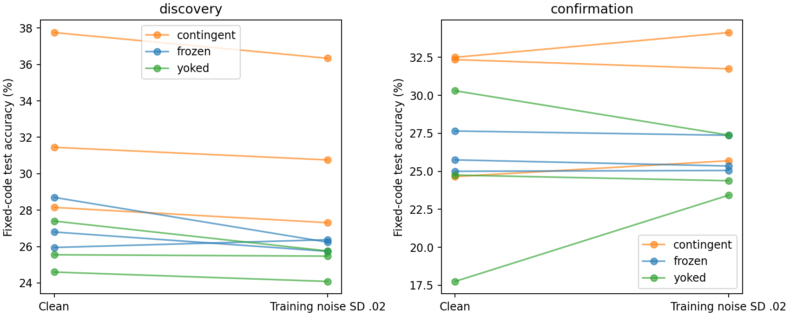
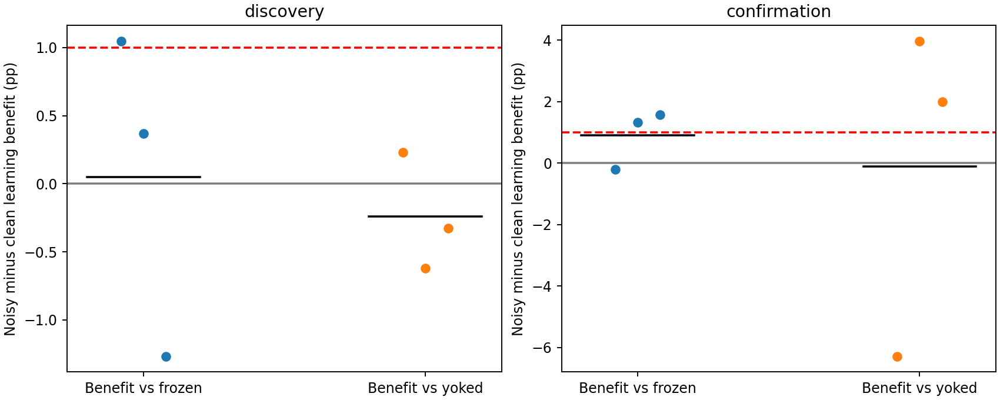

# ACT IV — 최종 가중치의 학습·평가 잡음 일치 비교

## 1. Repository audit

[초기 갱신 방향 진단](reward-direction-results.md)을 먼저 완료했다.169개 probe graphs,
5,187개 궤적을 독립 재현했고 noisy forward gain은6/6seed에서 양수였다.
하지만 무작위 대조 초과가 한 seed에서 음수여서 전체 확인 기준은 실패했다.
Clean에서 부호가 반전된 seed가 있어, 기존 학습의 평가 잡음 차이를 별도 검사했다.
두 연구의 입력/코드 seed는 다르므로 결과 행을 서로 paired로 취급하지 않는다.

이번 비교는 기존 local_reward의39개 최종 checkpoint를 그대로 사용한다.
새 learning rule,재학습,noise sweep은 없다. 과거 결과 20,285개 파일을
보존했다. ACT IV의 이 두 진단은 완료했지만 생물학적 내부 기억 학습 전체를
완료했다고 주장하지 않는다. ACT V의 강건성 곡선 실험과도 구분한다.

## 2. Reproduced baseline

모든39개 기존 clean score와 test state를 정확히 재현했다. 대표 기존 보상
학습 c701/s241142의38.10%도 유지된다. 직전 방향 연구는 그 학습 자체도 독립
재현했다. 기존 lock 환경을 재사용했고 새 환경 설치라고 표현하지 않는다.

## 3. New implementation

[실행기](../scripts/reward_noise.py)는 기존 weight/input/code/test symbol을 고정하고
MBON drive noise0과.02를 비교한다. [검증기](../scripts/verify_reward_noise.py)는
별도 scalar 순방향 구현으로 모든 반복을 다시 계산한다. 출력층을 학습하지 않는다.
특히 정확도 자체와 **두 대조군 대비 학습 이득의 변화**를 구분하는 통계를 추가했다.

## 4. Experiments executed

[사전등록 protocol](reward-noise-protocol.md), [config](../configs/reward_noise.json).
Lock commit `d2e1c140258812e84aa25e8c078c8b81f3386216`;config hash `1252c2e29e74681368f95a028940b7d56c3d7ec40cf654152bd5cf081e537454`.
686뉴런 부분망2개,48MBON,K4,lag2,원래 train2000/test1000,warmup100,
synchronous tanh/leak.6,동일 고정 코드 해독기. Internal/final weights는 고정.
SD.02는 원래 학습의 값이며 새로 최적화하지 않았다.

기존 contingent/frozen/yoked의 final weights39개를 clean/noisy로 평가했다.
Main36개는32noisy repeats,smoke3개는2repeats. 모두 합쳐39clean+1158noisy
=1197궤적이다. 새 noise seed281142–281144/291142–291144,smoke281001,
bootstrap298399. 입력/model seed241142–241144/251142–251144는 그대로 재사용했다.
따라서 fresh model confirmation이 아니라 기존 두 cohort의 사전등록 재평가다.
32반복은 Monte Carlo noise이며 표본 수32가 아니다. 회로 평균 후 n=3/cohort.

## 5. Results

고정 해독 test accuracy(%);두 회로 평균. 각 noise 반복의 raw scores와 accuracy는
checkpoint.npz에 보존했다.

| cohort | seed | mode | contingent | frozen | yoked |
| --- | --- | --- | --- | --- | --- |
| confirmation | 251142 | clean | 32.35000 | 25.75000 | 17.75000 |
| confirmation | 251142 | noisy | 31.74375 | 25.34688 | 23.42656 |
| confirmation | 251143 | clean | 24.65000 | 27.65000 | 30.30000 |
| confirmation | 251143 | noisy | 25.69375 | 27.36875 | 27.37812 |
| confirmation | 251144 | clean | 32.50000 | 25.00000 | 24.75000 |
| confirmation | 251144 | noisy | 34.13125 | 25.05312 | 24.37656 |
| discovery | 241142 | clean | 37.75000 | 28.70000 | 27.40000 |
| discovery | 241142 | noisy | 36.33594 | 26.23906 | 25.75625 |
| discovery | 241143 | clean | 31.45000 | 26.80000 | 25.55000 |
| discovery | 241143 | noisy | 30.75625 | 25.73906 | 25.47500 |
| discovery | 241144 | clean | 28.15000 | 25.95000 | 24.60000 |
| discovery | 241144 | noisy | 27.30937 | 26.37656 | 24.08594 |

Noisy contingent 평균은 본31.46719%,확인30.52292%;frozen26.11823/25.92292%,
yoked25.10573/25.06042%다. 기존 clean 평균과 섞어서 pooling하지 않는다.

아래 cells의 mean/median은 %,contrasts는%p,분산은pp²이다. Paired dz는 차이에만
표시한다. n=3 bootstrap95는 기술 통계이며 정밀한 모집단 구간으로 과장하지 않는다.

| cohort | type | metric | mean | median | variance_pp2 | bootstrap95 | paired_dz | positive_pairs |
| --- | --- | --- | --- | --- | --- | --- | --- | --- |
| discovery | cells | contingent/clean | 32.45000 | 31.45000 | 23.79000 | 28.15000 / 37.75000 | nan | nan |
| discovery | cells | contingent/noisy | 31.46719 | 30.75625 | 20.74878 | 27.30937 / 36.33594 | nan | nan |
| discovery | cells | frozen/clean | 27.15000 | 26.80000 | 1.98250 | 25.95000 / 28.70000 | nan | nan |
| discovery | cells | frozen/noisy | 26.11823 | 26.23906 | 0.11255 | 25.73906 / 26.37656 | nan | nan |
| discovery | cells | yoked/clean | 25.85000 | 25.55000 | 2.02750 | 24.60000 / 27.40000 | nan | nan |
| discovery | cells | yoked/noisy | 25.10573 | 25.47500 | 0.79976 | 24.08594 / 25.75625 | nan | nan |
| discovery | contrasts | clean_vs_frozen | 5.30000 | 4.65000 | 12.04750 | 2.20000 / 9.05000 | 1.52696 | 3.00000 |
| discovery | contrasts | clean_vs_yoked | 6.60000 | 5.90000 | 11.92750 | 3.55000 / 10.35000 | 1.91104 | 3.00000 |
| discovery | contrasts | noisy_vs_frozen | 5.34896 | 5.01719 | 21.07756 | 0.93281 / 10.09687 | 1.16509 | 3.00000 |
| discovery | contrasts | noisy_vs_yoked | 6.36146 | 5.28125 | 14.40374 | 3.22344 / 10.57969 | 1.67617 | 3.00000 |
| discovery | contrasts | interaction_vs_frozen | 0.04896 | 0.36719 | 1.41467 | -1.26719 / 1.04687 | 0.04116 | 2.00000 |
| discovery | contrasts | interaction_vs_yoked | -0.23854 | -0.32656 | 0.18577 | -0.61875 / 0.22969 | -0.55344 | 1.00000 |
| confirmation | cells | contingent/clean | 29.83333 | 32.35000 | 20.15583 | 24.65000 / 32.50000 | nan | nan |
| confirmation | cells | contingent/noisy | 30.52292 | 31.74375 | 18.91568 | 25.69375 / 34.13125 | nan | nan |
| confirmation | cells | frozen/clean | 26.13333 | 25.75000 | 1.86583 | 25.00000 / 27.65000 | nan | nan |
| confirmation | cells | frozen/noisy | 25.92292 | 25.34688 | 1.58940 | 25.05312 / 27.36875 | nan | nan |
| confirmation | cells | yoked/clean | 24.26667 | 24.75000 | 39.55083 | 17.75000 / 30.30000 | nan | nan |
| confirmation | cells | yoked/noisy | 25.06042 | 24.37656 | 4.25445 | 23.42656 / 27.37812 | nan | nan |
| confirmation | contrasts | clean_vs_frozen | 3.70000 | 6.60000 | 33.87000 | -3.00000 / 7.50000 | 0.63576 | 2.00000 |
| confirmation | contrasts | clean_vs_yoked | 5.56667 | 7.75000 | 106.09083 | -5.65000 / 14.60000 | 0.54045 | 2.00000 |
| confirmation | contrasts | noisy_vs_frozen | 4.60000 | 6.39688 | 31.32899 | -1.67500 / 9.07812 | 0.82183 | 2.00000 |
| confirmation | contrasts | noisy_vs_yoked | 5.46250 | 8.31719 | 38.82497 | -1.68437 / 9.75469 | 0.87667 | 2.00000 |
| confirmation | contrasts | interaction_vs_frozen | 0.90000 | 1.32500 | 0.92868 | -0.20312 / 1.57812 | 0.93392 | 2.00000 |
| confirmation | contrasts | interaction_vs_yoked | -0.10417 | 2.00469 | 29.59307 | -6.28281 / 3.96563 | -0.01915 | 2.00000 |

[Raw case metrics](../results/reward_noise/raw-metrics.csv),
[Seed blocks](../results/reward_noise/seed-blocks.csv),
[Paired differences](../results/reward_noise/paired-differences.csv),
[판정 전체](../results/reward_noise/summary.json).




기존과 같은 coding 기준: contingent가 모든 seed에서 frequency+5pp 이상,
두 대조군 각각 대비 평균5pp 이상 및 모든 paired 차이 양수. Interaction은
(contingent−control)_noisy minus (contingent−control)_clean으로,두 대조군 모두
평균1pp 이상 및 모든 seed 양수가 두 cohort에서 필요하다.
최종 확인 `{"noisy_coding": false, "clean_coding": false, "noise_interaction": false}`.
Noise-removal explanation supported: **False**.

## 6. Interpretation

Noisy 조건에서도 본 seed241144의 frequency 초과는2.30938%p로5%p에 못 미쳤다.
확인 seed251143은 contingent25.69375%로 frequency26.2%와 두 대조군보다 낮았다.
확인 frozen 대비 평균 이득4.60%p도5%p 기준에 못 미친다.
따라서 학습·평가 잡음을 맞추는 것만으로 기존 primary 실패를 해소하지 못했다.

잡음에 따른 학습 이득 변화는 frozen 대비 본+0.04896%p/확인+0.90000%p,
yoked 대비−0.23854/−0.10417%p다. 모든 seed에서 일관된 이득 증가가 아니다.
확인 contingent의 raw accuracy는29.83333→30.52292%로 올랐지만, 이것만으로
학습 특이적 효과를 주장하면 대조군 변화를 놓친다. 일부 조건에서는 잡음이 영향을
주므로 '잡음은 아무 역할도 없다'는 결론도 지지되지 않는다.

## 7. Negative findings

Noisy coding,clean coding,noise interaction,둘의 joint explanation 모두 실패했다.
학습률·noise level·반복 수·기준은 바꾸지 않았다. 기존 실패를 뒤집기 위해 seed를
선택하거나 후속 범위를 확장하지 않았다. 모든 궤적 계산과 replay는 정상 완료했다.

## 8. What we can claim

현재 부분 계산 모델과 고정 코드 인터페이스에서,초기 국소 방향의 일부 유용성은
관찰되지만 전체 확인 기준은 미충족이다. 원래 학습 noise를 평가에도 적용해도
최종 코드 학습의 실패는 해소되지 않는다. 이는 계산 모델 내 제한된 진단 결과다.

## 9. What we cannot claim

실제 초파리의 학습,생리학적 도파민 검증,전체 뇌의 기억,π 자율 회상 개선,
formal memory capacity 증가,모든 local-rule의 불가능은 말할 수 없다.
한 noise level의 비교는 robustness curve가 아니다. 기존 test/model seed를 다시
사용했으므로 새 task-generalization confirmation도 아니다. 초기 directional 이득과
전체 learning trajectory의 유용성은 다른 질문이다.

## 10. Reproducibility

[Root manifest](../results/reward_noise/manifest.json),
[독립 검증](../results/reward_noise_validation/checks.json),
[원래 가중치 source](../results/local_reward/manifest.json).
새 checkpoint에는 모든 clean/noisy scores와 반복 정확도가 있고 manifest에 원본
checkpoint/weight identity가 연결된다. 기존 final weights는 복사·수정하지 않았다.

233 tests passed,8 optional-dependency skips.39checkpoint,1197scalar trajectories,
모든 score/clean state/paired interaction/criteria 독립 검증 통과.
Runner78.37s,peak sampled RSS178.02MiB,
verifier61.63s. RSS는50ms 표본값이다.
Manifest SHA256 `eac742af2ed664a2ac64badaa7698f71a6523693bd8643e107883e87e1c66386`.
Python3.12.10,Windows-11-10.0.26200-SP0,CPU12logical cores,
one numerical thread. Packages `{"numpy": "2.3.5", "scipy": "1.17.0", "pandas": "2.2.3", "mpmath": "1.4.1", "threadpoolctl": "3.6.0", "psutil": "7.2.2", "pyarrow": "25.0.1"}`.

기존 source/graph artifacts와 requirements-act1-lock.txt 환경,clean checkout에서:

```powershell
$env:PYTHONPATH='src'
.\.venv\Scripts\python.exe scripts/reward_noise.py --out outputs/reward_noise_new
.\.venv\Scripts\python.exe scripts/verify_reward_noise.py outputs/reward_noise_new --out outputs/reward_noise_check_new
.\.venv\Scripts\python.exe scripts/plot_reward_noise.py outputs/reward_noise_new --out outputs/reward_noise_plots_new
```

## 11. Next highest-information experiment

**학습 궤적에서 국소 갱신 방향이 어떻게 바뀌는지 확인하는 진단 하나.**
원래 scalar-reward 실행을 그대로 replay하며 epoch0/1/5/10의 사전 고정 시점에서
가중치를 저장한다. 같은 모델·수열 seed에서 각 시점의 frozen local proposal와
norm-matched 방향 반응을 비교한다. 유용한 초기 신호가 학습 중 유지되는지,
어느 시점에서 달라지는지 묻는다. 새로운 rule·학습률·중단 시점 선택은 하지 않는다.
현재 초기 방향 연구는 다른 task seed였으므로 두 연구를 직접 이어 붙이지 않고,
후속에서는 동일 seed의 trajectory 안에서 비교한다. 이 진단은 아직 실행하지 않았다.
