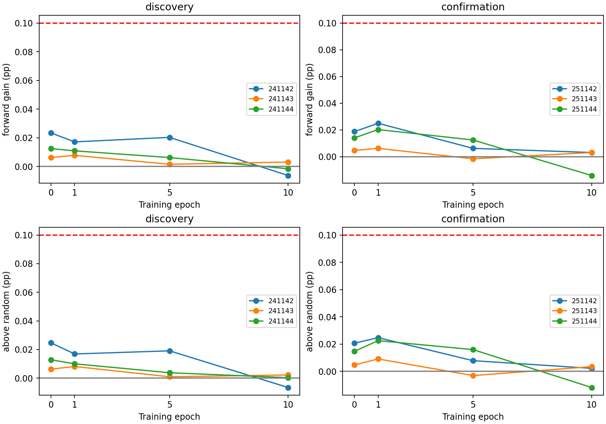
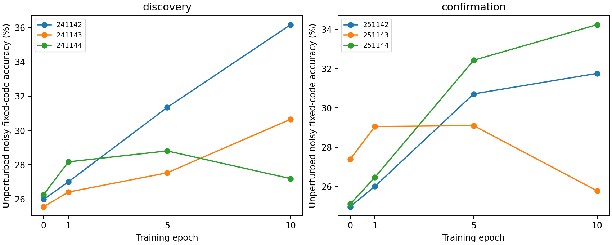

# ACT IV — 같은 학습 궤적에서 국소 갱신 방향의 변화

## 1. Repository audit

[초기 방향](reward-direction-results.md)과 [학습·평가 잡음 일치](reward-noise-results.md)
비교를 먼저 완료했다. 둘의 full criteria는 실패했고, 서로 다른 입력 seed이므로
초기와 최종 결과를 하나의 학습 곡선으로 이어 붙일 수 없었다. 이번에는 원래
local_reward의 SAME 입력·코드·학습 잡음·연결을 따라 epoch0/1/5/10을 비교했다.

당초 next-work의 ± 방향 제안은 새 결과를 보기 전에 변경했다. 기존 최종
artifact에서 일부 연결이 원래 크기의1e-4 근처여서,반대 방향의 허용 반경이
거의0이 될 수 있었기 때문이다. [Protocol](reward-trajectory-protocol.md)에
한쪽 방향 비교로 바꾼 이유와 판별 불가 기준을 먼저 기록했다. 원래 결과·평가
기준은 바꾸지 않았다. 과거 20,377개 result 파일의 해시를 보존했다.
ACT IV의 이 진단은 완료했지만 생물학적 내부 학습이라는 전체 질문은 열려 있다.

## 2. Reproduced baseline

13개 원래 contingent 학습을 동일 seed/config/입력으로 정확히 재현했다.
최종 가중치,모든 epoch의 action/reward/advantage/trace 로그 및 history가 일치했고,
최종 clean test state와 accuracy도 원본과 일치한다. 대표 c701/s241142는38.10%.
독립 수식 구현이 중간 checkpoint까지 모두 재현했다.
[Baseline raw checks](../results/reward_trajectory/baseline.json).
기존 Python3.12.10 격리 환경을 재사용했다. 이번에 새 환경을 설치했다는 뜻은 아니다.

## 3. New implementation

[실행기](../scripts/reward_trajectory.py)는 학습 중간 연결을 저장하고,각 연결을 고정한 채
한 번씩 제안되는 변화량을 평균한다. 변화는 다음 입력 전에 되돌리므로 진단 도중
추가 학습이 누적되지 않는다. 가중치 하한과 뉴런별 연결 총량은 원래 초기값을
참조한다. 학습된 checkpoint를 새 초기값처럼 취급하는 오류를 피했다.

시점마다 같은5개 무작위 벡터 표본을 현재 연결 크기로 가중하고,뉴런별 연결
총량을 보존하도록 투영한다. 모든 시점·방향에 하나의 실제 변화량을 적용한다.
[검증기](../scripts/verify_reward_trajectory.py)는 원래 학습,고정 제안 및 scalar 평가를
별도 수식으로 다시 실행한다. 초기화·하한·경계·seed 통계의 합성 검증도 추가했다.

## 4. Experiments executed

[Config](../configs/reward_trajectory.json),lock commit `592b1bd83efc9659893a64437c63b7754f833c3d`.
Canonical config hash `f0a2d83e03d1970616b3224ec0fb244f07c329561b14b736e60325a474b5bd37`.
686뉴런 부분망2개,c701/c702,threshold5,3309/3241edges,48MBON.
K4 iid 입력,lag2,train2000/test1000,warmup100,원래10epoch.
고정 nearest-code 해독기0학습 파라미터,leak.6,gain.9,국소 learning rate.05,
trace.8,activity/baseline EMA.05,학습 noiseSD.02를 유지했다.

원래 seed241142–241144 및251142–251144를 시간에 걸쳐 paired로 재사용한다.
각 checkpoint에서10 frozen proposal passes,5 random directions.
7graphs×4epochs×12main blocks,smoke는7graphs×2epochs×1block.
총50checkpoint,350graphs,700metric rows,11,130평가 궤적.
본 평가는 각 graph당32noisy+1clean,smoke2noisy+1clean이다.
Proposal/evaluation seed는 [고정 seed 표](../configs/reward_trajectory.json)와
[seed audit](reward-trajectory-seed-audit.json)에 있다. 32반복을 모델 표본 수로
세지 않는다. 두 회로 평균 후 n=3/cohort,cohort끼리 pooling하지 않는다.

명목 변화량=원래 plastic weight L2의1%. 음의 성분에 대해 현재 연결 크기의
절반을 남길 수 있는 공통 반경을 사용한다. 실제 반경이 명목의10% 미만이면
해당 cohort의 temporal endpoint는 **판별 불가**다. 이 기준은 결과 전 고정했다.

## 5. Results

사전 유용성 기준은 forward_gain과 above_random 모두 평균≥0.10%p이며,
cohort의 세 seed 모두 양수인 것이다. 감소 가설은 epoch0 유용성에 더해 두 지표의
epoch0−epoch10 차이도 평균≥0.10%p/전 seed 양수여야 한다. 유지 가설은 epoch0과
epoch10 모두 유용성이 필요하다. 두 가설 모두 분해능 통과와 양쪽 cohort의
통과가 필요하며,서로 배타적이지 않다. Clean 결과는 보조 분석이다.

아래 baseline은 noisy 고정 코드 정확도(%),forward_gain은 local−baseline(%p),
above_random은 local−5random 평균(%p)다. 모든 seed와 시점을 표시했다.

| cohort | seed | epoch | baseline | forward_gain | above_random |
| --- | --- | --- | --- | --- | --- |
| confirmation | 251142 | 0 | 24.978125 | 0.018750 | 0.020625 |
| confirmation | 251142 | 1 | 26.012500 | 0.025000 | 0.024688 |
| confirmation | 251142 | 5 | 30.712500 | 0.006250 | 0.007812 |
| confirmation | 251142 | 10 | 31.754687 | 0.003125 | 0.002187 |
| confirmation | 251143 | 0 | 27.392187 | 0.004687 | 0.004687 |
| confirmation | 251143 | 1 | 29.053125 | 0.006250 | 0.009062 |
| confirmation | 251143 | 5 | 29.100000 | -0.001563 | -0.003125 |
| confirmation | 251143 | 10 | 25.784375 | 0.003125 | 0.003437 |
| confirmation | 251144 | 0 | 25.110937 | 0.014062 | 0.014687 |
| confirmation | 251144 | 1 | 26.471875 | 0.020312 | 0.022500 |
| confirmation | 251144 | 5 | 32.421875 | 0.012500 | 0.015937 |
| confirmation | 251144 | 10 | 34.229687 | -0.014062 | -0.011875 |
| discovery | 241142 | 0 | 25.981250 | 0.023437 | 0.024688 |
| discovery | 241142 | 1 | 27.006250 | 0.017187 | 0.016875 |
| discovery | 241142 | 5 | 31.342187 | 0.020312 | 0.019062 |
| discovery | 241142 | 10 | 36.168750 | -0.006250 | -0.006563 |
| discovery | 241143 | 0 | 25.554688 | 0.006250 | 0.006250 |
| discovery | 241143 | 1 | 26.407812 | 0.007813 | 0.008125 |
| discovery | 241143 | 5 | 27.531250 | 0.001562 | 0.000937 |
| discovery | 241143 | 10 | 30.654688 | 0.003125 | 0.002188 |
| discovery | 241144 | 0 | 26.270312 | 0.012500 | 0.012813 |
| discovery | 241144 | 1 | 28.170313 | 0.010938 | 0.010000 |
| discovery | 241144 | 5 | 28.807812 | 0.006250 | 0.003750 |
| discovery | 241144 | 10 | 27.192187 | -0.001562 | 0.000313 |

시간 비교와 시점별 통계:단위%p,분산pp². Bootstrap95는 n=3의 기술적 구간으로,
정밀한 모집단 추정이 아니다. Paired dz는 seed별 차이의 평균/표준편차다.

| cohort | epoch | contrast | mean | median | variance_pp2 | bootstrap95 | paired_dz | positive |
| --- | --- | --- | --- | --- | --- | --- | --- | --- |
| discovery | 0 | forward_gain | 0.014063 | 0.012500 | 0.000076 | 0.006250 / 0.023437 | 1.616448 | 3 |
| discovery | 0 | above_random | 0.014583 | 0.012813 | 0.000087 | 0.006250 / 0.024688 | 1.560476 | 3 |
| discovery | 1 | forward_gain | 0.011979 | 0.010938 | 0.000023 | 0.007813 / 0.017187 | 2.509506 | 3 |
| discovery | 1 | above_random | 0.011667 | 0.010000 | 0.000021 | 0.008125 / 0.016875 | 2.532408 | 3 |
| discovery | 5 | forward_gain | 0.009375 | 0.006250 | 0.000095 | 0.001562 / 0.020312 | 0.960769 | 3 |
| discovery | 5 | above_random | 0.007917 | 0.003750 | 0.000095 | 0.000937 / 0.019062 | 0.811593 | 3 |
| discovery | 10 | forward_gain | -0.001563 | -0.001562 | 0.000022 | -0.006250 / 0.003125 | -0.333333 | 1 |
| discovery | 10 | above_random | -0.001354 | 0.000313 | 0.000021 | -0.006563 / 0.002188 | -0.293940 | 2 |
| discovery | 0 minus 10 | forward_gain | 0.015625 | 0.014063 | 0.000178 | 0.003125 / 0.029687 | 1.170411 | 3 |
| discovery | 0 minus 10 | above_random | 0.015938 | 0.012500 | 0.000194 | 0.004062 / 0.031250 | 1.145272 | 3 |
| confirmation | 0 | forward_gain | 0.012500 | 0.014062 | 0.000051 | 0.004687 / 0.018750 | 1.745743 | 3 |
| confirmation | 0 | above_random | 0.013333 | 0.014687 | 0.000065 | 0.004687 / 0.020625 | 1.655372 | 3 |
| confirmation | 1 | forward_gain | 0.017187 | 0.020312 | 0.000095 | 0.006250 / 0.025000 | 1.761410 | 3 |
| confirmation | 1 | above_random | 0.018750 | 0.022500 | 0.000072 | 0.009062 / 0.024688 | 2.216151 | 3 |
| confirmation | 5 | forward_gain | 0.005729 | 0.006250 | 0.000050 | -0.001563 / 0.012500 | 0.813143 | 2 |
| confirmation | 5 | above_random | 0.006875 | 0.007812 | 0.000092 | -0.003125 / 0.015937 | 0.718709 | 2 |
| confirmation | 10 | forward_gain | -0.002604 | 0.003125 | 0.000098 | -0.014063 / 0.003125 | -0.262432 | 2 |
| confirmation | 10 | above_random | -0.002083 | 0.002187 | 0.000072 | -0.011875 / 0.003437 | -0.245016 | 2 |
| confirmation | 0 minus 10 | forward_gain | 0.015104 | 0.015625 | 0.000177 | 0.001562 / 0.028125 | 1.136600 | 3 |
| confirmation | 0 minus 10 | above_random | 0.015417 | 0.018438 | 0.000167 | 0.001250 / 0.026563 | 1.192889 | 3 |

Primary identifiable: **False**.
Confirmed endpoints: `{"attenuation": false, "persistent_utility": false}`.
본12개 회로/seed 중 **12/12개**가 resolution-limited.
실제 반경/명목 비율 범위는 **0.013928–0.099075**.
Smoke는 main inference에서 제외했다. 모든 반경을 [raw radii](../results/reward_trajectory/radii.csv)에 남겼다.

아래는 실행 후 계산한 **사후 geometry audit**다. 어떤 epoch·방향·연결이 가장
작은 허용 반경을 만들었는지 저장값으로 역산했고,runner 반경과 정확히 일치했다.
12개 모두 local 방향이 제한을 만들었으며,10개는 epoch10,각1개는 epoch1/5였다.
무작위 대조 방향 때문에 생긴 제한이라고 돌려 해석하지 않는다.
이 분석은 gate를 바꾸거나 유리한 방향을 선택하지 않는다. `nominal_fraction`은
실제/명목 반경,`current_to_original`은 제한을 만든 연결의 현재/원래 크기다.

| cohort | seed | circuit_seed | epoch | variant | nominal_fraction | current_to_original |
| --- | --- | --- | --- | --- | --- | --- |
| confirmation | 251142 | 701 | 10 | local | 0.016595 | 0.000758 |
| confirmation | 251143 | 701 | 10 | local | 0.017205 | 0.000782 |
| confirmation | 251144 | 701 | 10 | local | 0.026253 | 0.001049 |
| confirmation | 251142 | 702 | 1 | local | 0.066051 | 0.015802 |
| confirmation | 251143 | 702 | 10 | local | 0.023322 | 0.001026 |
| confirmation | 251144 | 702 | 10 | local | 0.090263 | 0.021683 |
| discovery | 241142 | 701 | 10 | local | 0.055031 | 0.001221 |
| discovery | 241143 | 701 | 10 | local | 0.013928 | 0.000834 |
| discovery | 241144 | 701 | 10 | local | 0.019547 | 0.000599 |
| discovery | 241142 | 702 | 5 | local | 0.099075 | 0.016058 |
| discovery | 241143 | 702 | 10 | local | 0.030873 | 0.000956 |
| discovery | 241144 | 702 | 10 | local | 0.044531 | 0.000488 |

[Raw graph/mode metrics](../results/reward_trajectory/raw-metrics.csv),
[seed blocks](../results/reward_trajectory/seed-blocks.csv),
[paired differences](../results/reward_trajectory/paired-differences.csv),
[all decisions](../results/reward_trajectory/summary.json),
[neural diagnostics](../results/reward_trajectory/neural.csv).
표현 진단의 cohort 평균(두 회로·세 seed의 기술 통계):

| cohort | epoch | effective_rank | direction_cosine_to_epoch0 | local_proposal_norm | tiny_edge_fraction |
| --- | --- | --- | --- | --- | --- |
| confirmation | 0 | 5.756303 | 1.000000 | 0.000014 | 0.000000 |
| confirmation | 1 | 5.766227 | 0.976635 | 0.000015 | 0.000000 |
| confirmation | 5 | 5.362904 | 0.519894 | 0.000030 | 0.002282 |
| confirmation | 10 | 4.749882 | 0.166117 | 0.000035 | 0.160417 |
| discovery | 0 | 5.813147 | 1.000000 | 0.000011 | 0.000000 |
| discovery | 1 | 5.811421 | 0.972172 | 0.000013 | 0.000000 |
| discovery | 5 | 5.391481 | 0.700041 | 0.000026 | 0.020014 |
| discovery | 10 | 4.737632 | 0.271608 | 0.000035 | 0.101132 |

각 반복의 전체 scores·정답·정확도,clean state,방향 벡터·제안 로그와 그래프는
개별 checkpoint에 보존했다. 점수는 거리 기반으로,보정된 확률이 아니다.




## 6. Interpretation

이번 비교로 안정적으로 답할 수 있는 것은 학습 과정과 진단의 기하학적 제약이다.
원래 학습은 정확히 재현됐지만,같은 크기의 유한 변화를 모든 시점에 적용하면
일부 작은 연결이 허용 반경을 강하게 제한했다. 정답률은 이산적인 지표이므로
아주 작은 변화에서 차이가0이거나 작다는 것을 '학습 신호가 없다'고 해석하지 않는다.
초기 방향 진단의1% 반경 결과와 이번 작은 반경 수치를 직접 비교하지 않는다.
이번 noisy final accuracy가 이전 noise-match 표와 조금 다른 것은 새 평가 잡음
표본을 사용했기 때문이다. 모델을 다시 최적화한 결과가 아니며,정확히 일치해야
하는 baseline은 원래 학습 및 clean state/score다.

Unperturbed 정확도 곡선은 중간 시점의 실제 결과지만,높은 epoch를 골라 기존
최종10epoch의 실패를 성공으로 바꾸지 않는다. 사전 기준을 유지한다.
갱신 제안의 평균 크기는0이 되지 않았고,방향과 상태의 다양성이 달라졌다.
다만 실제 probe 반경은 블록마다 다르며,같은 반경이라는 통제는 한 블록 안의
시점·방향 비교에 적용된다. 무작위 대조도 현재 연결 크기로 가중한5개 방향이므로
모든 가능한 방향을 대표하지 않는다.
Representation rank나 방향 cosine 변화는 진단값이며,그 자체로 정보 소실의
인과적 증거나 연결망 기억 용량 변화가 아니다.

## 7. Negative findings

학습 방향의 유용성이 초기보다 줄었다는 가설과 끝까지 유지된다는 가설은
완전한 확인 기준을 통과하지 못했다. 특히 반경 부족으로 primary는 판별 불가이며,
이를 두 가설의 생물학적 반증으로 표현하지 않는다. 경계 제한이 나타난 뒤에도
반경·learning rate·seed·epoch·평가 noise·성공 기준을 변경하지 않았다.
계산 실패나 checkpoint 불일치는 없다. 합성 preflight에서 학습률0이 모든 갱신을
건너뛴다는 기존 동작에 맞춰 floor 시험 fixture를 수정했으며,실제 실험 이전이었다.

## 8. What we can claim

**실제 초파리 connectome 구조를 사용한 이 계산 모델**에서 동일 학습의 중간 연결과
진단 궤적을 정확히 재현할 수 있다. 후기의 작은 연결은 동일 L2 유한 변화량을
사용하는 이번 비교의 분해능을 제한한다. 이는 측정법의 구체적 한계이며 중요한
negative/inconclusive result다. 이전 스칼라 보상 학습의 full criterion 실패는 유지된다.

## 9. What we cannot claim

실제 초파리 학습,생리학적 도파민 검증,전체 뇌 기억 개선,π 자율 회상 개선,
formal memory capacity 증가를 주장할 수 없다. 이번 과제는 입력이 계속 주어지는
과거 기호 해독이다. 초기 유용한 신호가 학습으로 반드시 사라진다거나,모든 국소
학습 규칙이 불가능하다는 주장도 하지 않는다. 새 잡음 seed를 썼지만 원래 model/task
seed를 재사용했으므로 독립된 fresh model confirmation이 아니다.

## 10. Reproducibility

[Root manifest](../results/reward_trajectory/manifest.json),
[독립 검증](../results/reward_trajectory_validation/checks.json),
[geometry audit](../results/reward_trajectory_geometry/manifest.json).
Root manifest SHA256 `0c61a3b4637033f66a3a7f0b1e3860ea517328374c521383e552b45ca218104b`.
각 `results/reward_trajectory/<cohort>/c<ci>_s<seed>/epoch<epoch>/checkpoint.npz`와
`*-weights.npz`를 사용한다. 원래 입력·코드는 case manifest의 `source_case`와 해시로
연결된다. 원래 graph/checkpoint artifact가 함께 필요하다.

237 tests pass, 8 optional skips. 13 training runs, 50 snapshots, 350 graphs,
11,130 scalar trajectories와 700 metrics를 독립 검증했다. 모든 score는 array-exact.
Runner 510.95s, peak 196.26MiB.
Verifier 779.57s, peak 194.54MiB.
측정 peak RSS는50ms sampling이며 순간 peak를 완벽하게 포착하는 값은 아니다.
환경은 manifest에 dependency/BLAS/hardware와 함께 보존했다.

```powershell
$env:PYTHONPATH='src'
../venv-act1/Scripts/python.exe -m pytest -q
../venv-act1/Scripts/python.exe scripts/reward_trajectory.py --out outputs/reward_trajectory_new
../venv-act1/Scripts/python.exe scripts/verify_reward_trajectory.py outputs/reward_trajectory_new --out outputs/reward_trajectory_check_new
../venv-act1/Scripts/python.exe scripts/plot_reward_trajectory.py outputs/reward_trajectory_new --out outputs/reward_trajectory_plots_new
../venv-act1/Scripts/python.exe scripts/audit_reward_trajectory_radius.py outputs/reward_trajectory_new --out outputs/reward_trajectory_geometry_new
```

## 11. Next highest-information experiment

**같은 checkpoint에서 정답 코드 점수와 나머지 세 코드의 평균 점수 차이에 대한
방향 미분 진단** 하나를 제안한다. 실제 연결을 유한량 바꾸지 않고,국소 제안 방향과 무작위 방향이 점수 차이를
어느 쪽으로 움직이는지 tangent dynamics로 계산한다. 합성 회로의 중앙차분으로
미분 구현을 검증하고,same-seed/noise/epoch 비교와 기준을 새 protocol에 먼저 고정한다.
이 방법은 작은 연결의 유한 반경 제약을 피하지만,미분 가능한 코드 점수의 국소
민감도를 측정할 뿐이다. 정확도 성공 기준을 대체하거나 학습기에 정답 gradient를
제공하지 않는다. 아직 실행하지 않은 제안이며 학습률 탐색은 하지 않는다.
